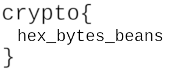

---
tags:
  - notes
  - ctf
comments: true
---

> [!cite] from symmetic ciphers on [cryptohack](https://cryptohack.org/challenges/aes/)
>
> Symmetric-key ciphers are algorithms that use the same key both to encrypt and decrypt data. The goal is to use short secret keys to securely and efficiently send long messages.
> 
>> [!warning]
>> 
>> [cryptohack](https://cryptohack.org/) 不希望大家将题解公开，但是这确实是一个很好的接触密码学的地方，所以还请真正自己看明白，而非复制粘贴 flag 。

## How AES Works


### Keyed Permutations

> [!QUESTION]
>
> What is the mathematical term for a one-to-one correspondence?

> [!FLAG]
>
> crypto{bijection}

### Resisting Bruteforce

> [!QUESTION]
>
> What is the name for the best single-key attack against AES?

> [!FLAG]
>
> crypto{Biclique attack}

### Structure of AES

```python title="matrix.py"
def bytes2matrix(text):
    """Converts a 16-byte array into a 4x4 matrix."""
    return [list(text[i : i + 4]) for i in range(0, len(text), 4)]


# my solution
def matrix2bytes(matrix):
    """Converts a 4x4 matrix into a 16-byte array."""
    res = ""
    for li in matrix:
        for i in li:
            res += chr(i)
    return res


# elegant solution
def matrix2bytes(matrix):
    """Converts a 4x4 matrix into a 16-byte array."""
    return bytes(sum(matrix, [])).decode()


matrix = [
    [99, 114, 121, 112],
    [116, 111, 123, 105],
    [110, 109, 97, 116],
    [114, 105, 120, 125],
]

print(matrix2bytes(matrix))

```

> [!FLAG]
>
> crypto{inmatrix}

### Round Keys


```python title="add_round_key.py"
state = [
    [206, 243, 61, 34],
    [171, 11, 93, 31],
    [16, 200, 91, 108],
    [150, 3, 194, 51],
]

round_key = [
    [173, 129, 68, 82],
    [223, 100, 38, 109],
    [32, 189, 53, 8],
    [253, 48, 187, 78],
]


def matrix2bytes(matrix):
    """Converts a 4x4 matrix into a 16-byte array."""
    return bytes(sum(matrix, []))


def add_round_key(s, k):
    return [list(s[i][j] ^ k[i][j] for j in range(4)) for i in range(4)]


print(matrix2bytes(add_round_key(state, round_key)))
```

> [!FLAG]
>
> crypto{r0undk3y}

### Confusion through Substitution


```python title="sbox.py"
s_box = ( 0x63, 0x7C, 0x77, 0x7B, 0xF2, 0x6B, 0x6F, 0xC5, 0x30, 0x01, 0x67, 0x2B, 0xFE, 0xD7, 0xAB, 0x76, 0xCA, 0x82, 0xC9, 0x7D, 0xFA, 0x59, 0x47, 0xF0, 0xAD, 0xD4, 0xA2, 0xAF, 0x9C, 0xA4, 0x72, 0xC0, 0xB7, 0xFD, 0x93, 0x26, 0x36, 0x3F, 0xF7, 0xCC, 0x34, 0xA5, 0xE5, 0xF1, 0x71, 0xD8, 0x31, 0x15, 0x04, 0xC7, 0x23, 0xC3, 0x18, 0x96, 0x05, 0x9A, 0x07, 0x12, 0x80, 0xE2, 0xEB, 0x27, 0xB2, 0x75, 0x09, 0x83, 0x2C, 0x1A, 0x1B, 0x6E, 0x5A, 0xA0, 0x52, 0x3B, 0xD6, 0xB3, 0x29, 0xE3, 0x2F, 0x84, 0x53, 0xD1, 0x00, 0xED, 0x20, 0xFC, 0xB1, 0x5B, 0x6A, 0xCB, 0xBE, 0x39, 0x4A, 0x4C, 0x58, 0xCF, 0xD0, 0xEF, 0xAA, 0xFB, 0x43, 0x4D, 0x33, 0x85, 0x45, 0xF9, 0x02, 0x7F, 0x50, 0x3C, 0x9F, 0xA8, 0x51, 0xA3, 0x40, 0x8F, 0x92, 0x9D, 0x38, 0xF5, 0xBC, 0xB6, 0xDA, 0x21, 0x10, 0xFF, 0xF3, 0xD2, 0xCD, 0x0C, 0x13, 0xEC, 0x5F, 0x97, 0x44, 0x17, 0xC4, 0xA7, 0x7E, 0x3D, 0x64, 0x5D, 0x19, 0x73, 0x60, 0x81, 0x4F, 0xDC, 0x22, 0x2A, 0x90, 0x88, 0x46, 0xEE, 0xB8, 0x14, 0xDE, 0x5E, 0x0B, 0xDB, 0xE0, 0x32, 0x3A, 0x0A, 0x49, 0x06, 0x24, 0x5C, 0xC2, 0xD3, 0xAC, 0x62, 0x91, 0x95, 0xE4, 0x79, 0xE7, 0xC8, 0x37, 0x6D, 0x8D, 0xD5, 0x4E, 0xA9, 0x6C, 0x56, 0xF4, 0xEA, 0x65, 0x7A, 0xAE, 0x08, 0xBA, 0x78, 0x25, 0x2E, 0x1C, 0xA6, 0xB4, 0xC6, 0xE8, 0xDD, 0x74, 0x1F, 0x4B, 0xBD, 0x8B, 0x8A, 0x70, 0x3E, 0xB5, 0x66, 0x48, 0x03, 0xF6, 0x0E, 0x61, 0x35, 0x57, 0xB9, 0x86, 0xC1, 0x1D, 0x9E, 0xE1, 0xF8, 0x98, 0x11, 0x69, 0xD9, 0x8E, 0x94, 0x9B, 0x1E, 0x87, 0xE9, 0xCE, 0x55, 0x28, 0xDF, 0x8C, 0xA1, 0x89, 0x0D, 0xBF, 0xE6, 0x42, 0x68, 0x41, 0x99, 0x2D, 0x0F, 0xB0, 0x54, 0xBB, 0x16,
)

inv_s_box = ( 0x52, 0x09, 0x6A, 0xD5, 0x30, 0x36, 0xA5, 0x38, 0xBF, 0x40, 0xA3, 0x9E, 0x81, 0xF3, 0xD7, 0xFB, 0x7C, 0xE3, 0x39, 0x82, 0x9B, 0x2F, 0xFF, 0x87, 0x34, 0x8E, 0x43, 0x44, 0xC4, 0xDE, 0xE9, 0xCB, 0x54, 0x7B, 0x94, 0x32, 0xA6, 0xC2, 0x23, 0x3D, 0xEE, 0x4C, 0x95, 0x0B, 0x42, 0xFA, 0xC3, 0x4E, 0x08, 0x2E, 0xA1, 0x66, 0x28, 0xD9, 0x24, 0xB2, 0x76, 0x5B, 0xA2, 0x49, 0x6D, 0x8B, 0xD1, 0x25, 0x72, 0xF8, 0xF6, 0x64, 0x86, 0x68, 0x98, 0x16, 0xD4, 0xA4, 0x5C, 0xCC, 0x5D, 0x65, 0xB6, 0x92, 0x6C, 0x70, 0x48, 0x50, 0xFD, 0xED, 0xB9, 0xDA, 0x5E, 0x15, 0x46, 0x57, 0xA7, 0x8D, 0x9D, 0x84, 0x90, 0xD8, 0xAB, 0x00, 0x8C, 0xBC, 0xD3, 0x0A, 0xF7, 0xE4, 0x58, 0x05, 0xB8, 0xB3, 0x45, 0x06, 0xD0, 0x2C, 0x1E, 0x8F, 0xCA, 0x3F, 0x0F, 0x02, 0xC1, 0xAF, 0xBD, 0x03, 0x01, 0x13, 0x8A, 0x6B, 0x3A, 0x91, 0x11, 0x41, 0x4F, 0x67, 0xDC, 0xEA, 0x97, 0xF2, 0xCF, 0xCE, 0xF0, 0xB4, 0xE6, 0x73, 0x96, 0xAC, 0x74, 0x22, 0xE7, 0xAD, 0x35, 0x85, 0xE2, 0xF9, 0x37, 0xE8, 0x1C, 0x75, 0xDF, 0x6E, 0x47, 0xF1, 0x1A, 0x71, 0x1D, 0x29, 0xC5, 0x89, 0x6F, 0xB7, 0x62, 0x0E, 0xAA, 0x18, 0xBE, 0x1B, 0xFC, 0x56, 0x3E, 0x4B, 0xC6, 0xD2, 0x79, 0x20, 0x9A, 0xDB, 0xC0, 0xFE, 0x78, 0xCD, 0x5A, 0xF4, 0x1F, 0xDD, 0xA8, 0x33, 0x88, 0x07, 0xC7, 0x31, 0xB1, 0x12, 0x10, 0x59, 0x27, 0x80, 0xEC, 0x5F, 0x60, 0x51, 0x7F, 0xA9, 0x19, 0xB5, 0x4A, 0x0D, 0x2D, 0xE5, 0x7A, 0x9F, 0x93, 0xC9, 0x9C, 0xEF, 0xA0, 0xE0, 0x3B, 0x4D, 0xAE, 0x2A, 0xF5, 0xB0, 0xC8, 0xEB, 0xBB, 0x3C, 0x83, 0x53, 0x99, 0x61, 0x17, 0x2B, 0x04, 0x7E, 0xBA, 0x77, 0xD6, 0x26, 0xE1, 0x69, 0x14, 0x63, 0x55, 0x21, 0x0C, 0x7D,
)

state = [
    [251, 64, 182, 81],
    [146, 168, 33, 80],
    [199, 159, 195, 24],
    [64, 80, 182, 255],
]


# my solution
def sub_bytes(s, sbox=s_box):
    """Performs byte substitution on the input state matrix using the specified S-box."""
    m = len(s)
    n = len(s[0])
    for i in range(m):
        for j in range(n):
            s[i][j] = sbox[s[i][j]]
    return s


# faster solution
def sub_bytes(s, sbox=s_box):
    return [[sbox[s[i][j]] for j in range(4)] for i in range(4)]


def matrix2bytes(matrix):
    """Converts a 4x4 matrix into a 16-byte array."""
    return bytes(sum(matrix, []))


print(matrix2bytes(sub_bytes(state, sbox=inv_s_box)))
```

> [!FLAG]
>
> crypto{l1n34rly}

### Diffusion through Permutation


```python title="diffusion.py"
def shift_rows(s):
    s[0][1], s[1][1], s[2][1], s[3][1] = s[1][1], s[2][1], s[3][1], s[0][1]
    s[0][2], s[1][2], s[2][2], s[3][2] = s[2][2], s[3][2], s[0][2], s[1][2]
    s[0][3], s[1][3], s[2][3], s[3][3] = s[3][3], s[0][3], s[1][3], s[2][3]


def inv_shift_rows(s):
    s[0][1], s[1][1], s[2][1], s[3][1] = s[3][1], s[0][1], s[1][1], s[2][1]
    s[0][2], s[1][2], s[2][2], s[3][2] = s[2][2], s[3][2], s[0][2], s[1][2]
    s[0][3], s[1][3], s[2][3], s[3][3] = s[1][3], s[2][3], s[3][3], s[0][3]


# learned from http://cs.ucsb.edu/~koc/cs178/projects/JT/aes.c
xtime = lambda a: (((a << 1) ^ 0x1B) & 0xFF) if (a & 0x80) else (a << 1)


def mix_single_column(a):
    # see Sec 4.1.2 in The Design of Rijndael
    t = a[0] ^ a[1] ^ a[2] ^ a[3]
    u = a[0]
    a[0] ^= t ^ xtime(a[0] ^ a[1])
    a[1] ^= t ^ xtime(a[1] ^ a[2])
    a[2] ^= t ^ xtime(a[2] ^ a[3])
    a[3] ^= t ^ xtime(a[3] ^ u)


def mix_columns(s):
    for i in range(4):
        mix_single_column(s[i])


def inv_mix_columns(s):
    # see Sec 4.1.3 in The Design of Rijndael
    for i in range(4):
        u = xtime(xtime(s[i][0] ^ s[i][2]))
        v = xtime(xtime(s[i][1] ^ s[i][3]))
        s[i][0] ^= u
        s[i][1] ^= v
        s[i][2] ^= u
        s[i][3] ^= v

    mix_columns(s)


state = [
    [108, 106, 71, 86],
    [96, 62, 38, 72],
    [42, 184, 92, 209],
    [94, 79, 8, 54],
]

inv_mix_columns(state)
inv_shift_rows(state)


def matrix2bytes(matrix):
    """Converts a 4x4 matrix into a 16-byte array."""
    return bytes(sum(matrix, [])).decode()


print(matrix2bytes(state))
```

### Bringing It All Together

将上面内容组合在一起就好；注意不要直接导入，因为会同时运行上诉文件，而它们在过程中会修改 state 的值。

> [!FLAG]
>
> crypto{MYAES128}

## Symmetric Starter
### Modes of Operation Starter

模拟与服务器交互的情景（和以太坊合约的交互很像）：


先 submit ENCRYPT_FLAG() 获得加密后的 flag，再复制上去，提交得到解密后的哈希值，最后转为 ASCII 即可


```python title="block_cipher_starter.py"
from pwn import *
import json

context.log_level = "debug"

# Get encrypted flag
r = remote("aes.cryptohack.org", 443, ssl=True)
r.send(
    b"GET /block_cipher_starter/encrypt_flag/ HTTP/1.1\r\nHost: aes.cryptohack.org\r\n\r\n"
)
response = r.recvuntil(b"}").decode()
ciphertext = json.loads(response[response.find("{") :])["ciphertext"]
# Decrypt the ciphertext
r = remote("aes.cryptohack.org", 443, ssl=True)
r.send(
    f"GET /block_cipher_starter/decrypt/{ciphertext}/ HTTP/1.1\r\nHost: aes.cryptohack.org\r\n\r\n".encode()
)
response = r.recvuntil(b"}").decode()
plaintext = json.loads(response[response.find("{") :])["plaintext"]
# Convert hex to ASCII
flag = bytes.fromhex(plaintext).decode()
print(flag)
```

> [!FLAG]
>
> crypto{bl0ck_c1ph3r5_4r3_f457_!}

### Passwords as Keys

密钥不是随机的是比较容易被爆破的；这里使用常用的 rockyou.txt 作为密码字典：

```python title="password_as_keys.py"
def decrypt(ciphertext, password_hash):
    ciphertext = bytes.fromhex(ciphertext)
    key = bytes.fromhex(password_hash)

    cipher = AES.new(key, AES.MODE_ECB)
    try:
        decrypted = cipher.decrypt(ciphertext)
    except ValueError as e:
        return {"error": str(e)}

    return {"plaintext": decrypted.hex()}


with open(
    "wordlist/rockyou.txt", "r", encoding="latin-1"
) as f:
    for password in f:
        password = password.strip()
        key = hashlib.md5(password.encode()).hexdigest()
        try:
            plaintext = bytes.fromhex(decrypt(ciphertext, key)["plaintext"]).decode()
            if "crypto" in plaintext.lower():
                print(f"Found password: {password}")
                print(f"Flag: {plaintext}")
                break
        except UnicodeDecodeError:
            continue
```


> [!FLAG]
>
> crypto{k3y5__r__n07__p455w0rdz?}

## Block Ciphers 1
### ecb_oracle

> [CTF-wiki ECB](https://ctf-wiki.org/crypto/blockcipher/mode/ecb/)


#### 获取 flag 长度

```python
#### get flag length
for i in range(1, 16):
    plaintext = ("A" * i).encode().hex()
    r.send(
        f"GET /ecb_oracle/encrypt/{plaintext}/ HTTP/1.1\r\nHost: aes.cryptohack.org\r\n\r\n".encode()
    )
    res = r.recvuntil(b"}").decode()
    ciphertext = json.loads(res[res.find("{") :])["ciphertext"]
    print(i, ciphertext)
```

观察到当 i = 6 时，ciphertext 突然变长了（由 64 位 hex -> 96 位 hex），由此可见分组长度为 16 个字节，flag 长度为 (64/2 -6)=26 个字符。

#### 逐字节爆破

> cryptohack 中有人给出了[进一步优化的脚本](https://gist.github.com/DavidBuchanan314/beb4b4998f4131806ba466cbdff9a83ehttps://gist.github.com/DavidBuchanan314/beb4b4998f4131806ba466cbdff9a83e)

> [!FLAG]
>
> crypto{p3n6u1n5_h473_3cb}

### ECB CBC WTF

> [CTF-wiki CBC](https://ctf-wiki.org/crypto/blockcipher/mode/cbc/)


查看源码，使用 CBC 加密，ECB 解密；注意上下图中，Key 和 BlockCipher 是一样的；换句话说，只是少异或了一下而已，我们帮他加上即可：

```python title="ecb_cbc_wtf.py"
from pwn import *
import json

context.log_level = "debug"

r = remote("aes.cryptohack.org", 443, ssl=True)

# Get encrypted flag first
r.send(b"GET /ecbcbcwtf/encrypt_flag/ HTTP/1.1\r\nHost: aes.cryptohack.org\r\n\r\n")
response = r.recvuntil(b"}").decode()
ciphertext = json.loads(response[response.find("{") :])[
    "ciphertext"
]  # iv & encrypt_flag

# 将 ciphertext[16:] 发送解密
r.send(
    f"GET /ecbcbcwtf/decrypt/{ciphertext[32:]}/ HTTP/1.1\r\nHost: aes.cryptohack.org\r\n\r\n".encode()
)

response = r.recvuntil(b"}").decode()
decryption = json.loads(response[response.find("{") :])["plaintext"]

# 将 ciphertext[-15:] 与 decryption 逐字节进行异或
print(ciphertext[:-32])
print(decryption)
flag = bytes(
    [a ^ b for a, b in zip(bytes.fromhex(ciphertext[:-32]), bytes.fromhex(decryption))]
)

print(flag.decode())
```

> [!FLAG]
>
> crypto{3cb_5uck5_4v01d_17_!!!!!}

### Flipping Cookie

> [CTF-wiki CBC](https://ctf-wiki.org/crypto/blockcipher/mode/cbc/#_9)

```python title="flipping_cookie.py"
import requests

s = requests.session()
cout = 0


def get_cookie():
    r = s.get("http://aes.cryptohack.org/flipping_cookie/get_cookie/")
    return r.json()["cookie"]


def get_check(ciphertext, iv):
    r = s.get(
        f"http://aes.cryptohack.org/flipping_cookie/check_admin/{ciphertext}/{iv}/"
    )
    return r.json()


def flipping_attack(origin_iv: bytes, origin_text: bytes, target_text: bytes):
    """using origin_iv, flip origin_text to target_text in first target_length bytes"""
    result = bytearray(origin_iv)

    # XOR the bytes to get the desired plaintext after decryption
    for i in range(len(target_text)):
        result[i] = origin_iv[i] ^ origin_text[i] ^ target_text[i]

    return bytes(result)


# Use the function
cipher_cookie = bytes.fromhex(get_cookie())
iv = cipher_cookie[:16]
ciphertext = cipher_cookie[16:]

# Original and target plaintexts
origin_text = b"admin=False;expiry="
target_text = b"admin=True;"

# Perform the bit flipping attack
new_iv = flipping_attack(iv, origin_text, target_text)

# Send the modified cookie to get the flag
check = get_check(ciphertext.hex(), new_iv.hex())
print(check)
```

> [!FLAG]
>
> crypto{4u7h3n71c4710n_15_3553n714l}

### Lazy CBC

这里将 KEY 本身也作为 IV 去进行加密；而我们知道，在 CBC 中 IV 其实没有要求是保密的，但是它没告诉我们，我们能得到吗？

$$
\begin{cases}
P_{0}=D_{0} \oplus IV  \\
P_{1}=D_{1} \oplus C_{0}
\end{cases}
$$

如果我们让 `C_0 = C_1 = b'\x00'*block_size` ，我们发现 D0=D1 => `P0^P1 == IV`。

也就是说，有了能够使用解密函数，我们就能够获取**不变的** IV 。但是这里不给我们回显，该如何做？（其实全为 0 的话反向解出很可能就存在不可打印 ASCII 字符；如果恰好可以，在后面再加些可能会错的乱七八糟的东西即可）

```python title="laze_cbc.py"
import requests


def receive(ciphertext_hex):
    r = requests.get(f"http://aes.cryptohack.org/lazy_cbc/receive/{ciphertext_hex}/")
    return r.json()


def get_flag(key_hex):
    r = requests.get(f"http://aes.cryptohack.org/lazy_cbc/get_flag/{key_hex}/")
    return r.json()


attack_cipher = "00" * 32
print(f"Sending attack ciphertext: {attack_cipher}")
# 获取解密结果
result = receive(attack_cipher)
try:
    plaintext = result["error"]
except KeyError:
    print(f"Error: {result}")
    exit(1)

from pwn import *

plaintext = bytes.fromhex(plaintext[len("Invalid plaintext: ") :])

# 获取IV
P0 = plaintext[:16]
P1 = plaintext[16:32]
IV = xor(P0, P1)
print(f"IV: {IV.hex()}")
# 获取密钥
result = get_flag(IV.hex())
try:
    flag = result["plaintext"]
except KeyError:
    print(f"Error: {result}")
    exit(1)
print(f"Flag: {bytes.fromhex(flag).decode()}")
```

> [!FLAG]
>
> crypto{50m3_p30pl3_d0n7_7h1nk_IV_15_1mp0r74n7_?}

### Triple DES

> [CTF-wiki DES](https://ctf-wiki.org/crypto/blockcipher/des/) [深入理解Triple DES算法](https://www.cnblogs.com/Amd794/p/18133324) [Wikiwand Weak-Key](https://www.wikiwand.com/en/articles/Weak_key#Weak_keys_in_DES)

虽然考察的是上述知识点，但是我单看 [writeup](https://github.com/onealmond/hacking-lab/blob/master/cryptohack/triple-des/writeup.md) 还有一个疑问：

- 为什么最后成功的 `"00"*8+"ff"*8` 甚至不在 DES 的弱密钥/半弱密钥中？

```python title="triple_DES.py"
import requests
def encrypt(key, plaintext):
    r = requests.get(f"http://aes.cryptohack.org/triple_des/encrypt/{key}/{plaintext}/")
    return r.json()["ciphertext"]


def encrypt_flag(key):
    r = requests.get(f"http://aes.cryptohack.org/triple_des/encrypt_flag/{key}/")
    return r.json()["ciphertext"]


# https://www.wikiwand.com/en/articles/Weak_key#Weak_keys_in_DES
weak_keys = ["00" * 8 + "ff" * 8]
for weak_key in weak_keys:
    try:
        # Get encrypted flag using weak key
        encrypt1_flag = encrypt_flag(weak_key)
        print(encrypt1_flag)
        # Encrypt the ciphertext again with same key
        encrypt2_flag = encrypt(weak_key, encrypt1_flag)
        print(encrypt2_flag)
        print(bytes.fromhex(encrypt2_flag).decode())
    except Exception as e:
        print(e)
        continue
```

> [!FLAG]
>
> crypto{n0t_4ll_k3ys_4r3_g00d_k3ys}

## Stream Ciphers

### Symmetry

> [CTF-wiki OFB](https://ctf-wiki.org/crypto/blockcipher/mode/ofb/)


虽然这里没有给出加密时的流程图，但是由异或我们也不难猜到，加密算法就是解密算法；所以相当于把解密的接口给了我们：

```python title="symmetric.py"
import requests

s = requests.session()

def get_encrypted_flag():
    r = s.get("http://aes.cryptohack.org/symmetry/encrypt_flag/")
    return r.json()["ciphertext"]


def get_encrypted(plaintext, iv):
    r = s.get(f"http://aes.cryptohack.org/symmetry/encrypt/{plaintext}/{iv}/")
    return r.json()["ciphertext"]


encrypt_flag = get_encrypted_flag()
iv = encrypt_flag[:32]
ciphertext = encrypt_flag[32:]
flag_hex = get_encrypted(ciphertext, iv)
print(bytes.fromhex(flag_hex).decode())
```

> [!FLAG]
>
> crypto{0fb_15_5ymm37r1c4l_!!!11!}

### Bean Counter

> [CTF-wiki CTR](https://ctf-wiki.org/crypto/blockcipher/mode/ctr/)


> [!CITE]
>
> CTR 模式比 OFB 模式有一些优势。一个优点是它允许并行加密和解密多个块，因为可以为每个块独立计算密钥流。这可以提高加密和解密过程的性能和效率。

除此之外呢？没有了；同样是加密/解密函数通用。

同时注意到 self.stup 在本题始终为 False，也就是说，Counter 部分一直没变；所以密钥扩展可以反复使用：

```python title="bean_counter.py"
import requests

s = requests.session()
block_size = 16
png_header = b"\x89\x50\x4e\x47\x0d\x0a\x1a\x0a\x00\x00\x00\x0d\x49\x48\x44\x52"

assert len(png_header) == block_size


def get_encrypt():
    r = s.get("http://aes.cryptohack.org/bean_counter/encrypt/")
    return r.json()["encrypted"]


encryption = bytes.fromhex(get_encrypt())


def xor_bytes(bytes1: bytes, bytes2: bytes) -> bytes:
    return bytes(x ^ y for x, y in zip(bytes1, bytes2))


decrypt_block = xor_bytes(encryption[:block_size], png_header)

decryption = xor_bytes(encryption, decrypt_block * (len(encryption) // block_size))

# 将 decryption 写入 bean_flag.png
with open("bean_flag.png", "wb") as f:
    f.write(decryption)
```



> [!FLAG]
>
> crypto{hex_bytes_beans}

### CTRIME

重点在于 zlib.compress ，回顾 [CTF101讲到的Deflate 算法](https://slides.tonycrane.cc/CTF101-2023-misc/lec2/#/3/3)


总体来说，就是在滑动窗口 look ahead 中匹配与 search buffer 中最近的相同子字符串，未匹配到则正常向右滑；如果匹配到，则记录一个元组（最近距离 d，匹配长度 l）。如此一来，长度为 l 的内容变为了一个元组；当 l 较大时，数据量就会减小，达到压缩的目的。

既然我们的加密内容在加密前进行了压缩，如果我们的 plaintext 中有和 FLAG 类似的字符串，则会导致压缩后的明文=>密文变短，作为爆破的依据。但我实际上操作总是在一半断了……具体可以参考[这篇文章](https://0awawa0.medium.com/cryptohack-ctrime-97b39fcaeff6) 。

> [!FLAG]
>
> crypto{CRIME_571ll_p4y5}

## Padding Attacks

### Pad Thai

居然和 ZJUCTF2024 easy_pad 基本一样（或者说校赛改自这里？）所以直接用那里的脚本了，在 [padding_oracle_attack](https://darstib.github.io/blog/CTF/NOTE/padding_oracle_attack/) 中讲的比较清楚了：

```python title="13421_solver.py"
from pwn import *
from padding_oracle import padding_oracle_attack
import json

r = remote("socket.cryptohack.org", "13421", level="debug")


def json_recv():
    line = r.recvline()
    return json.loads(line.decode())


def json_send(json_obj):
    request = json.dumps(json_obj).encode()
    r.sendline(request)


r.recvuntil(
    "practice padding oracle attacks! Recover my message and I'll send you a flag.\n"
)
to_send_json = {"option": "encrypt", "message": "xxxxx"}
json_send(to_send_json)
received = json_recv()
iv_ct = bytes.fromhex(received["ct"])


def padding_decide(ciphertext):
    json_send({"option": "unpad", "ct": ciphertext.hex()})
    received = json_recv()
    return received["result"]


plaintext = padding_oracle_attack(
    iv_ct, padding_decide, plaintext_set="0123456789abcdef"
).decode()
# print(plaintext.decode("ascii"))
to_send_json = {"option": "check", "message": plaintext}
json_send(to_send_json)
received = json_recv()
print(received["flag"])
r.close()
```


> [!FLAG]
>
> crypto{if_you_ask_enough_times_you_usually_get_what_you_want}

