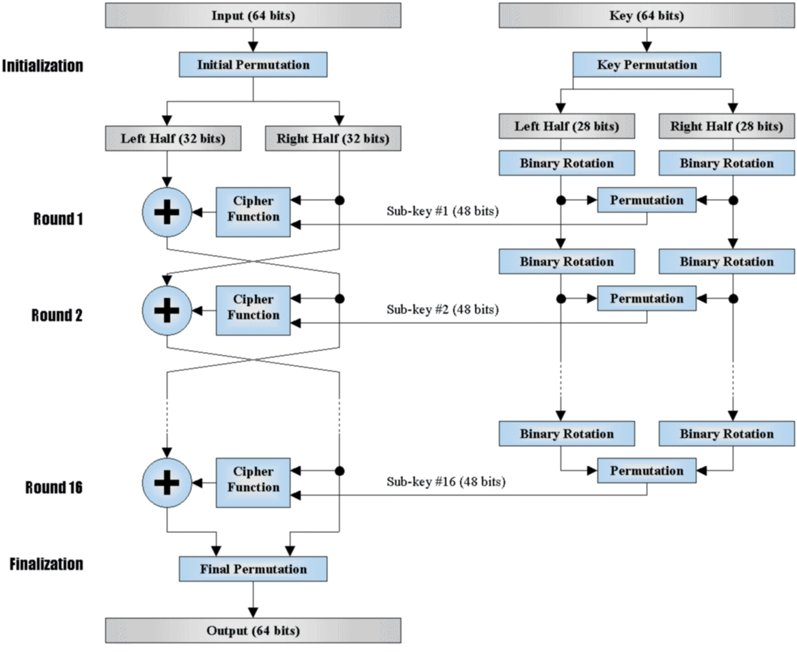
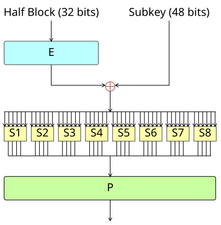
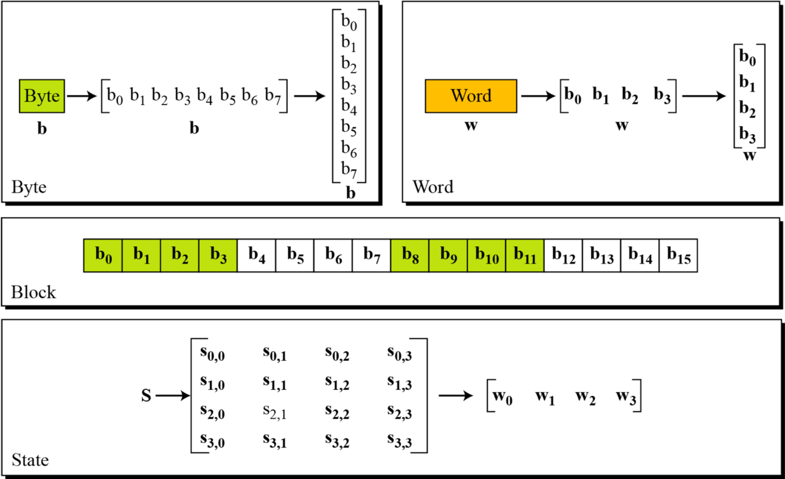
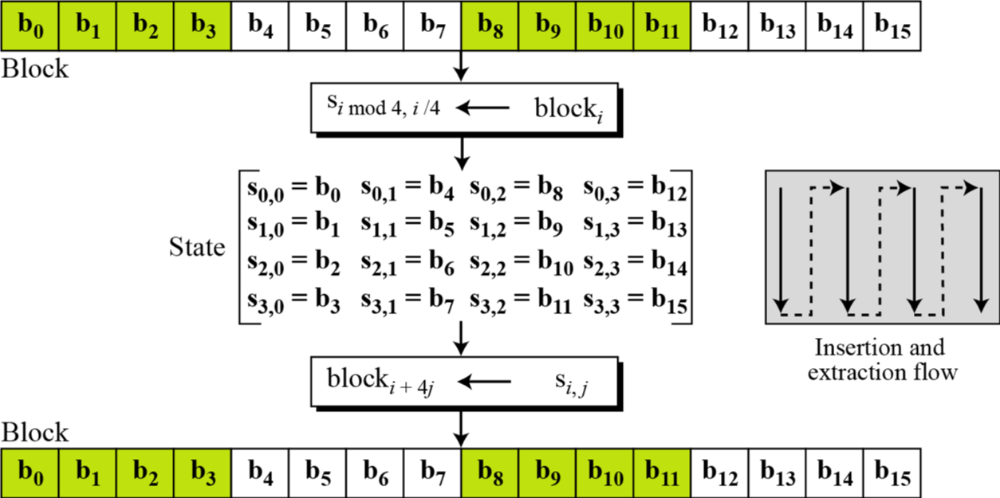
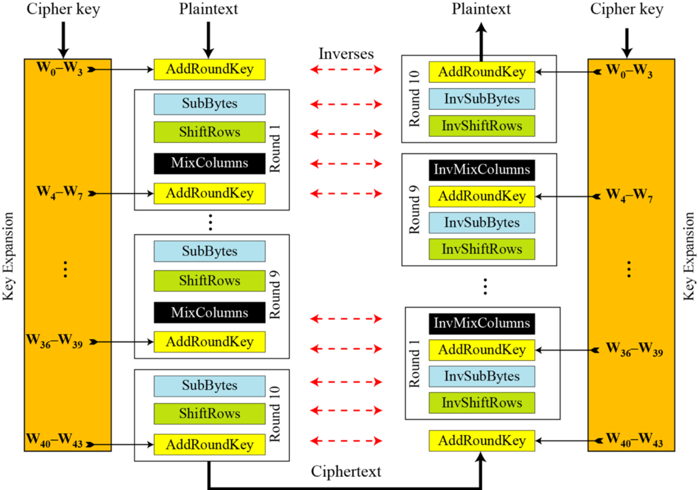
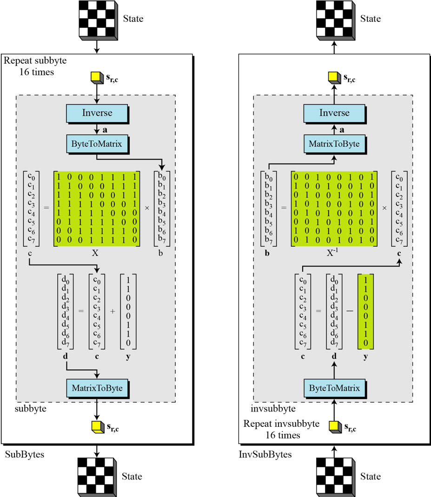
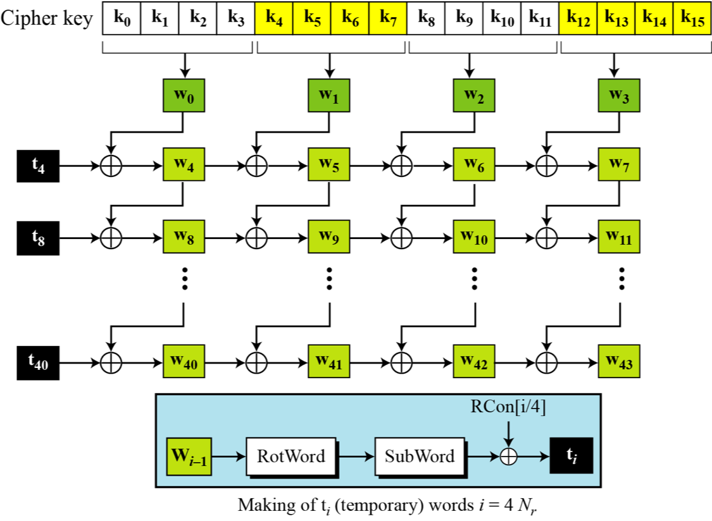
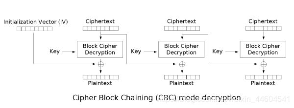
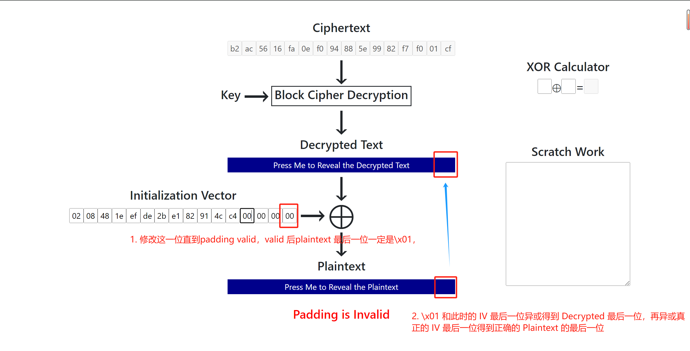

---
tags:
- notes
- ctf
comments: true
---
## blockcipher
分组/块密码就是将明文进行分组（不足则进行填充）后，按照一定的规则对块进行加密/解密的方法，是一种对称加密。
### 策略
在设计时，充分利用香农提出的两大策略：混淆与扩散。
- 混淆 (confusion)：一般使用非线性变换的方式，使得密钥与密文之间的统计关系变得复杂，常用：
	- S 盒
	- 乘法
- 扩散 (diffusion)：让明文中的每一位尽可能影响密文中的多位，常用：
	- 线性变换
	- 置换
	- （循环）移位

### 结构
目前块加密中主要使用的是**迭代结构**，便于设计、实现以及安全性评估，一般包括：
- 密钥置换
- 轮加密函数
- 轮解密函数

其中论函数主要由两种设计结构：
- Feistel Network，用在 DES 中
- Substitution-Permutation Network(SPN) 用在 AES 中

## DES
数据加密标准 (Data Encryption Standard, DES) 是典型的 Feistel 迭代结构：
- 输入、输出、密钥均为 64 bits（密钥使用其中 56 位）
- FEistel 迭代结构：明文/密文经过 16 轮迭代得到密文/明文

> 在 [Gist](https://gist.github.com/darstib/8ad412369dda356e9b91d0c0e910fe47) 上我创建了一个 DES 的 python 代码示例。

### 基本流程

#### 加密过程
**对于密钥**：
1. 取 56 位进行密钥置换 (Key Permutation) 后分为左右两部分 (L, R)
2. 每一轮加密过程中：
	- 经过 Binary Rotation 和 Permutation 后得到 48 bits 的 sub-key 传给主要加密部分使用

**对于输入**：
1. 经过初始化置换 (Initialization Permutation, IP) 后分为左右两部分
	- 记第 i 轮 $(i \in \{0, 1, \dots, 15\})$ 左右部分分别为 $L_{i}, R_{i}$
	- IP 后得到的是 $(L_{0}, R_{0})$
2. 每一轮加密过程中：
	- $L_{i+1} = R_i$，$R_{i+1} = L_i \oplus F(R_{i}, K_{i})$
3. 最后一轮输出的是 $L_{16}, R_{16}$，合并后经过最后的置换 (Final Permutation, FP) 后作为输出

> 一般来说，FP 会直接使用 IP 的逆；因此 FP 的逆也会是 IP。

#### 解密过程
和加密过程反方向进行迭代，我们可以：
**对于输出**：
1. 经过逆置换 (Inverse Permutation, FP_inv) 后分为左右两个部分 $L_{16}, R_{16}$
2. 每一轮解密过程中：
	- $R_{i} = L_{i+1}, L_{i} = R_{i+1}\oplus F(L_{i+1}, K_{i})$
3. 最后一轮得到的是 $L_{0}, R_{0}$，再进行逆置换 (Inverse Initialization Permutation, IP_inv) 即可恢复明文

### F 函数
现在我们只剩下 Feistel Function 没有搞清楚了，一般架构如下：

**扩展盒 (E)**：通常简称为 E-box
- 输入：右半部分的 32 bits
- 作用：将输入 32 bits 扩展到 48 bits
	- 与 sub-key 一致，便于进行异或运算
	- 增强扩散，让每个输入影响更多的输出
- 输出：扩展后的 48 位数据

**置换盒 (S)**：通常简称为 S-box，在 DES 中一般有 8 个不同的 S-box，是 DES 算法安全性的核心
- 输入：E 盒与子密钥异或后得到的 48 位数据，每个 S-box 6 位
- 作用：按照固定的查找表进行变换
	- 提供非线性，是 DES 中唯一的非线性组件，制造了混淆
	- 输入 1 位的变化至少能引起输入 2 位发生变化，加强了扩散
- 输出：每个盒输入 4 位数据，合并后得到 32 位数据形成总输出

**置换盒 (P)**：通常简称为 P-box
- 输入：来自 S 盒的 32 位输出
- 作用：再次对所有输出进行置换，增强 S 盒的混乱效果
- 输出：置换后的 32 位输出

### 双重/三重 DES
- 双重 DES 使用两个密钥加密两次 $C=E_{k2}(E_{k1}(P))$
	- 攻击：中间相遇攻击 $D_{k_{2}}(C) = E_{k_{1}}P$
- 三重 DEs 使用三个密钥依次加密、解密、加密 $C=E_{k3}(D_{k2}(E_{k1}(P)))$
	- 有时 $k_{3} = k_{1}$
	- 攻击：差分攻击、线性攻击

## AES
由于 DES 存在种种可被攻破的可能，高级加密标准 (Advanced Encryption Standard, AES) 被提出以取代 DES，是典型的 SPN 网络结构：
- 输入、输出均为 128 位
- 迭代轮数与密钥长度有关：

| 密钥长度（比特） | 迭代轮数 |
| :------: | :--: |
|   128    |  10  |
|   192    |  12  |
|   256    |  14  |
> - [Gist](https://gist.github.com/darstib/a0055c97fc0f3f8df0baf062d6bb2cbc) 上我的简易 python 实现
> - [Github](https://github.com/boppreh/aes/blob/master/aes.py) 上更完善的的 python 实现

### 基本流程
在 AES 中基本概念如下：

其中需要注意的是 Block 与 State 的转换关系为：

### 加解密过程

可以看到加密时每轮主要经过 4 个盒子：
- 字节替换 SubBytes
- 行移位 ShiftRows
- 列混淆 MixColumns
- 轮密钥加 AddRoundKey

密钥那边还有一个：
- 密钥扩展 ExtendKey

解密时也不过是每个盒子的逆操作，然后顺序也是反向的。更加详细的加密过程如下：

#### AddRoundKey
从上图可以看到，轮密钥加就是将当前的“状态”与子密钥进行逐位异或。
```python
def add_round_key(grid, round_key):
    for i in range(16):
        grid[i] ^= round_key[i]
```
#### SubBytes
字节替换阶段有对应的数学规则定义替换表，如图（运算定义在 $GF(2^8)$ 中）：

经过简化可以变为一个 S-box（也即上上张图所示）:
```python
s_box = [
    [0x63, 0x7c, 0x77, 0x7b, 0xf2, 0x6b, 0x6f, 0xc5, 0x30, 0x01, 0x67, 0x2b, 0xfe, 0xd7, 0xab, 0x76],
    [0xca, 0x82, 0xc9, 0x7d, 0xfa, 0x59, 0x47, 0xf0, 0xad, 0xd4, 0xa2, 0xaf, 0x9c, 0xa4, 0x72, 0xc0],
    [0xb7, 0xfd, 0x93, 0x26, 0x36, 0x3f, 0xf7, 0xcc, 0x34, 0xa5, 0xe5, 0xf1, 0x71, 0xd8, 0x31, 0x15],
    [0x04, 0xc7, 0x23, 0xc3, 0x18, 0x96, 0x05, 0x9a, 0x07, 0x12, 0x80, 0xe2, 0xeb, 0x27, 0xb2, 0x75],
    [0x09, 0x83, 0x2c, 0x1a, 0x1b, 0x6e, 0x5a, 0xa0, 0x52, 0x3b, 0xd6, 0xb3, 0x29, 0xe3, 0x2f, 0x84],
    [0x53, 0xd1, 0x00, 0xed, 0x20, 0xfc, 0xb1, 0x5b, 0x6a, 0xcb, 0xbe, 0x39, 0x4a, 0x4c, 0x58, 0xcf],
    [0xd0, 0xef, 0xaa, 0xfb, 0x43, 0x4d, 0x33, 0x85, 0x45, 0xf9, 0x02, 0x7f, 0x50, 0x3c, 0x9f, 0xa8],
    [0x51, 0xa3, 0x40, 0x8f, 0x92, 0x9d, 0x38, 0xf5, 0xbc, 0xb6, 0xda, 0x21, 0x10, 0xff, 0xf3, 0xd2],
    [0xcd, 0x0c, 0x13, 0xec, 0x5f, 0x97, 0x44, 0x17, 0xc4, 0xa7, 0x7e, 0x3d, 0x64, 0x5d, 0x19, 0x73],
    [0x60, 0x81, 0x4f, 0xdc, 0x22, 0x2a, 0x90, 0x88, 0x46, 0xee, 0xb8, 0x14, 0xde, 0x5e, 0x0b, 0xdb],
    [0xe0, 0x32, 0x3a, 0x0a, 0x49, 0x06, 0x24, 0x5c, 0xc2, 0xd3, 0xac, 0x62, 0x91, 0x95, 0xe4, 0x79],
    [0xe7, 0xc8, 0x37, 0x6d, 0x8d, 0xd5, 0x4e, 0xa9, 0x6c, 0x56, 0xf4, 0xea, 0x65, 0x7a, 0xae, 0x08],
    [0xba, 0x78, 0x25, 0x2e, 0x1c, 0xa6, 0xb4, 0xc6, 0xe8, 0xdd, 0x74, 0x1f, 0x4b, 0xbd, 0x8b, 0x8a],
    [0x70, 0x3e, 0xb5, 0x66, 0x48, 0x03, 0xf6, 0x0e, 0x61, 0x35, 0x57, 0xb9, 0x86, 0xc1, 0x1d, 0x9e],
    [0xe1, 0xf8, 0x98, 0x11, 0x69, 0xd9, 0x8e, 0x94, 0x9b, 0x1e, 0x87, 0xe9, 0xce, 0x55, 0x28, 0xdf],
    [0x8c, 0xa1, 0x89, 0x0d, 0xbf, 0xe6, 0x42, 0x68, 0x41, 0x99, 0x2d, 0x0f, 0xb0, 0x54, 0xbb, 0x16]
]
s_box_inv = [
    [0x52, 0x09, 0x6a, 0xd5, 0x30, 0x36, 0xa5, 0x38, 0xbf, 0x40, 0xa3, 0x9e, 0x81, 0xf3, 0xd7, 0xfb],
    [0x7c, 0xe3, 0x39, 0x82, 0x9b, 0x2f, 0xff, 0x87, 0x34, 0x8e, 0x43, 0x44, 0xc4, 0xde, 0xe9, 0xcb],
    [0x54, 0x7b, 0x94, 0x32, 0xa6, 0xc2, 0x23, 0x3d, 0xee, 0x4c, 0x95, 0x0b, 0x42, 0xfa, 0xc3, 0x4e],
    [0x08, 0x2e, 0xa1, 0x66, 0x28, 0xd9, 0x24, 0xb2, 0x76, 0x5b, 0xa2, 0x49, 0x6d, 0x8b, 0xd1, 0x25],
    [0x72, 0xf8, 0xf6, 0x64, 0x86, 0x68, 0x98, 0x16, 0xd4, 0xa4, 0x5c, 0xcc, 0x5d, 0x65, 0xb6, 0x92],
    [0x6c, 0x70, 0x48, 0x50, 0xfd, 0xed, 0xb9, 0xda, 0x5e, 0x15, 0x46, 0x57, 0xa7, 0x8d, 0x9d, 0x84],
    [0x90, 0xd8, 0xab, 0x00, 0x8c, 0xbc, 0xd3, 0x0a, 0xf7, 0xe4, 0x58, 0x05, 0xb8, 0xb3, 0x45, 0x06],
    [0xd0, 0x2c, 0x1e, 0x8f, 0xca, 0x3f, 0x0f, 0x02, 0xc1, 0xaf, 0xbd, 0x03, 0x01, 0x13, 0x8a, 0x6b],
    [0x3a, 0x91, 0x11, 0x41, 0x4f, 0x67, 0xdc, 0xea, 0x97, 0xf2, 0xcf, 0xce, 0xf0, 0xb4, 0xe6, 0x73],
    [0x96, 0xac, 0x74, 0x22, 0xe7, 0xad, 0x35, 0x85, 0xe2, 0xf9, 0x37, 0xe8, 0x1c, 0x75, 0xdf, 0x6e],
    [0x47, 0xf1, 0x1a, 0x71, 0x1d, 0x29, 0xc5, 0x89, 0x6f, 0xb7, 0x62, 0x0e, 0xaa, 0x18, 0xbe, 0x1b],
    [0xfc, 0x56, 0x3e, 0x4b, 0xc6, 0xd2, 0x79, 0x20, 0x9a, 0xdb, 0xc0, 0xfe, 0x78, 0xcd, 0x5a, 0xf4],
    [0x1f, 0xdd, 0xa8, 0x33, 0x88, 0x07, 0xc7, 0x31, 0xb1, 0x12, 0x10, 0x59, 0x27, 0x80, 0xec, 0x5f],
    [0x60, 0x51, 0x7f, 0xa9, 0x19, 0xb5, 0x4a, 0x0d, 0x2d, 0xe5, 0x7a, 0x9f, 0x93, 0xc9, 0x9c, 0xef],
    [0xa0, 0xe0, 0x3b, 0x4d, 0xae, 0x2a, 0xf5, 0xb0, 0xc8, 0xeb, 0xbb, 0x3c, 0x83, 0x53, 0x99, 0x61],
    [0x17, 0x2b, 0x04, 0x7e, 0xba, 0x77, 0xd6, 0x26, 0xe1, 0x69, 0x14, 0x63, 0x55, 0x21, 0x0c, 0x7d]
]
def sub_bytes(grid):
    for i, v in enumerate(grid):
        grid[i] = s_box[v >> 4][v & 0xf]
```
#### ShiftRows
如前面图中所示，行移位就是按行进行了循环移位。
```python
def shift_rows(grid):
    for r in range(1, 4):
        row = grid[r:16:4]
        grid[r:16:4] = row[r:] + row[:r]
```
#### MixColumns
如前面图中所示，列混淆是按列操作，右乘了一个 4x4 矩阵：
```
[ 02 03 01 01 ]
[ 01 02 03 01 ]
[ 01 01 02 03 ]
[ 03 01 01 02 ]
```
```python
def mix_columns(grid):
    def mul_by_2(n):
        s = (n << 1) & 0xff
        if n & 128:
            s ^= 0x1b
        return s
    def mul_by_3(n):
        return n ^ mul_by_2(n)
    def mix_column(c):
        return [
            mul_by_2(c[0]) ^ mul_by_3(c[1]) ^ c[2] ^ c[3],  # [2 3 1 1]
        c[0] ^ mul_by_2(c[1]) ^ mul_by_3(c[2]) ^ c[3],  # [1 2 3 1]
        c[0] ^ c[1] ^ mul_by_2(c[2]) ^ mul_by_3(c[3]),  # [1 1 2 3]
        mul_by_3(c[0]) ^ c[1] ^ c[2] ^ mul_by_2(c[3]),  # [3 1 1 2]
    ]
    for i in range(0, 16, 4):
        grid[i:i + 4] = mix_column(grid[i:i + 4])
```
#### ExtendKey

```python
def key_expansion(grid):
    for i in range(10 * 4):
        r = grid[-4:]
        if i % 4 == 0:  # 对上一轮最后4字节自循环、S-box置换、轮常数异或，从而计算出当前新一轮最前4字节
            for j, v in enumerate(r[1:] + r[:1]):
                r[j] = s_box[v >> 4][v & 0xf] ^ (rc[i // 4] if j == 0 else 0)
        for j in range(4):
            grid.append(grid[-16] ^ r[j])
    return grid
```
### 特性
分析 AES 密码可以发现：
- 交换逆行移位和逆字节替代不影响结果
- 交换轮密钥加和逆列混淆不影响结果

原因在于：可以将异或看作 GF(2) 上的多项式加法，而多项式中乘法对加法具有分配律
## Padding Oracle Attack
### intro
填充预言机攻击是一种密码学攻击，它利用了密码系统在处理填充错误时的行为。这种攻击允许攻击者在不知道加密密钥的情况下解密数据，或者在某些情况下，甚至可以加密数据。
#### 攻击原理
填充预言机攻击的核心在于分组密码的填充机制。在分组密码中，数据被分成固定大小的块进行加密。如果数据不足以填满最后一个块，就需要添加填充。常见的填充标准如 `PKCS #5` 和 `PKCS #7 ` ，会在数据末尾添加一系列的字节，使得最后一个块的大小满足加密算法的要求。
攻击者可以通过观察系统处理填充错误的方式来推断出关于加密数据的信息。例如，如果系统在填充错误时返回不同的错误消息[^1]，或者处理时间有显著差异，攻击者就可以利用这些信息来逐步推断出原始数据或加密密钥。
[^1]:  一般来说，如果密文没有被篡改，则解密成功，并且业务校验成功，响应 200；如果密文被篡改，服务端无法完成解密，解密校验失败，则响应 500；如果密文被篡改，但是服务端解密成功，但业务逻辑校验失败，则可能返回 200 或 302 等响应码,而不是响应 500

#### 攻击步骤
1. 获取密文和初始化向量（IV）：攻击者首先需要获取到密文和用于 CBC 模式加密的初始化向量。
2. 修改密文：攻击者对密文进行修改，然后发送给系统进行解密尝试。
3. 分析响应：根据系统的响应，攻击者可以判断出修改后的密文是否导致了有效的填充。
4. 推断密文块：通过逐个字节修改密文块并观察系统响应，攻击者可以推断出密文块的内容。
5. 重复以上步骤：对于多个密文块，攻击者重复以上步骤，直到整个密文被解密。

#### 攻击条件
要成功进行填充预言机攻击，必须满足以下条件：
- 攻击者能够获取到密文和初始化向量。
- 系统在处理填充错误时必须有可观察的行为差异，例如不同的错误消息或处理时间差异。

### example
> 来自 [ZJUCTF2024 crypto eazy_pad](https://ctf.zjusec.com/games/4/challenges) 。

记：从题目中获取的 IV 为 IV，而之后交付给解密函数/服务器的、附在 ciphertext 之前的为 attack_IV；真正的明文为 P，而解密函数/服务器解密 attack_IV+ciphertext 后的明文记作 P_ 。
#### 老思路
在 ctf 101 短学期课程中，其实已经学习过 padding oracle attack，但是我当时的理解有缺陷，思路如下

即我认为：
```python
D[-1] = attack_IV[-1] ^ P_[-1] # P_[-1] 即 b'\x01'
P[-1] = D[-1] ^ IV[-1]
```
由此解出 P，依次类推，得到下面的攻击函数：
```python title="old_padding"
def padding_oracle_attack(encrypt_msg):
    gus = set()
    IV = encrypt_msg[:16]
    print("IV: ", IV)
    ciphertext = encrypt_msg[16:]
    block_size = 16
    # 16 字节一组
    blocks = [
        ciphertext[i : i + block_size] for i in range(0, len(ciphertext), block_size)
    ]
    # print(blocks)
    plaintext = b""
    for block_index in range(len(blocks)):
        # 决定 "IV"
        if block_index == 0:
            previous_block = IV
        else:
            previous_block = blocks[block_index - 1]
        current_block = blocks[block_index]
        # print("current_block: ", current_block)
        decrypted_block = bytearray(16)
        for byte_index in range(block_size - 1, -1, -1):
            attack_IV = bytearray(16)
            padding_value = block_size - byte_index
            # print(padding_value)
            for i in range(block_size - 1, byte_index, -1):
                attack_IV[i] = decrypted_block[i] ^ padding_value
            # print(attack_IV)
            for guess in range(256):
                attack_IV[byte_index] = guess
                attack_ciphertext = attack_IV + current_block
                if decrypt(attack_ciphertext):
                    gus.add(guess)
                    decrypted_byte = guess ^ padding_value
                    decrypted_block[byte_index] = decrypted_byte
                    break
        # previous_block 发挥的是 IV 的功能
        plaintext_block = xor_bytes(decrypted_block, previous_block)
        plaintext += plaintext_block
    # 将gus 变为列表并排序
    print(sorted(list(gus)))
    return plaintext
```
但是，这道题要求访问次数为 0x2024，约 8000 次；而我们这样需要 $256*32 =8192$ 次；即便不是每次都要到 256 才结束，我们假定是 128 次；又因为题中
```python
def decrypt(msg: bytes):
    global cout
    cout += 1
    IV = msg[:16]
    cipher = AES.new(KEY, AES.MODE_CBC, IV)
    decrypted = cipher.decrypt(msg[16:])
    return unpad(decrypted) ^ (random.random() > 0.1)
```
返回结果对 padding valid 的判断进行了 0.9 概率的翻转，所以我们需要多试几次才能够保证某一次的 padding valid 是否正确。这导致次数要为原来的 10 倍，那么我们的次数远远不够了。
#### 新思路
我们为什么要执着于解出 D ? ciphertext->decryptedtext 这一过程总是不变的，也就是说 D 是不变的。我们想让 P[-1]=b"\x01" ，可以推导：
```python
IV[-1]^D[-1]=P[-1] # =>
IV[-1]^P[-1]^P_[-1]^D[-1]=P[-1]^P[-1]^P_[-1] = P_[-1] # 即 b'\x01'，所以只需要遍历 P[-1] ，构造 attack_IV 即可
attack_IV[-1]=IV[-1]^P[-1]^P_[-1]
```
这个思路能够将我们遍历的目标由 attack_IV 变为 P，即 256->|M| ，其中 M 代表明文空间；又由题意可知，我们的明文空间 M={0,1,2,3,4,5,6,7,8,9,a,b,c,d,e,f} ，那么次数就够了：
```python title="padding_oracle"
def padding_oracle_attack(encrypt_msg):
    IV = encrypt_msg[:16]
    ciphertext = encrypt_msg[16:]
    block_size = 16
    blocks = [
        ciphertext[i : i + block_size] for i in range(0, len(ciphertext), block_size)
    ]
    # print("blocks: ", blocks, len(blocks))
    full_plaintext = b""
    for block_index in range(len(blocks)):
        if block_index == 0:
            attack_IV = bytearray(IV)
        else:
            attack_IV = bytearray(blocks[block_index - 1])
        current_block = blocks[block_index]
        plaintext = bytearray(16)
        for byte_index in range(block_size - 1, -1, -1):
            padding_value = block_size - byte_index
            # print("padding_value: ", padding_value)
            for i in range(block_size - 1, byte_index, -1):
                attack_IV[i] = IV[i] ^ plaintext[i] ^ padding_value
            # print("attack_IV: ", attack_IV)
            for pf in b"0123456789abcdef":
                attack_IV[byte_index] = IV[byte_index] ^ pf ^ padding_value
                attack_cipher = attack_IV + current_block
                # print("attack_cipher: ", attack_cipher)
                if padding_decide(attack_cipher):
                    plaintext[byte_index] = pf
                    # print("plaintext: ", plaintext)
                    break
        IV = current_block
        full_plaintext += plaintext
    return full_plaintext
```
至此本题告破，结合题目的交互脚本如下：
```python title="easy_pad_solver.py"
from pwn import *
from Crypto.Util.Padding import pad, unpad
from padding_oracle import padding_oracle_attack
pad_length = 16
pad = lambda msg: msg + (chr(pad_length) * (16 - len(msg) % 16)).encode()
unpad = lambda msg: bytes([msg[-1]]) * msg[-1] == msg[-msg[-1] :]
def handOutMsg(message):
    print("hand out ing .............")
    con.sendafter(b"Quit", b"2\n")
    con.sendafter(b"Give me message", message.encode() + b"\n")
def sendAttackCiphertext(attack_ciphertext):
    # 将attack_ciphertext 由 bytearray 转为可发送的数据类型
    attack_ciphertext = attack_ciphertext.hex().encode()
    try:
        con.sendafter(b"2. Quit", b"1\n")
        con.sendafter(b"Give me ciphertext", attack_ciphertext + b"\n")
        respon = con.recvuntil(b"1. Decrypt").decode()
        return respon
    except EOFError:
        print("Connection closed unexpectedly")
        return None
def padding_decide(attack_ciphertext):
    times = 16
    responses = [sendAttackCiphertext(attack_ciphertext) for _ in range(times)]
    # 超过一半的返回值为False，则返回True
    if sum(1 for resp in responses if "False" in resp) > times / 2:
        return True
    elif sum(1 for resp in responses if "True" in resp) > times / 2:
        return False
    else:
        raise ValueError("padding_decide error")
context.log_level = "debug"
con = connect("127.0.0.1", 61600)
encrypt_msg = con.recvuntil(b"\n")[:-1]  # remove the last '\n'
encrypt_msg = bytes.fromhex(encrypt_msg.decode())
print(encrypt_msg)
# exit()
recovered_bytes = padding_oracle_attack(encrypt_msg)
print("recovered_bytes", recovered_bytes)
recovered_message = recovered_bytes.decode("ascii")
print("recovered_message: ", recovered_message)
handOutMsg(recovered_message)
con.recvall(timeout=10)
con.close()
```
### 更加通用的脚本
```python title="padding_oracle.py"
from string import printable
def padding_oracle_attack(
    encrypt_msg: bytes, padding_decide, plaintext_set=printable
) -> bytes:
    IV = encrypt_msg[:16]
    ciphertext = encrypt_msg[16:]
    block_size = 16
    blocks = [
        ciphertext[i : i + block_size] for i in range(0, len(ciphertext), block_size)
    ]
    full_plaintext = b""
    for block_index in range(len(blocks)):
        if block_index == 0:
            attack_IV = bytearray(IV)
        else:
            attack_IV = bytearray(blocks[block_index - 1])
        current_block = blocks[block_index]
        plaintext = bytearray(16)
        for byte_index in range(block_size - 1, -1, -1):
            padding_value = block_size - byte_index
            for i in range(block_size - 1, byte_index, -1):
                attack_IV[i] = IV[i] ^ plaintext[i] ^ padding_value
            # the char set of plaintext
            plaintext_set = [ord(c) for c in printable]
            for pf in plaintext_set:
                attack_IV[byte_index] = IV[byte_index] ^ pf ^ padding_value
                attack_cipher = attack_IV + current_block
                if padding_decide(attack_cipher):
                    plaintext[byte_index] = pf
                    print("plaintext: ", plaintext)
                    break
        IV = current_block
        full_plaintext += plaintext
    return full_plaintext
```

## 参考资料
- [块加密](https://ctf-wiki.org/crypto/blockcipher/introduction/)