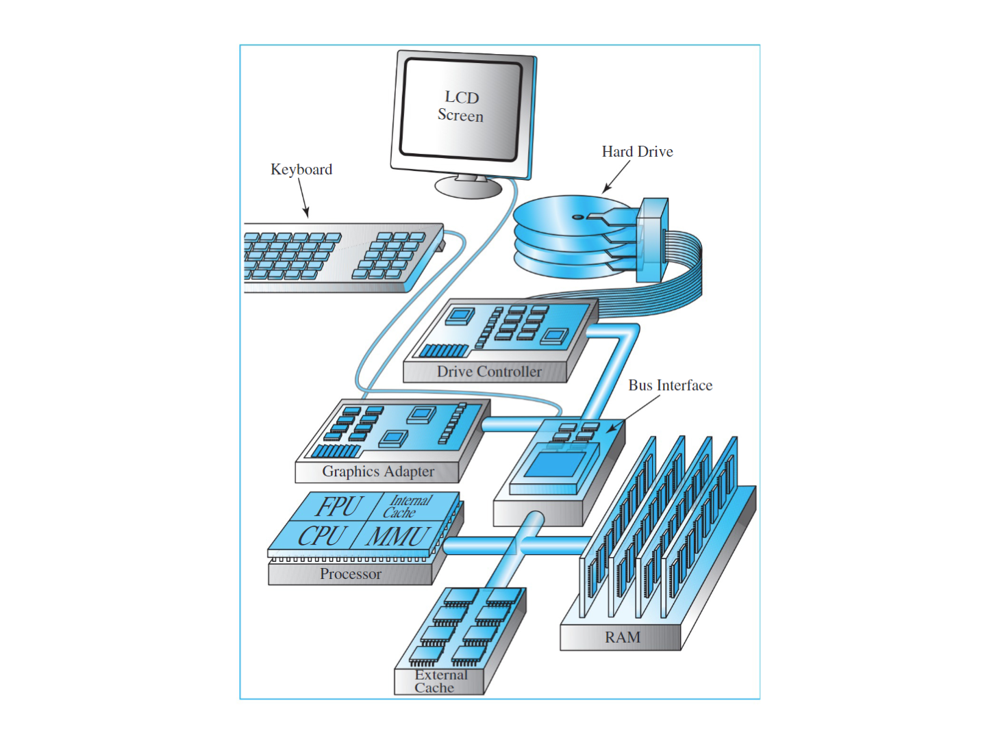
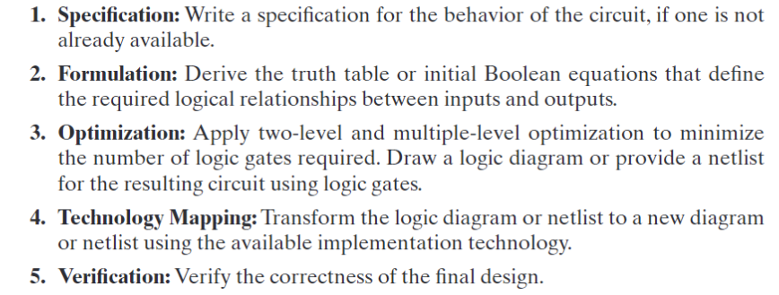

---
tags:
  - notes
  - sysI
comments: true
dg-publish: true
---

# CS-I

浙江大学本科贯通课程计算机系统 I 课程笔记；起初对于课程缺乏了解，没能构建起体系，比较杂乱，所以可能参考价值不大。

- [实验文档](https://zju-sys.pages.zjusct.io/sys1/sys1-sp24/)

<!-- more -->

## some verilog syntax from lab guide

> sys1-sp24 实验文档中的 verilog 相关语法讲解

- [verilog & circuit](https://zju-sys.pages.zjusct.io/sys1/sys1-sp24/lab0-2-appendix/)
- [generate & integer](https://zju-sys.pages.zjusct.io/sys1/sys1-sp24/lab2-1-appendix/#generate)
- [localparam & parameter](https://zju-sys.pages.zjusct.io/sys1/sys1-sp24/lab2-1-appendix/#_1)
- [start-finish](https://zju-sys.pages.zjusct.io/sys1/sys1-sp24/lab3-3/#start-finish)
- [reg initial](https://zju-sys.pages.zjusct.io/sys1/sys1-sp24/lab3-1-appendix/#_5)
- [Trigger Signal in @always](https://zju-sys.pages.zjusct.io/sys1/sys1-sp24/lab3-1-appendix/#_8)
- [more @always](https://zju-sys.pages.zjusct.io/sys1/sys1-sp24/lab3-1-appendix/#always_1)
- [valid-ready](https://zju-sys.pages.zjusct.io/sys1/sys1-sp24/lab4-1/#valid-ready)
- [typedef & struct](https://zju-sys.pages.zjusct.io/sys1/sys1-sp24/lab4-1-appendix/#typedef)
- [package & queue & interface](https://zju-sys.pages.zjusct.io/sys1/sys1-sp24/lab4-1-appendix/#package)

## Introduction to computer systems

**信息：** 数字系统存储、转移、处理的对象，是对物质世界与人类社会中存在的各种各样现象的表示。

模拟信号&数字信号

当前绝大多数电子数字系统的信号都采用两个离散值，称为二进制(binary),其中用到的两种离散值分别称为 0 和 1，也就是二进制系统中所用到的数字。

我们经常用两种一定范围的电压——高电平（HIGH）和低电平（LOW）（具体范围可以参考 [原书对应部分](../ebooks/Logic-and-computer-design-fundamentals.pdf#page=21&selection=57,0,64,5) )来表示两种离散值；相应的，TURE 和 FALSE 也可以用于表示。

实际上，我们经常这么干

- HIGH == 1 == TRUE
- LOW == 0 == FALSE

数字计算机其他计算机以及它们的组成元件等等不作记录，自行翻书。

计算机系统设计过程的 **基础** 是 “抽象的层次” 概念。

### 抽象层次

下面是现代计算机系统典型的抽象层次：

- 算法
- 编程语言
- 操作系统
- 指令集结构
- 微结构
- 寄存器传输
- 逻辑门
- 晶体管电路

### 数字设计过程

组合数字电路设计流程：（第 2、3 章将会介绍）

即：

- 功能描述
- 形式化
- 优化
- 工艺映射
- 验证
