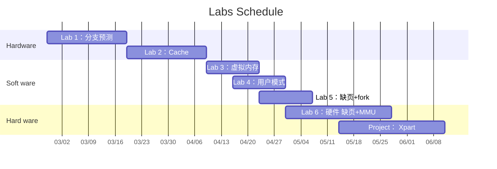

# Computer system III

## scoring

- Final examination (30%)
- Process assessment (70%)
    - homework (4%)
    - class attendance (6%)
    - Labs
        - [ ] (8%) lab1 - BHT BTB
        - [ ] (8%) lab2 - Cache design
        - [ ] (8%) lab3 - Virtual Memory
        - [ ] (8%) lab4 - User mode
        - [ ] (10%)lab5 - Page fault and fork system call
        - [ ] (10%)lab6 - Hard ware support page fault and MMU
        - [ ] (8%) project - X part (8%)
 
[实验安排](https://raw.githubusercontent.com/darstib/public_imgs/utool/2503/14_250314-220727.png)：

## source url

- linux kernel v5.2.21
	- [下载版](https://git.codelinaro.org/bryan.odonoghue/kernel/-/tree/v5.2.21)
	- [阅读版](https://elixir.bootlin.com/linux/v5.2.21/source)
- [riscv ISA](https://note.tonycrane.cc/cs/pl/riscv/)
	- [非特权级 ISA](https://note.tonycrane.cc/cs/pl/riscv/unprivileged/)
	- [特权级 ISA](https://note.tonycrane.cc/cs/pl/riscv/privileged/)
	- [页表相关](https://note.tonycrane.cc/cs/pl/riscv/paging/)
- some tutorial in sys II
	- [内联汇编](https://zju-sys.pages.zjusct.io/sys2/sys2-fa24/lab4/#_4)
	- [S-mode trap 相关 CSR](https://zju-sys.pages.zjusct.io/sys2/sys2-fa24/lab5/#_5)
	- [软硬件实验 clock_set_next_event 调整](https://zju-sys.pages.zjusct.io/sys2/sys2-fa24/lab7/#_6)
	- [bootloader 介绍](https://zju-sys.pages.zjusct.io/sys2/sys2-fa24/lab7/#bootloader)
	- [硬件调试](https://zju-sys.pages.zjusct.io/sys2/sys2-fa24/lab7/#_22)