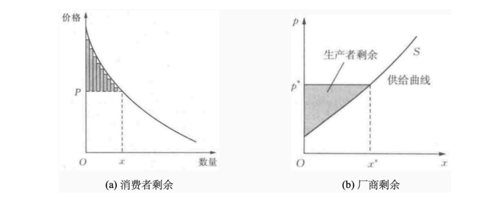
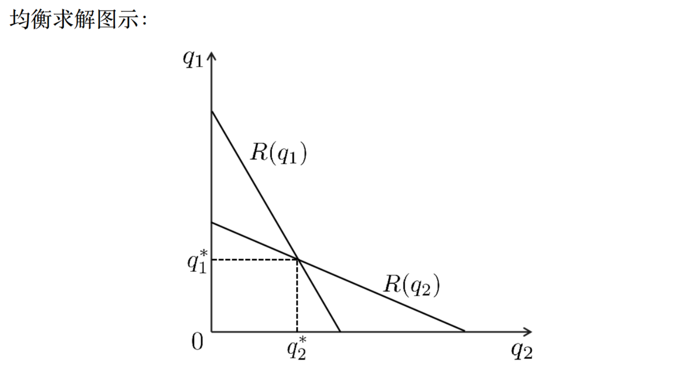

---
tags:
  - notes
comments: true
---

# 第三讲：非合作博弈论基础（一）

## I 微观经济学基础 (page 3-35)

在深入研究多个决策者如何互动之前，我们首先需要理解单个决策者的行为模式。微观经济学为我们提供了分析个人和厂商在市场中如何做出最优选择的基础框架。这对于理解数据定价、交易策略等复杂问题至关重要。

### I.1 偏好与效用 (page 4-7)

在经济学中，我们分析消费者行为的起点是**偏好 (preference)**。偏好描述了消费者对不同商品组合的喜爱程度。例如，在“15 个钥匙扣和 10 个本子”与“10 个钥匙扣和 15 个本子”之间，消费者能够判断出自己更喜欢哪一个，或者认为两者没有差别。

为了将这种主观的偏好进行量化分析，经济学家引入了**效用 (utility)** 的概念。

> [!definition]+ 效用 (Utility)
> 效用是一个数值，用于表示消费者从一个消费组合（也称消费束, consumer bundle）中获得的满意程度。一个消费束通常表示为向量 $\boldsymbol{x} = (x_1, x_2, \ldots, x_n)$，其中 $x_i$ 是商品 $i$ 的数量。
>
> **效用函数 (utility function)** 是一个将消费束映射到代表满意程度的实数的函数：
>
> $u: \mathbb{R}^n \rightarrow \mathbb{R}$
>
> 效用函数的关键性质是：如果消费者认为消费束 $\boldsymbol{x}$ 优于 $\boldsymbol{y}$，那么 $u(\boldsymbol{x}) > u(\boldsymbol{y})$。

例如，$u(1 \text{斤苹果}, -6 \text{元钱}) = 0$ 表示消费者认为获得 1 斤苹果所带来的满足感，正好与花费 6 元钱所带来的不满足感相抵消。换言之，他愿意为 1 斤苹果支付 6 元钱。

这一理论框架建立在一个核心假设之上：**理性人假设 (rational agent hypothesis)**。该假设认为，<u>经济活动中的每个参与者（无论是消费者还是厂商）都会在面临选择时，采取行动以最大化自身的效用（或利润）</u> 。虽然这一假设在现实中备受争议（行为经济学就是研究非理性行为的学科），但它构成了经典经济学和博弈论分析的基石。

### I.2 几类重要的效用函数 (page 9-11)

根据商品特性和分析场景的不同，经济学中会使用不同形式的效用函数。

1. **柯布-道格拉斯效用函数 (Cobb-Douglas Utility Function)**:
    形式为 $u(x_1, x_2) = x_1^\alpha x_2^{1-\alpha}$，其中 $\alpha \in (0, 1)$。
    - $\alpha$ 和 $1-\alpha$ 分别代表消费者对商品 1 和商品 2 的偏好权重。
    - 这个函数形式体现了“多多益善”的特点，即增加任何一种商品的消费量都会提高总效用。
    - 它还隐含了**边际效用递减**的特性，我们稍后会详细解释。
    - 在宏观经济学中，这种函数形式也常被用作生产函数，表示资本和劳动力投入与总产出之间的关系。
2. **冯·诺依曼-摩根斯坦效用 (von Neumann-Morgenstern Utility)**:
    用于处理不确定性下的选择。假设一个“彩票” $L$ 有 $p$ 的概率得到结果 $x$，有 $1-p$ 的概率得到结果 $y$。其期望效用为：
    $u(L) = p \cdot u(x) + (1-p) \cdot u(y)$
    - 这里的 $u(\cdot)$ 是指对确定性结果的效用。
    - 这个理论框架可以用来分析个体对风险的态度：
        - **风险厌恶 (Risk Averse)**: 如果效用函数 $u$ 是严格凹函数，个体更喜欢确定的平均收益，而不是有风险的收益。
        - **风险偏好 (Risk Seeking)**: 如果 $u$ 是严格凸函数，个体更喜欢有风险的赌博。
        - **风险中性 (Risk Neutral)**: 如果 $u$ 是线性函数，个体只关心期望收益，对风险无所谓。
3. **拟线性效用函数 (Quasi-linear Utility Function)**:
    形式为 $u(x, p) = v(x) - p$。
    - 它将消费束 $x$ 的效用 $v(x)$ 和为之支付的价格 $p$（即金钱）分离开来。
    - 这里隐含了一个简化的假设：货币的边际效用是恒定的（通常设为 1）。
    - 这种形式在机制设计和拍卖理论中非常常用，因为它简化了分析，让我们能更专注于商品本身的估值。

### I.3 边际效用递减规律 (page 12)

这是一个非常核心的经济学概念。

> [!definition]+ 边际效用 (Marginal Utility)
> 边际效用是指在其他商品消费量保持不变的情况下，消费者每增加一单位某种商品的消费所带来的**额外**满足程度。

**边际效用递减规律 (Law of Diminishing Marginal Utility)** 指出，在一定时期内，随着消费者对某种商品消费量的不断增加，其总效用虽然在增加，但边际效用（即总效用的增速）是递减的。当总效用达到最大值时，边际效用为零；如果继续消费，总效用反而会下降，边际效用变为负数。

> [!example]+ 冰激凌的效用
> 假设吃冰激凌的效用如下表所示：
> 
> | 数量 | 1 | 2 | 3 | 4 | 5 | 6 |
> | :---:| :-: | :-: | :-: | :-: | :-: | :-: |
> | **总效用** | 7 | 12 | 16 | 18 | 15 | 10 |
>
> 我们可以计算出对应的边际效用：
> 
> | 消费第几个 | 1 | 2 | 3 | 4 | 5 | 6 |
> | :---:| :-: | :-: | :-: | :-: | :-: | :-: |
> | **边际效用** | 7 | 5 | 4 | 2 | -3 | -5 |
>
> - 第 1 个冰激凌带来了 7 个单位的效用。
> - 第 2 个带来了 5 个单位的**额外**效用（总效用从 7 增加到 12）。
> - 到第 4 个时，总效用达到顶峰 18。
> - 吃第 5 个时，总效用反而下降到 15，说明边际效用为-3，已经吃腻了。

### I.4 效用最大化与市场均衡 (page 13-19)

理性消费者在**预算约束 (budget constraint)** 下会追求效用最大化。假设有两种商品，价格分别为 $p_1, p_2$，消费者收入为 $p$，其决策问题可以形式化为：
$$
\begin{aligned}
\max_{x_1, x_2} \quad & u(x_1, x_2) \\
\text{s.t.} \quad & p_1 x_1 + p_2 x_2 \le p
\end{aligned}
$$
由于我们通常假设效用函数是递增的（多多益善），所以在最优点上，预算约束会取等号，即钱会花完。

> [!example]+ 柯布-道格拉斯效用最大化 (page 14-15)
> **问题**: 设效用函数为 $u(x_1, x_2) = x_1^\alpha x_2^\beta$，价格为 $p_1, p_2$，收入为 $p$。求消费者的需求函数 $x_1(p_1, p_2, p)$ 和 $x_2(p_1, p_2, p)$。
>
> **求解**:
> 1. **建立优化问题**:
>     $$
>     \begin{aligned}
>     \max_{x_1, x_2} \quad & x_1^\alpha x_2^\beta \\
>     \text{s.t.} \quad & p_1 x_1 + p_2 x_2 = p
>     \end{aligned}
>     $$
> 2. **求解方法**: 可以使用拉格朗日乘数法，或者将约束代入目标函数，转化为单变量求极值问题。这里我们使用后者。
>     由约束得 $x_2 = (p - p_1 x_1) / p_2$。代入效用函数，问题变为最大化 $f(x_1) = x_1^\alpha \left(\frac{p - p_1 x_1}{p_2}\right)^\beta$。
> 3. **求导**: 对 $x_1$ 求导并令其为 0（求解过程略），可以得到最优解。
> 4. **结果**:
>     $$
>     x_1^* = \frac{\alpha}{\alpha + \beta} \cdot \frac{p}{p_1} \quad ; \quad x_2^* = \frac{\beta}{\alpha + \beta} \cdot \frac{p}{p_2}
>     $$
> **结论**: 从结果可以看出，某种商品的需求量与其自身价格成反比，与消费者的收入成正比。

这符合**需求定律 (Law of Demand)**：在其他条件不变时，价格上涨，需求量减少；价格下降，需求量增加。

与需求定律相对应的是**供给定律 (Law of Supply)**，它描述了厂商的行为：价格越高，厂商越愿意生产和销售，供给量越大。

当市场上的需求和供给相遇时，它们会通过价格机制达到一个平衡点，这个点被称为**市场出清 (market clearing)** 或**竞争均衡 (competitive equilibrium)**。在此均衡点（下图中的E点），供给量等于需求量（$Q_E$），价格为均衡价格（$P_E$）。

### I.5 社会福利与看不见的手 (page 20-23)

一个自然的问题是：竞争均衡是“好”的吗？为了衡量市场的“好坏”，我们引入**社会福利 (social welfare)** 的概念。

- **消费者剩余 (Consumer Surplus)**: 消费者愿意支付的最高价格与实际支付价格之间的差额总和。它代表了消费者在交易中获得的净收益。在图形上是需求曲线以下、价格线以上的区域。
	- 消费者剩余 = 买到的商品效用 - 支付
- **厂商剩余 (Producer Surplus)**: 厂商的销售收入与生产成本之间的差额总和。它代表了厂商在交易中获得的净利润。在图形上是价格线以上、供给曲线以下的区域。
	- 厂商剩余 = 出售的收益 - 成本

**社会福利 = 消费者剩余 + 厂商剩余** = 商品效用 - 成本（因为一般认为“支付=收益”）。它衡量了市场交易为整个社会带来的总价值。

> [!summary]+ 福利经济学第一定理
> 在完全竞争市场中（包含一系列理想化假设），市场自发达到的均衡状态能够实现社会福利的最大化。

这个定理为亚当·斯密的**看不见的手 (invisible hand)** 提供了现代数学的诠释：竞争均衡建立在市场上每个消费者都追求自身效用最大化，并且每个厂商都追求利润最大化的基础上，是 <u>所有人自私的行为结合在一起得到的均衡，最终却实现了有效率的分配</u> 。

### I.6 市场失灵 (page 24-30)

“看不见的手”并非万能，因为其所依赖的理想化假设（完全竞争、完全信息、无交易成本、无外部性、无规模经济等）在现实中往往不成立。当市场无法有效配置资源，导致社会福利未能最大化时，就出现了**市场失灵 (market failure)**。

1. **垄断 (Monopoly)** (page 25): 当市场上只有一个生产者时，该厂商就拥有**市场势力 (market power)**，可以通过提高价格来攫取更多的消费者剩余，导致产量低于社会最优水平，产生**无谓损失 (deadweight loss)**，损害了社会总福利。
	- 垄断厂商会通过提高价格攫取更多的消费者剩余。
2. **外部性 (Externalities)** (page 26): 外部性指一个人或一群人的行动和决策使另一个人或一群人受损或受益的情况，即社会成员从事经济活动时其成本与后果不完全由该行为人承担；
    - **负外部性**: 如工厂排污影响下游渔场，其生产成本未包含对环境的破坏。
    - **正外部性**: 如植树造林美化环境，其收益（清新的空气）未完全由植树者获得。
    - **公共物品 (Public Goods)**: 具有**非排他性**（无法阻止未付费者使用）和**非竞争性**（一人使用不影响他人使用）的物品，如国防、路灯。它们通常带来巨大的正外部性，但由于难以收费，私人市场往往供给不足，产生“搭便车”问题。
3. **信息不对称 (Asymmetric Information)** (page 27-30): 指交易中的一方比另一方拥有更多、更重要的信息。
    这会导致两种主要问题：
    - **逆向选择 (Adverse Selection)**: 发生在签约前。拥有信息优势的一方可能会做出损害另一方的选择，导致市场上的商品质量劣于平均水平。
    - **道德风险 (Moral Hazard)**: 发生在签约后。拥有信息优势的一方可能会采取不被观察到的、损害对方利益的行动。

> [!example]+ 柠檬市场 (The Market for Lemons) (page 29-30)
> 这是乔治·阿克洛夫提出的经典模型，用于说明信息不对称如何摧毁市场。
> - **背景**: 二手车市场有 50 辆好车（卖家要价$3000，买家愿付$3600）和 50 辆次品（“柠檬”，卖家要价$2000，买家愿付$2400）。
> - **信息不对称**: 只有卖家知道车的真实质量，买家不知道。
> - **买家决策**: 由于无法区分，买家只愿意支付基于平均质量的期望价格。市场上一半好车一半次品，所以买家的最高支付意愿是 $0.5 \times \$3600 + 0.5 \times \$2400 = \$3000$。
> - **市场崩溃**:
>     - 在这个价格（$3000）下，好车的卖家（心理价位也是$3000）即使卖出也无利可图，甚至可能选择退出市场。
>     - 一旦好车卖家退出，市场上只剩下“柠檬”，买家会意识到这一点，并将出价降至$2400。
>     - 最终，好车被完全挤出市场，只有次品在交易，这就是所谓的**“劣币驱逐良币”**。整个市场的效率和社会福利都大大降低了。
> - **解决方案**: 类似问题的解决方案通常依赖于**信号传递 (signaling)**（如好车卖家提供质保）或**信息甄别 (screening)**（如买家雇佣独立技师检测）。

### I.7 数据的经济学特性与定价挑战 (page 31-35)

数据作为一种特殊的商品，其特性完美地体现了市场失灵的各种挑战，使得为其合理定价变得异常复杂。

1. **卖家垄断**: 大型平台（如 Google, Meta）拥有独特的用户数据，形成事实上的垄断。
2. **零成本复制性**: 数据一旦产生，复制和分发的边际成本几乎为零。这使得传统基于成本的供给曲线失效。
3. **外部性**: 一家公司购买数据提升了自身竞争力，可能会损害其竞争对手的利润，即便后者并未参与交易。
4. **公共物品属性**: 数据的使用具有非竞争性，零成本复制又使其难以排他。这引发了关于数据产权的复杂问题。
5. **效用不确定性 (信息不对称)**:
    - **买家确定，卖家不确定**: 卖家不知道买家将数据用于何种下游任务，因此不确定数据对买家的真实价值。
    - **卖家确定，买家不确定**: 买家在购买前无法看到数据内容，不确定其质量和效用。需要免费试用、声誉或广告（如贝叶斯劝说）等机制来解决。
    - **双方都不确定**: 这是最复杂的情况。

这些特性使得数据市场天然地与**价格歧视 (price discrimination)** 相联系。

- **一级价格歧视 (完全价格歧视)**: 卖家完全了解每个买家的支付意愿，并据此定价，榨干所有消费者剩余。这在理论上是可能的，如果数据卖家能完美分析用户偏好。
- **三级价格歧视**: 根据可观察的群体特征（如年龄、地区）进行定价，例如“大数据杀熟”、“学生半价”。
- **二级价格歧视**: 卖家设计不同的产品/价格套餐，让消费者“自我选择”，从而实现信息甄别。例如，提供不同数量或质量的数据包，或者像软件的“家庭版”和“专业版”一样进行**版本化 (versioning)**。

所有这些挑战都指向一个结论：简单的供需模型不足以分析数据市场。我们需要一个能够处理战略互动、信息不对称和复杂决策的框架，这就是**博弈论**。

## II 博弈论：引入与基本概念 (page 36-52)

微观经济学主要研究单人决策问题（$\max u(x)$），而现实世界中，一个决策者的最优选择往往依赖于其他人的选择。博弈论正是研究这种**交互式决策 (interactive decision-making)** 的数学工具。

从数学上看，问题从单人最优化 $\max_{x \in X} u(x)$ 变为了多人关联的最优化：
$$
\max_{x_i \in X_i} u_i(x_i, \boldsymbol{x}_{-i})
$$
其中，$x_i$ 是参与人 $i$ 的决策，而 $\boldsymbol{x}_{-i}$ 代表**所有其他**参与人的决策组合。$i$ 的效用 $u_i$ 不仅取决于自己的行为 $x_i$，还取决于别人做了什么 $\boldsymbol{x}_{-i}$。

> [!example]+ 书店定价
>
> 1. **垄断 (Monopoly)**: 镇上只有你一家书店，书的成本20元，顾客最多愿意付200元。你的最优决策是什么？很简单，定价200元，赚取最大利润 $200 - 20 = 180$ 元。这时你只需要考虑消费者，不需要考虑其他竞争者。
>
> 2. **寡头 (Oligopoly)**: 镇上新开了一家书店，成本也是 20 元。现在你们的决策是什么？这就进入了博弈的范畴。
>     - 这被称为**伯川德竞争 (Bertrand Competition)**，是一种价格竞争。如果你定价高于对手，没人会买你的书。如果你定价低于对手，你将赢得所有顾客。
>     - 这种“削价”的逻辑会一直持续下去，直到价格被压到边际成本。如果你定价 20.01 元，对手可以定价 20 元来抢走所有生意。唯一的稳定结果是，**双方都定价 20 元**，利润都为 0。
>
> 3. **合作与串谋**: 利润为 0 的结果对双方都很糟糕。你们可能会私下达成协议，共同把价格提高（例如都定价 200 元），形成一个**卡特尔 (cartel)**。但这通常是违法的（反垄断法），而且这种协议本身也不稳定（双方都有偷偷降价来抢占市场的动机）。
>
> 4. **信息与成本变化**: 如果你的好朋友开了印刷厂，让你的成本降到15元，而对手成本仍是20元。现在你可以定价19.99元，既能把对手挤出市场，又能获得 $19.99 - 15 = 4.99$ 的利润。
>
> 这个例子清晰地展示了从单人决策到多人战略互动的转变，以及参与者、策略、信息、收益等因素如何让问题变得复杂。

### II.1 博弈的规范式表达 (page 46-48)

为了系统地分析博弈，我们需要一个标准化的表达方式。

> [!definition]+ 策略式博弈 (Strategic Game)
> 一个策略式博弈由一个三元组 $G = (N, \{S_i\}_{i \in N}, \{u_i\}_{i \in N})$ 定义，其中：
> - **参与人 (Players)**: $N = \{1, 2, \ldots, n\}$ 是参与者的集合。
> - **策略空间 (Strategy Spaces)**: $S_i$ 是参与人 $i$ 所有可选策略的集合。一个**策略组合 (strategy profile)** 是所有参与者策略的向量 $s = (s_1, \ldots, s_n)$，其中 $s_i \in S_i$。
> - **报酬函数 (Payoff Functions)**: $u_i: S_1 \times \ldots \times S_n \rightarrow \mathbb{R}$ 是参与人 $i$ 的效用函数，它为每一个可能的策略组合都指定一个收益值。

> [!note]+ 理性与智能的假设 (page 48)
> - **理性 (Rationality)**: 每个参与者都追求自身效用最大化。
> - **智能 (Intelligence)**: 每个参与者都了解博弈的全部规则（即上述三元组），并且有能力进行完美的逻辑推演。
> - **共同知识 (Common Knowledge)**: "每个参与者都是理性且智能的"这一事实，本身也是所有参与者都知道的。并且"所有人都知道所有人都知道..."，以此类推，直至无穷。这是博弈论分析的一个非常强的假设。

### II.2 博弈的分类 (page 52)

博弈论是一个庞大的领域，可以从不同维度进行分类：

#### II.2.1 合作博弈

**合作博弈**：关注参与者形成联盟后，如何分配合作所产生的联合效用。重点在于“分蛋糕”，而不是个体的策略选择。

#### II.2.2 非合作博弈

**非合作博弈 (Non-cooperative Game)**: 研究个体如何在无法达成有约束力的协议的情况下做出最优决策。即使参与者可以交流，任何口头协议都没有强制执行力。本课程主要关注此类博弈。

1. **信息完备性**:
    - **完全信息博弈 (Complete Information Game)**: 每个参与者都了解所有其他参与者的报酬函数（即知道别人的喜好）。
    - **不完全信息博弈 (Incomplete Information Game)**: 至少有一个参与者不完全了解其他某个参与者的报酬函数（例如，在拍卖中，你不知道对手对拍卖品的真实估价）。
2. **行动顺序**:
    - **静态博弈 (Static Game)**: 参与者同时做出决策，或者虽有先后但后行动者不知道先行动者的具体选择。囚徒困境、石头剪刀布都是静态博弈。
    - **动态博弈 (Dynamic Game)**: 参与者的行动有先后顺序，后行动者可以观察到先行动者的选择。象棋、围棋是典型的动态博弈。

这两个维度可以组合成四大类基础博弈，例如囚徒困境是“完全信息静态博弈”，而扑克牌是“不完全信息动态博弈”。

## III 占优策略均衡 (page 53-65)

在有了一个博弈模型后，我们的核心任务是预测博弈的结果。这需要**解概念 (solution concept)**。最简单、最强的解概念是占优策略均衡。

### III.1 囚徒困境与严格占优 (page 54-55)

> [!example]+ 囚徒困境 (Prisoner's Dilemma)
> 两名罪犯（1 和 2）被分开关押审问。他们面临的选择是“承认”罪行还是“不承认”。收益（以刑期年数的负数表示）如下：
>
> | **罪犯 1**/**罪犯 2** | **不承认** | **承认** |
> | :---:| :---:| :---:|
> | **不承认** | -1, -1 | -15, 0 |
> | **承认** | 0, -15 | -5, -5 |
>
> **理性分析**:
> - **罪犯 1 的思考**:
>     - “如果罪犯 2**不承认**，我选择**承认**（获释，收益 0）比选择**不承认**（判 1 年，收益-1）更好。”
>     - “如果罪犯 2**承认**，我选择**承认**（判 5 年，收益-5）比选择**不承认**（判 15 年，收益-15）更好。”
> - **结论**: 无论罪犯 2 做什么，对罪犯 1 来说，“承认”都是最优选择。
>
> 罪犯 2 的逻辑完全对称。因此，两个理性的参与者最终都会选择（承认，承认），各自判刑 5 年。

这个例子引出了**严格占优**和**严格劣势**策略的定义。

> [!definition]+ 严格劣策略与严格占优策略 (page 55)
> 对于参与人 $i$ 来说，策略 $s_i \in S_i$ 是一个**严格劣策略 (strictly dominated strategy)**，如果存在另一个策略 $t_i \in S_i$，使得**无论其他参与者选择什么策略组合 $\boldsymbol{s}_{-i}$**，都有：
> $$
> u_i(t_i, \boldsymbol{s}_{-i}) > u_i(s_i, \boldsymbol{s}_{-i})
> $$
> 在这种情况下，我们说策略 $t_i$ **严格占优于 (strictly dominates)** 策略 $s_i$。

理性人假设的一个直接推论是：**一个理性的参与者永远不会选择一个严格劣策略**。

在囚徒困境中，“不承认”就是一个严格劣策略，因为它被“承认”严格占优。双方都剔除这个劣策略后，唯一剩下的选择就是（承认，承认）。这个结果被称为**占优策略均衡 (Dominant Strategy Equilibrium)**。

> [!note]+ 囚徒困境的启示 (page 56)
> 囚徒困境揭示了一个深刻的矛盾：**个体理性可能导致集体非理性**。对每个囚犯来说最理性的选择（承认），却让他们陷入了比双方合作（都不承认）更糟糕的境地（-5, -5 vs -1, -1）。
>
> 现实世界中，从军备竞赛、价格战到小组作业拖延（“内卷”），许多困境都具有囚徒困境的结构。解决方案通常依赖于博弈之外的因素，如引入强制力（法律）、建立长期关系（重复博弈）、或改变支付结构（机制设计）。

### III.2 重复剔除严格劣策略 (IESDS) (page 57-61)

当博弈中没有一个策略能“通吃”所有情况（即没有占优策略）时，我们仍然可以利用剔除劣策略的思想来简化博弈。

> [!example]+ IESDS 流程 (page 57-61)
> 考虑以下博弈：
>
> | **参与人 1 \ 参与人 2** | L | M | R |
> | :---:| :---: | :---: | :---: |
> | **T** | 1, 0 | 1, 2 | 0, 1 |
> | **B** | 0, 3 | 0, 1 | 2, 0 |
>
> **求解步骤**:
> 1. **分析参与人 2**:
>     - 比较策略 R 和 M。如果 1 选 T，2 选 M(2)优于 R(1)。如果 1 选 B，2 选 M(1)优于 R(0)。因此，对 2 来说，**M 严格占优于 R**。
>     - 理性的参与人 2 绝不会选择 R。我们可以**剔除 R 列**，得到一个简化的新博弈：
>
> | **参与人 1 \ 参与人 2** | L | M |
> | :---:| :---: | :---: |
> | **T** | 1, 0 | 1, 2 |
> | **B** | 0, 3 | 0, 1 |
>
> 2. **分析参与人 1 (在新博弈中)**:
>     - 比较策略 T 和 B。如果 2 选 L，1 选 T(1)优于 B(0)。如果 2 选 M，1 选 T(1)优于 B(0)。因此，在新博弈中，对 1 来说，**T 严格占优于 B**。
>     - 理性的参与人 1 绝不会选择 B。我们**剔除 B 行**，博弈进一步简化：
>
> | **参与人 1 \ 参与人 2** | L | M |
> | :---:| :---: | :---: |
> | **T** | 1, 0 | 1, 2 |
>
> 3. **再次分析参与人 2 (在最终博弈中)**:
>     - 现在参与人 1 只可能选择 T。参与人 2 只需要比较在 T 行下 L 和 M 的收益。选择 M(2)优于选择 L(0)。因此，**M 严格占优于 L**。
>     - 剔除 L 列后，只剩下唯一的结果。
>
> **最终解**: (T, M)。这个过程被称为**重复剔除严格劣策略 (Iterated Elimination of Strictly Dominated Strategies, IESDS)**。

> [!important]
> 一个重要的性质是，只要每次剔除的都是**严格**劣策略，最终得到的结果是**唯一**的，与剔除的顺序无关。

### III.3 弱占优与问题 (page 62-65)

有时，一个策略并不比另一个“严格地”好，而只是“至少一样好，且有时更好”。

> [!definition]+ 弱劣策略与弱占优策略 (page 64)
> 
> 对于参与人 $i$，策略 $s_i$ 是一个**弱劣策略 (weakly dominated strategy)**，如果存在另一个策略 $t_i$，满足：
> 
> 1. 对于**所有**的 $\boldsymbol{s}_{-i}$，都有 $u_i(t_i, \boldsymbol{s}_{-i}) \ge u_i(s_i, \boldsymbol{s}_{-i})$。（至少一样好）
> 2. **至少存在一个** $\boldsymbol{s}_{-i}$，使得 $u_i(t_i, \boldsymbol{s}_{-i}) > u_i(s_i, \boldsymbol{s}_{-i})$。（有时更好）
>
> 此时，我们说 $t_i$ **弱占优于 (weakly dominates)** $s_i$。

例如，在下图中，对于参与人 1，策略 B 弱占优于 T，因为当参与人 2 选择 L 时，B(2)优于 T(1)；当参与人 2 选择 R 时，B(2)和 T(2)无差别。

| **1 \ 2** |    L     |    R     |
| :-------: | :------: | :------: |
|   **T**   |   1, 2   | **2**, 3 |
|   **B**   | **2**, 2 | **2**, 0 |

剔除弱劣策略似乎也是合理的（如基于“颤抖的手”原则[^1]），但它存在一个严重问题：**剔除弱劣策略的顺序可能会影响最终结果**。

[^1]: 颤抖的手原则 (Trembling Hand Perfection) 认为，对手在执行策略时有极小的概率会“手滑”选错，因此我们应该选择一个在对手犯错时表现也相对稳健的策略。在上面的例子中，如果 2 有极小概率选 L，那么 1 选择 B 的期望收益就严格高于 T。

> [!example]+ 弱劣策略剔除顺序问题：详细分析 (page 65)
>
> 下面的例子旨在说明，不同的弱劣策略剔除顺序，会导致不同的预测结果。
>
> **博弈矩阵:**
> 
> | **参与人 1 \ 参与人 2** | L | C | R |
> | :---: | :---: | :---: | :---: |
> | **T** | 1, 2 | 2, 3 | 0, 3 |
> | **M** | 2, 2 | 2, 1 | 3, 2 |
> | **B** | 2, 1 | 0, 0 | 1, 0 |
>
> **路径一：从参与人 1 开始剔除**
>
> 1. **第一步 (P1):** 检查参与人 1 的策略。
>     - 比较策略 M 和 B。当 P2 选 L 时, P1 的收益都是 2 (`2=2`)。当 P2 选 C 时, M(2) > B(0)。当 P2 选 R 时, M(3) > B(1)。
>     - 因此，**M 弱占优于 B**。我们剔除策略 B。
>
> 2. **第二步 (P2):** 博弈简化为 2x3 矩阵 (行 T, M vs 列 L, C, R)。现在检查参与人 2 的策略。
>     - 比较策略 L 和 R。当 P1 选 T 时, R(3) > L(2)。当 P1 选 M 时, L(2) = R(2)。
>     - 因此，在新博弈中，**R 弱占优于 L**。我们剔除策略 L。
>
> 3. **第三步 (P1):** 博弈简化为 2x2 矩阵 (行 T, M vs 列 C, R)。现在检查参与人 1 的策略。
>     - 比较策略 T 和 M。当 P2 选 C 时, T(2) = M(2)。当 P2 选 R 时, M(3) > T(0)。
>     - 因此，在新博弈中，**M 弱占优于 T**。我们剔除策略 T。
>
> 4. **第四步 (P2):** 博弈简化为 1x2 矩阵 (行 M vs 列 C, R)。
>     - 参与人 1 只能选择 M。此时，参与人 2 在 C (收益 1) 和 R (收益 2) 之间选择。
>     - 理性的参与人 2 会选择 R。
>
> **此路径的最终解为 (M, R)。**
>
> ---
>
> **路径二：从参与人 2 开始剔除**
>
> 5. **第一步 (P2):** 检查参与人 2 的策略。
>     - 比较策略 C 和 R。当 P1 选 T 时, C(3) = R(3)。当 P1 选 M 时, R(2) > C(1)。当 P1 选 B 时, C(0) = R(0)。
>     - 因此，**R 弱占优于 C**。我们剔除策略 C。
>
> 6. **第二步 (P1):** 博弈简化为 3x2 矩阵 (行 T, M, B vs 列 L, R)。现在检查参与人 1 的策略。
>     - 比较策略 T 和 M。当 P2 选 L 时, M(2) > T(1)。当 P2 选 R 时, M(3) > T(0)。
>     - 因此，在新博弈中，**M 严格占优于 T**。我们剔除策略 T。
>
> 7. **第三步 (P1):** 博弈简化为 2x2 矩阵 (行 M, B vs 列 L, R)。再次检查参与人 1 的策略。
>     - 比较策略 M 和 B。当 P2 选 L 时, M(2) = B(2)。当 P2 选 R 时, M(3) > B(1)。
>     - 因此，在新博弈中，**M 弱占优于 B**。我们剔除策略 B。
>
> 8. **第四步 (P2):** 博弈简化为 1x2 矩阵 (行 M vs 列 L, R)。
>     - 参与人 1 只能选择 M。此时，参与人 2 在 L (收益 2) 和 R (收益 2) 之间选择。
>     - 参与人 2 对 L 和 R **无差异**。
>
> **此路径的最终解集为 {(M, L), (M, R)}。**
>
> **结论**
>
> 路径一得出的唯一解是 **(M, R)**，而路径二得出的解集是 **{(M, L), (M, R)}**。（当然不止这两个）由于 `{(M,R)} ≠ {(M,L), (M,R)}`，这两个结果是不同的。这清晰地证明了，在重复剔除弱劣策略的过程中，剔除的顺序可以改变最终的预测结果，从而削弱了这一解概念的预测能力。这也是为什么在博弈论分析中，纳什均衡是比占优策略均衡更常用、更核心的概念。

## IV 纳什均衡 (page 66-81)

当博弈中不存在（严格或弱）劣策略时，我们需要一种新的思维方式。

### IV.1 纳什均衡的引入 (page 67-68)

思路的转换：与其寻找一个在所有情况下都好的“万能”策略，不如去寻找一个**稳定的策略组合**。稳定意味着，一旦博弈达到了这个状态，**没有任何一个参与者有动机单方面地改变自己的策略**。

> [!example]+ 寻找稳定点 (page 67)
> 
> | **1 \ 2** | L | R |
> | :---: | :---: | :---: |
> | **T** | 2, 1 | 2, -20 |
> | **M** | 3, 0 | -10, 1 |
> | **B** | -100, 2 | **3, 3** |
>
> 在这个博弈中，没有任何占优或劣势策略。但我们来考察策略组合 (B, R)：
> - **从参与人 1 的角度**: 假如 2 已经选择了 R。那么 1 的选择是在 T(2), M(-10)和 B(3)之间。他的最优选择是 B。所以，他**不想**偏离。
> - **从参与人 2 的角度**: 假如 1 已经选择了 B。那么 2 的选择是在 L(2)和 R(3)之间。他的最优选择是 R。所以，他也**不想**偏离。
>
> 因为在(B, R)这个组合下，双方都觉得自己的选择是**针对对方选择的最佳应对**，所以这个组合是稳定的。这就是纳什均衡的核心思想。

### IV.2 最佳应对与纳什均衡的定义 (page 69-71)

> [!definition]+ 最佳应对 (Best Response)
> 给定其他参与者的策略组合 $\boldsymbol{s}_{-i}$，参与人 $i$ 的一个策略 $s_i^*$ 被称为对 $\boldsymbol{s}_{-i}$ 的**最佳应对**，如果它能够最大化参与人 $i$ 的效用：
> $$
> u_i(s_i^*, \boldsymbol{s}_{-i}) = \max_{s_i \in S_i} u_i(s_i, \boldsymbol{s}_{-i})
> $$

基于最佳应对，我们可以给出纳什均衡的正式定义。

> [!definition]+ 纳什均衡 (Nash Equilibrium)
> 一个策略组合 $\boldsymbol{s}^* = (s_1^*, s_2^*, \ldots, s_n^*)$ 被称为一个**纳什均衡**，如果对于**每一个**参与人 $i$，$s_i^*$ 都是对其他参与者均衡策略组合 $\boldsymbol{s}_{-i}^*$ 的最佳应对。

换言之，在纳什均衡状态下，**没有人可以通过单方面改变策略而获得更高的收益**。这提供了另一种等价但更直观的定义：

> [!definition]+ 纳什均衡 (等价定义) (page 71)
> 一个策略组合 $\boldsymbol{s}^*$ 是一个纳什均衡，如果对于每一个参与人 $i$ 和他的任意一个其他策略 $s_i \in S_i$，都满足：
> $$
> u_i(\boldsymbol{s}^*) \ge u_i(s_i, \boldsymbol{s}_{-i}^*)
> $$

> [!extra]- 约翰·纳什的贡献 (page 72)
> 约翰·纳什 (John Nash) 在 1950 年仅 27 页的博士论文中提出了这个概念，并证明了在非常广泛的条件下（任何有限参与人、有限策略的博弈）至少存在一个（可能涉及混合策略的）纳什均衡。这项工作彻底改变了经济学及其他社会科学的研究范式，使博弈论成为分析战略互动的核心工具。尽管当时被冯·诺依曼评价为“只是又一个不动点定理”，但其深远影响为纳什在 1994 年赢得了诺贝尔经济学奖。电影《美丽心灵》讲述了他传奇的一生。

### IV.3 求解纳什均衡

#### IV.3.1 离散策略博弈 (page 73)

对于 payoff 矩阵给出的离散博弈，求解纳什均衡最直观的方法是 **“划线法”**（当然也可以是画圈法，本质是找到每个参与者最佳应对的交集），即找出每个参与者对他人所有可能策略的最佳应对。

> [!example]+ 划线法求解纳什均衡 (page 73)
> | **1 \ 2** | L | C | R |
> | :---:| :---: | :---: | :---: |
> | **T** | 1, 2 | 2, 3 | 0, 3 |
> | **M** | 2, 2 | 2, 1 | 3, 2 |
> | **B** | 2, 1 | 0, 0 | 1, 0 |
>
> 1. **固定参与人 2 的策略，找参与人 1 的最佳应对** (在每列中找第一位数字的最大值并划线):
>     - 若2选L，1在(1, 2, 2)中选，M和B都是最佳应对。<u>划线 M和B的第一位数字</u>。
>     - 若2选C，1在(2, 2, 0)中选，T和M都是最佳应对。<u>划线 T和M的第一位数字</u>。
>     - 若2选R，1在(0, 3, 1)中选，M是最佳应对。<u>划线 M的第一位数字</u>。
>
> | **1 \ 2** | L | C | R |
> | :---:| :---: | :---: | :---: |
> | **T** | 1, 2 | <u>**2**</u>, 3 | 0, 3 |
> | **M** | <u>**2**</u>, 2 | <u>**2**</u>, 1 | <u>**3**</u>, 2 |
> | **B** | <u>**2**</u>, 1 | 0, 0 | 1, 0 |
>
> 2. **固定参与人 1 的策略，找参与人 2 的最佳应对** (在每行中找第二位数字的最大值并划线):
>     - 若1选T，2在(2, 3, 3)中选，C和R都是最佳应对。<u>划线 C和R的第二位数字</u>。
>     - 若1选M，2在(2, 1, 2)中选，L和R都是最佳应对。<u>划线 L和R的第二位数字</u>。
>     - 若1选B，2在(1, 0, 0)中选，L是最佳应对。<u>划线 L的第二位数字</u>。
>
> | **1 \ 2** | L | C | R |
> | :---:| :---: | :---: | :---: |
> | **T** | 1, 2 | 2, <u>**3**</u> | 0, <u>**3**</u> |
> | **M** | 2, <u>**2**</u> | 2, 1 | 3, <u>**2**</u> |
> | **B** | 2, <u>**1**</u> | 0, 0 | 1, 0 |
>
> 3. **寻找两个数字都被划线的格子**: 两个格子 (M, L), (M, R), (T, C), (B, L) 都被划线了。
>
> **结论**: 该博弈有 4 个纯策略纳什均衡。

#### IV.3.2 连续策略博弈：古诺竞争 (page 74-79)

当策略空间是连续的（如产量、价格），我们通常通过求解最佳应对函数（也称反应函数）的交点来找到纳什均衡。

> [!example]+ 古诺产量竞争 (Cournot Competition)
> **设定**:
> - 两个厂商 1 和 2 生产同质产品，同时决定各自的产量 $q_1, q_2$。
> - 市场总产量 $Q = q_1 + q_2$。
> - 市场价格由需求决定：$P(Q) = 2 - Q = 2 - q_1 - q_2$。
> - 两厂商的单位生产成本分别为 $c_1, c_2$。
>
> **求解步骤**:
> 1. **写出利润函数 (效用函数)**:
>     - 厂商 1 的利润: $\pi_1(q_1, q_2) = P(Q) \cdot q_1 - c_1 q_1 = (2 - q_1 - q_2)q_1 - c_1 q_1$
>     - 厂商 2 的利润: $\pi_2(q_1, q_2) = P(Q) \cdot q_2 - c_2 q_2 = (2 - q_1 - q_2)q_2 - c_2 q_2$
>
> 2. **求解厂商 1 的最佳应对函数 $R_1(q_2)$**:
>     - 给定 $q_2$，厂商 1 选择 $q_1$ 来最大化自己的利润 $\pi_1$。
>     - 求导并令其为 0: $\frac{\partial \pi_1}{\partial q_1} = (2 - 2q_1 - q_2) - c_1 = 0$
>     - 解出 $q_1$: $q_1 = \frac{2 - q_2 - c_1}{2}$。这就是厂商 1 的最佳应对函数 $R_1(q_2)$。
>
> 3. **求解厂商 2 的最佳应对函数 $R_2(q_1)$**:
>     - 同理，对 $\pi_2$ 求关于 $q_2$ 的偏导，可以得到 $R_2(q_1) = \frac{2 - q_1 - c_2}{2}$。
>
> 4. **求解纳什均衡**:
>     - 纳什均衡是两个最佳应对函数的交点，即求解方程组：
>       $$
>       \begin{cases}
>       q_1^* = \frac{2 - q_2^* - c_1}{2} \\
>       q_2^* = \frac{2 - q_1^* - c_2}{2}
>       \end{cases}
>       $$
>     - 将第二个式子代入第一个，解得均衡产量：
>       $$
>       q_1^* = \frac{2 - 2c_1 + c_2}{3} \quad ; \quad q_2^* = \frac{2 - 2c_2 + c_1}{3}
>       $$
>
> **结果分析 (page 78)**: 这个结果非常符合直觉。一个厂商自身的成本 $c_i$ 越高，其均衡产量 $q_i^*$ 就越低。而其**对手**的成本 $c_j$ 越高，反而会导致自己的均衡产量 $q_i^*$ 越高（因为对手产量会收缩，留出了市场空间）。
> 
> 这种模型的价值不仅在于解出均衡，更在于通过分析解来验证模型是否符合现实，并为现实决策提供参考。
>
> **图形表示 (page 79)**: 纳什均衡点是两条最佳应对曲线（在本例中是直线）的交点。
> 
> 

### IV.4 纳什均衡的意义与挑战：协调博弈 (page 80-81)

纳什均衡是博弈论中最核心的解概念，但它也有其局限性，**协调博弈 (Coordination Game)** 就是一个很好的例子。

> [!example]+ 将军博弈 (又称猎鹿博弈)
> 
> | **将军 1 \ 将军 2** | 进攻 | 不进攻 |
> | :---: | :---: | :---: |
> | **进攻** | **1, 1** | -2, 0 |
> | **不进攻** | 0, -2 | **0, 0** |
>
> 这个博弈有两个纯策略纳什均衡：**(进攻, 进攻)** 和 **(不进攻, 不进攻)**。
> 
> - (进攻, 进攻) 是一个好的均衡，双方合作获得收益。但它有风险，如果对方不配合，自己会损失惨重。
> - (不进攻, 不进攻) 是一个安全的均衡，虽然没有收益，但也避免了最坏的结果。

**协调博弈的挑战**:

1. **均衡选择问题**: 当存在多个纳什均衡时，博弈论本身无法告诉我们哪个会发生。现实中，结果可能依赖于历史、文化、惯例或外部的建议（**相关均衡**）。现实往往达不到纳什均衡：需要充分的交流或多次博弈达到稳态或者有一个仲裁者建议（相关均衡），这也是协调博弈的意义。
2. **均衡达成问题**: 即使只有一个好均衡，参与者也未必能自动达到。如果缺乏沟通和信任，大家可能会因为害怕风险而选择安全的、但次优的策略。
3. **精炼 (Refinement)**: 博弈论后续的发展提出了很多“均衡精炼”的概念，试图在多个纳什均衡中筛选出更“合理”的均衡。

协调博弈的意义在于，它说明了在很多社会经济活动中，**交流、信任和建立共同预期**是达成高效合作的关键。