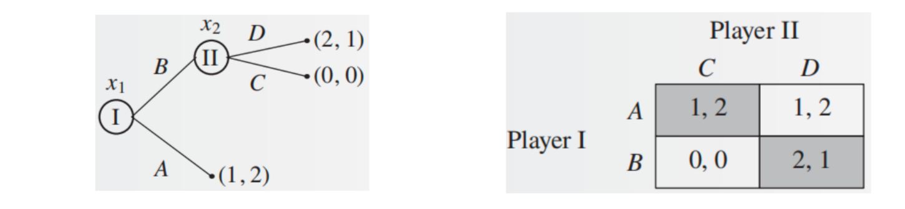

---
tags:
  - notes
comments: true
---

# 第四讲：非合作博弈论基础 (二)

## I 混合策略纳什均衡 (page 2-22)

### I.1 混合策略的引入 (page 3)

纳什均衡（Nash Equilibrium）是分析博弈的强大工具，但并非所有博弈都能找到纯策略纳什均衡。例如，在常见的“石头剪刀布”（Rock-Paper-Scissors）博弈中，无论参与者选择何种纯策略，对手总能找到一个策略来击败他，因此不存在稳定的纯策略均衡。这启发了“混合策略”（Mixed Strategy）的概念，即参与者选择行动时带有随机性，以使自己的行为不可预测，从而达到一个稳定的状态。

### I.2 混合策略的定义 (page 4-5)

> [!definition]+ 混合策略
>
> 设 $G = (N, (S_i)_{i \in N}, (u_i)_{i \in N})$ 为一个策略型博弈（Strategic-Form Game），其中 $N$ 是参与人集合，$S_i$ 是参与人 $i$ 的纯策略集合，$u_i$ 是参与人 $i$ 的效用函数。
>
> **混合策略**（Mixed Strategy） $\sigma_i$ 是参与人 $i$ 在其纯策略集合 $S_i$ 上的一个概率分布，即
> 
> $$\sum_{i} = \left\{\sigma_i: S_i \to [0,1] :\sum_{s_i \in S_i} \sigma_i(s_i) = 1\right\}$$
> 
> 其中，$\sigma_i(s_i)$ 表示参与人 $i$ 在该混合策略下选择纯策略 $s_i$ 的概率。参与人 $i$ 的混合策略集合记为 $\Sigma_i$，它也可以表示为 $\Delta(S_i)$，即 $S_i$ 上的概率分布集合。

**纯策略**（Pure Strategy）是混合策略的特例，即只有一个策略的概率为 1，其余策略的概率为 0。

> [!note]+ 连续策略空间
>
> 当纯策略集合 $S_i$ 是连续策略空间时，对概率的求和将替换为积分。

本课程不讨论连续策略空间下的混合策略。

### I.3 博弈的混合扩展 (page 6-7)

为了分析混合策略下的博弈，我们需要引入博弈的“混合扩展”（Mixed Extension）。

> [!definition]+ 博弈的混合扩展
>
> 给定一个策略型博弈 $G = (N, (S_i)_{i \in N}, (u_i)_{i \in N})$，其**混合扩展**（Mixed Extension） $\Gamma$ 是一个新的博弈，表示为 $\Gamma = (N, (\Sigma_i)_{i \in N}, (U_i)_{i \in N})$。
>
> 其中：
>
> - $N$ 仍是参与人集合。
> - $\Sigma_i = \Delta(S_i)$ 是参与人 $i$ 的混合策略集合。
> - $U_i: \Sigma_1 \times \dots \times \Sigma_n \to \mathbb{R}$ 是参与人 $i$ 的期望收益函数。它将混合策略向量 $\sigma = (\sigma_1, \dots, \sigma_n)$ 映射到一个实数。
>
> 参与人 $i$ 的期望收益 $U_i(\sigma)$ 是通过冯诺伊曼-摩根斯坦恩效用函数（von Neumann-Morgenstern Utility Function）计算的：
>
> $$U_i(\sigma) = E[u_i(\sigma)] = \sum_{s \in S} \left( \prod_{j=1}^n \sigma_j(s_j) \right) u_i(s_1, \dots, s_n)$$
>
> 这个公式意味着参与人 $i$ 的效用本质上是其在混合策略向量 $\sigma$ 下的期望收益。这里隐含一个假定：每个参与人的行动相互独立。

> [!example]+ 石头剪刀布博弈的混合扩展计算 (page 7)
>
> 假设在石头剪刀布博弈中，参与人 1 选择混合策略 $(\frac{1}{2}, \frac{1}{3}, \frac{1}{6})$（石头概率 $\frac{1}{2}$，剪刀概率 $\frac{1}{3}$，布概率 $\frac{1}{6}$），参与人 2 选择混合策略 $(\frac{1}{4}, \frac{1}{2}, \frac{1}{4})$。
>
> 考虑参与人 1 的收益矩阵（假设 $(R,R)$ 收益 $(0,0)$；$(R,P)$ 收益 $(-1,1)$；$(R,S)$ 收益 $(1,-1)$ 等）：
>
> | 参与人 1 / 参与人 2 | 石头 (1/4) | 剪刀 (1/2) | 布 (1/4) |
> | :----------------:| :---------:| :----------:| :--------:|
> | **石头 (1/2)**  | (0,0)      | (1,-1)      | (-1,1)    |
> | **剪刀 (1/3)** | (-1,1)     | (0,0)       | (1,-1)    |
> | **布 (1/6)** | (1,-1)     | (-1,1)      | (0,0)     |
>
> 为了计算参与人 1 的期望效用 $U_1(\sigma_1, \sigma_2)$，我们需要列出所有 9 种策略组合及其出现的联合概率和参与人 1 的效用：
>
> | 策略组合 (P1, P2) | 联合概率 $\sigma_1(s_1)\sigma_2(s_2)$ | 参与人 1 效用 $u_1(s_1,s_2)$ | 期望收益贡献 |
> | :----------------:| :----------------------------------:| :-------------------------:| :-----------:|
> | (石头, 石头)      | $\frac{1}{2} \times \frac{1}{4} = \frac{1}{8}$ | 0          | $0$          |
> | (石头, 剪刀)      | $\frac{1}{2} \times \frac{1}{2} = \frac{1}{4}$ | 1          | $\frac{1}{4}$ |
> | (石头, 布)        | $\frac{1}{2} \times \frac{1}{4} = \frac{1}{8}$ | -1         | $-\frac{1}{8}$ |
> | (剪刀, 石头)      | $\frac{1}{3} \times \frac{1}{4} = \frac{1}{12}$ | -1         | $-\frac{1}{12}$ |
> | (剪刀, 剪刀)      | $\frac{1}{3} \times \frac{1}{2} = \frac{1}{6}$ | 0          | $0$          |
> | (剪刀, 布)        | $\frac{1}{3} \times \frac{1}{4} = \frac{1}{12}$ | 1          | $\frac{1}{12}$ |
> | (布, 石头)        | $\frac{1}{6} \times \frac{1}{4} = \frac{1}{24}$ | 1          | $\frac{1}{24}$ |
> | (布, 剪刀)        | $\frac{1}{6} \times \frac{1}{2} = \frac{1}{12}$ | -1         | $-\frac{1}{12}$ |
> | (布, 布)          | $\frac{1}{6} \times \frac{1}{4} = \frac{1}{24}$ | 0          | $0$          |
>
> 参与人 1 的总期望效用 $$U_1(\sigma_1, \sigma_2) = 0 + \frac{1}{4} - \frac{1}{8} - \frac{1}{12} + 0 + \frac{1}{12} + \frac{1}{24} - \frac{1}{12} + 0 = -\frac{1}{6} + \frac{2}{12} - \frac{1}{24} = -\frac{1}{6} + \frac{1}{6} - \frac{1}{24} = \frac{1}{12}$$
>
> 对应的，参与人 2 的期望效用为 $- \frac{1}{12}$。

### I.4 混合策略纳什均衡的定义与等价条件 (page 8-11)

混合策略纳什均衡的定义类似于纯策略纳什均衡。

> [!definition]+ 混合策略纳什均衡
>
> 给定一个博弈的混合扩展 $\Gamma = (N, (\Sigma_i)_{i \in N}, (U_i)_{i \in N})$，一个混合策略向量 $\sigma^* = (\sigma_1^*, \dots, \sigma_n^*)$ 是一个**混合策略纳什均衡**（Mixed Strategy Nash Equilibrium），若对每个参与人 $i$，有
>
> $$U_i(\sigma^*) \ge U_i(\sigma_i, \sigma_{-i}^*), \quad \forall \sigma_i \in \Sigma_i$$

这意味着在给定其他参与者策略不变的情况下，任何参与人都没有动机通过改变自己的混合策略来增加期望收益。

直接根据上述定义验证一个混合策略向量是否是纳什均衡非常复杂，因为它需要对任意的混合策略 $\sigma_i$ 进行验证。因此，引入了一个更方便的等价条件。
 
> [!theorem]+ 混合策略纳什均衡等价条件 (page 10)
>
> 令 $G = (N, (S_i)_{i \in N}, (u_i)_{i \in N})$ 为一个策略型博弈，$\Gamma$ 为 $G$ 的混合扩展。一个混合策略向量 $\sigma^*$ 是 $\Gamma$ 的混合策略纳什均衡，当且仅当对于每个参与人 $i$ 和每一个纯策略 $s_i \in S_i$，有
>
> $$U_i(\sigma^*) \ge U_i(s_i, \sigma_{-i}^*)$$
>
>> [!proof]- **证明思路**：
> 
> - **正向推导**：如果 $\sigma^*$ 是混合策略纳什均衡，则 $U_i(\sigma^*) \ge U_i(\sigma_i, \sigma_{-i}^*)$ 对所有混合策略 $\sigma_i$ 都成立。由于纯策略是特殊的混合策略，因此对于任意纯策略 $s_i \in S_i$ 也必然成立 $U_i(\sigma^*) \ge U_i(s_i, \sigma_{-i}^*)$。
> - **反向推导**：如果对于每个参与人 $i$ 和每一个纯策略 $s_i \in S_i$ 都有 $U_i(\sigma^*) \ge U_i(s_i, \sigma_{-i}^*)$，则对于参与人 $i$ 的任意混合策略 $\sigma_i$，其期望收益为 $U_i(\sigma_i, \sigma_{-i}^*) = \sum_{s_i \in S_i} \sigma_i(s_i) U_i(s_i, \sigma_{-i}^*)$。
>     由于对所有 $s_i \in S_i$，都有 $U_i(s_i, \sigma_{-i}^*) \le U_i(\sigma^*)$，因此
>     
>     $$\sum_{s_i \in S_i} \sigma_i(s_i) U_i(s_i, \sigma_{-i}^*) \le \sum_{s_i \in S_i} \sigma_i(s_i) U_i(\sigma^*) = U_i(\sigma^*) \sum_{s_i \in S_i} \sigma_i(s_i) = U_i(\sigma^*) \times 1 = U_i(\sigma^*)$$
>     
>     所以 $U_i(\sigma_i, \sigma_{-i}^*) \le U_i(\sigma^*)$，即 $\sigma^*$ 是混合策略纳什均衡。

### I.5 混合策略纳什均衡计算：最优反应与无差异原则 (page 12-20)

**最优反应法**和**无差异原则**是计算混合策略纳什均衡的两种常用方法。

#### I.5.1 性别大战博弈 (page 12)

考虑“性别大战”博弈：夫妻二人要安排周末活动，可选择看足球赛（F）或听音乐会（C）。丈夫更喜欢足球，妻子更喜欢音乐会。若选择不同，双方都不高兴；若选择相同，双方都高兴，但高兴程度不同。收益矩阵如下（第一个数字是丈夫效用，第二个是妻子效用）：

| 丈夫 / 妻子     | F (足球赛) | C (音乐会) |
| :----------:| :------:| :------:|
| **F (足球赛)** | (2, 1)  | (0, 0)  |
| **C (音乐会)** | (0, 0)  | (1, 2)  |

显然，(F, F) 和 (C, C) 是纯策略纳什均衡。现在我们探讨是否存在非纯策略的混合策略纳什均衡。

#### I.5.2 最优反应法 (page 13-15)

假设丈夫选择 F 的概率为 $x$，C 的概率为 $1-x$；妻子选择 F 的概率为 $y$，C 的概率为 $1-y$。
丈夫的混合策略为 $\sigma_1 = (x, 1-x)$，妻子的混合策略为 $\sigma_2 = (y, 1-y)$。

- **妻子的期望效用 $u_2(x,y)$：**
	- 如果丈夫选择 F（概率 $x$），妻子选择 F 获得 1，选择 C 获得 0。
	- 如果丈夫选择 C（概率 $1-x$），妻子选择 F 获得 0，选择 C 获得 2。
	- $U_2(x, y) = x \cdot y \cdot 1 + x \cdot (1-y) \cdot 0 + (1-x) \cdot y \cdot 0 + (1-x) \cdot (1-y) \cdot 2 = 3xy - 2x - 2y + 2$

妻子的最优反应（Best Response） $br_{2}(x) = \arg\max_{y\in[0,1]}U_{2}(x,y)$ 。我们将 $x$ 视为定值，对 $y$ 求导：$\frac{\partial U_2}{\partial y} = 3x - 2$

- 如果 $3x - 2 > 0$（即 $x > \frac{2}{3}$），则 $U_2$ 关于 $y$ 递增，妻子会选择 $y=1$（选择 F）。
- 如果 $3x - 2 < 0$（即 $x < \frac{2}{3}$），则 $U_2$ 关于 $y$ 递减，妻子会选择 $y=0$（选择 C）。
- 如果 $3x - 2 = 0$（即 $x = \frac{2}{3}$），则 $U_2$ 与 $y$ 无关，妻子选择任何 $y \in$ 都是最优反应。

所以，妻子的最优反应集合为：
$$br_2(x) := \begin{cases} \{0\} & x \in [0, \frac{2}{3}) \\ [0, 1]& x = \frac{2}{3} \\ \{1\} & x \in (\frac{2}{3}, 1] \end{cases}$$

- **丈夫的期望效用 $u_1(x,y)$：**
	- 同理，丈夫的期望效用 
	- $U_1(x, y) = x \cdot y \cdot 2 + x \cdot (1-y) \cdot 0 + (1-x) \cdot y \cdot 0 + (1-x) \cdot (1-y) \cdot 1 = 3xy - x - y + 1$

丈夫的最优反应 $br_1(y)$ 是使 $U_1(x,y)$ 最大的 $x$ 值。我们将 $y$ 视为定值，对 $x$ 求导：$\frac{\partial U_1}{\partial x} = 3y - 1$

- 如果 $3y - 1 > 0$（即 $y > \frac{1}{3}$），则 $U_1$ 关于 $x$ 递增，丈夫会选择 $x=1$（选择 F）。
- 如果 $3y - 1 < 0$（即 $y < \frac{1}{3}$），则 $U_1$ 关于 $x$ 递减，丈夫会选择 $x=0$（选择 C）。
- 如果 $3y - 1 = 0$（即 $y = \frac{1}{3}$），则 $U_1$ 与 $x$ 无关，丈夫选择任何 $x \in$ 都是最优反应。

所以，丈夫的最优反应集合为：
$$br_1(y) := \begin{cases} \{0\} & y \in [0, \frac{1}{3}) \\ [0,1]& y = \frac{1}{3} \\ \{1\} & y \in (\frac{1}{3}, 1] \end{cases}$$

**纳什均衡点：** 纳什均衡是双方最优反应函数的交点。
从最优反应函数的图形（page 15）可以看出，有三个交点：

1. $(x^*, y^*) = (0, 0)$：对应 (C, C) 纯策略均衡。
2. $(x^*, y^*) = (1, 1)$：对应 (F, F) 纯策略均衡。
3. $(x^*, y^*) = (\frac{2}{3}, \frac{1}{3})$：这是混合策略纳什均衡。

#### I.5.3 无差异原则 (Indifference Principle) (page 16-20)

> [!definition]+ 无差异原则
>
> 令 $\sigma^*$ 为一个混合策略纳什均衡，$s_i$ 和 $s_i'$ 为参与人 $i$ 的两个纯策略。若 $\sigma_i^*(s_i) > 0$ 且 $\sigma_i^*(s_i') > 0$，则 $U_i(s_i, \sigma_{-i}^*) = U_i(s_i', \sigma_{-i}^*)$。

这意味着，在一个混合策略纳什均衡中，如果某个纯策略被赋予了正的概率（即属于混合策略的“支撑集”），那么该纯策略的期望收益必须与其他所有被赋予正概率的纯策略的期望收益相等。如果一个纯策略的期望收益更高，参与人就会将其选择该策略的概率调整为 1，这与混合策略均衡的定义相悖。

> [!extra]+ 支撑集 (Support Set)
>
> 被赋予正概率的纯策略的集合称为混合策略的**支撑集**（Support Set）。

> [!note]+ 无差异原则的思考问题 (page 17)
>
> - **被严格占优的策略是否能属于混合策略的支撑集合？**
>    不能。因为如果一个策略被严格占优，无论对手如何选择，它的收益总是低于另一个策略。那么赋予它正的概率就意味着参与人不是最大化其期望收益，从而它不能成为纳什均衡的支撑集。
> - **为什么混合策略支撑集的策略无差异，不能只选择其中一个行动或任意选取概率分布？**
>    在混合策略纳什均衡中，所有在支撑集中的纯策略都提供相同的期望收益。这意味着参与人对在这些策略之间进行混合是“无差异”的，任何一种混合方式都不会比其他方式带来更高的期望收益。选择其中一个行动（纯策略）或任意选取概率分布，只要其纯策略处于支撑集中，并且在给定其他玩家策略下，其收益与其他支撑集中的策略相等，那么它都是最优的。而采用混合策略是为了让对手无法预测你的行动，从而使其无法通过偏离策略来获得更高收益。

**使用无差异原则计算性别大战的混合策略纳什均衡：** (page 19)
假设存在一个完全混合的纳什均衡，即 $0 < x < 1$ 且 $0 < y < 1$。
根据无差异原则，在均衡点，丈夫选择 F 和 C 的期望效用必须相等：

$U_1(F, \sigma_2) = U_1(C, \sigma_2);$
$2 \cdot y + 0 \cdot (1-y) = 0 \cdot y + 1 \cdot (1-y)\implies y = \frac{1}{3}$

同理，妻子选择 F 和 C 的期望效用必须相等：

$U_2(\sigma_1, F) = U_2(\sigma_1, C);$
$1 \cdot x + 0 \cdot (1-x) = 0 \cdot x + 2 \cdot (1-x) \implies x = \frac{2}{3}$

因此，混合策略纳什均衡是丈夫选择 F 的概率为 $\frac{2}{3}$，C 的概率为 $\frac{1}{3}$；妻子选择 F 的概率为 $\frac{1}{3}$，C 的概率为 $\frac{2}{3}$，即 $(\sigma_1^*, \sigma_2^*) = ((\frac{2}{3}, \frac{1}{3}), (\frac{1}{3}, \frac{2}{3}))$。

> [!important]+ 必要而非充分条件
>
> 无差异原则只是取得混合策略纳什均衡的**必要条件**，并非充分条件。因此，通过无差异原则求出的结果需要验证。然而，在性别大战的例子中，每个参与人只有两个纯策略，且这两个策略在均衡下效用一致，不存在其他策略能获得更高效用，故无需额外检验。

### I.6 混合策略纳什均衡的存在性与计算复杂性 (page 21-22)

> [!theorem]+ 纳什定理 (Nash's Theorem)
>
> 每一个有限的策略型博弈 $G$，如果参与人的个数有限，每个参与人的纯策略数目有限，那么 $G$ 至少有一个混合策略纳什均衡。
>
> 该定理的证明需要使用布劳威尔不动点定理（Brouwer Fixed-Point Theorem）或角谷不动点定理（Kakutani Fixed-Point Theorem），超出了本课程的范围。

**计算复杂性：**

尽管纳什定理保证了混合策略纳什均衡的存在性，但计算它并非易事。根据定义，可以将其转化为线性可行性问题，但求解方式为指数时间。自然的问题是，是否存在多项式时间的通用解法？

> [!theorem]+ 定理 (陈汐, 邓小铁) (page 22)
>
> 双人博弈纳什均衡的计算是 PPAD 完全问题。
>
> **PPAD**（Polynomial Parity Argument on Directed graphs）是一类计算复杂性问题，其特点是保证解的存在性，但寻找解可能非常困难。对于一般的两人博弈的混合策略纳什均衡，目前没有多项式时间算法可以计算。

## II 完全信息动态博弈 (page 23-47)

### II.1 引入：蜈蚣博弈 (Centipede Game) (page 24)

**蜈蚣博弈**是一种典型的完全信息动态博弈。

两个参与人依次行动，总共 100 轮。
- 在奇数轮 $t=1,3,\dots,99$，参与人 1 选择停止博弈（S）或继续博弈（C）。若停止，收益为 $(t, t-1)$。
- 在偶数轮 $t=2,4,\dots,100$，参与人 2 选择停止博弈（S）或继续博弈（C）。若停止，收益为 $(t-2, t+1)$。
- 如果最初 99 轮无人停止，第 100 轮博弈结束，双方收益为 $(101, 100)$。

博弈树的结构像蜈蚣一样，因此得名。

### II.2 基本概念：扩展式博弈 (Extensive-Form Game) (page 25-27)

蜈蚣博弈体现了参与人多轮交互的特点，这类博弈被称为**扩展式博弈**（Extensive-Form Game）。

> [!definition]+ 扩展式博弈的组成部分
>
> - **根节点**：表示博弈的开始。
> - **叶节点**：标志博弈的一个结束点，需要标注博弈在该终点下的参与人效用。
> - **非叶节点**：需要标注该步的行动者。

在扩展式博弈中，每个参与人的**策略**是一个向量，表示其在所有可能行动的节点上的行动。例如，在蜈蚣博弈中，参与人 1 的策略可能是 (C, C, S, C, ..., S, C)，即使在某个节点选择了停止导致博弈结束，后续节点的策略也需要被定义。

> [!definition]+ 子博弈 (Subgame)
>
> 一个扩展式博弈的**子博弈**（Subgame）由博弈树中的一个节点 $x$ 和所有该节点的**后继节点**组成。实际上，它就是以 $x$ 为根的子树，记为 $\Gamma(x)$。

> [!definition]+ 完美信息博弈 (Game with Perfect Information) (page 28)
>
> 如果每个参与人在选择行动时，都知道他位于博弈树的哪个节点上（即完全了解博弈的历史），那么这个博弈就是**完美信息博弈**。蜈蚣博弈和国际象棋等都属于完美信息博弈。

许多博弈不符合这一条件，例如德州扑克或斗地主，玩家不知道其他玩家的手牌。这引入了不完全信息博弈的概念。

### II.3 子博弈完美均衡 (Subgame Perfect Equilibrium, SPE) (page 30-36)

子博弈完美均衡是动态博弈中一个重要的均衡概念，它对纳什均衡进行了精炼（Refinement）。

> [!definition]+ 子博弈完美均衡 (page 30)
>
> 在扩展式博弈 $\Gamma$ 中，一个策略向量 $\sigma^*$ 是**子博弈完美均衡**（Subgame Perfect Equilibrium），如果对于博弈的任意子博弈 $\Gamma(x)$，局限在那个子博弈的策略向量 $\sigma^*|_x$ 是 $\Gamma(x)$ 的纳什均衡。即，对每个参与人 $i$，每个策略 $\sigma_i$ 和子博弈 $\Gamma(x)$，都有：
>
> $$U_i(\sigma^*|x) \ge U_i(\sigma_i, \sigma_{-i}^*|x)$$
>
> 这个定义非常直观：如果在某个子博弈 $\Gamma(x)$ 上参与人存在有利可图的偏离，那么从全局来看这也将是一个有利可图的偏离。

**均衡精炼**（Equilibrium Refinements）：当一个博弈存在不止一个纳什均衡时，子博弈完美均衡作为一种精炼，可以帮助我们选择那些更合理的均衡，并剔除那些基于不可置信威胁的均衡。

> [!note]+ 子博弈完美均衡与纳什均衡的关系 (page 31)
>
> 子博弈完美均衡是纳什均衡的精炼。这意味着所有子博弈完美均衡都是纳什均衡，但并非所有纳什均衡都是子博弈完美均衡。

> [!example]+ 子博弈完美均衡的例子 (page 32-34)
>
> 考虑一个简单的两阶段博弈：
>
> 
> 
> - Player I 在 $x_1$ 处选择 A 或 B。
> - 如果 Player I 选择 A，博弈结束，收益为 (1, 2)。
> - 如果 Player I 选择 B，Player II 在 $x_2$ 处选择 C 或 D。
> - 如果 Player II 选择 C，博弈结束，收益为 (0, 0)。
> - 如果 Player II 选择 D，博弈结束，收益为 (2, 1)。
>
> 对应的策略型博弈矩阵（Player I 选择行，Player II 选择列）
>
> **1. 纯策略纳什均衡：**
> 
> - 如果 Player II 选择 C，Player I 会选择 A (1 > 0)。
> - 如果 Player II 选择 D，Player I 会选择 B (2 > 1)。
> - 如果 Player I 选择 A，Player II 会选择 C 或 D 均可 (2 = 2)。
> - 如果 Player I 选择 B，Player II 会选择 D (1 > 0)。
>
> 纳什均衡点：(A, C) 和 (B, D)。
> 参与人 I 更偏好 (B, D) (效用 2 > 1)，参与人 II 更偏好 (A, C) (效用 2 > 1)。
>
> **2. 子博弈完美均衡的分析：**
> 博弈中存在一个子博弈，即从节点 $x_2$ 开始的博弈。在 $x_2$ 处，Player II 需要决定选择 C 还是 D。
> - 如果 Player II 选择 C，收益为 0。
> - 如果 Player II 选择 D，收益为 1。
> 因此，Player II 在子博弈中的最优选择是 D。
>
> 基于 Player II 在子博弈中的最优选择，我们回溯到 Player I 的决策：
> - 如果 Player I 选择 A，收益为 (1, 2)。
> - 如果 Player I 选择 B，则 Player II 会选择 D，Player I 收益为 (2, 1)。
>
> 由于 Player I 选择 B 的收益 (2) 大于选择 A 的收益 (1)，因此 Player I 的最优选择是 B。
>
> 综合来看，子博弈完美均衡是 (B, D)。
>
> **分析 (A, C) 是否是子博弈完美均衡：**
> (A, C) 不是子博弈完美均衡，因为在 $x_2$ 处，参与人 II 存在有利可图的偏离：选择 D 而不是 C (收益 1 > 0)。因此，子博弈完美均衡的确是纳什均衡的精炼。
>
> **不可置信的威胁：**
> 在 (A, C) 均衡下，I 不会偏离，因为 Player II 对 Player I 存在一个**威胁**（Threat）：如果你选择 B，我就选择 C。然而，这个威胁显然是不可置信的，因为如果 Player I 真的选择了 B，那么 Player II 还是选择 D 更有利（收益 1 > 0）。子博弈完美均衡剔除了这种基于不可置信威胁的纳什均衡。

> [!theorem]+ 子博弈完美均衡的充分条件 (page 35-36)
>
> 一个策略向量 $\sigma^*$ 是扩展式博弈 $\Gamma$ 的纳什均衡。如果对于所有 $x$ 都有 $P_{\sigma^*}(x) > 0$（即在实施 $\sigma^*$ 时，博弈展开会造访节点 $x$ 的概率大于 0），那么 $\sigma^*$ 是子博弈完美均衡。
>
> **推论：** 完全混合的纳什均衡（即所有纯策略都被赋予正概率的混合策略纳什均衡）是子博弈完美均衡。

### II.4 逆向归纳法 (Backward Induction) (page 37-40)

逆向归纳法是求解有限完美信息扩展式博弈的子博弈完美均衡的核心方法。

> [!extra]+ 逆向归纳法 (Backward Induction)
>
> 逆向归纳法的直观思想是：要求每个子博弈都是均衡，可以从最小的子博弈出发求解。
>
> **步骤：**
> 
> 1. 从博弈树末端的最小子博弈（即其节点直接通向叶节点的子博弈）开始。
> 2. 在每个这样的子博弈中，找出 <u>行动者的最优行动</u> ，并记录其带来的效用。
> 3. 用这些最优行动及其带来的效用“替代”该子博弈。这意味着将该子博弈视为一个单一的决策节点，其结果是先前确定的最优效用。
> 4. 重复上述过程，逐步向上推导，直到达到根节点。每一步都确保行动者在当前子博弈中的选择是其最优反应。

> [!example]+ 逆向归纳法示例 (page 37-38)
>
> 考虑一个扩展式博弈：
>
> 初始节点 $x_1$，Player I 选择 $a$ 或 $b$。
> - 如果 Player I 选择 $b$，博弈结束，收益为 (1, 2)。
> - 如果 Player I 选择 $a$，进入节点 $x_2$，Player II 选择 $c$ 或 $d$。
>     - 如果 Player II 选择 $c$，进入节点 $x_3$，Player I 选择 $e$ 或 $f$ 或 $g$。
>         - 选择 $e$，收益 (4, 5)。
>         - 选择 $f$，收益 (-10, 10)。
>         - 选择 $g$，收益 (3, 7)。
>     - 如果 Player II 选择 $d$，进入节点 $x_4$，Player I 选择 $h$ 或 $i$。
>         - 选择 $h$，收益 (-10, 10)。
>         - 选择 $i$，收益 (-2, -4)。> 
> 
> 
> 
> **求解步骤：**
> 1. **从最小子博弈开始：**
>     - **子博弈 $\Gamma(x_3)$：** Player I 在 $x_3$ 处选择。
>         - 选择 $e$ 收益 4。
>         - 选择 $f$ 收益 -10。
>         - 选择 $g$ 收益 3。
>         Player I 最优选择是 $e$，带来收益 $(4, 5)$。
>     - **子博弈 $\Gamma(x_4)$：** Player I 在 $x_4$ 处选择。
>         - 选择 $h$ 收益 -10。
>         - 选择 $i$ 收益 -2。
>         Player I 最优选择是 $i$，带来收益 $(-2, -4)$。
>
> 2. **向上推导到 $x_2$：**
>     - 子博弈 $\Gamma(x_2)$ 的行动者是 Player II。
>     - 如果 Player II 选择 $c$，根据 $\Gamma(x_3)$ 的结果，最终收益为 $(4, 5)$。Player II 收益为 5。
>     - 如果 Player II 选择 $d$，根据 $\Gamma(x_4)$ 的结果，最终收益为 $(-2, -4)$。Player II 收益为 -4。
>     Player II 在 $x_2$ 处的最优选择是 $c$，带来收益 $(4, 5)$。
>
> 3. **向上推导到根节点 $x_1$：**
>     - Player I 在 $x_1$ 处选择。
>     - 如果 Player I 选择 $a$，根据 $x_2$ 处的分析，最终收益为 $(4, 5)$。
>     - 如果 Player I 选择 $b$，博弈结束，收益为 $(1, 2)$。
>     Player I 在 $x_1$ 处的最优选择是 $a$，带来收益 $(4, 5)$。
>
> 因此，该博弈的子博弈完美均衡纯策略是 Player I 选择 $a$，Player II 选择 $c$，Player I 在 $x_3$ 选择 $e$，Player I 在 $x_4$ 选择 $i$。写成策略向量形式为 $(a, c, e, i)$，但通常我们关注均衡路径上的行动，即 (ae, c)。

> [!theorem]+ 定理 (page 39)
>
> 每个有限完美信息扩展式博弈都至少有一个子博弈完美纯策略均衡。

> [!note]+ 逆向归纳法的局限性 (page 40)
>
> 逆向归纳法虽然能找到子博弈完美均衡，但在某些情况下其结果可能与直观不符，或无法完全描述现实情况。
>
> - **重复囚徒困境（Repeated Prisoner's Dilemma）有限轮：** 逆向归纳法会得到两个罪犯在每一轮都选择承认（缺陷策略），即使是合作可以带来更好的整体收益。这说明逆向归纳法可能无法描述人们在长期关系中可能会合作的事实。
> - **蜈蚣博弈：** 逆向归纳法会得出参与人在第一轮就选择停止，因为在最后一轮，选择停止总比选择继续（等待对方停止或承担博弈继续到最后带来较低收益）更有利。然后倒推到前一轮，也是停止有利，以此类推。然而，在现实中，参与者通常会试探性地前进几步，以期获得更高的总收益。
>
> 这些局限性表明，对于某些博弈，可能需要新的建模方式来描述更复杂的行为模式。

### II.5 产量领导模型 (Stackelberg Model, 斯塔克尔伯格模型) (page 41-47)

产量领导模型（或称斯塔克尔伯格模型）是子博弈完美均衡在经济学中的一个基本应用，用于描述存在一家支配性厂商（领导者）和一家或多家跟随者厂商的市场结构。

**模型设定：**

- 市场中有两个厂商，厂商 1 是领导者，选择产量 $y_1$。
- 厂商 2 是跟随者，观察到 $y_1$ 后，选择产量 $y_2$。
- 市场价格 $p(Y)$ 取决于总产量 $Y = y_1 + y_2$。
- 厂商 1 的成本函数为 $C_1(y_1)$，厂商 2 的成本函数为 $C_2(y_2)$。
- 厂商 $i$ 的利润函数为 $\pi_i(y_1, y_2) = p(y_1+y_2)y_i - C_i(y_i)$。

**求解过程 (逆向归纳法)：** (page 43)

这是一个双层优化问题（Bi-level Optimization Problem），其中优化的约束条件是另一个优化问题。

1. **求解跟随者厂商 2 的最优反应函数：**
    给定领导者厂商 1 的产量 $y_1$，厂商 2 将选择使其利润最大化的 $y_2$。
    $\max_{y_2} \pi_2(y_1, y_2) = p(y_1 + y_2) y_2 - C_2(y_2)$
    解得 $y_2 = f_2(y_1)$。
2. **求解领导者厂商 1 的最优产量：**
    厂商 1 知道厂商 2 会根据自己的产量做出最优反应，因此厂商 1 会在考虑厂商 2 的反应函数后，选择使其利润最大化的 $y_1$。
    $\max_{y_1} \pi_1(y_1, f_2(y_1)) = p(y_1 + f_2(y_1)) y_1 - C_1(y_1)$
    解得最优产量 $y_1^*$。
3. **确定跟随者厂商 2 的最优产量：**
    将 $y_1^*$ 代入 $f_2(y_1)$，得到 $y_2^* = f_2(y_1^*)$。
    $(y_1^*, y_2^*)$ 构成了斯塔克尔伯格博弈的子博弈完美均衡产量。

> [!example]+ 斯塔克尔伯格模型的求解 (page 42-46)
>
> 设市场中有两个厂商：厂商1（领导者），产量 $y_1$；厂商2（追随者），产量 $y_2$。
> 市场价格 $P(y_1 + y_2) = 2 - y_1 - y_2$。
> 厂商1和2的单位生产成本分别为 $c_1, c_2$。
>
> **利润函数：**
> - 厂商1：$\pi_1(y_1, y_2) = (2 - y_1 - y_2)y_1 - c_1 y_1$
> - 厂商2：$\pi_2(y_1, y_2) = (2 - y_1 - y_2)y_2 - c_2 y_2$
>
> **求解过程（逆向归纳法）：**
>
> 1. **求解追随者（厂商2）的最优反应函数** $y_2^*(y_1)$：
>     厂商2的目标是最大化自己的利润 $\pi_2(y_1, y_2)$，给定厂商1的产量 $y_1$。
>     对 $\pi_2$ 关于 $y_2$ 求导并令其等于 0：
>     $$ \frac{\partial \pi_2}{\partial y_2} = (2 - y_1 - y_2) - y_2 - c_2 = 0 $$
>     $$ 2 - y_1 - 2y_2 - c_2 = 0 $$
>     $$ y_2^*(y_1) = \frac{2 - y_1 - c_2}{2} $$
>     这是厂商2的最优反应函数，表示厂商2将根据厂商1的产量 $y_1$ 决定其最优产量 (page 45)。
>
> 2. **求解领导者（厂商1）的最优产量** $y_1^*$：
>     厂商1知道厂商2会做出最优反应，因此会将 $y_2^*(y_1)$ 代入自己的利润函数，然后最大化自己的利润：
>     $$ \pi_1(y_1, y_2^*(y_1)) = (2 - y_1 - \frac{2 - y_1 - c_2}{2})y_1 - c_1 y_1 $$
>     $$ \pi_1(y_1) = (\frac{4 - 2y_1 - 2 + y_1 + c_2}{2})y_1 - c_1 y_1 $$
>     $$ \pi_1(y_1) = (\frac{2 - y_1 + c_2}{2})y_1 - c_1 y_1 $$
>     对 $\pi_1$ 关于 $y_1$ 求导并令其等于 0：
>     $$ \frac{\partial \pi_1}{\partial y_1} = \frac{1}{2}(2 - y_1 + c_2) - \frac{1}{2}y_1 - c_1 = 0 $$
>     $$ 2 - y_1 + c_2 - y_1 - 2c_1 = 0 $$
>     $$ 2y_1 = 2 + c_2 - 2c_1 $$
>     $$ y_1^* = \frac{2 + c_2 - 2c_1}{2} $$
>     这是厂商 1 的最优产量 (page 46)。
>
> 3. **求解追随者（厂商2）的最终产量** $y_2^*$：
>     将 $y_1^*$ 代入 $y_2^*(y_1)$：
>     $$ y_2^* = \frac{2 - (\frac{2 + c_2 - 2c_1}{2}) - c_2}{2} $$
>     $$ y_2^* = \frac{4 - (2 + c_2 - 2c_1) - 2c_2}{4} $$
>     $$ y_2^* = \frac{4 - 2 - c_2 + 2c_1 - 2c_2}{4} $$
>     $$ y_2^* = \frac{2 + 2c_1 - 3c_2}{4} $$
>     这是厂商 2 在子博弈完美均衡下的产量 (page 46)。

> [!question]+ **问题解答 (page 47):**
>
> 1. **上述结果能如何联系到实际？**
>     这个模型可以解释在数据要素市场中，**头部数据平台/数据提供商**（领导者）如何影响**下游数据应用开发者/中小企业**（追随者）的策略。
>     - 例如，大型数据平台（如阿里云、腾讯云的数据开放平台）先行制定数据开放策略、API定价、数据质量标准（对应 $y_1$），这些决策会影响到依赖其数据进行开发和创新的下游企业（对应 $y_2$）的投入和数据产品开发策略。
>     - 领导者可以通过其先发优势和市场影响力，优化自己的数据服务产品（$y_1$）来最大化利润，同时考虑到追随者的反应。
>     - 斯塔克尔伯格模型预测，领导者能够获得更高的利润，因为它在决策顺序上占据优势，能将自己的利润最大化策略建立在对追随者行动的准确预测之上。
> 2. **上述求解过程和古诺竞争的区别？**
>     - **古诺竞争**（Cournot Competition）：属于**静态博弈**，两个厂商同时独立地决定产量，彼此不知道对方的具体决策，只能基于对对方理性的预期做出决策。均衡是纳什均衡。
>     - **斯塔克尔伯格竞争**（Stackelberg Competition）：属于**动态博弈**，一个厂商先决策（领导者），另一个厂商后决策（追随者）。追随者在决策时已经知道了领导者的行动。均衡是子博弈完美均衡。
>     - **主要区别在于信息和行动的顺序**：古诺是同时行动，斯塔克尔伯格是序贯行动。这导致领导者在斯塔克尔伯格模型中拥有先发优势。
> 3. **事实上古诺竞争和斯塔克尔伯格竞争都是在纳什均衡的概念提出之前就已经被研究了，因此纳什均衡统一了这些博弈背后的思想。**
>     - **解释：** 这句话强调了纳什均衡理论的普适性和重要性。尽管古诺和斯塔克尔伯格模型早于纳什理论，但纳什均衡的概念为这两种不同的市场竞争形式提供了一个统一的分析框架。古诺均衡是同时行动博弈的纳什均衡（特别是纯策略纳什均衡），而斯塔克尔伯格均衡是序贯行动博弈的纳什均衡，更具体地说是其**子博弈完美均衡**。纳什理论的提出，使得经济学家能够从更普遍的博弈论视角，理解并求解不同类型的竞争行为，揭示了不同市场结构下企业行为的内在逻辑。

## III 不完全信息博弈 (page 48-73)

### III.1 引入：行业博弈的例子 (page 49-51)

现实中的博弈通常是不完全信息的，例如德州扑克中玩家不知道对手的手牌，或者厂商竞争中不知道对方的真实成本和实力。这类情况需要引入**不完全信息博弈**（Game with Incomplete Information）来描述。

> [!example]+ 行业博弈 (page 50-51)
>
> 考虑一个行业博弈，包含一个在位者（参与人 1）和一个潜在的进入者（参与人 2）。
> - 参与人 1 决定是否建立新工厂（建厂/不建厂）。
> - 参与人 2 决定是否进入该行业（进入/不进入）。
>
> **不完全信息点**：参与人 2 不知道参与人 1 建厂的成本是 3（高成本）还是 0（低成本），但参与人 1 自己知道。
>
> 假设参与人 2 对参与人 1 的类型（高成本/低成本）有先验概率：
> - 参与人 1 成本为 3（高成本）的概率为 $p$。
> - 参与人 1 成本为 0（低成本）的概率为 $1-p$。
>
> **收益矩阵：**
>
> **参与人 1 建厂成本高 (成本 3) 时（参与人 1 收益 -3）：**
>
> | 参与人 1 / 参与人 2 | 进入 (Entry) | 不进入 (No Entry) |
> | :-------------------:| :-----------:| :----------------:|
> | **建厂 (Build)**  | (0, -1) | (2, 0)  |
> | **不建厂 (Not Build)** | (2, 1)       | (3, 0)            |
>
> **参与人 1 建厂成本低 (成本 0) 时（参与人 1 收益 -0）：**
>
> | 参与人 1 / 参与人 2 | 进入 (Entry) | 不进入 (No Entry) |
> | :-------------------:| :-----------:| :----------------:|
> | **建厂 (Build)**  | (3, -1) |  (5, 0) |
> | **不建厂 (Not Build)** | (2, 1)       | (3, 0)            |

#### III.1.1 行业博弈均衡计算 (page 52-57)

**1. 检查劣策略：** (page 52)

- **当参与人 1 成本高时：**
    - 建厂：如果 2 进入，1 收益 0；如果 2 不进入，1 收益 2。
    - 不建厂：如果 2 进入，1 收益 2；如果 2 不进入，1 收益 3。
    无论参与人 2 如何选择，“不建厂”的收益总是优于“建厂”的收益。因此，“建厂”是劣策略。高成本的参与人 1 的均衡策略是**不建厂**。
- **当参与人 1 成本低时：**
    - 建厂：如果 2 进入，1 收益 3；如果 2 不进入，1 收益 5。
    - 不建厂：如果 2 进入，1 收益 2；如果 2 不进入，1 收益 3。
    无论参与人 2 如何选择，“建厂”的收益总是优于“不建厂”的收益。因此，“不建厂”是劣策略。低成本的参与人 1 的均衡策略是**建厂**。

**2. 参与人 2 的期望效用：** (page 53)

参与人 2 知道参与人 1 在高成本时会选择不建厂，在低成本时会选择建厂。

- 如果参与人 2 选择“进入”：
    - 当参与人 1 成本高（概率 $p$）时，1 不建厂，2 收益 1。
    - 当参与人 1 成本低（概率 $1-p$）时，1 建厂，2 收益 -1。
    参与人 2 期望效用：$p \cdot 1 + (1-p) \cdot (-1) = p - 1 + p = 2p - 1$。
- 如果参与人 2 选择“不进入”：
    - 当参与人 1 成本高（概率 $p$）时，1 不建厂，2 收益 0。
    - 当参与人 1 成本低（概率 $1-p$）时，1 建厂，2 收益 0。
    参与人 2 期望效用：$p \cdot 0 + (1-p) \cdot 0 = 0$。

**3. 参与人 2 的最优选择：**

- 如果 $2p - 1 > 0 \implies p > 1/2$，参与人 2 选择“进入”优于“不进入”。
- 如果 $2p - 1 < 0 \implies p < 1/2$，参与人 2 选择“不进入”优于“进入”。
- 如果 $2p - 1 = 0 \implies p = 1/2$，参与人 2 对“进入”和“不进入”无差异。

**总结该博弈的均衡：** (page 54)

- **高成本的参与人 1 永远选择占优策略“不建厂”**。
- **当 $p > 1/2$ 时：** 低成本的参与人 1 选择“建厂”，参与人 2 选择“进入”。
- **当 $p < 1/2$ 时：** 低成本的参与人 1 选择“建厂”，参与人 2 选择“不进入”。
- **当 $p = 1/2$ 时：** 此时存在混合策略均衡。
    - 低成本的参与人 1 选择建厂。
    - 参与人 2 对进入和不进入无差异，可以任意混合。

> [!extra] **进一步考虑当低成本时建厂成本设定为 1.5 的情况 (page 54-56)：**

**参与人 1 建厂成本高 (成本 3) 时：**

| 参与人 1 / 参与人 2 | 进入     |  不进入  |
| :-----------: | :---:| :---: |
|    **建厂**     | (0,-1) | (2,0) |
|    **不建厂**    | (2,1)  | (3,0) |
（同上，1 在高成本时选择不建厂）

参与人 1 建厂成本低 (成本 1.5) 时：（1 在低成本时无占优策略，需要无差异原则）**

| 参与人 1 / 参与人 2 | 进入 | 不进入 |
| :-------------------:| :-- | :-----:|
| **建厂**        | (1.5,-1) | (3.5,0) |
| **不建厂**      | (2,1) | (3,0)  |

**使用无差异原则求解混合策略均衡：**

设参与人 1 低成本时建厂概率为 $x$，参与人 2 进入概率为 $y$。

**1. 参与人 1 低成本时无差异：** (page 56)

在均衡时，低成本的参与人 1 选择“建厂”和“不建厂”的期望效用相等：

$$U_1(\text{建厂}, y) = U_1(\text{不建厂}, y)$$
$$1.5y + 3.5(1-y) = 2y + 3(1-y)$$
$$1.5y + 3.5 - 3.5y = 2y + 3 - 3y$$
$$3.5 - 2y = 3 - y$$
$$0.5 = y \implies y = 1/2$$

因此，当低成本的参与人 1 混合策略时，参与人 2 必须以 $1/2$ 的概率选择“进入”，以使参与人 1 对其纯策略无差异。

**2. 参与人 2 无差异：**

参与人 2 知道高成本的参与人 1 选择不建厂。
当 $p=1/2$ 时，参与人 2 处于无差异状态，可以混合。
参与人 2 选择“进入”的期望效用等于“不进入”的期望效用。

- $U_2(\text{进入}) = p \cdot U_2(\text{进入}|\text{高成本}) + (1-p) \cdot U_2(\text{进入}|\text{低成本})$
- $U_2(\text{不进入}) = p \cdot U_2(\text{不进入}|\text{高成本}) + (1-p) \cdot U_2(\text{不进入}|\text{低成本})$

设 $x$ 是低成本参与人 1 建厂的概率。
- $U_2(\text{进入}) = p \cdot 1 + (1-p) \cdot (-x \cdot 1 + (1-x) \cdot 1) = p + (1-p)(1-2x)$
- $U_2(\text{不进入}) = p \cdot 0 + (1-p) \cdot (x \cdot 0 + (1-x) \cdot 0) = 0$

令 $U_2(\text{进入}) = U_2(\text{不进入})$：

$$p + (1-p)(1-2x) = 0$$
$$1-2x = -\frac{p}{1-p}$$
$$2x = 1 + \frac{p}{1-p} = \frac{1-p+p}{1-p} = \frac{1}{1-p}$$
$$x = \frac{1}{2(1-p)}$$

**总结均衡：**

- 高成本参与人 1 永远选择“不建厂”。
- 当 $y=1/2$ (即参与人 2 以 $1/2$ 概率进入) 且 $x = \frac{1}{2(1-p)}$ (低成本参与人 1 建厂概率) 时，存在混合策略均衡。
	- 如果 $p \le 1/2$，则 $1-p \ge 1/2$，那么 $2(1-p) \ge 1$，所以 $x = \frac{1}{2(1-p)} \le 1$。
	- 如果 $p > 1/2$，则 $1-p < 1/2$，那么 $2(1-p) < 1$，所以 $x = \frac{1}{2(1-p)} > 1$，这不符合概率的定义。因此，此混合策略均衡仅在 $p \le 1/2$ 时有效。

**最终均衡结果：** (page 57)

- **高成本的参与人 1 永远选择“不建厂”**。
- **当 $p \le 1/2$ 时：**
    - 低成本的参与人 1 以 $x = \frac{1}{2(1-p)}$ 概率选择“建厂”。
    - 参与人 2 以 $y=1/2$ 概率选择“进入”。
- **当 $p > 1/2$ 时：**
    - 低成本的参与人 1 选择“建厂”。
    - 参与人 2 选择“进入”。

> [!tip] 学会从解的直观中判断解是否正确/合理。

### III.2 不完全信息博弈的定义 (page 58-62)

从行业博弈的例子出发，不完全信息博弈的正式定义在策略型博弈的基础上进行了扩展。

> [!definition]+ 不完全信息博弈的扩展定义
>
> 传统的策略型博弈是三元组 $G = (N, (S_i)_{i \in N}, (u_i)_{i \in N})$。
> 
> 不完全信息博弈需要扩展为**五元组**：$G = (N, (S_i)_{i \in N}, (T_i)_{i \in N}, p, (u_i)_{i \in N})$。
>
> 其中新增的元素：
> 
> - $(T_i)_{i \in N}$ 是每个参与人 $i$ 的**类型集合**（Type Set）。类型 $t_i \in T_i$ 包含了参与人 $i$ 的私人信息（例如成本类型、手牌等）。
> - $p$ 是类型的**先验分布**（Prior Distribution），它给每种类型向量 $(t_1, \dots, t_n)$ 赋予一个概率。这个先验分布是所有参与人的共同知识。
>     - “自然”（Nature）是博弈论中用来描述随机源的方式，它根据 $p$ 抽取类型向量，并告知每个参与人其自身的类型 $t_i$，但参与人不知道其他人的具体类型 $t_{-i}$。
>     - 行业博弈中，参与人 2 只有一种默认类型，因此先验分布只定义在参与人 1 的两种类型（高成本、低成本）上。
>
> **参与人的策略：** $S_{i}$
> 
> - 原先的参与人策略需要扩展为对参与人的**每种类型都定义一个策略**。
> - 尽管参与人知道自己的类型，但仍需为每个类型定义策略，因为其他参与人不知道你的类型，计算均衡时需要基于所有类型下的策略才能算出期望效用。
> - 参与人 $i$ 类型为 $t_i$ 时选择纯策略 $s_i$ 的概率记为 $\sigma_i(t_i; s_i)$。
>
> **效用函数：** $u_{i}$
> 
> - 参与人 $i$ 的效用与所有人的类型相关。当所有人类型组合为 $t=(t_1, \dots, t_n)$，纯策略组合为 $s=(s_1, \dots, s_n)$ 时的效用记为 $u_i(t; s)$。
> - 注意，效用与所有人的类型相关，但策略只与自己的类型相关。

### III.3 不完全信息博弈的均衡：贝叶斯纳什均衡 (Bayesian Nash Equilibrium) (page 59-65)

在不完全信息博弈中，参与人在做决策时，并不知道其他参与人的具体类型，因此他们基于对其他参与人类型的**后验概率分布**（Posterior Probability Distribution）来最大化自己的期望收益。

> [!definition]+ 参与人 $i$ 的期望收益 (page 63-64)
>
> 当参与人策略组合为 $\sigma = (\sigma_1, \dots, \sigma_n)$ 时，如果参与人类型组合是 $t = (t_1, \dots, t_n)$，那么每个纯策略组合 $(s_1, \dots, s_n)$ 被选择的概率是 $\prod_{j \in N} \sigma_j(t_j; s_j)$。
>
> 此时，参与人 $i$ 在给定类型 $t$ 和策略 $\sigma$ 下的期望收益为：
> $$U_i(t; \sigma) = \sum_{s \in S} \left( \prod_{j=1}^n \sigma_j(t_j; s_j) \right) u_i(t; s)$$
>
> 然而，参与人 $i$ 不知道其他参与人 $j \ne i$ 的类型 $t_j$。因此，他需要对其他人的类型 $t_{-i}$ 求期望，基于自己的类型 $t_i$ 和对 $t_{-i}$ 的后验概率分布 $p(t_{-i}|t_i)$。
>
> 参与人 $i$ 的总期望收益（当他知道自己的类型 $t_i$ 时）为：
> $$U_i(\sigma | t_i) = E_{t_{-i}|t_i} [U_i(t_i, t_{-i}; \sigma)] = \sum_{t_{-i} \in T_{-i}} p(t_{-i}|t_i) U_i(t_i, t_{-i}; \sigma)$$
>
> 其中 $p(t_{-i}|t_i) = \frac{p(t_i, t_{-i})}{p(t_i)} = \frac{p(t_i, t_{-i})}{\sum_{t_{-i}' \in T_{-i}} p(t_i, t_{-i}')}$ 是在给定 $t_i$ 的条件下，对其他参与人类型 $t_{-i}$ 的条件概率。

> [!definition]+ 贝叶斯纳什均衡 (Bayesian Nash Equilibrium) (page 65)
>
> 不完全信息博弈的策略向量 $\sigma^* = (\sigma_1^*, \dots, \sigma_n^*)$ 是一个**贝叶斯纳什均衡**（Bayesian Nash Equilibrium），如果对每个参与人 $i$，每个类型 $t_i \in T_i$，以及每个可能的纯策略 $s_i \in S_i$，都有：
>
> $$U_i(\sigma^*) \ge U_i(s_i, \sigma_{-i}^*)$$

这意味着，在给定自己的类型和所有其他参与人策略的情况下（所以也许也可以写作 $U_i(\sigma^*|t_i) \ge U_i(s_i, \sigma_{-i}^*|t_i)$），每个参与人都没有动机通过改变自己的策略来增加期望收益。这个定义与混合策略纳什均衡的等价条件非常相似，只是在期望收益的计算中增加了对不确定类型变量的期望。

### III.4 不完全信息博弈的三个阶段 (page 66-69)

一个不完全信息博弈的进行顺序可以分为三个阶段：

1. **自然阶段 (Nature)**：自然根据先验概率分布 $p$ 抽取类型向量 $t = (t_1, \dots, t_n)$，并将每个参与人 $i$ 的类型 $t_i$ 告知给参与人 $i$。每个参与人知道自己的类型，但不知道其他参与人的具体类型 $t_{-i}$。
2. **事中阶段 (Interim)**：参与人 $i$ 知道自己的类型 $t_i$ 后，会更新信息，对其他参与人类型的分布更新为 $p(t_{-i}|t_i)$。然后所有参与人同时选择自己的行动 $s_i$。
3. **事后阶段 (Ex Post)**：博弈结束后，每个参与人 $i$ 得到收益 $u_i(t; s)$，其中 $s = (s_1, \dots, s_n)$ 是所有参与人的纯策略组合，而 $t = (t_1, \dots, t_n)$ 是所有参与人的类型组合。

> [!note]+ 静态博弈与动态博弈的区分 (page 67-68)
>
> 尽管上述行动顺序看起来像动态博弈，但这里讨论的**不完全信息博弈实际上是静态博弈**。
> 仔细观察会发现：
> - 自然的行动并非策略性的。
> - 参与人之间没有交互，最后一步的结果在第二步选择行动后就确定了。
>
> 尽管不是真的动态博弈，但上述三个步骤划分了经济学文献中常见的不完全信息博弈的三个阶段：
> - **事前阶段**（Ex Ante）：每个人类型被指派之前的阶段。
> - **事中阶段**（Interim）：每个人类型被指派之后的阶段。
> - **事后阶段**（Ex Post）：收益确定之后的阶段。
>
> 不同阶段的关键差异在于参与人拥有的信息不同。

> [!extra]- 约翰·海萨尼和诺贝尔经济学奖 (page 69)
>
> 约翰·海萨尼（John C. Harsanyi）与纳什、泽尔腾（Reinhard Selten）在 1994 年共同获得诺贝尔经济学奖。海萨尼的主要贡献在于提出了不完全信息博弈的框架（通过将不完全信息转化为不确定性，并引入类型和先验分布的概念），泽尔腾则主要贡献了子博弈完美纳什均衡的概念。

### III.5 不完全信息古诺竞争 (page 70-73)

前面的行业博弈中，参与人类型空间和行动空间都是离散的。这里讨论一个类型空间离散但行动空间连续的例子，即不完全信息下的古诺竞争。

**模型设定：**

- 古诺竞争：两个寡头同时决定产量。
- 厂商 $i$ 的利润函数为 $\pi_i = q_i(\theta_i - q_i - q_j)$，其中 $\theta_i$ 是线性需求函数的截距与厂商 $i$ 单位成本之差，$q_i$ 是厂商 $i$ 的产量。
- **不完全信息点**：厂商 1 的类型 $\theta_1 = 1$ 是共同知识。
	- 但厂商 2 的类型是私人信息。厂商 1 认为 $\theta_2 = 3/4$（高成本）和 $\theta_2 = 5/4$（低成本）的概率均为 $1/2$。先验分布是共同知识。

**目标**：求解博弈的纯策略贝叶斯纳什均衡。

**1. 求解厂商 2 的最优产量 $q_2(\theta_2)$：** (page 71)

- 厂商 2 的利润函数：$\pi_2 = q_2(\theta_2 - q_1 - q_2)$。
	- 厂商 2 利润最大化：$\frac{\partial \pi_2}{\partial q_2} = \theta_2 - q_1 - 2q_2 = 0 \implies q_2(\theta_2) = \frac{\theta_2 - q_1}{2}$

- 当 $\theta_2 = 3/4$（高成本）时，厂商 2 的最优产量：$q_2^H = \frac{3/4 - q_1}{2}$。
- 当 $\theta_2 = 5/4$（低成本）时，厂商 2 的最优产量：$q_2^L = \frac{5/4 - q_1}{2}$。

**2. 求解厂商 1 的最优产量 $q_1$：** (page 72)

厂商 1 不知道厂商 2 的类型，因此其收益是针对厂商 2 两种类型的期望收益。

- 厂商 1 利润：$\pi_1 = q_1(\theta_1 - q_1 - q_2(\theta_2)) \implies q_{1}=\frac{\theta_{1}-E[q_{2}]}{2}$

代入 $\theta_1=1, \theta_2^H=3/4, \theta_2^L=5/4$，联立得 $q_1 = \frac{1}{3}$。

然后回代计算 $q_2^H$ 和 $q_2^L$：

-  $q_2^{H*} = \frac{3/4 - q_1^*}{2} = \frac{3/4 - 1/3}{2} = \frac{9/12 - 4/12}{2} = \frac{5/12}{2} = \frac{5}{24}$
-  $q_2^{L*} = \frac{5/4 - q_1^*}{2} = \frac{5/4 - 1/3}{2} = \frac{15/12 - 4/12}{2} = \frac{11/12}{2} = \frac{11}{24}$

> [!extra] 事实上这也是博弈唯一的贝叶斯纳什均衡。

> [!summary]+ 贝叶斯纳什均衡下的利润分析 (page 73)
>
> 比较不同信息结构下的利润：
> 
> | 关于厂商 2 的类型的知识 | 厂商 1 的利润 | 厂商 2 的利润 |
> | :----------:| :-----:| :-----:|
> | 两个厂商都不知道      | 1/9      | 1/9      |
> | 只有厂商 2 知道     | 1/9      | ≈ 0.127  |
> | 两个厂商都知道       | 1/8      | 5/36     |
> 
> - **如果两个厂商都知道厂商 2 的类型**：可以计算高低两种情况的纳什均衡，并计算平均利润。这本质上是两个独立的完全信息古诺博弈，然后取平均。
> - **如果只有厂商 2 知道自己的类型，厂商 1 不知道（即本例的不完全信息古诺竞争）**：
>     - 厂商 2 知道自己的类型 $\theta_2$，选择 $q_2(\theta_2)$。
>     - 厂商 1 不知道 $\theta_2$，选择 $q_1$ 以最大化期望利润。
> - **如果两个厂商都不知道厂商 2 的类型**：这会退回到完全信息博弈场景，但厂商 2 需要根据其类型的平均值来计算策略，厂商 1 也知道厂商 2 会按平均值计算。
>
> 这种分析表明，信息不对称会对博弈结果产生显著影响；有时候公开自己的信息能够使得收益和社会福利最大化。贝叶斯纳什均衡提供了一个在信息不完全情况下预测参与人行为的框架。