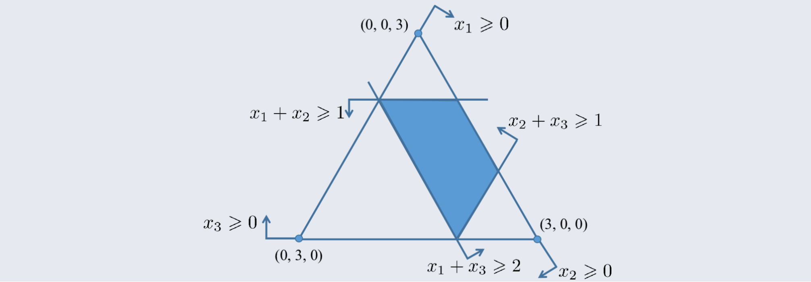

# 合作博弈与数据估值

## I 从非合作博弈到合作博弈 (page 3-7)

为了理解合作博弈，我们首先从一个简单的非合作博弈示例——“分摊美元博弈”开始。

### I.1 分摊美元博弈示例 (page 3)

> [!example]+ 例
>
> 假设有两个参与者，他们各自提出一个介于 0 到 100 美元之间的金额。
>
> - 如果两人提出的金额之和不超过 100 美元，他们将按照各自提出的金额比例分配这 100 美元。
> - 如果两人提出的金额之和超过 100 美元，他们都只能得到 0 美元。

这个例子旨在探讨在简单规则下，参与者如何做出决策以及可能的结果。

### I.2 公平性与效率性 (page 4)

考虑上述博弈的一个潜在解：`(50, 50)`。这个解具有以下特性：

- **公平 (equity)**：两位参与者得到了相同的钱数。
- **效率 (efficiency)**：两人将 100 美元全部瓜分完毕，没有浪费。

### I.3 复杂情况 (page 5-6)

我们将博弈扩展到更复杂的场景：一个三人参与的博弈，每个人提出一个包含三个参与者收益的配置方案，且总收益不能超过 300 美元。考虑以下两种情况：

1. **全局一致性**：除非三个人提出相同的配置方案，否则他们都得到 0 美元。在这种情况下，一个可能的解是 `(100, 100, 100)`。这意味着只有当所有人都同意相同的分配方案时，才能获得收益。
2. **局部一致性**：除非参与人 1 和 2 提出相同的配置方案，否则他们都得到 0 美元。在这种情况下，一个可能的解是 `(150, 150, 0)`。这意味着只有当特定子集（这里是 1 和 2）达成一致时，才能获得收益，而第三个参与者可能无法获得收益。

### I.4 公平、有效率的合作博弈解 (page 7)

在上述复杂博弈中，如果参与者 1 和 2 进行有效谈判，他们可能提出 `(150, 150, 0)`。但这可能导致后续的复杂谈判：

- 参与者 3 可能与 2 妥协，提出 `(0, 225, 75)`，试图通过牺牲 1 的利益来争取 2 的同意，从而获得更多收益。
- 此时，参与者 1 又可能和 3 妥协，提出 `(113, 0, 187)`。

这种反复的谈判揭示了在非合作博弈中，找到一个同时满足公平性和效率性的稳定解的复杂性。这正是合作博弈理论旨在解决的问题。

## II 合作博弈 (page 8-12)

合作博弈关注的是参与者通过合作能够获得的总收益，以及如何公平地分配这些收益。

### II.1 定义 (合作博弈) (page 8)

> [!definition]+ 定义 (合作博弈)
>
> 一个具有**可转移效用 (transferable utility, TU) 博弈**[^1]的合作博弈（或称为 TU 博弈）是一个满足如下条件的二元组 $(N; v)$：
>
> 1. $N = \{1, 2, \dots, n\}$ 是一个有限的**参与者集合**；$N$ 的子集被称为一个**联盟 (coalition)**，全体联盟构成的集合记为 $2^N$；
> 2. $v: 2^N \to \mathbb{R}$ 称为该博弈的**特征函数 (characteristic function)**，对于任意的 $S \subseteq N$, $v(S)$ 表示联盟 $S$ 的**价值 (worth)**，且满足 $v(\emptyset) = 0$。

[^1]: **可转移效用 (Transferable Utility, TU)**：在博弈论中，可转移效用指的是参与者之间可以通过某种媒介（例如货币）自由地转移效用，而不影响总效用。这意味着联盟的总收益可以被任意地在成员之间分配。

简单来说，一个合作博弈由一组玩家和衡量任意子集玩家（联盟）合作时能产生的总价值的函数组成。空联盟的价值总是零。

### II.2 合作博弈示例 (page 9-10)

我们用一个商业合作场景来具体说明合作博弈的构成：

> [!example]+ 例
> 考虑有三位参与者 A, B, C，他们的特点和单独收入如下：
> -   **A**：擅长发明专利，年收入 17 万美元。
> -   **B**：有敏锐的商业嗅觉，创建商业咨询公司，年收入 15 万美元。
> -   **C**：擅长市场营销，开办销售公司，年收入 18 万美元。

他们合作能产生的收入如下：

- **A 与 B 合作**：B 为 A 提供市场资讯，A 的专利卖给最有需求的人，年收入 35 万美元。
- **A 与 C 合作**：C 销售 A 的专利，年收入 38 万美元。
- **B 与 C 合作**：组建市场咨询和销售一体化公司，年收入 36 万美元。
- **A, B, C 共同合作**：A 在 B 的建议下发明最符合市场需求的专利，由 C 销售，年收入 56 万美元。

我们可以用合作博弈的形式来表示这个场景：

- 参与者集合 $N = \{A, B, C\}$。
- 全体联盟构成的集合 $2^N = \{\emptyset, \{A\}, \{B\}, \{C\}, \{A, B\}, \{B, C\}, \{A, C\}, \{A, B, C\}\}$。
- 特征函数 $v$ 定义如下：

$$
v(S) =
\begin{cases}
0 & S = \emptyset \\
17 & S = \{A\} \\
15 & S = \{B\} \\
18 & S = \{C\} \\
35 & S = \{A, B\} \\
36 & S = \{B, C\} \\
38 & S = \{A, C\} \\
56 & S = \{A, B, C\}
\end{cases}
$$

通过这个二元组 $(N; v)$，我们能够形式化地完整描述这个博弈的所有信息。

### II.3 合作博弈的解概念 (page 11-12)

> [!definition]+ 定义 (合作博弈解概念)
>
> 一个合作博弈 $(N; v)$（其中 $N = \{1, 2, \dots, n\}$）的**解概念**是一个函数 $\varphi$，它将每个博弈 $(N; v)$ 与一个 $\mathbb{R}^n$ 的子集 $\varphi(N; v)$ 联系起来。如果对于任意的博弈 $(N; v)$，$\varphi(N; v)$ 都是一个单点集，则称这一解概念为**单点解 (point solution)**。

更通俗地说，合作博弈的解概念就是将每个博弈映射到一个可行的收入分配集合的函数。这个集合中的每个元素是一个**分配向量** $(x_1, x_2, \dots, x_n)$，其中 $x_i$ 表示参与者 $i$ 在当前分配下可以获得的收入。

考虑一个三人分 300 元的简化例子，其形式化版本博弈 $(N; v)$ 如下：

- $N = \{1, 2, 3\}$
- $v(\emptyset) = v(\{1\}) = v(\{2\}) = v(\{3\}) = 0$
- $v(\{1, 2\}) = v(\{1, 3\}) = v(\{2, 3\}) = v(\{1, 2, 3\}) = 1$

现在我们从两个不同角度讨论这一博弈的可行解概念：

1. **参与者视角**：如果你是参与者，你可能认为两两组成联盟是最好的，结合对称性，你心中的解概念是一个包含三个元素的集合：
    $$
    \varphi(N; v) = \left\{\left(\frac{1}{2}, \frac{1}{2}, 0\right), \left(\frac{1}{2}, 0, \frac{1}{2}\right), \left(0, \frac{1}{2}, \frac{1}{2}\right)\right\}
    $$
    这表示在不同两两合作中，第三个玩家可能一无所获。
2. **局外人视角**：如果你是局外人，你可能认为三个参与人是“对称的”，因此这一博弈的解概念应当是：
    $$
    \varphi(N; v) = \left\{\left(\frac{1}{3}, \frac{1}{3}, \frac{1}{3}\right)\right\}
    $$
    这表示每个参与者都应得到相等份额。

这两个不同视角的解概念引发了对博弈解的更深层次思考：什么样的解是稳定、公平且有效的？

## III 核 (Core) (page 13-16)

核是合作博弈中一个重要的解概念，它定义了一组稳定的分配方案。

### III.1 定义 (核) (page 13)

> [!definition]+ 定义 (核)
>
> 一个合作博弈 $(N; v)$（其中 $N = \{1, 2, \dots, n\}$）的**核 (core)** 是一个解概念 $\varphi$，其中 $\varphi(N; v)$ 由满足以下两个条件的分配向量 $x = (x_1, x_2, \dots, x_n)$ 组成：
>
> 1. **有效率的 (efficient)**：
>    $$
>    \sum_{i=1}^{n} x_i = v(N)
>    $$
>    即所有参与者分完了整个联盟的全部收入。
> 2. **联盟理性 (coalitionally rational)**：对于任意的 $S \subseteq N$，有
>   $$
>    \sum_{i \in S} x_i \ge v(S)
>    $$
> 	即对于任何联盟而言，他们在大联盟中分配到的收入一定不会比离开大联盟组成小联盟获得的收入少。

- **效率性**保证了总收益不会被浪费，所有收益都被分配给了参与者。
- **联盟理性**是核的核心思想，它确保了分配方案的稳定性。
	- 如果某个联盟能通过独立合作获得比当前分配更多的收益，那么他们就会脱离大联盟，从而使得当前分配方案不稳定。核中的分配方案不允许这种情况发生。

### III.2 核的计算示例 (page 14-15)

> [!example]+ 例
>
> 求解以下三个参与人的合作博弈的核，其中 $N = \{1, 2, 3\}$，特征函数 $v$ 定义如下：
>
> $v(\emptyset) = v(\{1\}) = v(\{2\}) = v(\{3\}) = 0$
> $v(\{1, 2\}) = 1, v(\{2, 3\}) = 1, v(\{1, 3\}) = 2, v(\{1, 2, 3\}) = 3$

> [!tip]+ 解
> 设核中的向量为 $x = (x_1, x_2, x_3)$。
>
> **根据效率性条件**：
>
> $$
> x_1 + x_2 + x_3 = v(\{1, 2, 3\}) = 3
> $$
>
> **根据联盟理性条件**：
>
> - $x_1 + x_2 \ge v(\{1, 2\}) = 1$
> - $x_2 + x_3 \ge v(\{2, 3\}) = 1$
> - $x_1 + x_3 \ge v(\{1, 3\}) = 2$
> - $x_1 \ge v(\{1\}) = 0$
> - $x_2 \ge v(\{2\}) = 0$
> - $x_3 \ge v(\{3\}) = 0$
>
> 这里的关键问题是如何求出符合上述等式与不等式的所有向量。事实上，效率性已经将 $x$ 限制到 $\mathbb{R}^3$ 中的一个平面，然后我们只需将这些不等式约束在这一平面上处理即可。
>
> 

### III.3 核为空集的博弈示例 (page 16)

核不一定总是存在，有时可能是空集。

> [!example]+ 例 (核为空集的博弈)
>
> 考虑三个参与人的合作博弈，$N = \{1, 2, 3\}$，特征函数 $v$ 定义如下：
>
> $v(\emptyset) = v(\{1\}) = v(\{2\}) = v(\{3\}) = 0$
> $v(\{1, 2\}) = 1, v(\{2, 3\}) = 1, v(\{1, 3\}) = 1, v(\{1, 2, 3\}) = 1$

> [!proof]+ 证明
> 设核中向量为 $x = (x_1, x_2, x_3)$。
>
> 1. **根据效率性条件**：
>    $$
>    x_1 + x_2 + x_3 = v(\{1, 2, 3\}) = 1 \quad (1)
>    $$
> 2. **根据联盟理性条件**：
>     由于 $v(\{1, 2\}) = v(\{2, 3\}) = v(\{1, 3\}) = 1$，因此：
>     - $x_1 + x_2 \ge 1$
>     - $x_2 + x_3 \ge 1$
>     - $x_1 + x_3 \ge 1$
>
>     将这三个不等式相加，得到：
>     $$
>     2x_1 + 2x_2 + 2x_3 \ge 3 \quad (2)
>     $$
>
> 显然，将式 (1) 代入式 (2)，我们得到 $2(1) \ge 3$，即 $2 \ge 3$，这是一个矛盾。因此，这一博弈的核为空集。

这意味着在这个博弈中，不存在一个能够同时满足效率性和所有联盟理性的稳定分配方案。这突显了核的局限性，即核可能不存在，或者即使存在，也可能包含多个解，无法提供唯一的公平分配。

## IV Shapley 值性质 (page 17-22)

为了克服核的这些局限性，Shapley 值被提出，它是一种单点解，并通过一系列公平性公理来定义。

首先，我们定义一个符号：

> [!definition]+ 定义
>
> 令 $\varphi$ 为一个单点解，即对于任意的合作博弈 $(N; v)$（其中 $N = \{1, 2, \dots, n\}$），$\varphi(N; v)$ 都是一个单点集，也就是唯一一个 $\mathbb{R}^n$ 中的向量。我们定义 $\varphi_i(N; v)$ 为向量 $\varphi(N; v)$ 中的第 $i$ 个位置的元素，即 $\varphi_i(N; v)$ 表示参与者 $i$ 在博弈 $(N; v)$ 中的分配到的收入。

Shapley 值满足以下几个关键性质：

### IV.1 效率性 (Efficiency) (page 18)

> [!theorem]+ 有效率的
>
> 一个解概念 $\varphi$ 是**有效率的 (efficiency)**，若对于任意的合作博弈 $(N; v)$（其中 $N = \{1, 2, \dots, n\}$），有
>
> $$
> \sum_{i=1}^{n} \varphi_i(N; v) = v(N)
> $$
>
> 即所有参与者分完了整个联盟的全部收入。

这一性质与核的效率性要求一致，是理性参与者一定会希望满足的。它确保了合作产生的总收益得到充分分配，没有被浪费。

### IV.2 对称性 (Symmetry) (page 19-20, 22)

对称性是 Shapley 值公平性的关键。为了定义解概念的对称性，我们首先需要定义参与者何时是对称的。

#### IV.2.1 参与人的对称性 (page 19)

> [!definition]+ 定义 (参与人的对称性)
>
> 令 $(N; v)$ 是一个合作博弈，对于 $i, j \in N$，如果对于任意的 $S \subseteq N \setminus \{i, j\}$，有
>
> $$
> v(S \cup \{i\}) = v(S \cup \{j\})
> $$
>
> 则称参与者 $i$ 和 $j$ 是**对称的**。

用通俗的话说，两个参与人是对称的，即对于任何不包含他们的联盟 $S$，二者分别加入这一联盟后，联盟增加的效用（或称**边际贡献 (marginal contribution)**）是一致的，因为对称性的定义等价于 $v(S \cup \{i\}) - v(S) = v(S \cup \{j\}) - v(S)$。这意味着他们对任何联盟的价值贡献是相同的。

#### IV.2.2 解概念的对称性 (page 20, 22)

> [!definition]+ 定义 (解概念的对称性)
>
> 一个解概念 $\varphi$ 是满足**对称性 (symmetry)** 的，若对于任意的合作博弈 $(N; v)$，如果 $i, j \in N$ 是对称的，则 $\varphi_i(N; v) = \varphi_j(N; v)$。

这意味着，如果两个参与者在所有情况下都对联盟做出相同的边际贡献，那么他们在解中获得的收益也应该相同。这体现了“等量贡献，等量回报”的公平原则。

### IV.3 零参与者 (Null Player) (page 21)

> [!definition]+ 定义 (零参与者)
>
> 一个解概念 $\varphi$ 是符合**零参与者 (null player)** 性质的，若对于任意的合作博弈 $(N; v)$，如果 $i \in N$，且对于任意的 $S \subseteq N \setminus \{i\}$，有
>
> $$
> v(S \cup \{i\}) = v(S)
> $$
>
> 则 $\varphi_i(N; v) = 0$。

零参与者性质表明，如果一个参与者对于任何联盟的加入都不会增加联盟的效用，即他的边际贡献永远为 0，那么他获得的收入应当为 0。

除了上述三个性质，Shapley 值还满足**可加性 (Additivity)**：如果一个博弈可以分解为两个子博弈的和，那么每个参与者在原博弈中的 Shapley 值等于他在两个子博弈中的 Shapley 值之和。

## V Shapley 值定义 (page 23-26)

Shapley 值是唯一一个同时满足效率性、对称性、零参与者和可加性这四个公理的单点解。

### V.1 Shapley 值定义尝试及缺陷 (page 23)

> [!example]+ 例 (Shapley 值定义尝试)
>
> 考虑合作博弈 $(N; v)$，其中 $N = \{1, 2, \dots, n\}$，我们定义解概念 $\varphi$ 为：
>
> $$
> \varphi_i(N; v) = v(\{1, 2, \dots, i\}) - v(\{1, 2, \dots, i - 1\}), \quad \forall i \in N.
> $$
>
> 习题中要求读者证明这一解概念满足有效率性、零参与者和加性。然而这一解概念不满足对称性，例如考虑 $N = \{1, 2, 3\}$，特征函数 $v$ 定义如下：
>
> $v(\emptyset) = v(\{1\}) = v(\{2\}) = v(\{3\}) = v(\{1, 2\}) = v(\{1, 3\}) = 0$
> $v(\{2, 3\}) = 1, v(\{1, 2, 3\}) = 1$
>
> 不难解得这一解概念下的分配向量为 $\{(0, 0, 1)\}$，但是我们很容易发现参与人 2 和 3 在这一博弈中是对称的，但是 $\varphi_2(N; v) = 0 \ne 1 = \varphi_3(N; v)$。

这个例子表明，简单地按固定顺序（如 1, 2, ..., n）计算边际贡献无法保证对称性，因为贡献的计算依赖于玩家的加入顺序。Shapley 值的核心思想正是通过考虑所有可能的加入顺序来克服这个问题。

### V.2 排序与前序集合 (page 24)

为了正式定义 Shapley 值，我们需要考虑所有可能的参与者加入顺序。

记 $n$ 个参与人的全体排序构成的集合为 $S_n$，根据组合知识可知这一集合中含有 $|S_n| = n!$ 个元素。对于任意排序 $\sigma \in S_n$，定义：

$$
P_i(\sigma) := \{j \in N \mid \sigma(j) < \sigma(i)\}
$$

即在排序 $\sigma$ 下位于参与人 $i$ 前面的所有参与人的集合。例如若在排序 $\sigma$ 下参与人 $i$ 排在了第一位，那么 $P_i(\sigma) = \emptyset$。

### V.3 正式定义 (page 25)

> [!definition]+ 定义
>
> 令 $(N; v)$ 是一个合作博弈，其中 $N = \{1, 2, \dots, n\}$，参与人 $i$ 的 Shapley 值定义为
>
> $$
> SV_i(N; v) = \frac{1}{n!} \sum_{\sigma \in S_n} [v(P_i(\sigma) \cup \{i\}) - v(P_i(\sigma))] \quad (3)
> $$
>
> 即我们将所有排序下前面失败的定义取了平均。

Shapley 值的定义是对所有可能的排列中参与者 $i$ 的边际贡献取平均。这样保证了公平性，因为每个参与者在每个位置上加入联盟的机会是均等的。

### V.4 等价定义 (page 26)

前面的定义基于对不同排列的边际贡献加权平均，我们可以重新整理这一定义，得到基于对不同联盟的边际贡献的加权平均定义的 Shapley 值等价定义。

> [!definition]+ 定义
>
> 合作博弈 $(N; v)$, $N = \{1, 2, \dots, n\}$, 则参与人 $i$ 的 Shapley 值定义为
>
> $$
> SV_i(N; v) = \sum_{S \subseteq N \setminus \{i\}} \frac{|S|!(n - |S| - 1)!}{n!} [v(S \cup \{i\}) - v(S)] \quad (4)
> $$

这一公式是 Shapley 值的常用计算形式。其中 $\frac{|S|!(n - |S| - 1)!}{n!}$ 是一个权重，它表示在所有 $n!$ 种排列中，参与者 $i$ 恰好在联盟 $S$ 的所有成员都加入之后，且在 $N \setminus (S \cup \{i\})$ 中的所有成员都加入之前加入的排列数目所占的比例。$v(S \cup \{i\}) - v(S)$ 表示参与者 $i$ 加入联盟 $S$ 的边际贡献。

## VI Shapley 值计算例子 (page 27)

我们以第 9 页的商业合作博弈为例，其特征函数 $v(S)$ 如下：

$$
v(S) =
\begin{cases}
0 & S = \emptyset \\
17 & S = \{A\} \\
15 & S = \{B\} \\
18 & S = \{C\} \\
35 & S = \{A, B\} \\
36 & S = \{B, C\} \\
38 & S = \{A, C\} \\
56 & S = \{A, B, C\}
\end{cases}
$$

Shapley 值可以通过**排列 (permutation) 公式**或**组合 (combination) 公式**计算：

排列 $SV_i(N; v) = \frac{1}{n!} \sum_{\sigma \in S_n} [v(P_i(\sigma) \cup \{i\}) - v(P_i(\sigma))]$

组合 $SV_i(N; v) = \sum_{S \subseteq N \setminus \{i\}} \frac{|S|!(n - |S| - 1)!}{n!} [v(S \cup \{i\}) - v(S)]$

这两个公式是等价的，实际计算中通常选择组合公式，因为它避免了枚举所有排列，而是枚举所有不包含参与者 $i$ 的联盟 $S$；但是怕兜不清的话用排列也不错。

## VII 数据估值 (page 28-34)

Shapley 值不仅用于博弈论中的收益分配，也被广泛应用于机器学习领域的数据价值评估，即“数据估值”。

### VII.1 留一法 (Leave-One-Out, LOO) (page 28-29)

> [!note]+ 留一法 (Leave-One-Out, LOO)
>
> 一个自然的想法是使用逆向思维，即为了衡量数据集 $D_i$ 的贡献，可以考虑如果没有数据 $D_i$，模型的表现会受到多大的影响。这就是**留一法 (leave-one-out, 简称 LOO)** 的基本思想，即基于留一法数据价值 $\varphi_i^{\text{LOO}}$ 的定义如下：
>
> $$
> \varphi_i^{\text{LOO}} = U(D) - U(D \setminus \{D_i\})
> $$
>
> 即使用所有数据训练出的模型的表现与去掉数据 $D_i$ 后训练出的模型的表现之差。换句话说，也就是在已有其它数据集的情况下，加入 $D_i$ 后的模型的性能可以提升多少。这一定义的直观合理性在于，如果数据 $D_i$ 对模型的贡献很大，那么去除数据 $D_i$ 后模型的表现应当会受到很大的影响，即 $\varphi_i^{\text{LOO}}$ 的值应当较大。

#### VII.1.1 缺陷 (page 29)

> [!attention]+ 留一法存在的缺陷
>
> 如果 $D_i = D_j$，显然 $\varphi_i^{\text{LOO}} = \varphi_j^{\text{LOO}} = 0$，因为当去掉数据 $D_i$ 或 $D_j$ 后训练出的模型因为存在完全重复的数据，模型表现完全不会受到影响。

这意味着留一法无法区分完全重复数据的价值，这在实际应用中是无法接受的，因为即使数据重复，它仍然提供了某种信息，或者至少不应该使其价值为零。

### VII.2 Data-Shapley (page 30)

为了克服留一法的缺陷，Data-Shapley 将 Shapley 值的概念引入数据估值，将每个数据点视为一个“参与者”，整个数据集视为一个“联盟”，模型的性能视为“联盟价值”。

> [!definition]+ 定义 (Data-Shapley)
>
> 数据集 $D_i$ 的 Data-Shapley 值的定义如下：
>
> $$
> \varphi_i^{\text{Shap}} = \frac{1}{n} \sum_{S \subseteq D \setminus \{D_i\}} \frac{1}{\binom{n-1}{|S|}} [U(S \cup \{D_i\}) - U(S)]
> $$
>
> 进一步地，可以考虑将所有 $|S|$ 一致的项合并，令
>
> $$
> \Delta_j(D_i) = \frac{1}{\binom{n-1}{j}} \sum_{S \subseteq D \setminus \{D_i\}, |S|=j} [U(S \cup \{D_i\}) - U(S)] \quad (5)
> $$
>
> 即加入数据集 $\{D_i\}$ 后对所有大小为 $j$ 的联盟带来的模型训练结果提升的平均值，称为 $D_i$ 对大小为 $j$ 的联盟的**边际贡献 (marginal contribution)**。基于此，Data-Shapley 的定义可以进一步改写为
>
> $$
> \varphi_i^{\text{Shap}} = \frac{1}{n} \sum_{j=0}^{n-1} \Delta_j(D_i) \quad (6)
> $$
>
> 从这一角度看，数据集 $D_i$ 的 Data-Shapley 值实际上就是 $D_i$ 对所有不同大小的联盟的边际贡献的平均，也就是说，Data-Shapley 将数据对任意大小联盟的贡献是平等对待的。

Data-Shapley 克服了留一法无法衡量重复数据价值的缺陷，因为即使数据重复，它在某些联盟中的边际贡献可能仍然不为零。

### VII.3 Beta-Shapley (page 31)

> [!note]+ Beta-Shapley
>
> 在 Data-Shapley 中，数据对任意大小的联盟的贡献是平等对待的，也就是说，一个数据集对小的联盟的贡献和对大的联盟的贡献在 Data-Shapley 中具有相同的权重。然而，一个自然的问题是，当联盟本身已经很大时，此时再加入一个数据集，对联盟的贡献通常而言会比较小，所以对较大联盟的边际贡献值更容易受到噪声干扰。因此直观上来看，在数据估值中，如果对较大联盟的边际贡献的权重应当适当缩小，更加重视对较小联盟的边际贡献，可能对数据集的评估会更加准确。基于此，Beta-Shapley 的定义为
>
> $$
> \varphi_i^{\text{Beta}} = \frac{1}{n} \sum_{j=0}^{n-1} \tilde{w}_j \Delta_j(D_i) \quad (7)
> $$

Beta-Shapley 是 Data-Shapley 的一种改进，通过引入加权系数 $\tilde{w}_j$ 来调整不同大小联盟的贡献权重，使得对较小联盟的贡献更加重视，从而提高数据价值评估的准确性。

### VII.4 Data-Banzhaf (page 32)

> [!definition]+ 定义 (Data-Banzhaf)
>
> $$
> \varphi_i^{\text{Banz}} = \frac{1}{2^{n-1}} \sum_{S \subseteq D \setminus \{D_i\}} [U(S \cup \{D_i\}) - U(S)]
> $$
>
> 从 Data-Banzhaf 的表达式中很容易看出其中的思想，事实上就是将 $D_i$ 对所有 $2^{n-1}$ 个联盟 $S \subseteq D \setminus \{D_i\}$ 的贡献取平均，而此前 Data-Shapley 对每个单独的联盟的权重与联盟大小有关（为 $\frac{|S|!(n - |S| - 1)!}{n!}$），只有将同一大小联盟权重求和才是常数。
>
> 和 Beta-Shapley 相比，二者均是 Data-Shapley 的优化，Beta-Shapley 解决了对大联盟边际贡献噪声大的问题，Data-Banzhaf 是从另一个角度，即针对随机学习算法带来的扰动进行优化。

Data-Banzhaf 是另一种衡量数据贡献的方法，它对所有可能的联盟（不考虑大小）中数据点的边际贡献进行平均。与 Shapley 值不同，Banzhaf 值不考虑加入顺序的概率，而是所有可能联盟的贡献的简单平均。

### VII.5 时间复杂度 (page 33)

在实际应用中，计算数据点的价值是一个重要的考量，尤其是在大规模数据集上。

- **留一法 (LOO)**：时间复杂度为 $O(n)$，其中 $n$ 是数据点的数量。因为需要计算 $n$ 次移除单个数据点后的模型性能。
- **Data-Shapley, Beta-Shapley, Data-Banzhaf**：这些基于 Shapley 或 Banzhaf 值的精确计算方法的时间复杂度为 $O(2^n)$。这是因为需要遍历所有 $2^n$ 个可能的联盟来计算边际贡献。这类问题属于 **\ #P 完全问题**，意味着其计算难度非常高。

由于 $O(2^n)$ 的计算复杂度对于大规模数据集是不可行的，因此在实践中通常使用**蒙特卡洛采样 (Monte Carlo Sampling)** 等近似方法来估计 Shapley 值。

### VII.6 多项式时间复杂度游戏 (page 34)

> [!wiki]+ Airport Game (机场博弈)
>
> 在合作博弈论中，**Airport Game (机场博弈)** 是一个经典的成本分摊问题，用于模拟机场跑道的建设成本分摊问题。其核心思想是：
>
> - 每个玩家（航空公司）需要一条长度为 $c_i$ 的跑道（$c_i$ 是玩家 $i$ 的最大需求）。
> - 跑道的总成本由所有玩家中最大的 $c_i$ 决定（即 $U(S) = \max_{j \in S} c_j$）。
> - 目标是公平地分摊总成本 $U(N)$（其中 $N$ 是全体玩家集合）。
>
> 不妨假设 $c_1 \le c_2 \le \dots \le c_n$。对于玩家 $i$，只有与 $S \subseteq \{1, 2, \dots, i-1\}$ 合作时对成本产生贡献，且
>
> $$
> U(S \cup \{i\}) - U(S) = c_i - \max_{j \in S} c_j
> $$
>
> 因此，可以通过直接枚举 $S$ 中需求最大的玩家 $j$ 以及计算满足 $j \in S$ 且 $j = \arg \max_{k \in S} c_k$ 的集合 $S$ 的组合数在多项式时间内求得 $i$ 的成本。
>
> $$
> \varphi_i^{\text{shap}} = \frac{c_i}{n} + \sum_{j=1}^{i-1} \sum_{k=0}^{j-1} \frac{1}{n} \binom{j-1}{k} \frac{1}{\binom{n-1}{k+1}} (c_i - c_j) \quad (8)
> $$

机场博弈是一个具有特殊结构（跑道成本由最长需求决定）的合作博弈。在这个特定类型的博弈中，Shapley 值的计算可以简化为多项式时间复杂度。这提示我们，对于某些特定结构的合作博弈，可能存在更高效的 Shapley 值计算方法。

## VIII Shapley 值计算方法 (page 35-42)

由于 Shapley 值的精确计算是指数级的，实际应用中通常采用采样或近似方法。

- **边际贡献 (Marginal Contribution)**：$MC(S \cup \{i\}) = U(S \cup \{i\}) - U(S)$。这是参与者 $i$ 加入联盟 $S$ 后对联盟价值的增量。
- **Shapley 值公式回顾**：
    - $SV_i = \frac{1}{n!} \sum_{\pi} U(S_i^\pi \cup \{i\}) - U(S_i^\pi)$ (排列形式)
    - $SV_i = \sum_{S \subseteq N \setminus \{i\}} \frac{MC(S \cup \{i\})}{\binom{n-1}{|S|}}$ (组合形式，缺少 $\frac{1}{n}$ 权重因子，可能是简化表示)

> [!important]+ 精确计算的时间复杂度
>
> 精确计算 Shapley 值的复杂度为 $O(2^n)$。对于 $N = \{1, 2, 3\}$ 的例子，需要计算：
>
> $$
> SV_1 = \frac{1}{3} [ (U(\{1\}) - U(\emptyset)) + \frac{1}{2} (U(\{1, 2\}) - U(\{2\}) + U(\{1, 3\}) - U(\{3\})) + (U(\{1, 2, 3\}) - U(\{2, 3\})) ]
> $$
>
> 这个公式展示了对所有可能的联盟以及它们的边际贡献进行加权求和。

### VIII.1 估计 Shapley 值 (Estimating Shapley Values) (page 36)

由于精确计算的复杂度过高，我们需要使用采样方法来估计 Shapley 值。

> [!tip]+ 排列采样 (Permutation Sampling)
>
> 蒙特卡洛排列采样是一种常用的 Shapley 值估计方法。
>
> **步骤**：
>
> 1. 初始化 $SV_1 = 0, SV_2 = 0, SV_3 = 0$ (对所有玩家的 Shapley 值估计)。
> 2. **采样第 1 个排列**: `1, 2, 3`
>     - $SV_1^+ = U(\{1\}) - U(\emptyset)$
>     - $SV_2^+ = U(\{1, 2\}) - U(\{1\})$
>     - $SV_3^+ = U(\{1, 2, 3\}) - U(\{1, 2\})$
> 3. **采样第 2 个排列**: `3, 2, 1`
>     - $SV_3^+ = U(\{3\}) - U(\emptyset)$
>     - $SV_2^+ = U(\{3, 2\}) - U(\{3\})$
>     - $SV_1^+ = U(\{3, 2, 1\}) - U(\{2, 1\})$
> 4. 重复上述步骤多次，然后取平均值来估计每个参与者的 Shapley 值。
>
> 例如，如果两次采样后的平均值分别为 $SV_1 = 2, SV_2 = 2, SV_3 = 2$。

这种方法通过随机选择少量排列来近似计算所有排列的平均边际贡献，从而降低计算成本。

### VIII.2 分层采样边际贡献 (Sampling Marginal Contributions) (page 37-42)

为了进一步提高采样效率和准确性，可以采用分层采样。

#### VIII.2.1 分层采样 (Stratified Sampling) (page 37)

分层采样是将所有可能的边际贡献按照某个标准（例如，联盟大小）进行分层，然后在每个层内进行采样。

例如，对于玩家 1：
- **层 1** (联盟大小 $|S|=0$): $U(\{1\}) - U(\emptyset)$
- **层 2** (联盟大小 $|S|=1$): $U(\{1,2\}) - U(\{2\})$, $U(\{1,3\}) - U(\{3\})$
- **层 3** (联盟大小 $|S|=2$): $U(\{1,2,3\}) - U(\{2,3\})$

> [!note]+ 分层采样估计
>
> 对玩家 $i$ 的 Shapley 值可以表示为各个层内边际贡献的平均值的加权和：
>
> 表: $SV_1 = \frac{1}{3}(SV_{1,1} + SV_{1,2} + SV_{1,3})$ (这里 $SV_{1,k}$ 表示第 $k$ 层的平均贡献)
>
> **步骤**：
>
> 1. 初始化 $SV_{1,1} = 0, SV_{1,2} = 0, SV_{1,3} = 0$。
> 2. 从**层 1** 中抽取一个样本：$U(\{1\}) - U(\emptyset)$。
>     - $SV_{1,1}^+ = U(\{1\}) - U(\emptyset)$
> 3. 从**层 2** 中抽取一个样本：$U(\{1,3\}) - U(\{3\})$。
>     - $SV_{1,2}^+ = U(\{1,3\}) - U(\{3\})$
> 4. 从**层 3** 中抽取一个样本：$U(\{1,2,3\}) - U(\{1,2\})$。
>     - $SV_{1,3}^+ = U(\{1,2,3\}) - U(\{1,2\})$
> 5. 计算平均值：$SV_1 = \frac{SV_{1,1}^+ + SV_{1,2}^+ + SV_{1,3}^+}{3}$。

分层采样可以减少估计的方差，提高估计的准确性，因为它确保了每个“类型”的边际贡献都被采样到。

#### VIII.2.2 互补贡献 (Complementary Contribution) (page 38-39)

除了边际贡献，还可以定义互补贡献：

- **互补贡献 (Complementary Contribution)**：$CC(S) = U(S) - U(N \setminus S)$。这表示一个联盟 $S$ 相对于其补集 $N \setminus S$ 的价值。

Shapley 值也可以用互补贡献来表达，例如对于 $N = \{1, 2, 3\}$：

$$
SV_1 = \frac{1}{3} [ (U(\{1\}) - U(\{2,3\})) + \frac{1}{2} (U(\{1,2\}) - U(\{3\}) + U(\{1,3\}) - U(\{2\})) + (U(\{1,2,3\}) - U(\emptyset)) ]
$$

页面 39 的图示直观地展示了边际贡献和互补贡献的概念，它们是从不同视角衡量一个参与者对联盟价值的影响。

#### VIII.2.3 分层 (Stratification) (page 40-41)

分层方法可以推广到所有参与者。例如，对于三个参与者 $N=\{1,2,3\}$：

**对于 $SV_1$ 的分层：**

- **Stratum 1**：$U(\{1\}) - U(\{2,3\})$
- **Stratum 2**：$U(\{1,2\}) - U(\{3\})$, $U(\{1,3\}) - U(\{2\})$
- **Stratum 3**：$U(\{1,2,3\}) - U(\emptyset)$

表: $SV_1 = SV_{1,1} + SV_{1,2} + SV_{1,3}$ (这里 $SV_{i,k}$ 可能是加权后的值)

**对于 $SV_2$ 的分层：**

- **Stratum 1**：$U(\{2\}) - U(\{1,3\})$
- **Stratum 2**：$U(\{1,2\}) - U(\{3\})$, $U(\{2,3\}) - U(\{1\})$
- **Stratum 3**：$U(\{1,2,3\}) - U(\emptyset)$

表: $SV_2 = SV_{2,1} + SV_{2,2} + SV_{2,3}$

**对于 $SV_3$ 的分层：**

- **Stratum 1**：$U(\{3\}) - U(\{1,2\})$
- **Stratum 2**：$U(\{1,3\}) - U(\{2\})$, $U(\{2,3\}) - U(\{1\})$
- **Stratum 3**：$U(\{1,2,3\}) - U(\emptyset)$

表: $SV_3 = SV_{3,1} + SV_{3,2} + SV_{3,3}$

这些分层结构有助于我们更系统地进行采样，以减少方差和提高估计的准确性。

#### VIII.2.4 示例 (page 42)

页面 42 的图示展示了如何将一个博弈的 Shapley 值计算分解为不同分层内的贡献，并通过加权平均得到最终结果。

$$
\begin{align*}
SV_A &= \frac{1}{3} \left[ (U(\{A\}) - U(\{B, C\})) + \frac{1}{2} (U(\{A, B\}) - U(\{C\})) + \frac{1}{2} (U(\{A, C\}) - U(\{B\})) + (U(\{A, B, C\}) - U(\emptyset)) \right] \\
SV_B &= \frac{1}{3} \left[ (U(\{B\}) - U(\{A, C\})) + \frac{1}{2} (U(\{A, B\}) - U(\{C\})) + \frac{1}{2} (U(\{B, C\}) - U(\{A\})) + (U(\{A, B, C\}) - U(\emptyset)) \right] \\
SV_C &= \frac{1}{3} \left[ (U(\{C\}) - U(\{A, B\})) + \frac{1}{2} (U(\{A, C\}) - U(\{B\})) + \frac{1}{2} (U(\{B, C\}) - U(\{A\})) + (U(\{A, B, C\}) - U(\emptyset)) \right]
\end{align*}
$$

这里，$\frac{1}{2}$ 的权重对应于联盟大小为 1 的边际贡献（例如，对于玩家 A，S={B} 或 S={C}）。$\frac{1}{3}$ 权重是整体的平均因子。这是一个具体的 Shapley 值计算例子，使用了前面讨论的分层和加权求和的思想。

## IX 动态 Shapley 值 (Dynamic Shapley Value) (page 43-50)

在许多实际场景中，数据集是动态变化的，例如有新数据点加入或旧数据点被删除。在这种情况下，重新计算所有数据点的 Shapley 值代价高昂。动态 Shapley 值方法旨在高效地更新这些值。

### IX.1 动机 (Motivation) (page 44)

> [!important]+ 动机
>
> 考虑一个动态的患者数据集，每个患者的数据点（例如 $z_1, z_2, z_3$）都有多个特征（年龄、性别、血压、胆固醇等）和对应的疾病诊断。
>
> 当新的数据点加入（例如，加入 $z_3$ 到只有 $z_1, z_2$ 的数据集），或现有数据点被删除时，我们需要更新每个数据点的 Shapley 值，而不用从头开始计算。

页面 44 的表格和图示展示了数据集 $D = \{z_1, z_2\}$ 及其 Shapley 值，以及当 $z_3$ 加入形成 $N^+ = \{z_1, z_2, z_3\}$ 后，新的 Shapley 值是如何变化的。

### IX.2 算法 (Algorithms) (page 45)

为了高效计算动态 Shapley 值，提出了针对数据增加和删除的不同算法：

- **对于数据增加 (Addition)**：
    - **Pivot 算法 (The Pivot Algorithm)**
    - **Delta 算法 (The Delta Algorithm)**
- **对于数据删除 (Deletion)**：
    - **YN 算法 (The YN Algorithm)**
    - **Delta 算法 (The Delta Algorithm)**

### IX.3 Pivot 算法 (page 46)

> [!tip]+ Pivot 算法的动机
>
> **核心思想**：重用预计算的边际贡献。当一个新数据点 $z_i$ 加入时，如果它的出现顺序在 $z_{n+1}$ 之前，那么它在某些排列中的边际贡献可能已经预先在原始数据集 $D$ 中计算过，可以被复用。
>
> 例如，现有数据集 $D = \{z_1, z_2\}$，新增数据点 $z_3$，形成 $N^+ = \{z_1, z_2, z_3\}$。选择 $z_3$ 作为“枢轴 (pivot)”。
>
> 对于 $z_1$ 的 Shapley 值，可以分解为两部分：
> $SV_1^+ = LSV_1^+ + RSV_1^+$
> 其中 $LSV_1^+$ 表示预计算的部分（Left-Shifted Value），$RSV_1^+$ 表示需要计算的部分（Right-Shifted Value）。
>
> 页面 46 的表格展示了当 $z_3$ 加入后，Shapley 值从 $D=\{z_1, z_2\}$ 变为 $N^+=\{z_1, z_2, z_3\}$ 的变化。`LSV` 是在较小数据集上已计算的贡献，`RSV` 是新增数据点引入后需要计算的新贡献。

Pivot 算法通过巧妙地利用新增数据点作为参考点，将 Shapley 值的计算分解为可重用部分和需要增量计算的部分，从而提高效率。

### IX.4 Delta 算法 (page 47)

> [!tip]+ Delta 算法的动机
>
> **核心思想**：计算 Shapley 值的**变化量 $\Delta SV_i$**，而不是重新计算整个 Shapley 值 $NSV_i$。这通常需要更少的采样排列就能达到相同的精度。
>
> 页面 47 的图示直观地展示了这一思想：与其直接计算新的 Shapley 值 $NSV_i$（右侧柱状图），不如计算从旧的 $SV_i$ 到新的 $NSV_i$ 的变化量 $\Delta SV_i$（中间柱状图），然后将其加到原始的 $SV_i$ 上。

Delta 算法通过关注变化的“增量”而不是“绝对值”来提高计算效率，特别适用于数据量动态变化但每次变化不大的场景。

### IX.5 YN 算法 (page 48-50)

> [!tip]+ YN 算法的动机
>
> **核心思想**：存储预计算的效用在一个多维数组中，以便重复利用。
>
> 对于数据集 $D = \{z_1, z_2, z_3\}$，定义两个辅助函数：
>
> $$
> YN[z_i][z_j][k] = \sum_{S \subseteq D, |S|=k, z_i \in S, z_j \in S} U(S) \\
> NN[z_i][z_j][k] = \sum_{S \subseteq D, |S|=k, z_i \notin S, z_j \notin S} U(S)
> $$
>
> $YN[z_i][z_j][k]$ 表示所有包含 $z_i, z_j$ 且大小为 $k$ 的联盟的效用和。
> $NN[z_i][z_j][k]$ 表示所有不包含 $z_i, z_j$ 且大小为 $k$ 的联盟的效用和。
>
> 当从 $D$ 中删除 $z_{\text{del}}$ 形成 $N^- = D \setminus \{z_{\text{del}}\}$ 时，对于 $z_i \in N^-$ 的 Shapley 值 $SV_i^-$ 可以通过预计算的 $YN$ 和 $NN$ 值来计算：
>
> $$
> SV_i^{-} = \frac{1}{n-1} \sum_{k=1}^{n-1} \frac{1}{\binom{n-2}{k-1}} (YN[z_i][z_{\text{del}}][k] - NN[z_i][z_{\text{del}}][k-1])
> $$
>
> 页面 50 的示例展示了如何利用 $YN$ 和 $NN$ 函数来计算 $SV_1^-$。

YN 算法通过预先计算和存储不同数据点组合的效用和，以应对数据删除场景下的 Shapley 值计算。这是一种通过空间换取时间的策略。

## X P-Shapley: 直观理解 (page 51-52)

P-Shapley 是一种针对概率分类器（如逻辑回归、神经网络等）的 Shapley 值变体，它在评估数据价值时考虑了模型的预测概率。

### X.1 模型精度与平均概率 (page 51)

> [!note]+ 核心思想
>
> 传统 Shapley 值通常基于模型的**准确率 (Accuracy)** 等离散指标来衡量效用。然而，分类器通常输出的是**预测概率 (Predicted Probability)**，这提供了更细粒度的信息。
>
> P-Shapley 旨在利用这些概率信息来评估数据价值。
>
> 页面 51 的图示对比了基于准确率（Accuracy）和基于平均概率（Avg. Probability）的联盟效用。它表明，即使准确率相同，平均概率可能存在差异，P-Shapley 希望捕捉这种差异。

### X.2 公式 (page 52)

> [!definition]+ 定义 (P-Shapley)
>
> P-Shapley 将模型的效用函数 $U(S)$ 替换为 $U_p(S)$，它是一个基于预测概率的效用函数：
>
> $$
> U_p(S) = \frac{1}{|V|} \sum_{z_k \in V} CF(\text{Pr}(\hat{y}_k = y_k))
> $$
>
> 其中 $V$ 是验证集，$CF$ 是一个转换函数（例如，可以是对数损失函数或简单的指示函数），$\text{Pr}(\hat{y}_k = y_k)$ 是模型对正确标签的预测概率。
>
> 基于此，参与者 $z_i$ 的 P-Shapley 值定义为：
>
> $$
> PSV_i = \frac{1}{n} \sum_{S \subseteq N \setminus \{z_i\}} \frac{1}{\binom{n-1}{|S|}} (U_p(S \cup \{z_i\}) - U_p(S))
> $$

P-Shapley 的核心是使用概率校准的效用函数来计算 Shapley 值，而不是直接使用分类准确率。这使得数据价值评估能够更细致地反映数据点对模型“信心”或“校准”的贡献。

### X.3 图示 (page 52)

页面 52 的四张图展示了 P-Shapley 在不同数据集（Covertype, Wind, Fashion-MNIST, CIFAR-10）上的边际贡献分布。
- 图中的“Clean”数据通常具有较高的 Shapley 值和较小的方差，表明它们对模型有稳定且积极的贡献。
- “Noisy”数据（或称为嘈杂数据）通常具有较低的 Shapley 值，甚至可能为负，且方差较大，表明它们对模型的贡献不稳定或有害。
- 这些图直观地展示了 P-Shapley 如何识别并量化数据质量对模型性能的影响。

通过 P-Shapley，我们能够更好地理解每个数据点对模型学习到准确概率分布的贡献，这对于数据清洗、数据选择和模型可解释性具有重要意义。

至此，对合作博弈、核、Shapley 值及其在数据估值领域的应用，包括传统方法和动态计算方法，以及针对概率分类器的 P-Shapley 都有了详细的解释。