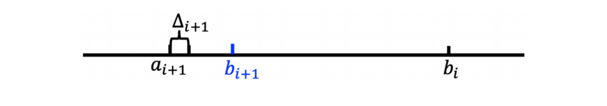

---
tags:
  - notes
comments: true
---

# 第六讲：多臂老虎机算法基础与应用

## I 一般的机器学习任务 (page 3-4)

机器学习任务通常分为两大类：基于模式识别的学习问题和基于决策的学习问题。

### I.1 基于模式识别的学习问题

这类问题通常具有以下特点：

- **学习环境给定**：输入数据（如图片、语言）和对应的输出标签是预先确定的。
- **监督学习**：通过学习特征到标签的映射关系来完成任务。
- **示例**：
    - 图像识别 (Image recognition)
    - 语音识别 (Speech recognition)
    - 文本生成 (Next token/word prediction for language models)
    - 推荐系统中的偏好学习 (Preference learning for recommendations)

### I.2 基于决策的学习问题

与模式识别不同，基于决策的学习问题关注在动态环境中通过决策过程获得的奖励或代价来学习最优策略。

- **学习环境动态**：环境会根据智能体的行为而变化。
- **通过决策学习**：通过在决策过程中获得的奖励或代价来学习，例如 AlphaGo。
- **强化学习**：基于决策的学习问题属于强化学习的范畴。
- **多臂老虎机**：是强化学习的一种特殊情况，**无状态转移**，即每次决策都是独立的，不受之前状态的影响。

> [!definition]+ 多臂老虎机 (Multi-Armed Bandit, MAB)
>
> 多臂老虎机问题是一类经典的强化学习问题，其核心在于在有限的时间步内，在多个“臂”（或称为“动作”、“选项”）之间做出选择，以最大化累积奖励。每个臂的奖励服从一个未知分布，智能体需要通过“探索”（尝试未知的臂以获取更多信息）和“利用”（选择已知表现最好的臂以获得奖励）来权衡。

## II 随机多臂老虎机问题: 引入 (page 5-6)

### II.1 问题描述

想象一个赌徒面对多台老虎机。每台老虎机代表一个“臂”或“动作选择”。

- **K 个臂 (Arms / Actions)**：赌徒可以选择拉动 K 台老虎机中的任意一台。
- **随机奖励 (Reward)**：每次拉动一个臂，都会获得一个随机奖励，这个奖励来源于该老虎机预设好的一个未知概率分布 ($D_k$)。
- **目标**：在总共玩 T 轮的情况下，赌徒如何选择拉动哪个臂，以最大化总奖励？

$$
1: r_1 \sim D_1 \quad 2: r_2 \sim D_2 \quad \dots \quad k: r_k \sim D_k
$$

### II.2 其它场景和问题本质

多臂老虎机问题是一个抽象模型，可以应用于多种现实场景：

- **新闻网站 (推荐系统)**：选择推荐哪条新闻给用户，以最大化用户点击率。
- **动态定价**：为商品选择一个价格，以最大化销售收益。
- **投资组合**：选择投资哪个股票，以最大化涨跌收益。

问题的本质是**权衡探索 (explore) 和利用 (exploit)**。

- **探索**：尝试新的、未知表现的臂，以获取更多关于其奖励分布的信息。
- **利用**：选择目前已知表现最好的臂，以最大化当前奖励。

> [!example]+ 新闻网站推荐示例
>
> 对于新闻网站的推荐，可以先尝试几次随机推荐来探索用户的喜好（探索），然后利用这几次尝试学习到的结果做出比较准确的推荐（利用）。

## III 基本概念 (page 7-9)

多臂老虎机问题中的一些关键概念：

### III.1 例子与组成要素

不同的应用场景中，**动作**和**奖励**的具体含义不同：

| 例子     | 动作           | 奖励           |
| :-------: | :---------------: | :-------------: |
| 投资组合 | 选择一个股票买入 | 股票的涨跌     |
| 动态定价 | 选择一个价格交易 | 商品销售的收益 |
| 新闻网站 | 展示一则新闻   | 是否被用户点击 |

### III.2 反馈类型分类

根据智能体能够获得的环境反馈程度，可以将 MAB 问题分为不同类型：

- **完全反馈 (Full feedback)**：智能体能看见所有臂的奖励。例如，在投资组合中，你可以看到所有股票的涨跌。
- **部分反馈 (Partial feedback)**：智能体能看见部分臂的奖励。例如，在动态定价中，你可以看到任何更低（或更高）的价格是否被接受或拒绝。
- **老虎机反馈 (Bandit feedback)**：智能体只能看见自己选择的臂的奖励。这是最常见也是最困难的情况。例如，在新闻网站上，你只能知道用户是否点击了你展示的那条新闻，而不知道如果展示其他新闻会怎样。

### III.3 奖励类型分类

根据奖励的生成机制，奖励可以分为：

- **随机奖励 / IID 奖励 (Random / IID rewards)**：每次奖励都是从一个未知但固定的概率分布中独立同分布地抽取。这是随机多臂老虎机问题的基础。
- **对抗性奖励 (Adversarial rewards)**：奖励可以由一个“对手”有针对性地选择，这意味着对手可能会根据玩家的策略来调整奖励，从而增加问题的难度。这属于对抗性多臂老虎机问题。

## IV 随机多臂老虎机问题模型 (page 10)

在随机多臂老虎机问题中，智能体在每一步 $t = 1, 2, \dots, T$ 中执行以下操作：

1. **选择臂**：玩家选择一个臂 $a_t \in \mathcal{A} = \{a_1, \dots, a_K\}$。
2. **获得奖励**：玩家获得该臂对应的随机奖励 $r_t \sim R(a_t)$，其中 $r_t \in$。
3. **调整策略**：玩家根据过往轮次的奖励情况调整选择策略，以实现奖励最大化。

### IV.1 关键定义

- **奖励分布的均值**：臂 $a_k$ 的奖励分布均值记为 $\mu(a_k) = \mathbb{E}[R(a_k)]$，其中 $k \in [K]$。
- **最优臂的奖励均值**：所有臂中奖励均值最高的臂 $a^*$ 的奖励均值记为 $\mu^* = \max_{a \in \mathcal{A}} \mu(a)$。
- **均值差异**：任意臂 $a$ 与最优臂之间的奖励均值差异记为 $\Delta(a) = \mu^* - \mu(a)$。这个差异表示选择臂 $a$ 相较于选择最优臂所造成的期望损失。

## V 遗憾分析 (page 11-13)

### V.1 遗憾 (Regret) 的定义

为了评估多臂老虎机算法的性能，我们使用**遗憾 (regret)** 来度量实际选择和最优选择之间的差异。设计 MAB 算法的目标是最大化累积奖励，这实际上等价于找到最优臂。因此，分析 MAB 算法的性能就是分析算法能否找到最优臂以及其遗憾的大小。

1. **伪遗憾 (Pseudo-regret)**：
    伪遗憾是指选择最优臂的期望收益减去实际收益。它量化了在 T 轮游戏中，由于没有始终选择最优臂而损失的累计期望奖励。

    $$
    R(T) = \sum_{t=1}^{T} (\mu^* - \mu(a_t)) = \mu^* \cdot T - \sum_{t=1}^{T} \mu(a_t)
    $$

2. **期望遗憾 (Expected regret)**：
    期望遗憾是伪遗憾的期望值，记作 $\mathbb{E}[R(T)]$。由于玩家的策略可能存在随机性，因此 $\mu(a_t)$ 也可能是随机变量，所以计算其期望更为合理。
    显然，最大化奖励的目标可以等价为**最小化遗憾**的目标。

### V.2 遗憾界 (Regret Bound)

在 MAB 问题中，我们常常关注算法的**遗憾界 (regret bound)**。一个好的遗憾界通常是**次线性的 (sub-linear)**，这意味着算法能够逐渐学到最优臂，使得平均遗憾趋近于 0。

$$
\frac{\text{regret bound}}{T} \to 0, \quad T \to \infty
$$

次线性遗憾意味着算法随着时间能够越来越接近最优策略，因为总遗憾的增长速度慢于总游戏轮数。

## VI Hoeffding 不等式 (page 14-16)

Hoeffding 不等式是一种强大的**集中不等式 (concentration inequalities)**，它描述了独立随机变量的和（或平均值）与其期望值偏离的概率。

> [!theorem]+ Hoeffding 不等式
>
> 假设 $X_1, X_2, \dots, X_n$ 是 $[0,1]$ 上的独立随机变量，样本均值为 $\bar{X}_n = \frac{1}{n} \sum_{i=1}^n X_i$，且 $\mu = \mathbb{E}[\bar{X}_n]$。对于任意 $\epsilon > 0$ 有：
>
> $$
>  P(|\mu - \bar{X}_n| \ge \epsilon) \le 2\exp(-2n\epsilon^2)
>  $$

### VI.1 直观解释

该不等式表明，样本均值与实际均值之间的差距很小的概率是很大的 (即 $P(|\mu - \bar{X}_n| \le \text{small}) \ge 1 - \text{small}$)。此外，随机变量的个数越多 ($n$ 越大)，样本均值偏离实际均值的概率就越小。

### VI.2 与多臂老虎机问题的关联

将 $X_1, \dots, X_n$ 视为选择一个臂 $n$ 次得到的 $n$ 个奖励。Hoeffding 不等式表明，当臂被选择的次数 $n$ 很大时，采样出的奖励均值 $\bar{X}_n$ 和臂的真实均值 $\mu$ 是非常接近的。这为我们估计臂的真实奖励均值提供了理论基础。

### VI.3 置信区间 (Confidence Interval)

基于 Hoeffding 不等式，我们可以定义置信区间 $[ \mu - \epsilon, \mu + \epsilon ]$，其中 $\epsilon$ 是**置信半径 (confidence radius)**。
如果令 $\epsilon = \sqrt{\frac{\alpha \log T}{n}}$，则有：

$$
P\left(\left|\mu - \bar{X}_n\right| \ge \sqrt{\frac{\alpha \log T}{n}}\right) \le 2T^{-2\alpha}, \quad \forall \alpha > 0
$$

在后续的讨论中，通常取 $\alpha = 2$。这个置信半径在 UCB 算法中会用到。

## VII 贪心算法 (page 17-21)

### VII.1 基本思想

为了找到表现最好的臂，一种朴素的思路是：首先将所有臂都尝试一遍（探索阶段），然后选择表现最好的臂，并在后续的所有时间步中保持这种选择（利用阶段）。贪心算法采用“完全偏向利用”的策略，其基本逻辑是始终选择当前估计奖励最高的臂，并利用历史经验更新对每个臂的奖励估计值。

> [!tip]+ 贪心算法流程
>
> 1. **探索阶段**：将每个臂各尝试 $N$ 次。
> 2. **利用阶段**：
>     - 对于 $t > KN$ 的每一轮：
>         - 选择平均奖励最高的臂 $\hat{a} = \arg \max_a Q_t(a)$，其中 $Q_t(a)$ 是臂 $a$ 在第 $t$ 轮前的平均奖励估计。
>         - 观察奖励 $r_t$。
>         - 更新所选臂的计数和平均奖励：
>             $N_{t+1}(\hat{a}) = N_t(\hat{a}) + 1$, 
>             $Q_{t+1}(\hat{a}) = Q_t(\hat{a}) + \frac{r_t - Q_t(\hat{a})}{N_{t+1}(\hat{a})}$
>     - 注意 $N_t(\hat{a})$ 表示第 $t$ 轮前臂 $\hat{a}$ 被选过的次数。对于未被选中的臂，其 $N$ 和 $Q$ 值不变。

### VII.2 贪心算法的遗憾分析

> [!theorem]+ 贪心算法的遗憾界
> 
> 贪心算法的遗憾界为 $O(T^{2/3}(K \log T)^{1/3})$。

分析过程通常分为探索阶段和利用阶段：

1. **探索阶段的遗憾**：探索阶段会产生遗憾，因为我们可能没有选择最优臂，这个阶段的遗憾上限是 $R(\text{exploration}) \le N(K-1)$。
2. **利用阶段的遗憾**：利用阶段的遗憾分析较为复杂，通常考虑两种情况：
    - **事件 $E$**：所有臂 $a$ 的采样期望奖励 $Q(a)$ 与真实期望 $\mu(a)$ 之间的差距不大。即满足 $| \mu(a) - Q(a) | \le \sqrt{\frac{2 \log T}{N}}$。在这种情况下，遗憾较小。
    - **事件 $\bar{E}$**：事件 $E$ 的补集，即存在至少一个臂的采样期望与真实期望差距较大。这种情况下，算法可能错误地选择了次优臂，导致遗憾较大，但这种事件发生的概率应该很小。

    通过 Hoeffding 不等式，可以证明 $\mathbb{P}(\bar{E})$ 的概率非常小，例如 $2T^{-4}$。
    最终，通过对 $\mathbb{E}[R(\text{exploitation})]$ 的分析，结合探索阶段的遗憾，可以得到总遗憾界。

    - 对于 $K=2$ 的情况（只有两个臂）：
        若 $N = T^{2/3}(\log T)^{1/3}$，则 $\mathbb{E}[R(T)] \le O(T^{2/3}(\log T)^{1/3})$。
    - 对于 $K>2$ 的情况：
        若 $N = (\frac{T}{K})^{2/3}(\log T)^{1/3}$，则 $\mathbb{E}[R(T)] \le O(T^{2/3}(K \log T)^{1/3})$。

### VII.3 贪心算法的缺点

贪心算法存在两个主要问题：

- **“探索”阶段的尝试带来遗憾**：在探索阶段，算法盲目地尝试每个臂，这可能会导致不必要的损失。
- **“利用”阶段陷于局部最优**：一旦进入利用阶段，算法会始终选择当前估计奖励最高的臂。如果这个估计是基于少量样本的，并且不够准确，算法可能会长时间停留在次优臂上，无法发现真正的最优臂。

## VIII $\epsilon$-贪心算法 (page 22-23)

为了解决贪心算法的上述问题，$\epsilon$-贪心算法引入了随机性，在“探索”与“利用”之间实现了较好的权衡。

### VIII.1 核心思想

- 以 $1 - \epsilon$ 的概率选择当前已在最优的臂 $a' = \arg \max_a Q_t(a)$（**利用**）。
- 以 $\epsilon$ 的概率随机选择一个臂（**探索**）。

前一步代表对当前知识的“利用”，后一步代表对可能最优的“探索”，从而避免陷入局部最优。通过调整 $\epsilon$ 值 ($0 \le \epsilon \le 1$)，可以控制探索和利用之间的平衡。

- 较小的 $\epsilon$ 值倾向于更多的利用。
- 较大的 $\epsilon$ 值倾向于更多的探索。

通常会将 $\epsilon$ 设置成一个较小的值，例如 $\epsilon = 0.1$。

> [!tip]+ $\epsilon$-贪心算法流程
>
> 1. 对于 $t = 1, 2, \dots, T$ 轮（既有利用又有探索，是与前面贪心算法的重要区别）：
> 2. 生成一个随机数 $p \in [0, \epsilon_{t}]$。
> 3. 如果 $p < \epsilon_t$（或 $p < \epsilon$）：
>     - **探索**：随机选择一个臂 $a_t$。
> 4. 否则：
>     - **利用**：选择 $a_t = \arg \max_a Q_t(a)$。
> 5. 观察奖励 $r_t$。
> 6. 更新所选臂的计数和平均奖励：
>     $N_{t+1}(a_t) = N_t(a_t) + 1$
>     $Q_{t+1}(a_t) = Q_t(a_t) + \frac{r_t - Q_t(a_t)}{N_{t+1}(a_t)}$

### VIII.2 $\epsilon$-贪心算法的遗憾界

通过选择合适的 $\epsilon$ 值，可以证明 $\epsilon$-贪心算法的遗憾界：

> [!theorem]+ $\epsilon$-贪心算法遗憾界
>
> 令 $\epsilon_t = t^{-1/3}(K \log t)^{1/3}$，则 $\epsilon$-贪心算法的遗憾界为 $O(T^{2/3}(K \log T)^{1/3})$。

**优势**：该算法简单易实现，并且可以通过调整 $\epsilon$ 灵活控制探索与利用。

## IX 上置信界算法 (Upper Confidence Bound, UCB) (page 24-26)

$\epsilon$-贪心策略存在一个问题：虽然每个动作都有被选择的概率，但是这种选择太过于随机，导致最优臂被访问的概率较低，这并不能有助于智能体很大概率地发现最优选择。**上置信界算法 (UCB)** 很好地改进了这一点。

### IX.1 核心思想

UCB 算法是一种经典的基于置信区间的探索-利用策略。其核心思想是为每个臂的奖励估计构建一个**置信区间上界**，并选择上界最大的臂。通过这种方式，算法能够自动平衡探索和利用。

### IX.2 UCB 算法流程

> [!tip]+ UCB 算法流程
>
> 1. **初始化**：对于每个候选臂 $k = 1, \dots, K$，设置其初始估计奖励 $Q_1(a_k) = 0$ 和选择次数 $N_1(a_k) = 0$。
> 2. **预探索阶段**：在开始的 $K$ 轮中，顺序选择每个臂一次，进行初始化探索（即当 $t \le K$ 时）。
> 3. **主循环**：对于 $t = 1, \dots, T$ 轮：
>     - 如果 $t \le K$，则顺序选择每个臂（初始化）。
>     - 否则：
>         - 选择 $a_t = \arg \max_a \left( Q_t(a) + \sqrt{\frac{2 \ln t}{N_t(a)}} \right)$。
>     - 观察奖励 $r_t$。
>     - 更新所选臂的计数和平均奖励：
>         $N_{t+1}(a_t) = N_t(a_t) + 1$
>         $Q_{t+1}(a_t) = Q_t(a_t) + \frac{r_t - Q_t(a_t)}{N_{t+1}(a_t)}$

### IX.3 UCB 置信界理解

UCB 算法选择的表达式 $Q_t(a) + \sqrt{\frac{2 \ln t}{N_t(a)}}$ 可以直观理解为：
- **前一项 $Q_t(a)$**：代表臂 $a$ 的估计奖励（利用），这个值越大说明对应臂的历史表现越好。
- **后一项 $\sqrt{\frac{2 \ln t}{N_t(a)}}$**：代表置信区间的半径（探索），它会随着选择次数 $N_t(a)$ 的增加而变小。该值越大，说明对该臂的估计不确定性越大，因此鼓励玩家尝试较少被选择的臂，避免陷入局部最优。

因此，选择上置信界最大的臂，意味着算法会偏向于选择表现较好（$Q_t(a)$ 大）或是较少被选择（$N_t(a)$ 小，导致不确定性项大）的臂，从而算法能够逐渐收敛到最优臂。

### IX.4 UCB 算法的遗憾界

UCB 算法同时考虑了估计奖励与不确定性，较好地平衡了探索与利用，因此可以得到更好的遗憾界：

> [!theorem]+ UCB 算法遗憾界
>
> UCB 算法的遗憾界为 $O(\sqrt{KT \log T})$。

与贪心算法和 $\epsilon$-贪心算法相比，UCB 的遗憾界对 $T$ 的依赖是 $\sqrt{T}$ 而不是 $T^{2/3}$，这是一个理论上的改进，表明其收敛速度更快。

## X 汤普森采样算法 (Thompson Sampling, TS) (page 27-31)

### X.1 历史与发展

汤普森采样 (Thompson Sampling, TS) 最早于 1933 年由 William R. Thompson 提出。尽管其历史悠久，但相关的理论分析工作直到 2015 年前后才逐渐完善。

### X.2 基本思想

汤普森采样是一种基于贝叶斯方法的探索-利用策略。

- **维护先验概率分布**：为每个臂维护一个先验概率分布，表示对该臂奖励概率的信念。
- **采样选择**：每次选择臂时，从每个臂的后验概率分布中进行采样，选择采样值最高的臂。
- **更新后验分布**：根据获得的奖励更新所选臂的后验概率分布，从而在探索和利用之间取得平衡。

### X.3 汤普森采样算法流程

在二值奖励（成功/失败）场景下，通常使用 Beta 分布作为奖励概率的共轭先验。

> [!tip]+ 汤普森采样算法流程 (基于 Beta 分布)
>
> 1. **初始化**：对于每个候选臂 $k = 1, \dots, K$，设置成功计数 $S_1(a_k) = 0$ 和失败计数 $F_1(a_k) = 0$。
> 2. **主循环**：对于 $t = 1, \dots, T$ 轮：
>     - 对于每个臂 $k = 1, \dots, K$：
>         - 从 Beta($S_t(a_k) + 1, F_t(a_k) + 1$) 分布中采样一个值 $\theta_t(a_k)$。
>     - 选择 $a_t = \arg \max_a \theta_t(a)$（选择采样值最高的臂）。
>     - 观察奖励 $r_t$。
>     - **更新参数**：
>         - 如果 $r_t = 1$（成功），则更新 $S_{t+1}(a_t) = S_t(a_t) + 1$。
>         - 否则（失败，即 $r_t = 0$），则更新 $F_{t+1}(a_t) = F_t(a_t) + 1$。

### X.4 具体解释

- **Beta 分布 B($\alpha, \beta$)**：作为每个臂选择的概率分布。参数 $\alpha$ 和 $\beta$ 分别表示伯努利试验中的成功和失败次数。$\alpha$ 越大，分布越集中于 1；$\beta$ 越大，分布越接近于 0。
- **采样与选择**：在每一个时间步中，对于每个臂，都从其当前的 Beta 后验分布中采样一个值。选择采样值最高的臂，这意味着算法倾向于选择那些目前看来最有潜力提供高奖励的臂。
- **参数更新**：根据获得的奖励，更新所选臂的 Beta 分布参数。如果成功 ($r_t=1$)，则增加成功次数 $S_t(a)$；如果失败 ($r_t=0$)，则增加失败次数 $F_t(a)$。这种更新机制使得对表现好的臂的信念增强，对表现差的臂的信念减弱。

### X.5 适用性

1. **只能用 Beta 分布吗？**
    - 并非如此。只要是**共轭先验分布**（即先验分布和后验分布属于同一个分布族），都可以用于汤普森采样。Beta 分布是伯努利奖励的共轭先验。
2. **只能用于奖励 $r_t \in \{0, 1\}$ 的情况吗？**
    - 不。如果奖励 $r_t \in$，可以将其视为概率，并以 $r_t$ 为概率从 $\{0,1\}$ 中抽取一个数作为反馈（即进行伯努利试验）。
    - 对于更一般的高斯奖励等，也有对应的高斯共轭先验。

### X.6 TS 算法的遗憾界

汤普森采样算法简洁优雅，并且在理论上和实验中都表现出色。

> [!theorem]+ TS 算法遗憾界
>
> TS 算法的遗憾界为 $O(\sqrt{KT \log T})$。

这与 UCB 算法的遗憾界一致，并且实证中通常表现比 UCB 算法更好。

## XI 对抗性多臂老虎机 (Adversarial Multi-Armed Bandit, Ad-MAB)

### XI.1 基本模型 (page 33-34)

对抗性多臂老虎机 (Adversarial MAB) 问题是 MAB 问题的一种变体，其关键区别在于**奖励 (或代价) 是由一个对手动态生成的**，而不是从固定的随机分布中产生。这种情况下，奖励可能会针对玩家的策略进行调整，从而产生了对抗性。

**基本模型如下**：
在每一步 $t = 1, 2, \dots, T$ 中：

1. **玩家选择概率分布**：玩家选择一个行动集合 $[n] = \{1, \dots, n\}$ 上的概率分布 $p_t$。
2. **对手选择代价向量**：对手在已知 $p_t$ 的情况下，选择一个代价向量 $c_t \in^n$，即为每一个行动选择一个代价。
3. **玩家选择行动并观察代价**：玩家根据概率分布 $p_t$ 选择一个行动 $i_t \sim p_t$，并观察到所选行动的代价 $c_t(i_t)$。
4. **玩家学习**：玩家根据观察到的代价学习，以调整未来的策略。

> [!note]+ 注意
>
> 1. **玩家的目标**：选取一个策略序列 $p_1, p_2, \dots, p_T$，使得总代价最小（这与此前最大化奖励的目标相对）。即最小化期望代价 $\mathbb{E}_{i_t \sim p_t} \left[ \sum_{t=1}^T c_t(i_t) \right]$。
> 2. **对手的角色**：对手不一定非要实际存在，这只是一个最坏结果分析。
> 3. **反馈情况**：此处玩家不仅能学到选择的行动的代价，事实上可以学到所有行动的代价（在某些模型中，如乘性权重更新），因此是**全反馈**的情况，与随机多臂老虎机中的老虎机反馈情况不同。

### XI.2 遗憾的定义 (page 35-36)

在对抗性 MAB 中，由于对手会动态生成代价，传统的伪遗憾定义（与事后最优作差）可能不再适用，因为事后最优指的是假设我们事先知道所有轮次的代价序列并能做出最优选择，这在对抗性环境中过于强大的基准。

> [!example]+ 不合理的伪遗憾示例
>
> 设行动集合为 $\{1, 2\}$。在每一轮 $t$，对手按如下步骤选择代价向量：
> 假设算法选择行动 1 的概率至少为 $1/2$，那么 $c_t = (1, 0)$（即选择行动 1 代价为 1，选择行动 2 代价为 0）。
> 反之，如果选择行动 1 的概率小于 $1/2$，则 $c_t = (0, 1)$。
>
> 在此情况下，在线算法的期望代价至少为 $T/2$。而在事先知晓代价向量的情况下，最优算法（总是选择代价为 0 的行动）的期望代价为 $0$。
> 这导致与事后最优（固定行动）比较可能出现线性级别的遗憾 ($T/2 - 0 = T/2$)，表明这个基准太强了。

因此，在对抗性 MAB 中，遗憾被重新定义为：**在线算法与最优固定行动的事后代价之差**。

> [!definition]+ 对抗性 MAB 遗憾定义
>
> 对于固定的代价向量序列 $c_1, c_2, \dots, c_T$ 和决策序列 $p_1, p_2, \dots, p_T$ 的遗憾为：
>
> $$
> R_T = \mathbb{E}_{i_t \sim p_t} \left[ \sum_{t=1}^T c_t(i_t) \right] - \min_{i \in [n]} \sum_{t=1}^T c_t(i)
> $$

- **合理性**：这种定义相对更合理，它比较的是在线算法的性能与假设从一开始就知道哪个固定行动是最好的并始终选择它所获得的性能。
- **无憾 (No-regret) 算法**：如果平均遗憾 $\frac{R_T}{T} \to 0$ 当 $T \to \infty$ 时（即 $\lim_{ T \to \infty } \frac{R_{T}}{T} = 0$），则称算法是无憾的。这等价于 $R_T$ 关于 $T$ 是**次线性的**。
- 这种定义保证了存在自然的算法可以实现无憾，但实现无憾并非平凡。

### XI.3 跟风算法 (Follow-The-Leader, FTL) (page 37-38)

跟风算法 (Follow-The-Leader, FTL) 是一种最简单的在线学习算法。

> [!definition]+ 跟风算法 (FTL)
>
> 跟风算法指在每一个时间点 $t$，选择最小累积代价 $\sum_{s=1}^{t-1} c_s(i)$ 的行动 $i$。
> 
>> [!note]+ FTL 不是无憾的。

> [!example]+ FTL 不是无憾的示例
> 
> 考虑一个含有两个行动 $\{1, 2\}$ 的例子：
> 
> | $t$    | 1 | 2 | 3 | 4 | 5 | ... | $T$ |
> | :----: | :-: | :-: | :-: | :-: | :-: | :-: | :-: |
> | $c_t(1)$ | 1 | 0 | 1 | 0 | 1 | ... | *   |
> | $c_t(2)$ | 0 | 1 | 0 | 1 | 0 | ... | *   |
> 
> - 在 $t=1$ 时，FTL 会选择行动 2（累积代价为 0）。
> - 在 $t=2$ 时，FTL 会选择行动 1（累积代价为 $c_1(1)=1$ vs $c_1(2)=0$，所以选择 2。
> 	- 因此, FTL 的总代价为 $T$，而最优固定行动算法的代价为 $T/2$，平均遗憾为 $1/2$，故不是无憾算法。

### XI.4 随机化是无憾的必要条件 (page 39-43)

事实上，<u>任意的确定性算法在对抗性 MAB 中都会有线性级别的遗憾</u> 。

- **对手的推断**：如果采用确定性算法，对手可以完全推断出玩家每一步的选择。
- **代价设置**：对手可以设置玩家选择的行动代价为 1，其余行动代价为 0。
- **总代价**：这样玩家的总代价为 $T$，而最优固定行动的总代价最高为 $T/n$（因为有 $n$ 种可能的行动）。遗憾为 $T - T/n = T(1-1/n)$，是线性遗憾。

因此，需要引入**随机化**来避免对手的推断。如果采用随机策略，对手只能推断出玩家的概率分布 $p_t$，而不能推断出具体的行动 $i_t \sim p_t$，因此对手无法完美利用玩家的算法。

下面通过一个简单的例子引入一种无憾算法：**乘性权重算法 (Multiplicative Weights Update, MWU)**。

#### XI.4.1 一个简单的例子

考虑一个简化的在线学习场景：

- 每个行动的代价都可能为 0 或 1。
- 存在一个**完美的行动**，其代价永远为 0（但玩家一开始不知道哪个是完美行动）。
- 问题：是否存在次线性遗憾的算法？

**观察**：

- 只要一个行动出现了非零代价，那就可以永远排除它，但我们并不知道剩余行动中哪个最好。

**算法设计**：

- 对于每一步 $t = 1, 2, \dots, T$，记录截至目前从未出现过代价 1 的行动。
- 然后在这些“好”的行动中根据均匀分布随机选择一个行动。

#### XI.4.2 算法分析

设 $S_{\text{good}} = \{i \in [n] \mid \text{行动 } i \text{ 从未出现过代价 } 1\}$，其大小为 $k = |S_{\text{good}}|$。

- 因此每个 $i \in S_{\text{good}}$ 下一轮选中概率为 $1/k$。
- 每个 $i \notin S_{\text{good}}$ 的概率为 $0$。

对于任意的 $\epsilon \in (0,1)$，下面两种情况之一一定会发生：
1. **情况 1**：$S_{\text{good}}$ 中至多有 $\epsilon k$ 个行动有代价 1。此时这一阶段的期望代价至多为 $\epsilon$。
2. **情况 2**：$S_{\text{good}}$ 中至少有 $\epsilon k$ 个行动有代价 1。每次出现这种情况时，下一步就可以排除掉至少 $\epsilon k$ 个行动。因此这种情况最多出现 $\log_{1-\epsilon} \frac{1}{n}$ 次（即 $\frac{\ln n}{-\ln(1-\epsilon)}$ 次）。

**总的遗憾**：
- 在情况 1 下，每轮的期望代价是 $\epsilon$，T 轮总代价为 $T\epsilon$。
- 在情况 2 下，每次发生都会排除掉一批行动，总共发生次数有限。每次排除行动，最坏情况导致1的代价。
结合两种情况，总的遗憾至多为：

$$
R_T = T \times \epsilon + \log_{1-\epsilon} \frac{1}{n} \times 1 = T\epsilon + \frac{\ln n}{-\ln(1-\epsilon)}
$$

由于 $-\ln(1-\epsilon) \ge \epsilon$ 对于 $0 < \epsilon < 1$，因此：

$$
R_T \le T\epsilon + \frac{\ln n}{\epsilon}
$$

为了最小化这个上限，我们可以令 $T\epsilon = \frac{\ln n}{\epsilon}$，即 $\epsilon^2 = \frac{\ln n}{T}$，所以 $\epsilon = \sqrt{\frac{\ln n}{T}}$。

此时，将 $\epsilon$ 代回遗憾界，我们得到：

$$
R_T \le T \sqrt{\frac{\ln n}{T}} + \frac{\ln n}{\sqrt{\frac{\ln n}{T}}} = \sqrt{T \ln n} + \sqrt{T \ln n} = 2\sqrt{T \ln n}
$$

即**次线性遗憾** $O(\sqrt{T \ln n})$。

## XII 乘性权重更新 (Multiplicative Weights Update, MWU) 算法 (page 44-47)

### XII.1 更一般的情况

在更一般的情况下，代价可以是 $[0,1]$ 中的任意值，并且不一定存在完美策略（代价永远为 0 的行动）。因此，需要对算法进行修改。

> [!tip]+ 乘性权重更新 (MWU) 算法流程
>
> 1. **初始化**：对于每个行动 $i = 1, \dots, n$，设置其初始权重 $w_1(i) = 1$。
> 2. **主循环**：对于 $t = 1, \dots, T$ 轮：
>     - 计算当前所有行动的总权重 $W_t = \sum_{i \in [n]} w_t(i)$。
>     - 根据概率 $p_t(i) = \frac{w_t(i)}{W_t}$ 选择行动 $i$。
>     - 观察代价向量 $c_t \in^n$（此处为全反馈）。
>     - 对于所有行动 $i \in [n]$，更新其权重：
>         $w_{t+1}(i) = w_t(i) \cdot (1 - \epsilon \cdot c_t(i))$

**直观解释**：MWU 算法的直观思想是根据每个行动在之前阶段的表现来决定下一阶段的权重。表现好的行动（代价小）权重增加，表现差的行动（代价大）权重减少。这里的 $\epsilon$ 是一个学习率或衰减因子。

**问题**：乘性权重算法是否是无憾的呢？

> [!theorem]+ 乘性权重更新 (MWU) 算法遗憾界
>
> 乘性权重算法在之前的问题设定（全反馈、对抗性代价）下的遗憾至多为 $O(\sqrt{T \ln n})$。

### XII.2 MWU 算法分析 (page 48-52)

**关键**：将期望代价与总权重的下降关联起来。
第 $t$ 轮的期望代价 $\bar{C}_t$ 为：

$$
\bar{C}_t = \sum_{i=1}^n p_t(i) c_t(i) = \sum_{i=1}^n \frac{w_t(i)}{W_t} c_t(i) = \frac{1}{W_t} \sum_{i=1}^n w_t(i) c_t(i)
$$

事实上，这正比于总权重的下降。下面通过一系列引理和推论来证明其遗憾界。

> [!lemma]+ 引理 (权重下降与期望代价的关系)
>
> $W_{t+1} \le W_t e^{-\epsilon \bar{C}_t}$，其中 $W_t = \sum_{i=1}^n w_t(i)$ 是第 $t$ 轮的总权重，$\bar{C}_t$ 是第 $t$ 轮的期望代价。
>
> **证明**：直接根据权重更新法则：
>
> $$
> \begin{align*}
> W_{t+1} &= \sum_{i=1}^n w_{t+1}(i) \\
> &= \sum_{i=1}^n w_t(i) \cdot (1 - \epsilon c_t(i)) \\
> &= W_t - \epsilon \sum_{i=1}^n w_t(i) c_t(i) \\
> &= W_t - \epsilon W_t \bar{C}_t \\
> &= W_t (1 - \epsilon \bar{C}_t)
> \end{align*}
> $$
>
> 又因为 $1-x \le e^{-x}$ 对于任意实数 $x$，所以 $1 - \epsilon \bar{C}_t \le e^{-\epsilon \bar{C}_t}$。
> 因此，$W_{t+1} \le W_t e^{-\epsilon \bar{C}_t}$。

不断应用上述引理，可以得到如下推论：

> [!theorem]+ 推论 (总权重上限)
>
> $W_{T+1} \le W_1 e^{-\epsilon \sum_{t=1}^T \bar{C}_t} = n e^{-\epsilon \sum_{t=1}^T \bar{C}_t}$。
> （因为初始权重 $w_1(i)=1$，所以 $W_1 = n$）

另一个引理给出权重下限：

> [!lemma]+ 引理 (权重下限)
>
> 对于任意的行动 $i$，都有 $W_{T+1} \ge w_{T+1}(i) \ge e^{-T\epsilon^2} \cdot e^{-\epsilon \sum_{t=1}^T c_t(i)}$。
>
> **证明**：
> $$
> \begin{align*}
> w_{T+1}(i) &= w_1(i) \cdot \prod_{t=1}^T (1 - \epsilon c_t(i)) \\
> &= 1 \cdot \prod_{t=1}^T (1 - \epsilon c_t(i)) \\
> &\ge \prod_{t=1}^T e^{-\epsilon c_t(i) - \epsilon^2 c_t^2(i)} \quad \text{ (利用 } 1-x \ge e^{-x-x^2} \text{ 当 x 较小时)} \\
> &\ge e^{-\epsilon \sum_{t=1}^T c_t(i) - \epsilon^2 \sum_{t=1}^T c_t^2(i)} \\
> &\ge e^{-\epsilon \sum_{t=1}^T c_t(i) - \epsilon^2 T} \quad \text{ (因为 } c_t(i) \in \Rightarrow c_t^2(i) \le c_t(i) \le 1 \text{，所以 } \sum c_t^2(i) \le T \text{)} \\
> &= e^{-T\epsilon^2} \cdot e^{-\epsilon \sum_{t=1}^T c_t(i)}
> \end{align*}
> $$
> 这步放缩比较激进，但非常有效。

**综合上述结论**：
我们有 $W_{T+1} \le n e^{-\epsilon \sum_{t=1}^T \bar{C}_t}$ 和 $W_{T+1} \ge e^{-T\epsilon^2} \cdot e^{-\epsilon \sum_{t=1}^T c_t(i)}$。
结合这两个不等式，对于最优固定行动 $i^*$：

$$
n e^{-\epsilon \sum_{t=1}^T \bar{C}_t} \ge e^{-T\epsilon^2} \cdot e^{-\epsilon \sum_{t=1}^T c_t(i^*)}
$$

取对数并整理：

$$
\ln n - \epsilon \sum_{t=1}^T \bar{C}_t \ge -T\epsilon^2 - \epsilon \sum_{t=1}^T c_t(i^*)
$$

$$
\epsilon \sum_{t=1}^T \bar{C}_t - \epsilon \sum_{t=1}^T c_t(i^*) \le \ln n + T\epsilon^2
$$

$$
\sum_{t=1}^T \bar{C}_t - \sum_{t=1}^T c_t(i^*) \le \frac{\ln n}{\epsilon} + T\epsilon
$$

回想遗憾的定义 $R_T = \sum_{t=1}^T \bar{C}_t - \min_{i \in [n]} \sum_{t=1}^T c_t(i)$。
所以，MWU 算法的遗憾 $R_T \le \frac{\ln n}{\epsilon} + T\epsilon$。

为了最小化这个遗憾上界，我们令 $\frac{\ln n}{\epsilon} = T\epsilon$，即 $\epsilon^2 = \frac{\ln n}{T}$，从而 $\epsilon = \sqrt{\frac{\ln n}{T}}$。

代入遗憾界，得到：

$$
R_T \le \frac{\ln n}{\sqrt{\frac{\ln n}{T}}} + T\sqrt{\frac{\ln n}{T}} = \sqrt{T \ln n} + \sqrt{T \ln n} = 2\sqrt{T \ln n}
$$

因此，MWU 算法的遗憾至多为 $O(\sqrt{T \ln n})$。

### XII.3 MWU 的评注 (page 53)

- MWU 算法对于**任意的代价序列**都是无憾的，这就是**对抗性**的意义。上述证明也不依赖于任何对代价序列的假设。
- 如果使用指数形式的权重更新 $w_{t+1}(i) = w_t(i) e^{-\epsilon c_t(i)}$，（因为 $e^{-\epsilon} \approx 1-\epsilon$ 当 $\epsilon$ 较小时），可以进行类似的分析，得到的算法称为 **Hedge 算法**。
- 如果从全反馈（MWU 假设可以看到所有行动的代价）更换为老虎机反馈（只能看到所选行动的代价），算法思路不变，得到的算法称为 **Exp3 算法**。Exp3 (Exponential-weight algorithm for Exploration and Exploitation) 是对抗性 MAB 中处理部分反馈的经典算法。

## XIII 多臂老虎机的应用

### XIII.1 基本思想 (page 55)

多臂老虎机提供了一种处理具有不确定性问题的“万金油”方法。它在数据市场相关文献中有着广泛的应用：

- **在线定价问题**：数据卖家不确定数据对于买家的价值，可以使用随机多臂老虎机建模解决。
- **数据获取问题**：数据买家不确定数据市场上哪些数据对于自己的训练任务最有效，可以使用随机或对抗性多臂老虎机建模解决。

### XIII.2 动态定价问题 (page 56-58)

#### XIII.2.1 经典场景

下面给出一个在线定价最经典文献中的一个简化场景，其解决方法与上述随机和对抗性多臂老虎机算法都有所不同：
- **来源**：《The Value of Knowing a Demand Curve》，R. Kleinberg and T. Leighton, FOCS 2003。
- **问题描述**：假设你要出售一份数据。你知道会有 $N$ 个人来购买你的数据，并且每个人对数据的估值 $v$ 都完全一致，都在 $[0,1]$ 中。买家是逐个到达的，你需要提供一个价格 $p$。如果买家估值 $v \ge p$，买家就会购买你的数据；否则，买家会离开。
- **目标**：你希望尽快地学习到估值 $v$，并且误差范围是 $\epsilon = \frac{1}{N}$。

#### XIII.2.2 二分搜索 (Naive Approach)

最朴素的想法是通过二分搜索迅速达到这一精度。

- **过程**：你最多需要 $\log_2 N$ 次搜索来实现对 $v$ 的这一精度估计。每次将价格区间减半，直到估值 $v$ 被定位到一个足够小的区间内。
- **总收益**：如果在 $\log N$ 次搜索后确定了 $p \ge v - \frac{1}{N}$，那么在剩余的 $N - \log N$ 轮中，每次出售数据你可以获得约 $v$ 的收益。
    总收益近似为：
    $$
    0 \quad (\text{前 } \log N \text{ 轮}) + (N - \log N) \left(v - \frac{2}{N}\right) \approx vN - v \log N - 2
    $$
- **遗憾**：二分搜索的遗憾为：
    $$
    R \approx vN - (vN - v \log N - 2) = v \log N + 2
    $$

#### XIII.2.3 遗憾的最小化

问题是，这是最小的可能遗憾吗？

> [!theorem]+ **定理**：存在一个算法，使得其遗憾至多为 $1 + 2 \log \log N$。

这表明二分搜索的遗憾 $O(\log N)$ 并不是最优的，存在更好的算法。

#### XIII.2.4 二分搜索的缺点

- 尽管二分搜索在没有任何先验信息的情况下能搜索到 $N$ 的最快算法，但当猜测的 $p_i > v$ 时，卖家一分钱也赚不到。
- 也就是说，二分搜索在向上探索的时候可能过于激进，因此改进的算法需要在探索时更加保守！

### XIII.3 改进算法 (page 59-62)

为了实现 $O(\log \log N)$ 的遗憾，需要一个更保守的探索策略。

> [!tip]+ 改进算法流程 (动态定价)
>
> 1. **初始化探索区间**：在第 $i$ 阶段，我们保持一个探索区间 $[a_i, b_i]$。初始时，设置 $a_1 = 0, b_1 = 1$，并设置 $\Delta_1 = \frac{1}{2}$。
> 2. **提供价格**：为第 $i$ 个买家提供价格 $p_i = a_i + \Delta_i$。
> 3. **根据接受/拒绝更新区间**：
>     - **如果买家接受价格 $p_i$**：这表明 $v \ge p_i$。我们将探索区间的下限更新为 $p_i$，上限不变，并保持 $\Delta$ 值不变。
>         $a_{i+1} = p_i, \quad b_{i+1} = b_i, \quad \Delta_{i+1} = \Delta_i$
>
>        
>
>     - **如果买家拒绝价格 $p_i$**：这表明 $v < p_i$。我们将探索区间的上限更新为 $p_i$，下限不变，同时将 $\Delta$ 值平方（更保守地探索）。
>         $a_{i+1} = a_i, \quad b_{i+1} = p_i, \quad \Delta_{i+1} = (\Delta_i)^2$
>
> 	    
>
> 4. **停止条件**：当区间长度 $b_i - a_i \le \frac{1}{N}$ 时，此后价格均取 $a_i$，不再改变。

#### XIII.3.1 改进算法的分析 (page 63-66)

> [!theorem]+ 改进算法遗憾界
>
> 改进的算法的遗憾至多为 $1 + 2 \log \log N$。

**证明思路**：

1. **最终阶段的遗憾**：当区间长度 $b_i - a_i \le \frac{1}{N}$ 后，总的遗憾最多为 1。
2. **重点分析**：因此，重点在于分析达到这一步之前的遗憾。
3. **$\Delta$ 更新次数**：
    - $\Delta_i$ 的更新规律是 $\Delta_{i+1} = (\Delta_i)^2$。初始 $\Delta_1 = \frac{1}{2}$。
    - 所以 $\Delta_i = (\frac{1}{2})^{2^{i-1}} = 2^{-2^{i-1}}$。
    - 当 $\Delta_i$ 减小到 $\frac{1}{N}$ 时，即 $2^{-2^{i-1}} = \frac{1}{N}$，取对数：
        $-2^{i-1} = -\log_2 N \Rightarrow 2^{i-1} = \log_2 N \Rightarrow i-1 = \log_2 (\log_2 N) \Rightarrow i = 1 + \log_2 (\log_2 N)$。
    - 因此，$\Delta$ 的更新次数大约是 $\log \log N$ 次。

> [!lemma]+ 引理 (任意步长 $\Delta_i$ 内的遗憾)
>
> 任意的步长 $\Delta_i$ 内产生的遗憾至多为 2。
>
> - **如果直接被拒绝**：如果以价格 $p_i = a_i + \Delta_i$ 尝试出售，但被买家拒绝，那么损失是 $\Delta_i$（因为实际价值 $v < p_i$，但我们收到了 0）。此时，我们知道 $v$ 在 $[a_i, p_i)$ 区间，更新 $\Delta_{i+1} = \Delta_i^2$。如果拒绝一直发生，直到 $\Delta_i$ 变得非常小，则总遗憾是几何级数收敛，至多为 $1$。
> - **如果发生出售**：如果买家接受了价格 $p_i$，那么我们获得了 $p_i$ 的收益，但真正的最优收益是 $v$。此时的遗憾是 $v - p_i$。在接受的情况下，我们更新 $a_{i+1} = p_i$，并保持 $\Delta_{i+1} = \Delta_i$。由于 $v \ge p_i$，且 $v$ 在 $[a_i, b_i]$ 之间，因此 $p_i = a_i + \Delta_i \le v \le b_i$. 最多出售 $\frac{\sqrt{\Delta_i}}{\Delta_{i+1}}$ 次，因为 $\Delta_i$ 保持不变直到拒绝，而下次拒绝又会使 $\Delta$ 减小。这个部分有点复杂，附件描述为 "则最多出售 $\frac{\sqrt{\Delta_i}}{\Delta_{i+1}}$ 次，因为 $\Delta_{i-1} = \sqrt{\Delta_i}$，如果超出这个次数，那么 $\Delta_{i-1}$ 在前面的步骤不会更新"，这可能是笔误，更合理的解释是，由于 $a_{i+1} = p_i$，每次成功的出售会将探索区间的下界推高，总共推高距离约为 $\Delta_i$，并且每次 $\Delta$ 在接受时不变，在拒绝时平方，所以每个 $\Delta$ 阶段的出售次数是有限的。附件中的 "$\frac{\sqrt{\Delta_i}}{\Delta_i} \times \sqrt{\Delta_i} = 1$" 是一个简化。
>     每个 $\Delta_i$ 阶段的遗憾上限是 $1$。

综合上述两个引理，可以得到改进算法的遗憾为 $1 + 2 \log \log N$。

这个 $1 + 2 \log \log N$ 的遗憾界远优于二分搜索的 $O(\log N)$，表明了算法在探索与利用之间的有效平衡，尤其是在处理估值不确定性时的保守策略。保守策略。