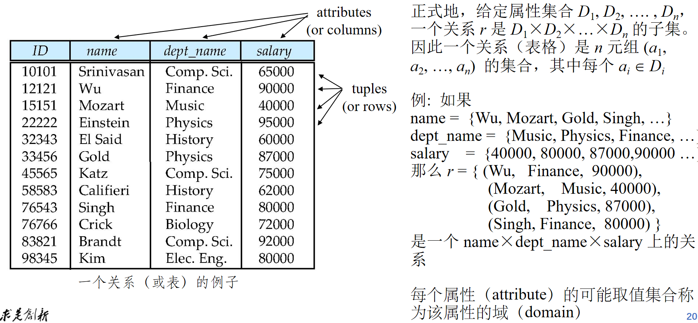
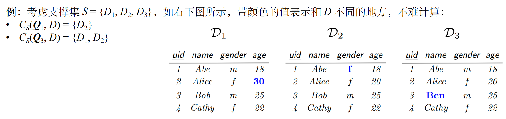
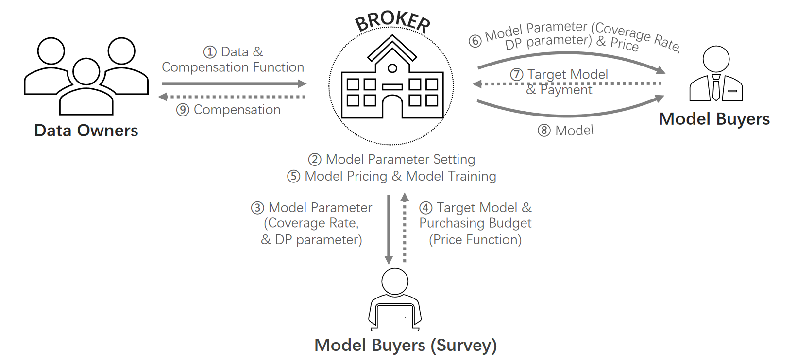
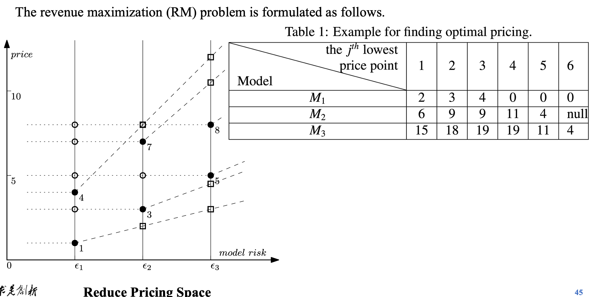

# 数据交易定价

## I 数据交易的基本框架 (page 4-6)

数据交易是数字经济时代的核心组成部分。理解其基本框架对于探讨数据定价至关重要。一个典型的数据交易市场通常涉及以下三个主要参与方：

- 数据提供方
- 数据服务方（或数据中介）
- 数据使用方

### I.1 数据服务方 (Data server) / 数据交易平台 (Data marketplace) / 数据中介 (Data broker) (page 4)

数据服务方在数据交易中扮演着核心角色，通常作为数据交易的枢纽。

- **职能与任务：** 数据服务方承担数据收集、管理、合规与安全等一系列关键任务，以确保数据交易能够正常、稳定地运行。
- **价值创造与收益分配：** 他们负责将从数据提供者那里获得的原始数据转化为有价值的数据产品，例如查询服务或机器学习模型。这些数据产品随后被出售给数据使用方，由此产生的收益会根据预设的公平分配规则（例如，扣除处理费用和利润后）分配给原始数据提供方。
- **市场中的角色：** 在现实中的数据交易场景中，数据中介的存在非常普遍。然而，也存在买卖双方直接交易、无需中介的简单场景。

### I.2 数据提供方 (Data owner, 或 Data seller, 即数据卖家) (page 5)

数据提供方是数据交易生态系统中的数据源头。

- **数据来源与转化：** 他们负责提供原始数据。这些原始数据可能会经过加工、清洗或转换，最终形成可供销售的查询结果或用于训练机器学习模型。例如，原始数据可能是用于机器学习模型训练的梯度参数，或者是供查询系统调用的数据。
- **收益分配：** 一份加工后出售的数据产品可能聚合了来自多个数据提供者的数据。因此，所得收益需要根据公平的原则（如数据贡献度、数据质量等）分配给这些原始数据提供者。

### I.3 数据使用方 (Data user, 或 Data buyer, 即数据买家) (page 6)

数据使用方是数据交易的最终消费者。

- **需求发起：** 他们向数据中介（或数据服务方）提出购买特定数据产品的需求。
- **价值支付：** 为了获取所需的数据产品，数据使用方需要支付一定的价格。这个价格的确定是数据定价研究的核心问题之一。

## II 数据定价要求 (page 7-9)

数据定价不仅仅是简单的商品定价，它还面临数据特有的挑战。在数据交易的框架下，数据定价需要满足多方面的要求。

### II.1 保持传统市场中定价的基本要求 (page 7)

传统市场经济学中的一些基本原则同样适用于数据定价。

- **效用最大化/帕累托最优/预算约束/社会福利最大化：** 这些是市场经济中普遍追求的目标，在数据定价中也需被考虑。例如，定价机制应能引导市场参与者做出最大化自身效用或社会总福利的决策，并受限于参与者的预算。
- **平衡预算 (budget balance)：**

> [!definition]+ 平衡预算
>
> 构建数据市场的总成本应当小于或等于市场所产生的总收益。如果成本超过收益，数据市场的建立将导致“财务赤字”，从而不可持续。

- **个人理性 (individual rationality, IR)：**

> [!definition]+ 个人理性 (IR)
>
> 市场中每个参与者（数据提供方、数据使用方）通过参与交易所获得的效用，应不低于其不参与交易所能获得的效用。
>
> **示例：** 通常，不参与市场的效用可以视为零。因此，个人理性的基本要求是每个参与者从市场中获得的收益应大于其参与成本。
>
> **数据外部性：** 数据的外部性（[^1]network externalities）使得这一要求变得复杂。例如，竞争对手购买了机器学习模型，能够预测客户偏好，如果自身不购买则可能失去客户，此时不参与市场的效用可能为负数。

- **无嫉妒 (envy-free)：**

> [!definition]+ 无嫉妒 (envy-free)
>
> 一个数据买家不会嫉妒另一个数据买家，即他不会觉得用另一个人支付的钱购买那个人的产品，比用自己支付的钱购买自己的产品更值得。
>
> **补充：** 这一概念来源于经济学中经典的“分蛋糕问题”[^2]，旨在确保分配的公平性。著名的 Selfridge-Conway 算法就是解决这一问题的有效方法。

### II.2 针对数据的特性，数据定价的挑战 (page 8)

除了传统市场的要求，数据自身的特性也带来了独特的定价挑战。

- **考虑数据隐私性 (privacy)：**
    - 尽管数据具有“零成本复制”的特性（复制一份数据的边际成本几乎为零），但若考虑数据的隐私成本，数据的出售可能导致其价值降低。
    - 需要辨析：数据出售越多，数据的价值是否越低？这可能取决于我们如何定义“数据的价值”，例如是否包含隐私泄露带来的潜在损失。
- **动态性 (dynamicity)：**
    - 数据是不断更新的，因此动态的数据定价策略值得考虑。
    - 最新的数据通常具有更高的价值，而过时的数据价值则会降低。
    - 当买家购买同一份数据集的更新版本时，如何定价以避免大量重复信息的价值问题？“订阅制定价”是解决这一问题的一种常见方式。
- **无套利原则 (arbitrage freeness)：** 市场中不允许出现套利机会，即不能通过无风险的交易策略赚取利润。
- **诚实性 (truthful) / 激励相容 (incentive compatible, IC)：** 这指的是设计一种机制，使得参与者在追求自身利益最大化时，通过如实报告其真实偏好或信息，能够实现最优结果。这通常在非合作博弈论与机制设计中进行讨论。
- **公平分配 (fairness)：** 涉及到如何公平地在数据提供者之间分配收益，以及在买家之间分配数据产品。这在合作博弈论中有所研究。
- **高效 (efficiency)：** 定价机制需要能够快速计算出结果，通常这意味着可以设计出多项式时间算法来解决定价问题。市场能够高效运行的关键在于，参与者无需等待大量时间即可获得定价结果。
	- 这体现了经济学与计算机科学的交叉领域——“算法博弈论”的思想，旨在设计既能实现经济目标又能保证计算效率的机制。

### II.3 定价要求是否必须同时达到？(page 9)

- **并非必须**：实践中，上述所有定价要求往往难以同时满足。
    - **Myerson-Satterthwaite 定理：** 在一般环境下，个人理性、激励相容、平衡预算与社会福利最大化这四个目标通常不可兼得。这意味着在机制设计中，我们往往需要在这些目标之间进行权衡。
    - **NP-hard 问题：** 满足部分定价要求的价格计算问题可能属于 NP-hard 问题，这意味着在大型市场中找到最优解在计算上是困难的。
    - **多参数最优机制：** 还有许多亟待解决的问题，例如如何设计适用于多参数（如不同类型数据、不同买家偏好等）的最优定价机制。
- **实用性考量：** 在实际的数据定价中，同时考虑过多的理论要求可能不切实际，甚至无法得到最优效果。
    - **有限理性：** 人的理性并非完美，工具理性也并非人们做决策的唯一标准。
	    - **示例：谷歌广告拍卖：** 谷歌早期广告拍卖从广义二价拍卖（类似于 VCG 机制，旨在实现效率和激励相容）逐渐转向一价拍卖（出价最高者得，可能带来更高收益但激励相容性较弱），这反映了在实际商业环境中对不同目标的权衡。
    - **研究侧重：** 通常的研究都是在满足一些基本要求（例如利润最大化、诚实性）的基础上，进一步考虑数据特性带来的定价问题。更深入的探讨可以在博弈论和机制设计领域进行。

## III 现实中的数据定价策略 (page 11-13)

现实世界中存在多种数据定价策略，这些策略往往借鉴了传统商品和服务的定价模型，并根据数据的特性进行了调整。

### III.1 免费数据 (page 11)

- **价值：** 一些公开的统计数据通常不具有直接出售的价值。
- **目的：** 然而，免费提供这些数据可以吸引用户进入市场，从而进一步吸引更多数据提供者加入，形成良性循环。

### III.2 根据使用次数决定价格 (page 11)

这种策略通常应用于 API (Application Programming Interface) 调用，类似于咨询服务按小时计费。

- **模式：** 每次调用 API 都收取一定的价格。
- **供给侧视角：** 从供给成本角度看，数据可以零成本复制。例如，一个机器学习模型训练好之后，尽管训练成本可能很高，但每次调用 API 所需的边际成本几乎为零。因此，当 API 调用次数越多时，理论上边际成本会下降。
- **需求侧视角：** 从需求效用角度看，每次买家调用 API 都是为了获取新的数据或信息，这说明存在着持续的数据需求，因此按使用次数收费具有合理性。

### III.3 打包定价 (page 11)

- **模式：** 以固定的价格出售一定次数的 API 调用权。
- **升级版：** 这种策略可以看作是“根据使用次数定价”的升级版，为买家提供了更灵活的选择和潜在的成本节约。

### III.4 订阅制 (page 12)

订阅制是一种常见的服务定价模式，它基于用户支付的固定费用来提供一段时间内的服务访问权。

- **按订阅时间收费：**
    - **全权限开放：** 一种机制是用户订阅后获得全部权限。
    - **固定费用 + 额外服务费：** 另一种是支付固定订阅费后，再根据每次服务使用额外收取费用。这类似于移动通信公司或软件许可模式，固定费用用于覆盖固定成本，而服务费用则提供利润。
- **优势：** 订阅制可以比较有效地解决动态定价问题，并能产生“订阅循环”，从而锁定用户，提高用户粘性。

### III.5 免费增值 (Freemium) (page 12-14)

免费增值模式结合了免费服务和付费增值服务。

- **核心思想：版本化 (page 14)：** 免费增值模式的关键思想在于“版本化”，即提供不同功能或服务水平的数据产品。

> [!example]+ Freemium 示例
>
> 许多软件服务，如 Overleaf（一个在线 LaTeX 编辑器）和淘宝旺铺服务，都采用了免费增值模式。它们提供一个免费的基础版本来吸引和锁定用户，然后通过提供更高级的功能或服务（增值服务）来将部分免费用户转化为付费用户。
>
> **优势：**
>
> 1. 无需花费大笔广告费用来介绍服务的各种特性，用户通过免费使用即可自我学习并熟悉产品。
> 2. 可以利用“二八定律”（20% 的付费用户支付了 80% 的成本）来支撑免费用户的使用。因此，如何提高付费转化率成为一个重要课题。

### III.6 特点总结 (page 13)

- **经典营销策略的借鉴：** 许多数据定价策略借鉴了传统服务定价（如软件使用、移动通信）或数字商品（如视频平台）的经验。这些产品通常具有高固定成本、低边际成本的特点，且内容动态更新。
- **从成本导向转向需求导向：**
    - 由于数据可以零成本复制，因此在数据定价中，固定成本更多地被视为预算平衡的限制，而非定价的核心要素。
    - 上述定价方法基本都从买家需求出发，目标是吸引买家，并给予买家更好的体验。
- **使用次数定价与订阅制的比较：**
    - 根据使用次数定价类似于传统定价方式，可能显得相对“幼稚” (naive)。
    - 订阅制有效解决了动态定价问题，同时能够留住客户。它以买家为中心，因为买家若不满意可以选择退出订阅，这会影响市场盈利，而不像买断服务那样可能导致服务质量越来越差。
- **免费增值：** 免费增值模式通过版本化吸引不同类型的买家群体，并能最大化总销售额与利润。它通过提供个性化的产品，实现个性化定价。

## IV 数据的版本化与无套利原则 (page 15-18)

数据版本化是一种智能的信息销售方式，它允许数据提供方根据不同的需求和价值提供不同“版本”的数据产品。然而，版本化也可能引入套利机会，这需要通过“无套利原则”来解决。

### IV.1 数据的版本化 (page 15)

“数据的版本化”是指将数据或数据产品以不同形式、不同质量或不同功能级别进行销售的策略。这种方法源于 Shapiro 和 Varian 1998 年关于信息销售的研究。

- **原始数据版本化：**
    - 无需一次性出售所有数据，可以根据用户兴趣将数据划分为不同部分进行出售。
    - 根据数据的关键性进行分级分类出售。
    - 通过添加噪声来构造新版本，例如降低数据的精度或匿名化程度。
- **查询数据版本化：**
    - 可以为任意的 SQL 查询（Structured Query Language）定价。这意味着用户可以购买特定查询的结果，而无需购买整个数据集。
- **机器学习模型版本化：**
    - 通过向训练好的模型中添加噪声，影响模型的准确性，从而生成不同版本的机器学习模型。例如，提供高精度、高价格的模型和低精度、低价格的模型。

### IV.2 版本化的好处 (page 16)

版本化策略对买卖双方都带来了显著的益处。

- **买家侧：**
    - **自由选择：** 买家拥有更大的选择自由，可以只购买自己感兴趣或需要的部分数据或特定功能。
    - **预算友好：** 对于预算有限的买家，即使买不起“最好的”数据，也可以选择购买级别较低、价格更实惠的数据产品。
- **卖家侧：**
    - **高效利用零成本复制特性：** 卖家可以有效利用数据“零成本复制”的特性，构建不同类型的数据产品，从而吸引更广泛的用户群体。
    - **网络外部性 (network externalities) 或需求面的规模经济 (demand-side economies of scale)：**
	- **增大卖家利润：** 价格歧视理论

> [!definition]+ 网络外部性/需求面的规模经济
>
> 指使用某一产品的消费者越多，个体消费者在使用该产品时获得的效用就越大。
>
> **示例：** 如果没有其他人拥有传真机，那么你购买传真机将毫无意义，因为你无法与他人通信。但当传真机用户增多时，其对每个用户的价值也随之增加。
>
> **与生产规模经济的区别：** 生产规模经济是通过扩大生产规模来降低单位成本，而网络外部性则强调用户数量增加带来的价值提升。
>
> **在数据市场中的疑问：** 在数据市场中，这种网络外部性是否明显？例如，微软通过版本化出售操作系统，低价版本吸引了大量客户，从而建立了庞大的 Windows 用户生态。随着用户增多，更多开发者愿意为 Windows 开发应用，进一步增加了 Windows 系统的价值。微软增加用户或服务的成本可以忽略，但愿意购买付费服务的用户增加，从而实现了需求面的规模经济。然而，在数据市场中，这种直接的网络外部性效应可能不如软件市场那么显著。

> [!definition]+ 价格歧视
>
> 经济学中的定义是“按不同价格出售不同单位的产量”。
>
> **第二级价格歧视：** 表现为非线性定价，即每单位产品的价格不一致，例如批量购买可以获得折扣。在数据市场中，这意味着为支付意愿较高的买家出售高价优质数据，而为支付意愿较低的买家出售低价次级数据。
>
> **个性化定价：** 卖家可以从成本导向转向需求导向，根据用户的具体需求出售产品并制定价格，从而实现利润最大化。

### IV.3 版本化带来的问题：套利的可能 (page 17-18)

版本化在带来好处的同时，也可能引入套利机会。

> [!example]+ 香蕉套利示例 (page 17)
>
> 假设市场上有两种购买香蕉的方式：
>
> - 购买 1 根香蕉，价格为 3 美元。
> - 购买 3 根香蕉，价格为 10 美元。
>
> 此时，一个“聪明”的买家会发现，如果他分三次购买，每次购买 1 根香蕉，那么购买 3 根香蕉的总成本将是 $3 \times 3 = 9$ 美元，这比一次性购买 3 根香蕉的 10 美元更便宜。这种行为就叫做**套利 (arbitrage)**。

#### IV.3.1 套利的严格定义 (page 18)

套利这一术语来源于金融学，有其严格的定义。

> [!definition]+ 套利 (Arbitrage)
>
> 利用一个或多个市场存在的各种价格差异，在不冒任何损失风险且无需投资者自有资金的情况下，赚取利润的交易策略或行为。
>
> **金融学中的“做空”：** 在金融学中，类似于香蕉的例子可以通过“做空”来实现。例如，从卖家手中分三次借入三根香蕉（无需立即支付），然后将其捆绑以 10 元出售，最后再分三次向卖家偿还 9 元。这样，投资者就可以无风险地“空手套白狼”赚取 1 元。
>
> **数据市场中的套利：** 在数据市场的研究中，套利的定义通常没有金融学中那么严谨。上述香蕉例子可以被视为一种套利行为，因为它在市场中创造了套利机会，即通过多次购买更便宜的单价产品来组合成更贵的打包产品。
>
> **影响：** 套利行为的存在可能导致非预期的市场行为，甚至破坏市场稳定性。在金融学理论中，无套利原则是其重要的基石。

#### IV.3.2 无套利原则 (arbitrage freeness) (page 18)

> [!definition]+ 无套利原则 (Arbitrage Freeness)
>
> 即市场中不允许出现上述套利机会。
>
> **特性：** 无套利原则在不同的数据类型中具有相同的本质，但其内涵和具体实现方式略有差异。

接下来，我们将分别介绍查询数据和机器学习模型的无套利定价。

## V 查询数据的版本化与无套利定价 (page 19-29)

在数据交易中，查询数据是常见的数据产品形式。本节将深入探讨查询数据的定价模型及其无套利原则。

### V.1 数据库基础知识 (page 20-22)




- **关系 (relation) / 表格：** (page 20)
    - **属性 (attributes) 或列 (columns)：** 表格的每一列，代表数据的一个特定维度或字段（例如：`ID`, `name`, `gender`, `age`）。
    - **元组 (tuples) 或行 (rows)：** 表格的每一行，代表一个完整的数据记录或实体（例如：`(10101, Srinivasan, Comp. Sci., 65000)`）。
    - **形式化定义：** 给定属性集合 $D_1, D_2, \dots, D_n$，一个关系 $r$ 是这些属性域的笛卡尔积 $D_1 \times D_2 \times \dots \times D_n$ 的子集。因此，一个关系（表格）是 $n$ 元组 $(a_1, a_2, \dots, a_n)$ 的集合，其中每个 $a_i \in D_i$。
    - **域 (domain)：** 每个属性可能取值的集合称为该属性的域。

- **关系模式 (relation schema) 与关系实例 (relation instance)：** (page 21)
    - **关系模式 $R = (A_1, A_2, \dots, A_n)$：** 通常而言就是数据库表格的“表头”，定义了表格的结构，包括属性的名称和顺序。例如：`Instructor_schema = (id, name, dept_name, salary)`。
    - **关系 $r(R)$：** 表示关系模式 $R$ 上的一个关系 $r$，换句话说，它是符合表头的、一系列元组的集合。例如：`instructor(Instructor_schema)`。
    - **关系实例：** 是一个所有值都已确定的表格。关系 $r$ 中的一个元素 $t$ 称为元组，在表格中表示为一行具体的记录。
    - **数据库 (database)：** 包含很多关系（表格）的集合。简而言之，数据库是由许多表格构成的。

- **结构化查询语言 (Structured Query Language, SQL)：** (page 22)
    - **定义：** SQL 是目前最常用的用于访问和处理数据库的标准计算机语言。
    - **基本结构：** SQL 查询的基本结构如下：

    ```sql
    select A1, A2, ..., An
    from r1, r2, ..., rm
    where P
    ```

    - $A_1, A_2, \dots, A_n$ 表示要查询的属性（列）；
    - $r_1, r_2, \dots, r_m$ 表示要从中查询的关系（表格）；
    - `P` 是一个谓词（条件表达式）。
    - **含义：** 上述 SQL 语句的含义是从表格 `r1, r2, ..., rm` 中查询满足谓词 `P` 的元组的 `A1, A2, ..., An` 属性；
    - **查询结果：** SQL 查询返回的结果也是一个关系（表格），该关系包含了满足查询要求的元组集合；
    - **其他操作：** SQL 还支持插入、删除、各种合并操作（如 JOIN），但这些与当前课程关联不大，故不在此赘述。

### V.2 查询定价基本模型 (page 23)

- **场景设定：** 一个数据卖家需要出售一个关系实例（即一个表格）$D \in I$（其中 $I$ 是卖家拥有的全体关系实例）。数据买家可以通过查询来购买数据。
- **查询向量：** 买家可以通过对 $D$ 进行一组查询 $Q = (Q_1, \dots, Q_p)$ 来购买数据，其中 $Q$ 被称为查询向量 (query vector)。
- **查询函数：** 每次查询（一个 SQL 语句）$Q$ 可以视为一个确定性函数，将表格 $D$ 映射到查询结果 $Q(D)$。因此，整个查询向量得到的答案可以记为 $Q(D)$。
- **定价函数：** 一个定价函数 $p(Q, D)$ 根据查询输入的向量以及表格决定一个价格，该价格必须是一个正实数。
- **无套利原则：** 我们要求定价函数 $p(Q, D)$ 满足以下两类无套利原则：
    - **信息无套利 (information arbitrage)**
    - **组合无套利 (combination arbitrage)**

#### V.2.1 查询定价的信息无套利原则 (page 24)

信息无套利原则关注的是不同查询之间信息包含关系与价格的关系。

**直观理解：** 如果一个查询向量 $Q_1$ 得到的结果是另一个查询向量 $Q_2$ 结果的子集，那么 $Q_1$ 的价格一定低于 $Q_2$ 的价格。

直观来看，查询向量 $Q_2$ 可以决定 $Q_1$ 表明 $Q_2$ 比 $Q_1$ 更强，或者说 $Q_2$ 包含了 $Q_1$，这与我们的直觉相符。

> [!definition]+ 信息无套利 (Information Arbitrage)
>
> 假设 $D \in I$ 是一个表格。如果对于任意满足 $Q_2(D) = Q_2(D')$ 的 $D' \in I$，都有 $Q_1(D) = Q_1(D')$，则称在表格 $D$ 下查询向量 $Q_2$ 可以决定 $Q_1$。
>
> **定价函数 $p$ 是信息无套利的条件：**
> 如果对于所有满足在表格 $D$ 下查询向量 $Q_2$ 可以决定 $Q_1$ 的表格 $D$，都有：
>
> $$
> p(Q_2, D) \ge p(Q_1, D)
> $$

**示例：**
买家 Alice 希望查找表格中有多少个女性用户。她可以使用两种查询方式：

1. `select count(*) from User where gender = 'f'` (查询 1)
2. `select gender, count(*) from User group by gender` (查询 2)

查询 1 精确地查询出女性用户数量。查询 2 则同时给出了男性和女性的用户数量。无论对于任何表格 $D$，查询 2 总是能够决定查询 1 的结果。因此，根据信息无套利原则，定价函数必须满足：

$$
p(\text{查询 2}, D) \ge p(\text{查询 1}, D)
$$

#### V.2.2 查询定价的组合无套利原则 (page 25)

组合无套利原则与香蕉套利的故事类似，关注的是一次性查询和分两次查询之间的价格关系。

**直观理解：** 一次查询如果可以拆分成两次查询来完成，那么一次查询的价格不能大于两次查询的价格之和。否则，买家可以通过分别两次查询来绕开一次查询的定价，实现套利。

> [!definition]+ 组合无套利 (Combination Arbitrage)
> 
> 我们记 $Q = Q_1 || Q_2$ 为查询 $Q_1$ 和 $Q_2$ 的连接，即查询 $Q$ 可以拆成 $Q_1$ 和 $Q_2$ 两次查询分别执行。
>
> 如果对于所有表格 $D$，定价函数 $p$ 是组合无套利的条件是：
>
> $$
> p(Q_1 || Q_2, D) \le p(Q_1, D) + p(Q_2, D)
> $$

**示例：**
买家 Alice 希望查找表格中女性用户的平均年龄。她可以使用如下查询方式：

1. `Q3: select avg(age) from User where gender = 'f'`

但这一查询也可以通过以下两个查询共同得到：

1. `Q1: select count(*) from User where gender = 'f'`
2. `Q4: select sum(age) from User where gender = 'f'`

因为 `avg(age)` 等于 `sum(age) / count(*)`，所以 `Q3` 可以由 `Q1` 和 `Q4` 组合得到。因此，如果定价函数 $p$ 是组合无套利的，那么必须要满足：

$$
p(Q_3, D) \le p(Q_1, D) + p(Q_4, D)
$$

### V.3 查询定价无套利等价条件 (page 26-27)

在实践中，判断查询向量 $Q_2$ 是否可以决定 $Q_1$ 是一个计算上非常困难的问题。为了解决这一困难，引入了“冲突集”的概念，并给出了无套利定价的等价条件。

#### V.3.1 冲突集 (conflict set) (page 26)

> [!definition]+ 支撑集 (support) 与冲突集 (conflict set)
>
> 令 $S \subseteq I$ 是任意一个子集，称之为**支撑集 (support)**。
>
> 定义查询 $Q$ 关于 $S$ 的**冲突集 (conflict set)** 为：
>
> $$
> C_S(Q, D) = \{D' \in S \mid Q(D) \ne Q(D')\}
> $$
>
> 冲突集 $C_S(Q, D)$ 包含了在支撑集 $S$ 中，所有与表格 $D$ 相比，会使得查询 $Q$ 给出不同结果的表格 $D'$。我们可以将任意一个查询 $Q$ 映射到对应的 $S$ 上的**捆 (bundle)**，事实上捆的计算在 $S$ 比较小的时候是很容易的，因为只需要对 $S$ 中的每个表格逐个验证是否满足上述定义即可。



#### V.3.2 单调性与次可加性 (page 27)

无套利原则与集合函数（将集合映射到正实数的函数）的特定属性密切相关。

> [!definition]+ 集合函数的单调性 (monotone) 与次可加性 (subadditive)
>
> 对于一个集合函数 $f: 2^S \to \mathbb{R}^+$（即将 $S$ 的一个子集映射到正实数的函数），我们称函数 $f$ 是满足：
>
> - **单调性 (monotone) 的：** 如果对于任意的 $A \subseteq B$，$A, B \subseteq S$，都有 $f(A) \le f(B)$。
> - **次可加性 (subadditive) 的：** 如果对于任意的集合 $A$ 和 $B$，$A, B \subseteq S$，都有 $f(A \cup B) \le f(A) + f(B)$。

> [!theorem]+ 无套利等价条件
>
> 令 $S \subseteq I$，并令 $f: 2^S \to \mathbb{R}^+$ 是一个集合函数。则定价函数 $p(Q, D) = f(C_S(Q, D))$ 是无套利的，当且仅当函数 $f$ 是单调、次可加的。
>
> **补充：**
> 由此我们得到了一个定价函数无套利的等价条件。事实上，单调性、次可加性对于函数而言并非很严苛的要求，因此这个等价条件在设计定价函数时有很大的帮助。需要注意的是，这里的函数 $f$ 取值于冲突集，即其输入是冲突集 $C_S(Q, D)$，输出是价格。
>
> **参考文献：** 定理证明较为复杂，参见 Deep, S., & Koutris, P. (2016). *The Design of Arbitrage-Free Data Pricing Schemes.* ArXiv, abs/1606.09376 中的定理 3.8。

### V.4 查询定价最大化利润 (page 28-29)

在设计数据定价机制时，除了满足无套利原则，最大化卖家利润也是一个重要的目标。

#### V.4.1 针对买家行动的假设 (page 28)

为了实现利润最大化，我们需要对买家的行动做出一定的假设。这些假设简化了模型，是研究经济学问题的基础，否则模型参数过多将难以求解和分析。

1. **单次购买：** 我们假设每个买家只购买一组查询的查询结果。在现实中，一个买家多次查询可以视为多个不同的买家。
2. **估值购买：** 买家只有当产品价格 $p(Q, D)$ 小于或等于其对查询 $Q$ 的估值 $v_Q$ 时才会购买。
	-  $v_Q$ 是买家对 $Q$ 的估值，即买家愿意为该查询结果支付的最高价格。
3. **完全信息市场：** 假设市场是完全信息的，即卖家知道买家的心理价位（估值）。这可以通过市场调研获得。

#### V.4.2 利润最大化问题 (page 28)

现在的问题转化为：在已知所有可能购买查询产品的买家及其估值后，如何利用这些信息来最大化利润，同时满足上述的无套利条件？

- **市场调研：** 我们假设市场调研的买家就是所有可能购买的买家，这是一种经典的简化方式。当然，当数据量很大时，可以尝试拟合曲线来解决。
- **买家数量：** 为了简化讨论，我们假设有 $m$ 个买家，每个买家 $i$ 希望购买查询 $Q_i$。

#### V.4.3 超图 (hypergraph) 模型构建 (page 29)

为了进一步形式化利润最大化问题，我们可以构建一个超图模型。

- **超图定义：** 选定支撑集 $S \subseteq I$，其大小为 $n = |S|$。我们构建一个**超图 (hypergraph)** $H = (V, E)$。
> [!definition]+ 超图
>
> 超图是一种广义上的图，它的一条边可以连接任意数量的顶点（在普通图中，一条边只能连接两个顶点）。
>
> - **顶点集 $V$：** 设 $V = S$，即支撑集中的每个关系实例（表格 $D_1, D_2, D_3$）作为超图的一个顶点。
> - **边集 $E$：** 设 $E = \{e_i \mid i = 1, \dots, m\}$，其中 $e_i = C_S(Q_i, D)$，即每个买家请求的查询 $Q_i$ 对应的冲突集作为超图的一条超边。

- **目标问题：** 找到一个满足单调性、次可加性的集合函数 $f$（即无套利定价函数）可以最大化卖家利润。

    $$
    \text{OPT} = \max_{f \text{ 是单调、次可加的}} R(f)
    $$

    其中， $R(f) = \sum_{i: v_i \ge f(e_i)} f(e_i)$。这意味着在集合函数 $f$ 定义的价格下，只要买家的估值 $v_i$ 大于或等于价格 $f(e_i)$，买家就会购买，并贡献利润 $f(e_i)$。

- **回忆：** 这里的 $f(e_i) = f(C_S(Q_i, D)) = p(Q_i, D)$，即冲突集上的函数值就是查询的价格。
- **后续讨论：** 进一步关于如何决定定价函数，以及简单的定价函数如何实现近似比等问题，可以作为更深入的课题。这里引入超图看似没什么关联，但实际上源于其他理论性工作，目标是得到进一步的近似算法等。

## VI 机器学习模型的版本化与无套利定价 (page 30-45)

除了查询数据，机器学习模型也是数据交易市场中重要的产品。本节将探讨机器学习模型的版本化定价以及如何实现无套利。

### VI.1 Dealer 端到端机器学习模型买卖市场架构 (page 31-35)

一个典型的端到端机器学习模型买卖市场涉及多个参与方及其交互流程。这里以“经销商（Dealer）”作为中间商为例。

- **市场参与方：**
    - **数据拥有者 (Data Owners)：** 原始数据的提供者。
    - **中间商 (Broker / Dealer)：** 连接数据拥有者和模型买家，负责数据处理、模型构建和定价。
    - **模型买家 (Model Buyers) (Survey)：** 潜在的模型买家，可能参与市场调查以提供需求信息。
    - **模型买家 (Model Buyers)：** 最终购买机器学习模型的消费者。

- **交易流程 (以 Dealer 为中心)：** (page 31)
    1. **数据拥有者贡献数据并获得补偿** (Data & Compensation Function / Compensation)。 (page 32)
    2. **中间商设定模型参数** (Model Parameter Setting)。
    3. **中间商向模型买家（调研者）询问目标模型参数** (Target Model & Purchasing Budget (Price Function))。
    4. **中间商基于数据拥有者数据设计、构建并出售模型** (Design & Build and Sell Models to Model Buyers)。 (page 33)
    5. **中间商对模型进行定价和训练** (Model Pricing & Model Training)。
    6. **中间商向模型买家提供模型参数（覆盖率、差分隐私参数）和价格** (Model Parameter (Coverage Rate, DP parameter) & Price)。
    7. **模型买家从中间商处购买目标模型，并支付费用** (Target Model & Payment)。 (page 34)
    8. **中间商提供模型** (Model)。
    9. **中间商向数据拥有者提供补偿** (Compensation)。



- **核心关注点：** (page 35)
    - **数据贡献评估 (Data Contribution Evaluation)：** 如何评估数据拥有者的贡献并给予公平补偿。
    - **数据产品定价 (Data Product Pricing)：** 如何对模型产品进行定价以最大化收益并满足其他市场要求。

### VI.2 预备知识 (page 36-40)

在深入探讨机器学习模型的定价前，我们需要理解几个重要概念。

#### VI.2.1 版本化 (Versioning) (page 36)

- **概念：** 版本化是指将产品或服务以不同的功能、质量或特性级别进行发布和销售的策略。
- **目的：**
    - **最大化收益 (总销售额与利润)：** 通过为不同需求的用户提供不同版本，可以捕获更广泛的市场，从而增加总体收入。
    - **个性化定价 - 个性化产品：** 根据不同用户的支付意愿和需求，提供量身定制的产品版本，实现个性化定价。
    - **吸引不同类型的买方 (消费者) 群体：** 不同版本能够满足不同用户的需求和预算，从而吸引更多的消费者。
- **示例：** 微软 Windows 10 操作系统的不同版本（Home, Pro, Pro for Workstations）就是典型的版本化案例。不同版本提供不同的功能集，定价也不同，以满足个人用户、小型企业和高级用户的需求。

#### VI.2.2 差分隐私 (Differential Privacy) (page 37)

差分隐私是一种量化隐私保护程度的数学模型，由 Dwork 于 2006 年首次提出。

> [!definition]+ 差分隐私 (Differential Privacy)
>
> **核心思想：** 通过对真实数据添加随机噪声进行扰动，实现用户隐私的量化保护。其目标是使得在数据集中的任何单个个体的信息的存在或缺失，都对统计结果的影响微乎其微，从而保护个体隐私不被推断。
>
> **实现方式：** 向数据中注入符合特定概率分布（如拉普拉斯分布）的噪声。
>
> **安全性：** 随机噪声对真实数据的扰动是差分隐私安全性的来源。这意味着即使攻击者拥有辅助信息，也无法通过观察输出结果来确定某个特定个体是否在数据集中。
>
> **可用性：** 由于添加的噪声是独立的，它们在统计聚合时会相互抵消，从而使得扰动数据的统计结果（如均值）仍然具有较高的准确度。例如，对身高数据添加噪声后，虽然个体身高值变化较大，但群体的平均身高仍能保持近似一致。

#### VI.2.3 无套利 (Arbitrage) (page 38-39)

无套利原则是金融经济学中的一个核心概念，其目标是消除市场中无风险获利的机会。

> [!example]+ 香蕉套利与无套利属性 (page 38-39)
>
> 假设市场上有 1 根香蕉售价 $2，而 3 根香蕉的捆绑售价为 $X?。
>
> - **套利：** 如果 3 根香蕉的捆绑售价高于 $6（即 3 根单买的总价），那么消费者会选择单买 3 次来获得 3 根香蕉。
> - **无套利：** 为了避免这种套利行为，3 根香蕉的捆绑售价必须小于或等于 $6。
>
> **无套利属性 1 (单调性)：**
>
> 给定一个函数 $f$，定义域为 $(\mathbb{R}^+)^n$，值域为 $\mathbb{R}^+$。当且仅当任意两个定义域内向量 $x, y$，满足 $x \le y$ 时，都有 $f(x) \le f(y)$，则称函数 $f$ 单调。
>
> **无套利属性 2 (次可加性)：**
>
> 给定一个函数 $f$，定义域为 $(\mathbb{R}^+)^n$，值域为 $\mathbb{R}^+$。当且仅当任意两个定义域内向量 $x, y$，满足 $f(x + y) \le f(x) + f(y)$ 时，则称函数 $f$ 具有次可加性。
>
> **补充：** 这两个属性对于构建无套利定价函数至关重要。单调性确保了“更多”的数据或功能不会比“更少”的数据或功能更便宜；次可加性则确保了购买组合产品不会比购买其组成部分的成本之和更贵。

#### VI.2.4 Shapley 值 (Shapley Value) (page 40)

Shapley 值是合作博弈论中的一个概念，用于公平地分配合作所产生的总收益。

> [!definition]+ Shapley 值 (Shapley Value)
>
> Shapley 值衡量的是一个参与者在其所参与的所有可能合作联盟中，对总收益的平均边际贡献。它确保了每个参与者获得的收益与其边际贡献成正比。
>
> **公式：** 对于参与者 $i$，其 Shapley 值 $SV_i$ 定义为：
>
> $$
> SV_i = \frac{1}{n!} \sum_{\pi \in G} [U(S_i^\pi \cup \{z_i\}) - U(S_i^\pi)]
> $$
>
> 其中：
> - $n$ 是参与者的总数量。
> - $\pi$ 是所有 $n!$ 种可能的参与者加入联盟的排列方式。
> - $G$ 是所有排列方式的集合。
> - $S_i^\pi$ 是在排列 $\pi$ 中，参与者 $i$ 之前已经加入联盟的参与者集合。
> - $U(S)$ 是联盟 $S$ 的总收益。
> - $U(S_i^\pi \cup \{z_i\}) - U(S_i^\pi)$ 表示参与者 $z_i$ 加入联盟 $S_i^\pi$ 时所带来的边际贡献。
>
> **应用：** 在数据交易中，Shapley 值可以用于评估不同数据拥有者对其贡献训练的机器学习模型的价值。

### VI.3 数据拥有者：补偿函数 (Compensation Function) (page 41)

数据拥有者关注的核心是隐私保护程度和收益分配的公平性。

- **隐私泄露风险量化：** 使用 $\epsilon$ -差分隐私来量化数据拥有者的隐私泄露风险。$\epsilon$ 值越小，隐私保护越严格，数据泄露风险越低。
- **补偿函数建模：** 构建一个单调递增的补偿函数 $c_i$ 来建模数据拥有者 $D_i$ 对参与训练满足 $\epsilon$ -差分隐私要求的机器学习模型（数据产品）所需的补偿。

> [!definition]+ 补偿函数
>
> $$
> c_i(\epsilon) = b_i \cdot (e^\epsilon)^{\rho_i}
> $$
>
> 其中：
> - $c_i(\epsilon)$ 是数据拥有者 $i$ 在隐私预算为 $\epsilon$ 时的补偿。
> - $b_i$ 是基础价格，通常来源于 Shapley 值，反映了数据拥有者对其数据贡献的固有价值。
> - $\epsilon$ 是隐私预算，量化了模型的隐私保护程度。
> - $\rho_i$ 是数据拥有者 $i$ 的隐私敏感度 (Privacy sensitivity)。
>
> **隐私敏感度 ($\rho_i$) 的影响：** 如果 $\rho_i$ 较高，意味着数据拥有者对隐私泄露更为敏感，那么随着隐私预算 $\epsilon$ 的增加（即隐私保护程度降低），其要求的补偿 $c_i$ 将会更快地增长。

### VI.4 模型购买者：价格函数 (Price Function) (page 42)

模型购买者关注的是最终机器学习模型（数据产品）的效用。

- **模型效用估计：** 使用参与训练数据的 Shapley 值覆盖率 (Coverage Rate, CR) 来估计模型的最终效用。

> [!definition]+ 覆盖率 CR(M)
>
> $$
> CR(M) = CR(D_{i_1}, \dots, D_{i_k}) = \frac{SV(\{D_{i_1}, \dots, D_{i_k}\})}{SV(\{D_1, \dots, D_n\})} = \frac{SV(\text{data used for M})}{\text{SV(all data)}}
> $$
>
> 其中：
> - $SV(\{D_{i_1}, \dots, D_{i_k}\})$ 是用于训练模型 $M$ 的数据子集所产生的 Shapley 值。
> - $SV(\{D_1, \dots, D_n\})$ 是所有数据所产生的总 Shapley 值。
> - $CR(M)$ 表示用于训练模型 $M$ 的数据对整个数据集价值的贡献比例，可以作为衡量模型效用的指标。

- **价格函数建模：** 为了满足差分隐私所添加的噪声，可以使用隐私预算 $\epsilon$ 来量化。模型购买者 $j$ 的价格函数 $P(B_j, M)$ 可以建模如下：

    $$
    P(B_j, M) = V_j \cdot \frac{1}{1 + e^{-\delta_j(CR(M)-\theta_j)}} \cdot \frac{1}{1 + e^{-\gamma_j(\epsilon-\eta_j)}}
    $$

    其中：
    - $P(B_j, M)$ 是模型买家 $j$ 购买模型 $M$ 所需支付的价格。
    - $V_j$ 是买家 $j$ 的估值或对模型的最大支付意愿。
    - 第一个分数项 $\frac{1}{1 + e^{-\delta_j(CR(M)-\theta_j)}}$ 是一个 Sigmoid 函数，它表示买家对模型效用 $CR(M)$ 的敏感度。其中 $\delta_j$ 和 $\theta_j$ 是与买家偏好相关的参数。
    - 第二个分数项 $\frac{1}{1 + e^{-\gamma_j(\epsilon-\eta_j)}}$ 也是一个 Sigmoid 函数，它表示买家对隐私预算 $\epsilon$ 的敏感度。其中 $\gamma_j$ 和 $\eta_j$ 是与买家对隐私的偏好相关的参数。这个项反映了隐私预算的期望，$\epsilon$ 越大（隐私保护越弱），价格可能越低。

### VI.5 中间商 (Broker) (page 43)

中间商在机器学习模型交易市场中扮演着关键角色，需要在多个目标之间进行平衡。

- **核心任务：** 给定一组数据拥有者、一组模型买家和模型版本数量 $l$，中间商需要合理划分 $l$ 个模型版本，以在最大化收入的同时兼顾以下几点：
    1. **公平分配补偿：** 确保向数据拥有者公平分配补偿，以激励他们积极参与模型市场。
    2. **无套利定价：** 确保不同模型版本之间的定价公平，避免出现套利机会。
    3. **最小化生产开销，最大化模型效用：** 在给定补偿的情况下，优化模型生产过程，以最小化开销并最大化模型的效用。
    4. **非盈利导向（可选）：** 如果中间商是一个非盈利机构，其目标可能是促进数据市场发展和社会福利最大化。在这种情况下，模型收入可以直接分配给数据拥有者作为补偿，同时最大化模型效用。

- **决策路径：** 中间商的决策可以概括为两个阶段：
    - **阶段一：收入最大化：** 根据买家对模型的市场需求，制定模型版本定价，以实现总收入的最大化。
    - **阶段二：效用最大化：** 在给定数据拥有者补偿（由第一阶段的收入决定）的前提下，优化数据和模型的选择，以最大化最终模型的效用。

### VI.6 收入最大化 (Revenue Maximization) (page 44-45)

在机器学习模型的定价中，收入最大化是一个核心优化问题，需要考虑模型的不同版本、买家估值以及无套利约束。

#### VI.6.1 优化问题形式化 (page 44)

为了最大化收入，中间商需要解决以下优化问题：

$$
\arg \max_{(p(\epsilon_1), \dots, p(\epsilon_{l'}))} \sum_{k=1}^{l'} \sum_{j=1}^{m'} p(\epsilon_k) \cdot \mathbb{I}(tm_j == M_k) \cdot \mathbb{I}(p(\epsilon_k) \le v_j)
$$

其中：

- $p(\epsilon_k)$ 表示具有隐私预算 $\epsilon_k$ 的模型版本 $M_k$ 的价格。
- $l'$ 是中间商提供的模型版本总数。
- $m'$ 是市场中的买家总数。
- $\mathbb{I}(\cdot)$ 是指示函数，当括号内的条件为真时取值为 1，否则为 0。
    - $\mathbb{I}(tm_j == M_k)$ 表示买家 $j$ 希望购买的模型 $tm_j$ 等于模型版本 $M_k$。
    - $\mathbb{I}(p(\epsilon_k) \le v_j)$ 表示模型版本 $M_k$ 的价格 $p(\epsilon_k)$ 小于或等于买家 $j$ 对该模型的估值 $v_j$。
- 整个目标函数表示所有被成功出售的模型版本所产生的总收入。

**约束条件：**

为了确保定价的无套利性，优化问题还必须满足以下约束条件：

$$
\begin{align}
& p(\epsilon_{k_1} + \epsilon_{k_2}) \le p(\epsilon_{k_1}) + p(\epsilon_{k_2}), \quad \epsilon_{k_1}, \epsilon_{k_2} > 0 \quad (10) \\
& 0 < p(\epsilon_{k_1}) \le p(\epsilon_{k_2}), \quad 0 < \epsilon_{k_1} \le \epsilon_{k_2} \quad (11)
\end{align}
$$

- **(10) 次可加性 (subadditivity) 约束：** 模型的隐私预算 $\epsilon$ 可以被视为某种“资源量”或“风险量”。这个约束表示，将两个模型版本（或其隐私预算）组合在一起的价格，不应超过它们各自价格之和。
	- 这对应于查询定价中的组合无套利原则。
	- 可以推得： $\frac{p(x)}{x} \leq $
- **(11) 单调性 (monotonicity) 约束：** 这个约束表明，随着隐私预算 $\epsilon$ 的增加（即隐私保护程度降低，模型“质量”或“信息量”可能更高），模型的价格也应随之增加。同时，价格必须为正。
	- 这对应于查询定价中的信息无套利原则。

$$
\begin{align} \\
\arg \max_{(p(\epsilon_1), \dots, p(\epsilon_{l'}))} &\sum_{k=1}^{l'} \sum_{j=1}^{m'} p(\epsilon_k) \cdot \mathbb{I}(tm_j == M_k) \cdot \mathbb{I}(p(\epsilon_k) \le v_j)  \\
s.t.\quad & p(\epsilon_{k_1} + \epsilon_{k_2}) \le p(\epsilon_{k_1}) + p(\epsilon_{k_2}), \quad \epsilon_{k_1}, \epsilon_{k_2} > 0 \\
& 0 < p(\epsilon_{k_1}) \le p(\epsilon_{k_2}), \quad 0 < \epsilon_{k_1} \le \epsilon_{k_2}
\end{align}
$$

#### VI.6.2 示例 (page 45)



- **定价空间：** 左侧图表展示了版本定价空间，其中横轴是模型的某种风险或复杂度，纵轴是价格。不同的点代表不同的模型版本及其价格。
	- $\epsilon_{1}: \epsilon_{2}: \epsilon_{3} = 1:2:3$，分别对应于模型 $M_{1}, M_{2}, M_{3}$
	- 实心圆表示现有买家对对应模型估值，
- **收入优化结果：** 右侧图表展示了使用不同定价策略的收入结果。

## VII 思考与未来工作 (page 46)

本讲座介绍了数据定价的基础和挑战，但仍有许多方面可以改进和深入研究。

### VII.1 如何为隐私定价？ (page 46)

- 基于差分隐私的工作是一个重要的方向，它为量化和定价隐私提供了数学基础。这也是课程大作业的一个主题。

### VII.2 如何做到诚实报价？ (page 46)

- 本讲座介绍的定价机制大多假设通过市场调研可以了解用户的真实偏好和估值。
- 然而，在现实中，用户可能出于策略目的恶意低报自己的估值，以期获得更低的价格。
- **研究方向：**
    - 参考 Fernandez, R.C. (2022) 的研究，该研究关注在战略性买家存在下如何保护数据市场。
    - “同行预测 (peer prediction)”是一种可能的解决方案，它旨在激励参与者诚实报告信息，即使其信息无法被直接验证。
    - 可以设计一套机制，使得用户在诚实报告其内心价格的情况下效用最大化，从而解决激励不相容问题。

### VII.3 市场一定是完全信息的吗？ (page 46)

- 我们假设市场是完全信息的，即卖家知道买家的效用函数和机器学习模型的训练结果。
- 但在许多情况下，市场中存在信息不对称：
    - 买家的效用函数可能是未知的。
    - 机器学习模型的训练结果在训练前也是未知的。
- **博弈论：** 博弈论是解决不确定条件下决策问题的有力工具。它提供了一个框架，可以分析和设计在信息不完全或参与者行为具有战略性的市场中的机制。

因此，后续的主题将深入探讨**博弈论与机制设计**，以解决数据市场中更复杂的定价和激励问题。

[^1]: **网络外部性 (Network Externalities)：** 指产品或服务的价值随着使用该产品或服务的人数增加而增加的现象。例如，电话、社交媒体平台等。
[^2]: **分蛋糕问题 (Cake-Cutting Problem)：** 经济学和数学领域的一个经典公平分配问题，旨在找到一种方法，将一个异质的物品（如蛋糕）在多个参与者之间进行分配，使得每个参与者都认为自己分得的部分是公平的。