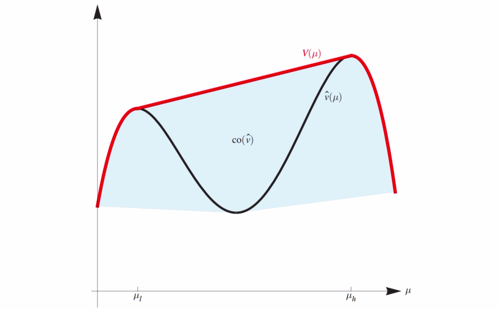
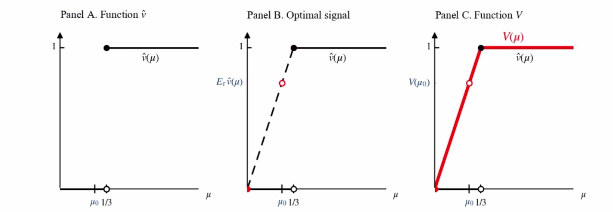

---
tags:
  - notes
comments: true
---

# 第十讲：贝叶斯劝说

## I 贝叶斯劝说：背景与例子 (page 2-23)

### I.1 劝说的概念与价值 (page 3-4)

贝叶斯劝说（Bayesian Persuasion）是一种信息设计的理论框架，研究信息发送者如何通过设计信息披露机制来影响接收者的信念和行动，从而最大化发送者自身的效用。

劝说在我们的日常生活中无处不在。根据 Donald McCloskey 和 Arjo Klamer 于 1995 年发表在《The American Economic Review》上的论文《One Quarter of GDP Is Persuasion》，四分之一的 GDP 来源于劝说活动，这充分说明了劝说在经济活动中的重要性。

> [!definition]+ 什么是劝说？
>
> 劝说（Persuasion）通常指以下行为：
>
> - **用言语打动**：通过语言交流，使对方产生共鸣或接受某种观点。
> - **影响公众行为**：公共关系人员运用多种传播方式，努力影响公众接受组织的观点，或促使公众主动采取某种行动。
> - **促成行动或同意**：劝说他人做某事或对某事表示同意。

### I.2 劝说的例子与建模思路 (page 5)

劝说活动的例子非常多样，例如：

- **广告**：商家通过广告宣传产品，目的是劝说消费者购买。
- **演讲**：政治家或公众人物通过演讲争取支持或改变听众观点。
- **谈判**：谈判双方通过言语和信息交换，试图劝说对方接受自己的条件。
- **导师写推荐信**：导师为学生撰写推荐信，目的是劝说招聘方雇用该学生。
- **教师劝学**：例如“我劝各位选这门课……”，目的是劝说学生选择某门课程。

> [!example]+ 贝叶斯劝说的建模思路
>
> 贝叶斯劝说模型的核心在于：
>
> - **信息优势方**：存在一方（信号发送者，如导师、商家）拥有信息优势，即他们知道某种“真实状态”（如学生的能力、产品的真实质量），而信息劣势方（信号接收者，如企业、消费者）不了解这种真实状态。
> - **发送“信号”**：信息优势方通过向信息劣势方发送“信号”（如推荐信的内容、广告词），试图影响信息劣势方对真实状态的信念。
> - **改变行动意愿**：最终目标是期望通过改变接收者的信念，进而改变其行动意愿，使其采取对发送者有利的行动。

### I.3 导师写推荐信的例子 (page 6-9)

为了更具体地理解贝叶斯劝说，我们以导师为学生写推荐信为例进行建模：

1. **参与人（Players）**
    - **信号发送者（Sender, S）**：导师。导师知道学生的真实能力。
    - **信号接收者（Receiver, R）**：企业。企业根据导师的推荐信决定是否雇用学生。
    - **学生**：学生不是博弈参与方，因为他们只被动接受结果，没有自己的策略。
2. **学生类型（真实状态，State of Nature, $\omega$）**
    - 学生有两种类型：优秀（excellent）或一般（average）。
    - 学生的类型对导师而言是**已知**的。
    - 对企业而言，学生的类型是**不完全信息**。
    - 学生的类型是自然按一定的**先验概率**随机抽取的。企业和导师对学生类型有共同的先验分布 $\mu_0$。
        - $\mu_0(\text{average}) = 0.75$ (一般学生的先验概率)
        - $\mu_0(\text{excellent}) = 0.25$ (优秀学生的先验概率)
3. **效用函数（Utility Functions）**
    - **导师（发送者）的效用 $v(a, \omega)$**：
        - 导师希望推荐出去的学生越多越好。
        - 只要企业雇用一个学生，导师就获得效用 1。
        - 如果企业不雇用学生，导师获得效用 0。
        - 即 $v(\text{hiring}, \omega) = 1$， $v(\text{not hiring}, \omega) = 0$，且与学生类型 $\omega$ 无关。
    - **企业（接收者）的效用 $u(a, \omega)$**：
        - 企业希望招收到优秀的学生。
        - 招收到优秀学生时获得效用 1。
        - 招收普通学生时获得效用-0.5。
        - 如果不雇用，效用为 0（隐含）。
        - 即 $u(\text{hiring}, \text{excellent}) = 1$， $u(\text{hiring}, \text{average}) = -0.5$。 $u(\text{not hiring}, \omega) = 0$。
4. **导师的策略（信号机制，Signaling Scheme）**
	- 导师的策略是向企业发送“信号”，即通过推荐信的好坏来表明学生的能力。
    - 信号空间 $S$ 包含两种可能的推荐信类型：`e` (excellent，好的推荐信) 和 `a` (average，一般的推荐信)。
    - 导师的策略用两个条件概率分布表示：$\pi(\cdot | \text{excellent})$ 和 $\pi(\cdot | \text{average})$。
        - $\pi(e | \text{excellent})$：学生为优秀类型时，导师写好的推荐信的概率。
        - $\pi(a | \text{excellent})$：学生为优秀类型时，导师写一般推荐信的概率。
        - $\pi(e | \text{average})$：学生为一般类型时，导师写好的推荐信的概率。
        - $\pi(a | \text{average})$：学生为一般类型时，导师写一般推荐信的概率。
    - 导师在学生类型确定后，按照其策略 $\pi(s|\omega)$ 发送信号 $s$。

> [!note]+ 贝叶斯劝说与信号博弈的区别
>
> 一个值得注意的点是，导师和企业之间存在长期关系，因此导师的策略是企业在看到推荐信之前就已知的。这意味着导师在游戏开始前**公开承诺**其信号机制，并且无法在游戏过程中偏离。
> 
> 这是贝叶斯劝说（Bayesian Persuasion）与传统信号博弈（Signaling Game）的关键区别。在信号博弈中，发送者通常不会预先承诺其策略。这种承诺使得贝叶斯劝说问题可以转化为寻找最优信息披露规则的问题。

### I.4 信号机制的例子 (page 12-19)

我们考察几种可能的信号机制，并计算发送者（导师）和接收者（企业）的期望效用。

#### I.4.1 完全诚实推荐 (page 12-13)

> [!example]+ 完全诚实推荐
>
> 在完全诚实推荐中，导师完全诚实地推荐学生：
>
> - 对于优秀学生，导师总是写好的推荐信：$\pi(e | \text{excellent}) = 1, \quad \pi(a | \text{excellent}) = 0$
> - 对于一般学生，导师总是写一般的推荐信：$\pi(e | \text{average}) = 0, \quad \pi(a | \text{average}) = 1$
>
> **企业行为及效用分析：**
>
> - **企业收到的信号**：如果收到好的推荐信 `e`，企业知道学生一定是优秀的；如果收到一般的推荐信 `a`，企业知道学生是一般的。
> - **企业决策**：企业会雇用所有收到好的推荐信 `e` 的学生（因为效用为1），拒绝所有收到一般的推荐信 `a` 的学生（因为效用为-0.5）。
> - **导师的期望效用**：导师只成功推荐了优秀学生（概率0.25），因此期望效用为 $0.25 \times 1 + 0.75 \times 0 = 0.25$。
> - **企业的期望效用**：企业只雇用了优秀学生，期望效用为 $0.25 \times 1 + 0.75 \times 0 = 0.25$。

#### I.4.2 完全不诚实推荐 (page 14-15)

> [!example]+ 完全不诚实推荐
>
> 自然地，导师可能会认为诚实推荐能推荐出的学生太少。极端情况下，导师可能会选择为每个学生都写好的推荐信：
>
> - 无论学生类型如何，导师都写好的推荐信：
>   $\pi(e | \text{excellent}) = 1, \quad \pi(a | \text{excellent}) = 0,$
>   $\pi(e | \text{average}) = 1, \quad \pi(a | \text{average}) = 0$
>
> **企业行为及效用分析：**
>
> - **企业收到的信号**：此时企业看到的全是好的推荐信 `e`。由于推荐信不再提供任何关于学生类型的信息，企业只能依赖其先验概率来判断学生的好坏。
> - **企业对学生类型的信念**：企业看到 `e` 后，学生是优秀类型的后验概率仍然是先验概率 $\mu_0(\text{excellent}) = 0.25$；学生是一般类型的后验概率是 $\mu_0(\text{average}) = 0.75$。
> - **企业雇用一个学生的期望效用**：$0.25 \times 1 + 0.75 \times (-0.5) = 0.25 - 0.375 = -0.125$。
> - **企业决策**：由于期望效用为负，企业不会雇用任何一个学生（效用为 0）。
> - **导师的期望效用**：$0$。
> - **企业的期望效用**：$0$。
>
> 比较可知，完全不诚实推荐导致导师的效用下降。这表明信息发送者并非总能通过“说谎”来最大化自身效用。

#### I.4.3 部分诚实推荐 (page 16-19)

从之前的例子可以看出，完全诚实和完全不诚实的策略都不是最优的。因此，需要更精妙的设计。

> [!example]+ 部分诚实推荐 (最优信号机制，将在后续证明)
>
> 以下信号机制将在后续被证明是最优的（即导师效用最大化）：
>
> - 对于优秀学生，导师总是写好的推荐信：
>   $\pi(e | \text{excellent}) = 1, \quad \pi(a | \text{excellent}) = 0$
> - 对于一般学生，导师则以 $2/3$ 的概率写好的推荐信，以 $1/3$ 的概率写一般的推荐信：
>   $\pi(e | \text{average}) = 2/3, \quad \pi(a | \text{average}) = 1/3$
>
> 这意味着，导师会给所有优秀的学生写好的推荐信，对一般的学生则以 $2/3$ 的概率写好的推荐信。
>
> 
>
> **企业行为及效用分析：**
>
> - **企业看到一般的推荐信 `a` 时**[^2]：
>   此时企业知道学生**一定是一般类型**的（因为优秀学生只收到好的推荐信）。
>   后验概率：$\mu_a(\text{excellent}) = 0, \mu_a(\text{average}) = 1$。
>   企业雇用学生的期望效用：$0 \times 1 + 1 \times (-0.5) = -0.5 < 0$。
>   因此，企业**不会雇用**收到一般推荐信的学生。
>
> - **企业看到好的推荐信 `e` 时**：
>   企业需要使用贝叶斯公式更新其信念。首先计算发出 `e` 信号的总概率 $P(e)$：
>   $$
>   \begin{align}
>   P(e) &= \pi(e | \text{excellent})\mu_0(\text{excellent}) + \pi(e | \text{average})\mu_0(\text{average}) \\
>   &= 1 \times 0.25 + (2/3) \times 0.75 \\
>   &= 0.25 + 0.5 = 0.75
>   \end{align}
>   $$
>   然后计算收到 `e` 后，学生是优秀和一般的后验概率：
>   $$
>   \begin{align}
>   \mu_e(\text{excellent}) &= \frac{\pi(e | \text{excellent})\mu_0(\text{excellent})}{P(e)} = \frac{1 \times 0.25}{0.75} = 1/3 \\
>   \mu_e(\text{average}) &= \frac{\pi(e | \text{average})\mu_0(\text{average})}{P(e)} = \frac{(2/3) \times 0.75}{0.75} = 2/3
>   \end{align}
>   $$
>   即：当企业看到好的推荐信时，有 $1/3$ 的概率认为学生是真的优秀，有 $2/3$ 的概率认为学生一般。
>
>   企业雇用一个学生的期望效用：
>   $$(1/3) \times 1 + (2/3) \times (-0.5) = 1/3 - 1/3 = 0$$
>
> - **企业决策**：对于收到好的推荐信 `e` 的学生，企业雇用和不雇用是无差异的。在这种情况下，我们假设信号接收者会选择有利于信号发送者的决策，即企业会选择**雇用**。
>
> **最终效用：**
>
> - **导师的期望效用**：
>   导师将所有优秀学生（概率 $0.25$）以及 $2/3$ 的一般学生（概率 $0.75 \times 2/3 = 0.5$）推荐进入企业。因此导师的期望效用为 $0.25 \times 1 + (0.75 \times 2/3) \times 1 = 0.25 + 0.5 = 0.75$。
> - **企业的期望效用**：对于收到 `e` 的学生，企业选择雇用，但期望效用为0。对于收到 `a` 的学生，企业选择不雇用，期望效用为 0。因此企业总的期望效用为 0。

[^2]: $\mu_{s}(\cdot{})$ 表示企业收到信号 s 后的后验分布。

**直观理解**：这种部分诚实的机制使得企业在收到“好”信号时恰好处于雇用与不雇用的无差异点。这使得导师在尽可能多地推荐一般学生的同时，还能确保企业选择雇用。如果导师进一步增大一般学生写好推荐信的比例，企业看到好推荐信时会认为一般学生比例太大，因此将倾向于不雇用，使得企业雇用和不雇用不再无差异，导师的效用将受损。因此，使得企业处于无差异点是实现导师效用最大化的关键。

## II 模型描述与问题转化 (page 24-48)

### II.1 贝叶斯劝说的模型描述 (page 25-33)

从导师写推荐信的例子中可以提炼出一般的贝叶斯劝说（Bayesian Persuasion）模型：

- **两个参与人**：信号发送者（Sender, S）和信号接收者（Receiver, R）；
- **真实状态（State of Nature）**：自然的真实状态 $\omega \in \Omega$。发送者知道状态的实现值，但接收者不知道：
    - $\Omega$ 是一个有限的状态空间；
    - 双方对 $\omega$ 有相同的先验分布 $\mu_0 \in \Delta(\Omega)$；
    - $\text{int}(\Delta(\Omega))$ 表示先验分布保证每个状态的概率都是正的（即没有零概率事件）；
- **行动空间（Action Space）**：接收者有一组可供选择的行动 $a \in A$；
- **效用函数（Utility Functions）**：发送者的效用为 $v(a, \omega)$，接收者的效用为 $u(a, \omega)$；
    - 假定双方都是理性的，即追求效用最大化，并且都是按照贝叶斯公式更新信念的。

> [!env]+ 博弈的行动顺序（动态博弈）
>
> 1. **发送者公开承诺信号机制**：发送者首先公开（承诺，commit）一个信号机制 $(S, \pi(s|\omega))$。
>     - $S$ 称为信号实现空间，例如在导师例子中 $S = \{e, a\}$。
>     - 信号机制包含信号实现空间 $S$ 及其在所有现实状态 $\omega \in \Omega$ 下的条件分布 $\pi(s|\omega)$。这意味着对于每个真实状态 $\omega$，发送者会以概率 $\pi(s|\omega)$ 发送信号 $s$。
>     - 接收者知晓此机制，并可以利用贝叶斯公式计算出后验概率 $\mu_s(\omega)$。
> 2. **自然选择真实状态**：自然以分布 $\mu_0$ 选择一个真实状态 $\omega \in \Omega$。
> 3. **发送者发送信号**：当真实状态为 $\omega$ 时，发送者以概率 $\pi(s|\omega)$ 发送信号 $s \in S$。
> 4. **接收者选择行动**：接收者收到信号 $s$ 后，形成对状态的后验信念 $\mu_s$，并选择一个行动 $a \in A$。
>     - $a$ 的选择应当最大化接收者的期望效用：$a = \arg \max_{a' \in A} E_{\mu_s}[u(a', \omega)]$。
>     - 如果有多个最大化效用的选择（即接收者无差异），假设接收者选择**最大化发送者效用**的行动。
> 	    - 在导师例子中，这意味着在雇用和不雇用无差异时，选择雇用学生。
> 5. **实现效用**：发送者获得效用 $v(a, \omega)$，接收者获得效用 $u(a, \omega)$。

### II.2 贝叶斯劝说的目标 (page 34-36)

贝叶斯劝说研究的目标和意义：

- **发送者公开承诺**：贝叶斯劝说的第一步就是信号发送者公开承诺其信号机制。
    - 这样的情况通常发生在**结果可验证**的场景。例如，企业在雇用后能看出学生的能力，或者消费者在购买产品后能看出产品的实际价值。
    - 因此，贝叶斯劝说主要在这样的场景下具有实际价值，因为发送者的承诺是可信的，接收者知道发送者无法在信息披露后改变其策略。
- **双层优化问题**：在贝叶斯劝说模型中，信号发送者优先行动，接收者在看到信号发送者的行动后行动。因此，最优化问题实际是一个双层优化问题：发送者在知道接收者将如何响应其信号机制的前提下，设计最优的信号机制。
    - 此时信号发送者和信号接收者的策略相对于对方的策略都是最优的，并且信号接收者的信念通过贝叶斯公式进行了更新。这种均衡被称为**完美贝叶斯均衡（Perfect Bayesian Equilibrium）**[^1]。

[^1]: 完美贝叶斯均衡（Perfect Bayesian Equilibrium, PBE）是博弈论中一种常用的均衡概念，用于分析不完全信息动态博弈。它要求：
	1. 参与者的策略对给定信念是最佳反应；
	2. 参与者的信念与策略在信息集上是贝叶斯一致的；
	3. 信念在通过决策路径时使用贝叶斯法则进行更新，而在未通过的决策路径上则可以自由定义（通常需要满足一些合理性条件，如“前向归纳”等）。
	
	在贝叶斯劝说中，发送者承诺其机制，接收者据此更新信念并行动，这正是 PBE 的体现。

在理解了贝叶斯劝说的例子、思想以及具体模型后，我们希望研究有关贝叶斯劝说的如下问题：

- 发送者是否总是可以通过设计信号机制来影响接收者的行为，从而提升自己的效用？如果不是，什么情况下可以？
- 发送者如何设计信号机制以达到最大化自己的效用？最大化效用时信号以及接收者的行为的特点是什么样的？
- 接收者是否愿意接受发送者的信号机制？如果不是，什么情况下可以？

### II.3 贝叶斯可行性 (Bayesian Plausibility) (page 37-44)

为了解决前两个问题，首先要定义贝叶斯可行（Bayesian Plausible）的概念，然后将设计最优信号机制的问题转化为更容易解决的问题。

给定信号机制 $(S, \pi(s|\omega))$，任一信号实现 $s$ 都会导致一个后验概率分布 $\mu_s \in \Delta(\Omega)$，即对任意的 $s \in S, \omega \in \Omega$：

$$
\mu_s(\omega) = \frac{\pi(s|\omega)\mu_0(\omega)}{\sum_{\omega' \in \Omega} \pi(s|\omega')\mu_0(\omega')}
$$

由于每个信号 $s$ 都会导致一个后验概率分布 $\mu_s$，所以所有的信号 $s$ 将导致 $|S|$ 个后验概率分布，并且所有的后验概率分布本质上都是 $\Omega$ 上的分布。根据全概率公式，每个信号 $s$ 被发出的概率为：

$$
P(s) = \sum_{\omega' \in \Omega} \pi(s|\omega')\mu_0(\omega')
$$

因此，所有 $s$ 将导致一个后验概率分布的分布 $\tau \in \Delta(\Delta(\Omega))$，其中概率分布 $\tau(\mu)$ 支撑中每一个后验概率 $\mu \in \Delta(\Omega)$ 的概率为：

$$
\tau(\mu) = \sum_{s: \mu_s=\mu} P(s) = \sum_{s: \mu_s=\mu} \sum_{\omega' \in \Omega} \pi(s|\omega')\mu_0(\omega')
$$

如果每个后验概率都不同，则支撑中每一个后验概率 $\mu \in \Delta(\Omega)$ 的概率为：

$$
\tau(\mu) = P(s) = \sum_{\omega' \in \Omega} \pi(s|\omega')\mu_0(\omega')
$$

> [!theorem]+ 贝叶斯可行性 (Bayesian Plausibility)
>
> 称一个后验概率分布的分布 $\tau$ 是**贝叶斯可行**的，如果后验概率的期望等于先验概率：
>
> $$
> \sum_{\mu \in \text{Supp}(\tau)} \mu \tau(\mu) = \mu_0
> $$
>
> 这里，$\text{Supp}(\tau)$ 表示分布 $\tau$ 的支撑集，即所有被分配了正概率的后验分布 $\mu$ 的集合。

例如，检查导师写推荐信的例子中，在最优机制下，信号机制导致的两个后验概率分布分别为：

- 收到“好”推荐信 `e` 后的后验分布 $\mu_e$：
  $\mu_e(\text{excellent}) = 1/3, \quad \mu_e(\text{average}) = 2/3$
- 收到“一般”推荐信 `a` 后的后验分布 $\mu_a$：
  $\mu_a(\text{excellent}) = 0, \quad \mu_a(\text{average}) = 1$

这两个后验概率分布不相同，因此 $\text{Supp}(\tau) = \{\mu_e, \mu_a\}$。二者对应的信号发出概率为：

- $P(e) = \pi(e | \text{excellent})\mu_0(\text{excellent}) + \pi(e | \text{average})\mu_0(\text{average}) = 1 \times 0.25 + (2/3) \times 0.75 = 0.75$
- $P(a) = \pi(a | \text{excellent})\mu_0(\text{excellent}) + \pi(a | \text{average})\mu_0(\text{average}) = 0 \times 0.25 + (1/3) \times 0.75 = 0.25$

> [!proof]-  验证贝叶斯可行性：
>
> - 对于 `excellent` 状态：
>   $$
>   \begin{align}
>   \tau(\mu_e) \cdot \mu_e(\text{excellent}) + \tau(\mu_a) \cdot \mu_a(\text{excellent}) &= P(e) \cdot \mu_e(\text{excellent}) + P(a) \cdot \mu_a(\text{excellent}) \\
>   &= 0.75 \times (1/3) + 0.25 \times 0 \\
>   &= 0.25 = \mu_0(\text{excellent})
>   \end{align}
>   $$
> - 对于 `average` 状态：
>   $$
>   \begin{align}
>   \tau(\mu_e) \cdot \mu_e(\text{average}) + \tau(\mu_a) \cdot \mu_a(\text{average}) &= P(e) \cdot \mu_e(\text{average}) + P(a) \cdot \mu_a(\text{average}) \\
>   &= 0.75 \times (2/3) + 0.25 \times 1 \\
>   &= 0.5 + 0.25 = 0.75 = \mu_0(\text{average})
>   \end{align}
>   $$
>
> 事实证明，导师写推荐信的例子满足贝叶斯可行性并非偶然：只要 $\tau$ 是信号机制导致的，信号机制必然贝叶斯可行。对任意的 $\omega \in \Omega$ 有：
>
> $$
> \begin{align}
> \sum_{\mu \in \text{Supp}(\tau)} \mu(\omega)\tau(\mu) &= \sum_{s \in S} \mu_s(\omega)P(s) \\
> &= \sum_{s \in S} \left( \frac{\pi(s|\omega)\mu_0(\omega)}{\sum_{\omega' \in \Omega} \pi(s|\omega')\mu_0(\omega')} \right) \left( \sum_{\omega' \in \Omega} \pi(s|\omega')\mu_0(\omega') \right) \\
> &= \sum_{s \in S} \pi(s|\omega)\mu_0(\omega) \\
> &= \mu_0(\omega) \sum_{s \in S} \pi(s|\omega) \\
> &= \mu_0(\omega) \times 1 = \mu_0(\omega)
> \end{align}
> $$

### II.4 问题转化 (page 45-48)

贝叶斯可行性概念非常重要，因为它帮助我们将原始问题进行转化：

> [!theorem]+ 问题转化定理
>
> 一个后验概率分布的分布 $\tau \in \Delta(\Delta(\Omega))$ 是贝叶斯可行的当且仅当存在一个信号机制 $(S, \pi(s|\omega))$ 使得 $\tau$ 是由该信号机制导致的。
>
>> [!proof]- **证明草图：**
>>
>> - **“当”的部分**：上文已经说明，任何信号机制导致的后验概率分布的分布都是贝叶斯可行的。
>> - **“仅当”的部分**：需要从一个贝叶斯可行的后验概率分布的分布 $\tau$ **构造出**一个信号机制 $(S, \pi(s|\omega))$。
>>   定义信号空间 $S = \text{Supp}(\tau)$（即，每一个可行的后验分布 $\mu_s$ 对应一个信号 $s$）。
>>   对任意的 $s \in S$ 和 $\omega \in \Omega$，定义发送信号的条件概率为：
>>   $$
>>   \pi(s|\omega) = \frac{\tau(\mu_s)\mu_s(\omega)}{\mu_0(\omega)}
>>   $$
>   （读者可以自行验证这构造出了一个合理的信号机制，即 $\sum_s \pi(s|\omega) = 1$ 且 $\pi(s|\omega) \ge 0$。）

**总结问题转化：**

- 因此，一个信号机制**等价于**一个贝叶斯可行的后验概率分布的分布。
- 进而，一个贝叶斯可行的后验概率分布的分布可以导致接收者行动的分布，因为一个后验概率分布就对应接收者的一个最优行动。
- 显然，只要接收者行动分布一定，那么发送者的效用也是确定的。
- 因此，设计最优信号机制的问题可以**转化为**设计一个贝叶斯可行的后验概率分布的分布 $\tau$，使得发送者的效用最大化。

### II.5 接收者最优行动与发送者期望效用 (page 50-51)

问题转化后，我们需要解决的问题是设计一个贝叶斯可行的后验概率分布的分布 $\tau$，使得发送者的效用最大化。

首先将问题形式化：记后验概率为 $\mu$ 时，接收者的最优行动为 $\hat{a}(\mu) = \arg \max_{a \in A} E_{\mu}[u(a, \omega)]$。则发送者在给定后验信念 $\mu$ 下的期望效用为：

$$
\hat{v}(\mu) = E_{\mu}[v(\hat{a}(\mu), \omega)]
$$

这里的期望是针对真实状态 $\omega$ 在给定后验信念 $\mu$ 下的期望。
在导师写推荐信的例子中，因为导师的效用 $v$ 与 $\omega$ 无关（只要雇用就是1），所以 $E_{\mu}[v(\hat{a}(\mu), \omega)] = v(\hat{a}(\mu), \omega)$。

基于此，最优信号机制问题可以表述为一个优化问题：

$$
\begin{align}
&\max_{\tau} E_{\tau}[\hat{v}(\mu)] \\
\text{s.t.}\quad &\sum_{\mu \in \text{Supp}(\tau)} \mu \tau(\mu) = \mu_0 \\
&\tau \in \Delta(\Delta(\Omega))
\end{align}
$$

其中，第一个约束是贝叶斯可行性条件，第二个约束是 $\tau$ 必须是一个概率分布。

## III 最优信号机制 (page 49-68)

### III.1 显示原理 (Revelation Principle) (page 52-55)

最优信号机制的优化问题转化为在贝叶斯可行性约束下最大化发送者的期望效用。然而，问题在于后验概率分布的分布 $\tau$ 的支撑集大小（也就是信号实现空间 $S$ 的大小）可能是多少？我们甚至不知道需要多少种不同的信号。例如，导师或许可以写三类甚至更多类推荐信，设计更复杂的信号机制，从而获得更高的期望效用。

> [!theorem]+ 贝叶斯劝说的显示原理
>
> 存在一个信号机制使得发送者的效用达到 $v^*$ 当且仅当存在一个**直接（straightforward）信号机制**使得发送者的效用达到 $v^*$。其中直接信号机制是指满足 $S \subseteq A$（信号空间是行动空间的子集）并且接收者的最优行动等于信号实现的信号（<u>即接收者收到信号 $s$ 后，其最优行动就是 $s$</u> ）。

**直观解释**：

- **缩小设计空间**：一个后验概率分布会对应于一个接收者的最优行动。接收者的最优行动决定发送者的效用。因此，直观来看，如果有 $|A|$ 种后验概率（故 $|A|$ 种信号实现）诱导出 $|A|$ 种行动就足够了。
- **与机制设计的关联**：
    - 贝叶斯劝说也称为**信息设计（Information Design）**。信息设计和机制设计都是使他人行动按照自己设想进行的方式。
	    - **信息设计**通过改变他人的**信念**来实现预设行动。
	    - **机制设计**通过设计**激励**来实现预设行动。
    - 这两个显示原理都是缩小信息/机制设计的空间。
- **导师推荐信的例子**：直接信号机制指信号实现空间 $S \subseteq \{\text{hiring, not hiring}\}$。当接收者看到“雇用”信号时雇用，看到“不雇用”信号时不雇用。
    - 此前给出的最优信号机制（部分诚实推荐）的确满足直接信号机制的定义，因为企业收到 `e` 信号后会选择雇用，收到 `a` 信号后会选择不雇用。
- **总结**：显示原理表明，最优信号机制设计所需的信号实现数目（后验概率数目）是不超过接收者行动数目的。
- **证明**：定理的证明是简单的：如果有两个信号实现会导致相同的接收者最优行动，将这两个信号实现合并成一个即可，因为它们在影响接收者行为和发送者效用方面是等价的。

### III.2 凹包络 (Concave Closure) (page 56-57)

在完成了准备工作后，最后的问题是如何求解最优信号机制。我们将介绍一个重要的概念：凹包络。

> [!definition]+ 函数的凹包络 (Concave Closure)
>
> 函数 $\hat{v}$ 的**凹包络** $V(\mu)$ 定义为：
>
> $$
> V(\mu) = \sup\{z \mid (\mu, z) \in \text{co}(\hat{v})\}
> $$
>
> 其中 $\text{co}(\hat{v})$ 表示函数 $\hat{v}$ 的图像（Graph）的凸包（Convex Hull）。
>
> **直观而言**：一个函数的凹包络是大于等于这个函数的最小凹函数。它是函数上方能找到的最大凹函数，或者说是将函数所有的“凹陷”部分用直线“拉平”后的结果。
>
> 

### III.3 最优信号机制的解 (page 58-59)

函数的凹包络是求解最优信号机制问题的关键：

- 我们可以将发送者的问题视为在所有贝叶斯可行的后验概率分布 $\tau$ 中选择一个，使得 $E_{\tau}[\hat{v}(\mu)]$ 最大化。
- 注意到，如果 $(\mu_0, z) \in \text{co}(\hat{v})$，则必然存在后验概率分布的分布 $\tau$ 使得 $E_{\tau}[\mu] = \mu_0$ 且 $E_{\tau}[\hat{v}(\mu)] = z$（因为期望也是凸组合）。
- 因此， $V(\mu_0)$ 则是所有这样的 $z$ 中的最大值。

> [!theorem]+ 最优信号机制的解
>
> 最优信号机制问题的解存在，最大值为 $V(\mu_0)$。
>
> **推论**：发送者设计信号**能提升自己的效用当且仅当 $V(\mu_0) > \hat{v}(\mu_0)$**。
>
> 这意味着，只有当先验信念 $\mu_0$ 所对应的发送者当前效用 $\hat{v}(\mu_0)$ 处于“凹陷”区域（即可以通过信息披露来“拉平”提高）时，发送者才有动机进行劝说。如果 $\hat{v}(\mu_0)$ 已经在 $V(\mu_0)$ 上，则发送者无法通过信息披露进一步提升效用。

### III.4 导师写推荐信问题的解 (page 60-61)

回到导师写推荐信的例子，我们可以利用上述结论证明之前给出的部分诚实推荐的解是最优的。

首先，我们需要计算 $\hat{v}(\mu) = E_{\mu}[v(\hat{a}(\mu), \omega)] = v(\hat{a}(\mu), \omega)$。
接收者（企业）会选择雇用（hiring）当且仅当雇用带来的期望效用不低于不雇用带来的期望效用（为 0）：
$$
E_{\mu}[u(\text{hiring}, \omega)] = \mu(\text{excellent}) \times 1 + \mu(\text{average}) \times (-0.5) \ge 0
$$
由于 $\mu(\text{average}) = 1 - \mu(\text{excellent})$，此不等式变为：
$$
\mu(\text{excellent}) \times 1 + (1 - \mu(\text{excellent})) \times (-0.5) \ge 0 \\
\mu(\text{excellent}) - 0.5 + 0.5\mu(\text{excellent}) \ge 0 \\
1.5\mu(\text{excellent}) \ge 0.5 \\
\mu(\text{excellent}) \ge 1/3
$$
因此，当 $\mu(\text{excellent}) \ge 1/3$ 时，接收者的最优行动是雇用 ($\hat{a}(\mu) = \text{hiring}$)，导师的效用为1。反之，当 $\mu(\text{excellent}) < 1/3$ 时，接收者的最优行动是不雇用 ($\hat{a}(\mu) = \text{not hiring}$)，导师的效用为 0。
所以，$\hat{v}(\mu)$ 的表达式为：
$$
\hat{v}(\mu) = \begin{cases}
1 & \text{if } \mu(\text{excellent}) \ge 1/3 \\
0 & \text{if } \mu(\text{excellent}) < 1/3
\end{cases}
$$
这可以绘制成下图中的 Panel A（横坐标表示 $\mu(\text{excellent})$）：

现在我们找到其凹包络 $V(\mu)$。由于 $\hat{v}(\mu)$ 在 $\mu(\text{excellent}) < 1/3$ 时为0，在 $\mu(\text{excellent}) \ge 1/3$ 时为1，其凹包络将是连接 $(0, 0)$ 和 $(1, 1)$ 上方并包络 $\hat{v}(\mu)$ 的函数[^3]。具体的 $V(\mu)$ 在 Panel C 中显示。

[^3]: 由“凹函数”的性质决定，想想为什么不连接 (1/3, 0) 和 (1/3, 1) ？

先验概率为 $\mu_0(\text{excellent}) = 0.25$。此时，$\hat{v}(\mu_0) = 0$。我们可以看出 $V(\mu_0) = 0.75$，这与之前计算出的导师最优效用 $0.75$ 相符。

此时，后验概率分布的支撑集为 $\{\mu_e, \mu_a\}$，其中：

$\mu_e(\text{excellent}) = 1/3, \mu_e(\text{average}) = 2/3$ (企业无差异点)
$\mu_a(\text{excellent}) = 0, \mu_a(\text{average}) = 1$ (企业选择不雇用)

这恰好符合我们之前通过直觉推导出的最优策略和结果。因此，凹包络方法为我们提供了一种通用的数学工具来求解最优信号机制问题。

### III.5 贝叶斯劝说与线性规划 (Bayesian Persuasion and Linear Programming) (page 62-65)

贝叶斯劝说问题也可以从计算的视角重新审视，并转化为一个线性规划问题。

> [!tip]+ 最优信号机制的线性规划表述
>
> 已知先验分布 $\mu_0$，发送者的效用函数 $v(a, \omega)$ 和接收者的效用函数 $u(a, \omega)$。设接收者行动有 $n$ 种，记为 $\{1, 2, \dots, n\}$。显示原理表明，只需对每个 $\omega$ 设计 $n$ 种信号 $\pi(s_i|\omega)$ 即可，其中 $s_i$ 是导致接收者采取行动 $i$ 的信号。
>
> 目标函数：最大化发送者的期望效用
>
> $$
> \max_{\{\pi(s_i|\omega)\}} \sum_{i=1}^n \sum_{\omega \in \Omega} \pi(s_i|\omega)\mu_0(\omega)v(i, \omega)
> $$
>
> 约束条件：
>
> 1. **接收者激励相容性约束**：对于每个信号 $s_i$（导致行动 $i$）和任意其他行动 $j$，接收者选择 $i$ 的期望效用必须不低于选择 $j$ 的期望效用。这确保了接收者在收到 $s_i$ 后，最优选择是行动 $i$。
>
>     $$
>     \sum_{\omega \in \Omega} \pi(s_i|\omega)\mu_0(\omega)u(i, \omega) \ge \sum_{\omega \in \Omega} \pi(s_i|\omega)\mu_0(\omega)u(j, \omega), \quad \forall i, j \in [n]
>     $$
>     这个约束的推导是基于接收者选择 $i$ 的后验期望效用大于选择 $j$ 的后验期望效用，即 $E_{\mu_{s_i}}[u(i, \omega)] \ge E_{\mu_{s_i}}[u(j, \omega)]$。将后验概率代入并乘以 $P(s_i)$，即可得到上述形式。
>
> 2. **概率归一化约束**：对于每个真实状态 $\omega$，所有可能信号的发送概率之和必须为 1。
>
>     $$
>     \sum_{i=1}^n \pi(s_i|\omega) = 1, \quad \forall \omega \in \Omega
>     $$
>
> 3. **非负性约束**：所有发送信号的概率必须是非负的。
>
>     $$
>     \pi(s_i|\omega) \ge 0, \quad \forall s_i \in S, \omega \in \Omega
>     $$
>
> 上述线性规划给予我们的启示是，贝叶斯劝说与迈尔森最优拍卖机制设计等问题类似，本质上都可以写成数学规划问题。这些问题通常都可以找到特殊的结构，从而可以将问题转化为可以给出比较直接的解的问题。并且两个问题的解都非常简洁美观，值得反复品味。

### III.6 贝叶斯劝说对接收者的影响 (page 66-68)

最后，我们解决前面提出的第三个问题：信号接收者是否愿意接受发送者的信号机制？

> [!theorem]+ 接收者的效用提升
>
> 在任意信号机制 $(S, \pi(s|\omega))$ 下，接收者的效用都不会低于其在没有信号（即仅根据先验分布采取行动）的情况下的效用。
>
> **证明**：
>
> 设在没有信号的情况下，接收者的最优行动是 $a_0 = \arg \max_{a \in A} E_{\mu_0}[u(a, \omega)]$，此时其期望效用为 $E_{\mu_0}[u(a_0, \omega)]$。
>
> 在有信号机制的情况下，接收者收到信号 $s$ 后，会选择行动 $a_s = \arg \max_{a \in A} E_{\mu_s}[u(a, \omega)]$，此时其效用为 $\max_{a \in A} E_{\mu_s}[u(a, \omega)]$。
>
> 信号机制下接收者的总期望效用为：
>
> $$
> \begin{align}
> \sum_{s \in S} P(s) \max_{a \in A} E_{\mu_s}[u(a, \omega)] &= \sum_{s \in S} \max_{a \in A} \sum_{\omega \in \Omega} \mu_s(\omega) P(s) u(a, \omega) \\
> &= \sum_{s \in S} \max_{a \in A} \sum_{\omega \in \Omega} \pi(s|\omega)\mu_0(\omega) u(a, \omega)
> \end{align}
> $$
>
> 这是因为 $\mu_s(\omega) P(s) = \pi(s|\omega)\mu_0(\omega)$。
>
> 上式**大于等于** (由于 $\max$ 算子在求和外面，它选择最优的 $a$ 对于每个 $s$，这比预先固定一个 $a$ 再求期望要好)：
>
> $$
> \begin{align}
> &\ge \max_{a \in A} \sum_{s \in S} \sum_{\omega \in \Omega} \pi(s|\omega)\mu_0(\omega) u(a, \omega) \\
> &= \max_{a \in A} \sum_{\omega \in \Omega} \mu_0(\omega) u(a, \omega) \sum_{s \in S} \pi(s|\omega) \\
> &= \max_{a \in A} \sum_{\omega \in \Omega} \mu_0(\omega) u(a, \omega) \quad (\text{因为 } \sum_{s \in S} \pi(s|\omega) = 1) \\
> &= E_{\mu_0}[u(a_0, \omega)]
> \end{align}
> $$
>
> 由此可知命题成立。

**此命题的核心含义：**
理性接收者永远不会因为接收更多信息而受损，因为他们总可以选择忽略信息，回到基于先验信念的决策。如果信息披露能够帮助他们做出更好的决策（即增加期望效用），他们就会利用这些信息。因此，贝叶斯劝说机制总是对接收者有利或至少无害。

事实上，这里的讨论与数据要素市场中的**出售信号机制**的讨论有关：基于上述讨论，可以计算向数据买家出售信号机制给买家带来的效用，并且上述命题表明这一效用一定是非负的，这为数据交易的价值提供了理论基础。
