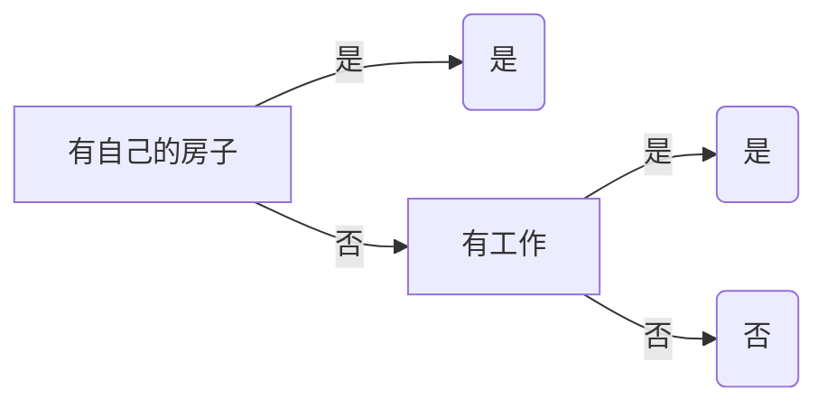

# 第五章 决策树

决策树（Decision Tree）是机器学习领域中一种非常基础且应用广泛的算法。它既可以用于**分类**问题，也可以用于**回归**问题。其核心思想源于人类在做决策时，往往会根据一系列问题（或条件）进行判断，最终得出一个结论。决策树模型就是将这个过程进行了形式化和算法化。

## 决策树的定义 (page 2-3)

> [!definition]+ 决策树
>
> **决策树 (decision tree)** 是一种基本的**分类**与**回归**方法。其模型呈树形结构，可以被看作是一系列 `if-then` 规则的集合，具有很强的可解释性。

决策树主要由以下几个部分构成：

- **结点 (Node)**:
    - **内部结点 (Internal Node)**: 每个内部结点代表对一个**特征**或**属性**的测试。它通常包含一个问题，例如“年龄是否小于30？”或“是否有房？”。
    - **叶结点 (Leaf Node)**: 也称为**终端结点 (Terminal Node)**，代表一个**类别**（在分类树中）或一个具体的**数值**（在回归树中）。它代表了最终的决策结果。
- **有向边 (Directed Edge)**: 代表根据内部结点测试结果划分出的不同分支。每条边通常对应着特征的一个可能取值。

整个决策过程从**根结点 (Root Node)** 开始，将待分类的实例（数据）的某个特征代入根结点的测试条件中，根据测试结果，沿着对应的分支向下传递。这个过程在后续的内部结点上递归地进行，直到实例被分配到某一个叶结点为止。该叶结点的标签就是这个实例的预测结果。


*上图直观地展示了决策树的组成部分。从根结点开始，根据特征 `x(1)` 的取值将数据划分，接着在子结点上根据特征 `x(2)` 继续划分，最终到达叶结点 `+1` 或 `-1`，完成分类。*

## 例子 (page 4-5)

为了更好地理解决策树的工作原理，我们可以看一个生活化的例子。

> [!example]+ 相亲决策
>
> 母亲要给女儿介绍一个男朋友，女儿通过一系列问题来决定是否要去见他。
>
> - **女儿**: 多大年纪了？
> - **母亲**: 26。 (`年龄 <= 30`)
> - **女儿**: 长的帅不帅？
> - **母亲**: 挺帅的。 (`长相 = 帅或中等`)
> - **女儿**: 收入高不？
> - **母亲**: 不算很高，中等情况。 (`收入 = 中等`)
> - **女儿**: 是公务员不？
> - **母亲**: 是，在税务局上班呢。 (`公务员 = 是`)
> - **女儿**: 那好，我去见见。 (`决策 = 见`)
>
> 这个对话过程就可以用一棵决策树来表示，在这个决策树中：
> 
> - **内部结点**（绿色圆形）：代表判断条件，如“年龄”、“长相”、“收入”、“公务员”。
> - **叶结点**（橙色方框）：代表最终决策，即“见”或“不见”。

## 分类与回归 (page 6)

决策树可以处理两种主要的机器学习任务，其根本区别在于目标变量（也就是我们希望预测的那个值 `y`）的类型。

- **分类树 (Classification Tree)**: 用于处理**离散型**目标变量。例如，在动物分类的数据集中，“类标号”（如哺乳动物、爬行类、鸟类）就是离散的。分类树的叶结点输出的是一个类别。
- **回归树 (Regression Tree)**: 用于处理**连续型**目标变量。例如，预测房价、股票价格或温度，这些目标变量都是连续的数值。回归树的叶结点输出的是一个具体的数值，通常是该叶结点所有样本目标值的平均值。

> [!note]
> 在上图中，特征（X）包括体温、表皮覆盖等，而目标属性（y）“类标号”是离散的，因此构建的是一棵分类树。如果目标是预测动物的“平均寿命”（一个连续值），那么就需要构建一棵回归树。

## 决策树-解决分类问题的一般方法 (page 7-8)

构建和使用一个分类模型，通常遵循以下两个主要步骤：

1. **模型构建 (归纳过程)**:
    - 这个阶段也称为**学习**或**训练**。
    - 我们使用一个带有已知类别标签的**训练集 (Training Set)**。
    - 学习算法通过对训练集的归纳，自动地构建出一个分类模型（例如，一棵决策树）。这个过程的目标是找到能够最好地拟合训练数据的规则。

2. **预测应用 (推论过程)**:
    - 这个阶段也称为**测试**或**推理**。
    - 我们使用已经构建好的模型，对没有类别标签的**测试集 (Test Set)** 或新数据进行预测。
    - 模型根据新数据的特征，推论出其最可能的类别。

## 决策树学习的步骤 (page 9)

决策树的学习过程，本质上是通过一系列规则对数据进行分类的过程。这个过程通常包含以下三个核心步骤：

1. **特征选择 (Feature Selection)**:
    - 特征选择是决定用哪个特征来划分当前数据集。如果把决策树的构建看作是盖房子，特征选择就是决定先用哪根柱子作支撑。
    - 好的特征能够将不同类别的数据尽可能地分离开。
    - 选择的标准通常是使得划分后的数据集“纯度”最高。后续会介绍如何用**信息增益**、**信息增益比**或**基尼指数**来度量。
2. **决策树的生成 (Tree Generation)**:
    - 这是一个递归的过程。从根结点开始，基于特征选择的结果，对数据集进行划分，生成子结点。
    - 对每个子结点，重复特征选择和划分的过程，直到满足停止条件。
    - 停止条件通常是：
        - 当前结点所有样本都属于同一类别。
        - 没有剩余特征可供划分。
        - 达到预设的树深度或叶结点样本数。
3. **决策树的剪枝 (Tree Pruning)**:
    - 直接根据训练数据生成的决策树可能会非常复杂，对训练数据拟合得很好，但在新数据上表现不佳，这种现象称为**过拟合 (Overfitting)**。
    - 剪枝是为了简化决策树，去掉一些不必要的枝叶，以提高模型的**泛化能力**[^1]。

[^1]: **泛化能力 (Generalization Ability)**: 指的是机器学习模型在处理未曾见过的（即非训练集的）新数据时表现出的准确性。

## 决策树与条件概率分布 (page 10-12)

从概率论的角度看，决策树的学习过程实际上是在划分特征空间，并估计每个划分单元上的条件概率分布 $P(Y|X)$。

- **特征空间划分**: 决策树的每个内部结点和它引出的分支，都在对特征空间进行一次划分。例如，一个特征 `年龄 < 30` 将整个特征空间分成了两部分。
- **路径与单元**: 从根结点到每个叶结点的路径，唯一地定义了特征空间中的一个**单元 (cell)** 或**区域 (region)**。这些单元互不相交，并覆盖了整个特征空间。
- **条件概率**: 在每个单元（即每个叶结点）内，都定义了一个类的概率分布。这个分布通常是通过该单元内训练样本的类别频率来估计的。例如，一个叶结点包含8个“是”类样本和2个“否”类样本，那么可以估计在该单元内 $P(Y=\text{"是"}) = 0.8$，$P(Y=\text{"否"}) = 0.2$。

> [!env]+ 视图的对应关系
>
> - **(a) 特征空间划分**: 将二维特征空间 `(x(1), x(2))` 划分为5个互不相交的矩形单元。每个单元内的 `+1` 或 `-1` 代表该区域的多数类别。
> - **(b) 条件概率分布**: 在(a)的划分基础上，展示了给定特征 `X`（即某个单元）条件下，类别 `Y` 为 `+1` 的条件概率 $P(Y=+1|X)$。概率越高，立方体的高度越高。
> - **(c) 决策树**: 是一棵与(a)和(b)完全对应的决策树。树的每个分支都对应一次空间划分。

决策树学习的本质是从训练数据中归纳出一组分类规则。理想情况下，我们希望找到一个与训练数据矛盾尽可能小、同时又具有良好泛化能力的决策树。

## 决策树算法 (page 14)

决策树的发展历史中，涌现出了一系列经典算法，它们在特征选择、树的生成和剪枝等方面各有侧重。

> [!wiki]+ 著名决策树算法
>
> - **CLS (Concept Learning System)**: 1966年由Hunt等人提出，是决策树算法的早期原型。
> - **ID3 (Iterative Dichotomiser 3)**: 1979年由Ross Quinlan提出，以**信息增益**作为特征选择的标准，是决策树发展史上的一个里程碑。
> - **C4.5**: Quinlan在ID3基础上于1993年提出的改进算法。它使用**信息增益比**来克服ID3偏向于选择多值特征的缺点，并且可以处理连续值特征和缺失值。
> - **CART (Classification and Regression Trees)**: 由Breiman等人在1984年提出。它非常独特，生成的决策树都是**二叉树**。对于分类树，它使用**基尼指数**作为划分标准；对于回归树，它使用**平方误差最小化**。

## 决策树CLS算法 (page 15-23)

CLS（Concept Learning System）是最早的决策树学习算法之一，为后来的ID3等算法奠定了基础。

### CLS基本思想 (page 15)

CLS采用“分而治之”的策略，其基本思想可以概括为：

1. 从一个空树开始，将整个训练样本集视为根结点。
2. 选择一个属性作为测试属性，根据该属性的不同取值，将样本集分割成若干子集。
3. 对每个子集：
    - 如果子集中的所有样本都属于同一类别，则将该子集标记为叶结点，其类别即为该样本的类别。
    - 如果子集为空，也标记为叶结点，类别通常设为其父结点中最多的类别。
    - 如果子集包含多种类别的样本，则将该子集视为一个新的内部结点，并递归地选择新的属性对其进行划分。
4. 重复此过程，直到所有子集都被正确分类或没有属性可用。

> [!tip]+ CLS算法步骤 (page 19)
>
> 1. **初始化**: 生成一棵空决策树和完整的训练样本属性集。
> 2. **终止条件检查**: 若当前训练集 `T` 中所有样本都属于同一类，则生成一个叶结点，算法终止。
> 3. **属性选择**: 否则，根据某种策略选择一个属性 `A` 作为测试属性，生成一个测试结点。
> 4. **数据划分**: 根据属性 `A` 的不同取值 {$v_1, v_2, \dots, v_m$}，将 `T` 划分为 `m` 个子集 {$T_1, T_2, \dots, T_m$}。
> 5. **属性移除**: 从属性表中删除属性 `A`。
> 6. **递归**: 对每个子集 `T_i`，递归调用CLS算法（从步骤2开始）。

### CLS算法的问题 (page 20-23)

CLS算法的一个核心问题是：**它没有明确规定如何选择最佳的测试属性**。在步骤3中，如果只是随机选择或按固定顺序选择，生成的决策树的结构和效率可能会天差地别。

> [!example]+ 属性选择的重要性
>
> 假设有一个学生膳食与缺钙情况的数据集（page 21）。
>
> - 如果选择“鸡肉”、“猪肉”、“牛肉”等属性来构建树，可能会得到一棵非常复杂、深度很大的树（page 22）。
> - 而如果首先选择“牛奶”这个属性，我们可能会发现，喝牛奶的学生都不缺钙，不喝牛奶的学生大部分都缺钙。这样，仅用一个属性就得到了一个非常简洁且有效的划分（page 23）。
>
> 实践证明，测试属性的选择顺序对决策树的规模和性能有举足轻重的影响。一个好的选择标准是后续ID3、C4.5等算法改进的关键。

## 决策树ID3算法 (page 24)

ID3算法由Ross Quinlan于1979年提出，它正是为了解决CLS算法中“如何选择最佳属性”的问题。ID3的核心是使用**信息增益 (Information Gain)** 作为特征选择的准则。

要理解信息增益，首先需要了解信息论中的两个基本概念：**信息量**和**熵**。

> [!note]+ 信息与不确定性
>
> 信息的核心价值在于**消除不确定性**。一个事件发生的概率越小，它所包含的信息量就越大。例如，“太阳从东边升起”这件事几乎不含信息量，因为它是一个确定性事件。

### 熵 (Entropy) (page 25-27)

在信息论中，**熵**是度量随机变量不确定性的指标。一个系统越混乱、越不确定，其熵值就越高。

> [!definition]+ 信息量与熵
>
> - **信息量**: 事件 $a_i$ 发生的概率为 $p(a_i)$，则它的信息量定义为：
>
>     $$
>     I(a_i) = \log_2 \frac{1}{p(a_i)} = -\log_2 p(a_i)
>     $$
>
> - **熵 (Entropy)**: 对于一个有 $n$ 个可能取值的离散随机变量 $X$，其概率分布为 $P(X=x_i) = p_i$，则 $X$ 的熵定义为所有可能事件信息量的数学期望：
>
>     $$
>     H(X) = -\sum_{i=1}^{n} p_i \log_2 p_i
>     $$
>
>     这里的对数底数通常取2，此时熵的单位是**比特 (bit)**。

**熵的特性**：

- **范围**: 对于有 $n$ 个取值的随机变量，其熵的范围是 $0 \le H(X) \le \log_2 n$。
- **最大熵**: 当所有事件等概率发生时（即均匀分布），系统不确定性最大，熵达到最大值 $\log_2 n$。
- **最小熵**: 当某个事件的概率为1，其余为0时（即确定性系统），系统不确定性最小，熵为0。

下图展示了二分类问题（伯努利分布）中，熵与概率 $p$ 的关系。当 $p=0.5$ 时，不确定性最大，熵达到峰值1。

### 信息增益 (Information Gain) (page 28-29)

**信息增益**表示在得知特征 `A` 的信息后，导致数据集 `D` 的类别不确定性减少的程度。不确定性的减少量越大，说明特征 `A` 的分类能力越强。

要计算信息增益，我们首先需要定义**条件熵 (Conditional Entropy)**。

> [!definition]+ 条件熵与信息增益
>
> - **条件熵 $H(Y|X)$**: 表示在已知随机变量 `X` 的条件下，随机变量 `Y` 的不确定性。其计算公式为：
>
>     $$
>     H(Y|X) = \sum_{i=1}^{n} p(X=x_i) H(Y|X=x_i)
>     $$
>
>     它是在 `X` 取不同值的情况下 `Y` 的熵的加权平均。
>
> - **信息增益 $g(D, A)$**: 定义为数据集 `D` 的**经验熵** $H(D)$ 与在特征 `A` 给定条件下的**经验条件熵** $H(D|A)$ 之差：
>
>     $$
>     g(D, A) = H(D) - H(D|A)
>     $$

> [!note]
> - $H(D)$ 度量了在不知道任何特征信息时，对数据集 `D` 进行分类的不确定性。
> - $H(D|A)$ 度量了在知道了特征 `A` 的取值后，对数据集 `D` 进行分类的剩余不确定性。
> - 两者的差值 $g(D, A)$ 就是特征 `A` 为分类带来的信息量。ID3算法在每一步都选择使信息增益最大的特征作为划分标准。
> - 信息增益在信息论中也被称为**互信息 (Mutual Information)**。

### 信息增益的算法 (page 31-32)

> [!tip]+ 信息增益计算步骤
>
> **输入**: 训练数据集 $D$，特征 $A$。
>
> **输出**: 特征 $A$ 对数据集 $D$ 的信息增益 $g(D, A)$。
>
> 1. **计算数据集的经验熵 $H(D)$**
>     假设数据集 $D$ 有 $K$ 个类别 $C_k$， $|C_k|$ 是属于第 $k$ 类的样本数， $|D|$ 是总样本数。
>
>     $$
>     H(D) = -\sum_{k=1}^{K} \frac{|C_k|}{|D|} \log_2 \frac{|C_k|}{|D|}
>     $$
>
> 2. **计算特征A对数据集D的经验条件熵 $H(D|A)$**
>     假设特征 $A$ 有 $n$ 个不同的取值 $\{a_1, a_2, \dots, a_n\}$，根据这些取值将 $D$ 划分为 $n$ 个子集 $\{D_1, D_2, \dots, D_n\}$。$|D_i|$ 是 $A=a_i$ 的样本数。$|D_{ik}|$ 是子集 $D_i$ 中属于类别 $C_k$ 的样本数。
>
>     $$
>     H(D|A) = \sum_{i=1}^{n} \frac{|D_i|}{|D|} H(D_i) = -\sum_{i=1}^{n} \frac{|D_i|}{|D|} \sum_{k=1}^{K} \frac{|D_{ik}|}{|D_i|} \log_2 \frac{|D_{ik}|}{|D_i|}
>     $$
>
> 3. **计算信息增益**
>
>     $$
>     g(D, A) = H(D) - H(D|A)
>     $$

### 信息增益例题 (page 33-35)

> [!example]+ 贷款申请数据
>
> 我们使用贷款申请样本数据表（共15个样本），来演示如何选择第一个划分特征。
>
> 目标：选择“年龄”、“有工作”、“有自己的房子”、“信贷情况”这四个特征中信息增益最大的一个。
>
> 1. **计算经验熵 $H(D)$**
>     数据集中，9个样本被批准贷款（是），6个被拒绝（否）。
>
>     $$
>     H(D) = -\left( \frac{9}{15} \log_2 \frac{9}{15} + \frac{6}{15} \log_2 \frac{6}{15} \right) \approx 0.971
>     $$
>
> 2. **计算各特征的信息增益**
>
>     - **A1: 年龄** (青年、中年、老年)
>         -   青年(5个): 2是, 3否 -> $H(D_1) = 0.971$
>         -   中年(5个): 3是, 2否 -> $H(D_2) = 0.971$
>         -   老年(5个): 4是, 1否 -> $H(D_3) = 0.722$
>         $g(D, A_1) = H(D) - \left[ \frac{5}{15}H(D_1) + \frac{5}{15}H(D_2) + \frac{5}{15}H(D_3) \right] \approx 0.083$
>
>     - **A2: 有工作** (是、否)
>         -   是(5个): 5是, 0否 -> $H(D_1) = 0$
>         -   否(10个): 4是, 6否 -> $H(D_2) = 0.971$
>         $g(D, A_2) = H(D) - \left[ \frac{5}{15}H(D_1) + \frac{10}{15}H(D_2) \right] \approx 0.324$
>
>     - **A3: 有自己的房子** (是、否)
>         -   是(6个): 6是, 0否 -> $H(D_1) = 0$
>         -   否(9个): 3是, 6否 -> $H(D_2) = 0.918$
>         $g(D, A_3) = H(D) - \left[ \frac{6}{15}H(D_1) + \frac{9}{15}H(D_2) \right] \approx 0.420$
>
>     - **A4: 信贷情况** (一般、好、非常好)
>         -   一般(5个): 1是, 4否
>         -   好(6个): 4是, 2否
>         -   非常好(4个): 4是, 0否
>         $g(D, A_4) = \dots \approx 0.363$
>
> 3. **比较信息增益**
>     比较四个特征的信息增益值：$g(D, A_3) > g(D, A_4) > g(D, A_2) > g(D, A_1)$。
>
> **结论**: 特征 **A3 (有自己的房子)** 的信息增益最大，因此ID3算法会选择它作为根结点进行划分。

## 信息增益比 (page 36)

虽然信息增益是一个很好的度量，但它有一个固有的**偏见**：**倾向于选择取值数目较多的特征**。极端情况下，如果一个特征的每个取值都唯一对应一个样本（如“ID号”），那么它的条件熵 $H(D|A)$ 将为0，信息增益达到最大值。但这样的特征对新数据的预测毫无意义。

为了校正这个问题，C4.5算法引入了**信息增益比 (Information Gain Ratio)**。

> [!definition]+ 信息增益比
>
> 信息增益比 $g_R(D, A)$ 定义为信息增益 $g(D, A)$ 与特征 $A$ 本身的**熵**（也称为**固有值 (Intrinsic Value)**）$H_A(D)$ 之比：
>
> $$
> g_R(D, A) = \frac{g(D, A)}{H_A(D)}
> $$
>
> 其中，$H_A(D)$ 的计算方式为：
>
> $$
> H_A(D) = -\sum_{i=1}^{n} \frac{|D_i|}{|D|} \log_2 \frac{|D_i|}{|D|}
> $$
>
> 这里 $n$ 是特征 $A$ 的取值个数。特征 $A$ 的取值越多，其熵 $H_A(D)$ 通常也越大，这就对信息增益起到了**惩罚**作用，从而平衡了特征选择。

## 决策树的生成 (page 37-42)

决策树的生成是一个递归调用特征选择和数据划分的过程。

### ID3算法的生成过程 (page 38-41)

> [!tip]+ ID3 算法
>
> **输入**: 训练数据集 $D$，特征集 $A$，阈值 $\epsilon$。
> **输出**: 决策树 $T$。
>
> 1. **若 $D$ 中所有实例属于同一类 $C_k$**，则 $T$ 为单结点树，类标记为 $C_k$，返回 $T$。
> 2. **若特征集 $A$ 为空**，则 $T$ 为单结点树，类标记为 $D$ 中实例数最多的类，返回 $T$。
> 3. **否则**，计算 $A$ 中各特征对 $D$ 的信息增益，选择信息增益最大的特征 $A_g$。
> 4. **若 $g(D, A_g) < \epsilon$** (信息增益小于阈值)，则 $T$ 为单结点树，类标记为 $D$ 中实例数最多的类，返回 $T$。
> 5. **否则**，对 $A_g$ 的每一个可能值 $a_i$，将 $D$ 分割为非空子集 $D_i$。以 $D_i$ 中实例数最多的类作为标记，构建子结点。
> 6. 对第 $i$ 个子结点，以 $D_i$ 为训练集，以 $A - \{A_g\}$ 为特征集，递归调用步骤1-5，得到子树 $T_i$，返回 $T_i$。

### C4.5算法的生成过程 (page 42)

C4.5算法的生成过程与ID3非常相似，主要区别在于特征选择标准：

- **将步骤3中的“信息增益”替换为“信息增益比”**。

> [!attention]+ C4.5的策略
> C4.5并非总是选择信息增益比最大的特征。它通常采用一种启发式方法：先从候选特征中找出信息增益高于平均值的特征，再从这些特征中选择信息增益比最高的。这样做可以避免对取值数目较少的特征产生不公平。

## 决策树面临的问题 (page 43-46)

### 过度拟合 (Overfitting)
这是决策树乃至许多机器学习模型都需要面对的核心问题。

- **理想的决策树**应该是叶子结点少、深度小，即模型简单且有效。但寻找全局最优的决策树是一个**NP难题**。
- 决策树生成算法倾向于不断生长，直到能完美划分训练数据为止。这会导致树过于复杂，学习到了训练数据中的噪声和偶然性，从而在新的、未见过的数据上表现很差。
- **训练误差 (Training Error)**: 模型在训练数据上的误差。
- **泛化误差 (Generalization Error)**: 模型在未知数据上的期望误差。
- **过拟合**的典型表现就是**训练误差很低，但泛化误差很高**。

为了解决过拟合，需要采用**剪枝 (Pruning)** 技术。

### 连续值处理

ID3等算法原生只支持离散特征。当遇到连续值特征（如年龄、收入）时，C4.5和CART等算法采用**二元分割 (Binary Split)** 的方法。

1. 将该连续特征的所有取值进行排序。
2. 遍历所有可能的**分割点**（通常是相邻两个取值的中点）。
3. 对每个分割点，计算其信息增益（或基尼指数等），将其视为一个二分问题（如 年龄 <= t 和 年龄 > t）。
4. 选择能使信息增益最大的那个分割点作为该特征的最佳划分点。

## 决策树的剪枝 (page 47-51)

剪枝是决策树学习算法中对付“过拟合”的主要手段。其基本策略是**通过极小化决策树整体的损失函数来实现**。

### 损失函数

决策树的损失函数（或称代价函数）需要平衡模型的**拟合优度**和**复杂度**。

结点上的经验熵为：$H_{t}(T) = -\sum_{k=1}^{K} \frac{N_{tk}}{N_{t}}\log \frac{N_{tk}}{N_{t}}$

> [!definition]+ 决策树损失函数
>
> 设树 $T$ 的叶结点个数为 $|T|$，叶结点 $t$ 有 $N_t$ 个样本，其经验熵为 $H_t(T)$。损失函数定义为：
>
> $$
> C_\alpha(T) = \sum_{t=1}^{|T|} N_t H_t(T) + \alpha |T|
> $$
>
> 也可以写作：
>
> $$
> C_\alpha(T) = C(T) + \alpha |T|
> $$
>
> - $C(T) = \sum_{t=1}^{|T|} N_t H_t(T)$ 代表模型的**训练误差**，反映了模型对训练数据的拟合程度。树越复杂，$C(T)$ 越小。
> - $|T|$ 代表模型的**复杂度**。
> - $\alpha \ge 0$ 是一个超参数，用于权衡拟合度与复杂度。$\alpha$ 越大，模型就越倾向于选择更简单的树（叶结点更少）。

> [!extra]+ 正则化的极大似然估计
>
> 损失函数（结构风险）的最小化等价于**正则化的极大似然估计**（最大后验估计）。$C(T)$ 实际上与对数似然函数的负值成正比： $\log L(T) = \sum_{t}\sum_{k} N_{tk}\log \frac{N_{tk}}{N_{t}} = - C(T)$，而 $\alpha |T|$ 是正则化项。因此，剪枝的过程就是在控制模型的复杂度，防止过拟合。

### 剪枝过程

剪枝过程是一个**自底向上**的回缩过程。

1. 首先生成一棵完整的决策树 $T$。
2. 递归地从树的叶结点向上回缩。
3. 考察任意一个内部结点，比较**剪枝前**（该结点和其子树存在）和**剪枝后**（该结点变成一个叶结点）的损失函数值。
    - 设剪枝前的子树为 $T_B$，剪枝后的结点为 $T_A$。
    - **如果 $C_\alpha(T_A) \le C_\alpha(T_B)$**，则说明剪枝是值得的，可以减少模型复杂度且不会过多地增加误差，于是执行剪枝。
4. 重复这个过程，直到无法继续回缩，得到损失函数最小的子树 $T_\alpha$。

## CART (Classification and Regression Trees) (page 52)

CART算法由Breiman等人在1984年提出，是目前应用最广泛的决策树算法之一，像Scikit-learn库中的决策树实现就是基于CART的优化版本。

> [!wiki]+ CART算法特点
>
> - **二叉树结构**: 无论是分类还是回归，CART生成的都是二叉树。它每次只将当前结点的数据集一分为二。
> - **回归树**: 使用**平方误差最小化准则**进行特征选择。
> - **分类树**: 使用**基尼指数 (Gini Index)** 最小化准则进行特征选择。
> - **剪枝**: 采用一种名为“代价复杂度剪枝”（Cost-Complexity Pruning）的精巧策略。

### CART-回归树的生成 (page 55-57)

假设我们有一个连续的目标变量 $Y$。CART回归树的目标是将输入空间（特征空间）划分为 $M$ 个区域 $R_m$，并且在每个区域内给出一个恒定的预测值 $c_m$。

- **预测模型**:
    $$
    f(x) = \sum_{m=1}^{M} c_m I(x \in R_m)
    $$
    其中 $I(\cdot)$ 是指示函数。

- **最优预测值**: 在一个区域 $R_m$ 内，使平方误差最小的预测值 $c_m$ 是该区域内所有样本 $y_i$ 值的**平均值**。
    $$
    \hat{c}_m = \text{ave}(y_i | x_i \in R_m)
    $$

- **如何划分**: 寻找最优的切分变量 $j$ 和切分点 $s$，使得划分后的两个区域的平方误差之和最小。
    $$
    \min_{j,s} \left[ \min_{c_1} \sum_{x_i \in R_1(j,s)} (y_i - c_1)^2 + \min_{c_2} \sum_{x_i \in R_2(j,s)} (y_i - c_2)^2 \right]
    $$
	其中 $R_1(j,s)=\{x|x^{(j)}\leq s\}$ 和 $R_2(j,s)=\{x|x^{(j)}>s\}$ 。

> [!tip]+ 最小二乘回归树生成算法
>
> 1. **选择最优切分**: 遍历所有特征 $j$，再对每个特征的所有可能取值 $s$ 进行扫描，找到使平方误差和最小的最优对 $(j^*, s^*)$。
> 2. **划分区域**: 使用 $(j^*, s^*)$ 将当前区域划分为两个子区域。
> 3. **确定输出值**: 计算每个子区域的输出值（均值）。
> 4. **递归**: 对两个子区域递归调用步骤1-3，直到满足停止条件（如叶结点样本数小于阈值）。
> 5. **生成树**: 将输入空间划分为 $M$ 个区域，生成最终的回归树。

### CART-分类树的生成 (page 58-60)

CART分类树使用**基尼指数 (Gini Index)** 来代替熵作为衡量数据“不纯度”的指标。

> [!definition]+ 基尼指数
>
> - **概率分布的基尼指数**: 对于有 $K$ 个类别的概率分布 $p = (p_1, \dots, p_K)$，其基尼指数为：
>
>     $$
>     \text{Gini}(p) = \sum_{k=1}^{K} p_k (1-p_k) = 1 - \sum_{k=1}^{K} p_k^2
>     $$
>
>     基尼指数的直观含义是：从数据集中随机抽取两个样本，其类别标记不一致的概率。基尼指数越小，数据集的纯度越高。
>
> - **数据集D的基尼指数**:
>
>     $$
>     \text{Gini}(D) = 1 - \sum_{k=1}^{K} \left( \frac{|C_k|}{|D|} \right)^2
>     $$
>
> - **特征A划分下的基尼指数**: 如果特征 $A$ 的某个取值 $a$ 将数据集 $D$ 划分为 $D_1$ 和 $D_2$，则此次划分的基尼指数为：
>
>     $$
>     \text{Gini}(D, A) = \frac{|D_1|}{|D|} \text{Gini}(D_1) + \frac{|D_2|}{|D|} \text{Gini}(D_2)
>     $$


> [!tip]+ CART分类树生成算法
>
> 1. **计算基尼指数**: 对每个特征 $A$ 的每个可能切分点 $a$，计算将数据集 $D$ 分为 $D_1$ (A=a) 和 $D_2$ (A!=a) 后的基尼指数 $\text{Gini}(D, A)$。
> 2. **选择最优切分**: 在所有可能的特征和切分点中，选择使基尼指数最小的组合作为最优切分。
> 3. **分配数据**: 将数据集分配到两个子结点中。
> 4. **递归**: 对两个子结点递归调用步骤1-3，直到满足停止条件。
> 5. **生成树**: 生成最终的CART分类树。

### CART的剪枝 (page 66-73)

CART的剪枝策略非常系统化，分为两个步骤：

1. **生成子树序列**:
    - 首先，生成一棵足够大的决策树 $T_0$。
    - 然后，通过代价复杂度剪枝，生成一个嵌套的子树序列 $\{T_0, T_1, \dots, T_n\}$。这个序列是通过不断增加正则化参数 $\alpha$ 得到的。
    - 对于 $T_0$ 中的每个内部结点 $t$，计算一个“剪枝效用”指标 $g(t)$：
        $$
        g(t) = \frac{C(t) - C(T_t)}{|T_t| - 1}
        $$
        其中 $C(t)$ 是将 $t$ 作为叶结点的误差，$C(T_t)$ 是以 $t$ 为根的子树的误差，$|T_t|$ 是子树 $T_t$ 的叶结点数。$g(t)$ 表示剪掉子树 $T_t$ 后，整体误差率的增加程度与复杂度减少程度的比值。
    - 在 $T_0$ 中剪去 $g(t)$ 最小的结点，得到 $T_1$。在 $T_1$ 中再剪去 $g(t)$ 最小的结点，得到 $T_2$，如此往复，直到只剩下根结点。

2. **交叉验证选择最优子树**:
    - 使用一个独立的**验证集 (Validation Set)**。
    - 对子树序列中的每一棵树 $T_k$，在验证集上计算其误差（如平方误差或基尼指数）。
    - 选择在验证集上误差最小的那棵树作为最终的最优决策树 $T_\alpha$。

这种方法通过将剪枝过程和最优树选择分离开，有效地避免了使用同一份数据既剪枝又评估的陷阱，找到了在拟合度和复杂度之间达到最佳平衡的模型。

## 习题

### 习题 5.1

> [!question]+
> 根据表 5.1 所给的训练数据集，利用信息增益比（C4.5 算法）生成决策树。
> 
> | ID  | 年龄  | 有工作 | 有自己的房子 | 信贷情况 | 类别  |
> | :-: | :-: | :-: | :----: | :--: | :-: |
> |  1  | 青年  |  否  |   否    |  一般  |  否  |
> |  2  | 青年  |  否  |   否    |  好   |  否  |
> |  3  | 青年  |  是  |   否    |  好   |  是  |
> |  4  | 青年  |  是  |   是    |  一般  |  是  |
> |  5  | 青年  |  否  |   否    |  一般  |  否  |
> |  6  | 中年  |  否  |   否    |  一般  |  否  |
> |  7  | 中年  |  否  |   否    |  好   |  否  |
> |  8  | 中年  |  是  |   是    |  好   |  是  |
> |  9  | 中年  |  否  |   是    | 非常好  |  是  |
> | 10  | 中年  |  否  |   是    | 非常好  |  是  |
> | 11  | 老年  |  否  |   是    | 非常好  |  是  |
> | 12  | 老年  |  否  |   是    |  好   |  是  |
> | 13  | 老年  |  是  |   否    |  好   |  是  |
> | 14  | 老年  |  是  |   否    | 非常好  |  是  |
> | 15  | 老年  |  否  |   否    |  一般  |  否  |

分别以 A1（年龄）, A2（有工作）, A3（有自己的房子）, A4（信贷情况）代表 4 个特征, 计算各特征对数据集 D 的信息增益比, 有（保留 3 位小数）：

$(1)\ g_R(D, A_1) = \frac{g(D, A_1)}{H_{A_1}(D)} = \frac{0.083}{3*( - \frac{5}{15}log_2{\frac{5}{15}})} = 0.052$

$(2)\ g_R(D, A_2) = \frac{g(D, A_2)}{H_{A_2}(D)} = \frac{0.324}{-\frac{5}{15}log_2{\frac{5}{15}} - \frac{10}{15}log_2{\frac{10}{15}}} = 0.353$

$(3)\ g_R(D, A_3) = \frac{g(D, A_3)}{H_{A_3}(D)} = \frac{0.420}{-\frac{6}{15}log_2{\frac{6}{15}} - \frac{9}{15}log_2{\frac{9}{15}}} = 0.433$

$(4)\ g_R(D, A_4) = \frac{g(D, A_4)}{H_{A_4}(D)} = \frac{0.363}{-\frac{5}{15}log_2{\frac{5}{15}} - \frac{6}{15}log_2{\frac{6}{15}} - \frac{4}{15}log_2{\frac{4}{15}}} = 0.232$

由于特征 **A3 (有自己的房子)** 的信息增益比最大, 所以选择特征 A3 作为根结点的特征。

它将训练集 D 划分为两个子集 D1 (A3 取值为 "是") 和 D2 (A3 取值为 "否")。由于 D1 只有同一类的样本点, 所以它成为一个叶结点, 结点的类标记为 "是"。对于 D2 则需从特征 A1 (年龄), A2 (有工作), A4 (信贷情况) 中选择新的特征。

计算各个特征的信息增益比:

$g_R(D_2, A_1) = \frac{g(D_2, A_1)}{H_{A_1}(D_2)} = \frac{0.251}{-\frac{4}{9}log_2{\frac{4}{9}} - \frac{2}{9}log_2{\frac{2}{9}} - \frac{3}{9}log_2{\frac{3}{9}}} = 0.164$

$g_R(D_2, A_2) = \frac{g(D_2, A_2)}{H_{A_2}(D_2)} = \frac{0.918}{-\frac{3}{9}log_2{\frac{3}{9}} - \frac{6}{9}log_2{\frac{6}{9}}} = 1.000$

$g_R(D_2, A_4) = \frac{g(D_2, A_4)}{H_{A_4}(D_2)} = \frac{0.474}{-\frac{4}{9}log_2{\frac{4}{9}} - \frac{4}{9}log_2{\frac{4}{9}} - \frac{1}{9}log_2{\frac{1}{9}}} = 0.340$

选择信息增益比最大的特征 **A2 (有工作)** 作为结点的特征, 从这一结点引出两个子结点: 一个是对应 "是" (有工作) 的子结点, 包含 3 个样本, 它们属于同一类, 所以这是一个叶结点, 类标记为 "是"; 另一个是对应 "否" (无工作) 的子结点, 包含 6 个样本, 它们也属于同一类, 所以这也是一个叶结点, 类标记为 "否"。

这样生成一个如下图所示的决策树。该决策树只用了两个特征 (有两个内部节点)：



### 习题 5.2

> [!question]+
>
> 已知如表 5.2 所示的训练数据，试用平方误差损失准则生成一个二叉回归树。  
> 
> | $x_{i}$ ​ |  1   |  2   |  3   |  4   |  5   |  6   |  7   |  8   |  9   |  10  |
> | :-------: | :--: | :--: | :--: | :--: | :--: | :--: | :--: | :--: | :--: | :--: |
> |  $y_i$ ​  | 4.50 | 4.75 | 4.91 | 5.34 | 5.80 | 7.05 | 7.90 | 8.23 | 8.70 | 9.00 |

1. 由数据表可知，j 只能取 1，选择最优切分点 s，遍历求解

|  s  | $\sum_{x_i \in R_1(1, s)}(y_i - \hat{c}_1)^2 + \sum_{x_i \in R_2(1, s)}(y_i - \hat{c}_2)^2$ |
| :-: | :-----------------------------------------------------------------------------------------: |
|  1  |                                           22.648                                            |
|  2  |                                           17.702                                            |
| ... |                                             ..                                              |
|  9  |                                           21.328                                            |
| 10  |                                   所有的点都在 $R_1$ 内，则输入空间不变                                    |

2. 则当 j = 1, s = 5 时取得最小值，将输入空间划分为两个区域 x <= 5 和 x > 5。
3. 接着，对两个子区域按上述过程递归计算，设定阈值为 0.2（自调整）；后续过程比较繁琐，考虑使用 python 完成，结果为：

$$f(x)=\begin{cases}4.72&x\leq3\\5.57&3<x\leq5\\7.05&5<x\leq6\\7.9&6<x\leq7\\8.23&7<x\leq8\\8.85&x>8&\end{cases}$$

#### python 代码及运行结果

> [!env]
>
> - python=3.11.11
> - numpy=2.1.2

```python title="LeastSquareRegTree.py"
import json
import numpy as np

class Node:
    """Tree node for least squares regression tree."""
    def __init__(self, value, feature, left=None, right=None):
        self.value = value.tolist() if isinstance(value, np.ndarray) else value
        self.feature = feature.tolist() if isinstance(feature, np.ndarray) else feature
        self.left = left
        self.right = right

    def __repr__(self):
        """Convert node to JSON string representation."""
        def custom_default(obj):
            if isinstance(obj, Node):
                return obj.__dict__
            # Handle numpy types by converting to Python standard types
            if isinstance(
                obj,(
                    np.int_,
                    np.intc,
                    np.intp,
                    np.int8,
                    np.int16,
                    np.int32,
                    np.int64,
                    np.uint8,
                    np.uint16,
                    np.uint32,
                    np.uint64,),
            ):
                return int(obj)
            if isinstance(obj, (np.float_, np.float16, np.float32, np.float64)):
                return float(obj)
            if isinstance(obj, np.ndarray):
                return obj.tolist()
            return str(obj)
        return json.dumps(self, indent=3, default=custom_default, ensure_ascii=False)


class LeastSquareRegTree:
    """Least squares regression tree implementation."""

    def __init__(self, train_X, train_y, epsilon=0.1, min_samples_split=2):
        self.X = np.asarray(train_X)
        self.y = np.asarray(train_y)
        self.feature_count = self.X.shape[1]
        self.epsilon = epsilon
        self.min_samples_split = min_samples_split
        self.tree = None

    def _fit(self, X, y, feature_count):
        j, s, min_error, c1, c2 = self._find_best_split(X, y, feature_count)
        tree = Node(feature=j, value=X[s, j], left=None, right=None)
        left_mask = X[:, j] <= X[s, j]
        right_mask = ~left_mask
        X_left, y_left = X[left_mask], y[left_mask]
        X_right, y_right = X[right_mask], y[right_mask]

        if min_error < self.epsilon or len(y_left) < self.min_samples_split:
            tree.left = float(c1)  # Convert numpy types to Python standard types
        else:
            tree.left = self._fit(X_left, y_left, feature_count)
        if min_error < self.epsilon or len(y_right) < self.min_samples_split:
            tree.right = float(c2)  # Convert numpy types to Python standard types
        else:
            tree.right = self._fit(X_right, y_right, feature_count)

        return tree

    def fit(self):
        self.tree = self._fit(self.X, self.y, self.feature_count)
        return self

    def predict(self, X):
        if self.tree is None:
            raise ValueError("tree is empty")

        X = np.asarray(X)
        predictions = np.zeros(X.shape[0])
        for i, sample in enumerate(X):
            predictions[i] = self._predict_sample(sample, self.tree)
        return predictions

    def _predict_sample(self, sample, node):
        if not isinstance(node, Node):
            return node

        if sample[node.feature] <= node.value:
            return self._predict_sample(sample, node.left)
        else:
            return self._predict_sample(sample, node.right)
    # Implements equation 5.21 from the textbook to find the split that minimizes squared error.
    def _find_best_split(self, X, y, feature_count):
        n_samples = len(X)
        min_error = np.inf
        best_feature = 0
        best_split = 0
        best_c1 = best_c2 = 0

        for feature_idx in range(feature_count):
            sorted_idx = np.argsort(X[:, feature_idx])
            sorted_X = X[sorted_idx]
            sorted_y = y[sorted_idx]
            unique_values = np.unique(sorted_X[:, feature_idx])

            for i in range(len(unique_values) - 1):
                split_value = (unique_values[i] + unique_values[i + 1]) / 2
                split_idx = np.searchsorted(sorted_X[:, feature_idx], split_value)

                if split_idx == 0 or split_idx == n_samples:
                    continue  # Skip if split would result in empty partition
                
                left_y = sorted_y[:split_idx]
                right_y = sorted_y[split_idx:]
                c1 = np.mean(left_y)
                c2 = np.mean(right_y)
                error = np.sum((left_y - c1) ** 2) + np.sum((right_y - c2) ** 2)

                if error < min_error:
                    min_error = error
                    best_feature = feature_idx
                    best_split = sorted_idx[split_idx - 1]  # Index in original array
                    best_c1 = c1
                    best_c2 = c2

        return best_feature, best_split, min_error, best_c1, best_c2

    def __repr__(self):
        return str(self.tree)


train_X = np.array([[1, 2, 3, 4, 5, 6, 7, 8, 9, 10]]).T
train_y = np.array([4.50, 4.75, 4.91, 5.34, 5.80, 7.05, 7.90, 8.23, 8.70, 9.00])
model = LeastSquareRegTree(train_X, train_y, epsilon=0.2)
model.fit()
print(model)
```

```json title="output"
{
   "value": 5,
   "feature": 0,
   "left": {
      "value": 3,
      "feature": 0,
      "left": 4.72,
      "right": 5.57
   },
   "right": {
      "value": 7,
      "feature": 0,
      "left": {
         "value": 6,
         "feature": 0,
         "left": 7.05,
         "right": 7.9
      },
      "right": {
         "value": 8,
         "feature": 0,
         "left": 8.23,
         "right": 8.85
      }
   }
}
```
