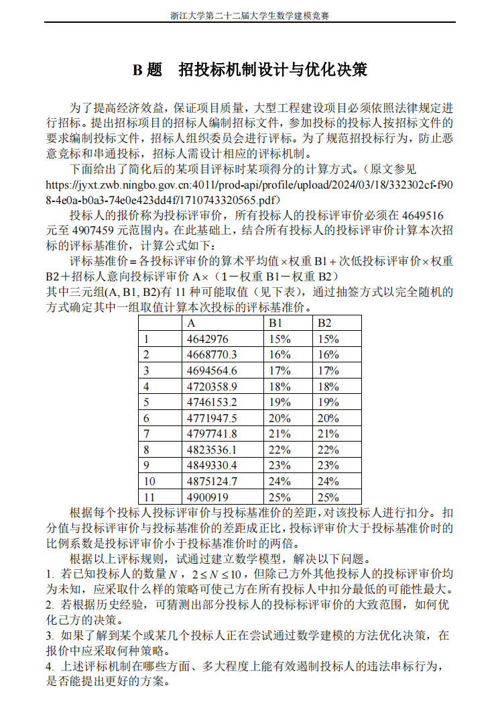

***

参加的第一次数学建模比赛，我和队友都毫无经验，权当体验一次[^1]。

<!-- more -->

[^1]: 我们队伍名就叫“体验队”hhhh

[报名网站](http://kyjs.zju.edu.cn/home/competition/detail?competitionId=400) ；当时选择了 B 题。

### 题面

### 资料链接

- [出题原型](https://jyxt.zwb.ningbo.gov.cn:4011/prod-api/profile/upload/2024/03/18/332302cf-f908-4e0a-b0a3-74e0e423dd4f/1710743320565.pdf)
- [原型招标结果](http://zwb.ningbo.gov.cn/art/2024/4/8/art_1229722758_673785.html)
- [博弈论在投标报价决策中的应用](https://d.wanfangdata.com.cn/periodical/ChlQZXJpb2RpY2FsQ0hJTmV3UzIwMjMxMjI2EhFiZmp0ZHh4YjIwMDAwMzAwOBoId2lvOWx0YTQ%3D)

### 结果

[提交论文（无封面）](https://github.com/darstib/blog/blob/main/docs/static/zjumcm2024_without_cover.pdf)，获校三等奖。

现在看来自己当时所知确实是甚少，但是很多思路还是比较正确的（这些本来是能够很快学习到的，却自己想了很久；不过印象更加深刻）。同时队友也十分给力，算是简单地体验了一把。
