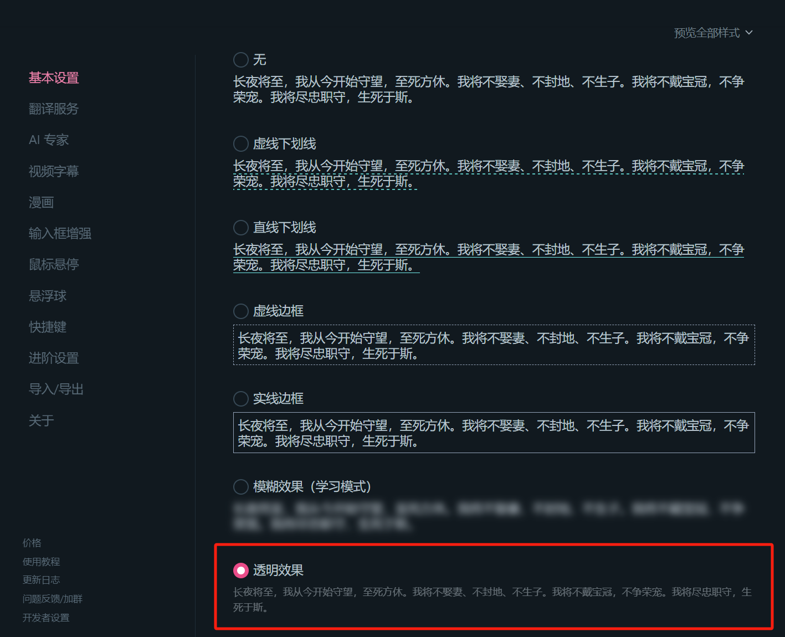
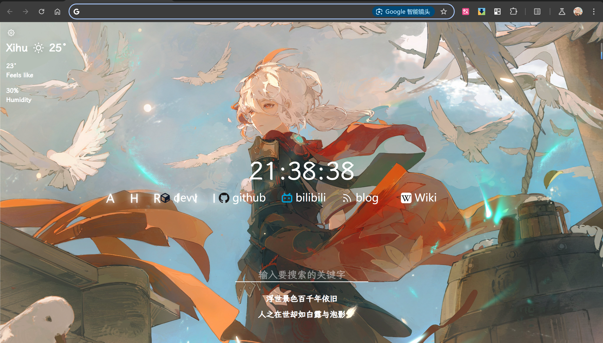

***

这里主要介绍的是我对 chrome browser 的一些插件和设置分享；edge 上可能也有同名插件，但是下面提供的链接都是 chrome store ，自备魔法，或者自己找渠道试试。

> chrome_begin 这个名字取得有点唬人（主要是比较适合加入 begin 系列）。

<!-- more -->

## I Extensions

- [workspaces](https://chromewebstore.google.com/detail/workspace/bgmncjaagnkknpeeamjhpbahlbbhigbf)
	- 保留一组打开的浏览器标签页，方便临时切换工作后回复。
- [bilibili 哔哩哔哩下载助手](https://chromewebstore.google.com/detail/bilibili%E5%93%94%E5%93%A9%E5%93%94%E5%93%A9%E4%B8%8B%E8%BD%BD%E5%8A%A9%E6%89%8B/bfcbfobhcjbkilcbehlnlchiinokiijp)
    - 顾名思义。
- [Dark Reader](https://chromewebstore.google.com/detail/dark-reader/eimadpbcbfnmbkopoojfekhnkhdbieeh)
    - 比较好的将所有 Light 界面变为 Dark 模式，深夜降低屏幕亮度。
- [Kimi 浏览器助手](https://chromewebstore.google.com/search/Kimi%20%E6%B5%8F%E8%A7%88%E5%99%A8%E5%8A%A9%E6%89%8B)
    - Kimi 官方 2024/07 出台的插件；
    - 重点在于其能够划词/句，**并结合上下文** 解释。
- [Page Sidebar | Open any page in side panel](https://chromewebstore.google.com/search/Page%20Sidebar%20%7C%20Open%20any%20page%20in%20side%20panel)
    - chrome 没有 edge 的网页分屏功能，这个插件可以基本平替；
- [VertiTab - Vertical Tabs in Side Panel](https://chromewebstore.google.com/detail/vertitab-vertical-tabs-in/chejfhdknideagdnddjpgamkchefjhoi)
- 广告拦截器
    - 个人评价一个广告拦截器主要看：
        - 能否很好地拦截广告，有些插件你不付费故意给你放出一些来；
        - DevTools 中的 Console 是否爆出许多错误；这一点 AdGuard 做的稍好一些。
    - [AdGuard](https://chromewebstore.google.com/detail/adguard-%E5%B9%BF%E5%91%8A%E6%8B%A6%E6%88%AA%E5%99%A8/bgnkhhnnamicmpeenaelnjfhikgbkllg)
    - [广告拦截器 - 1Block](https://chromewebstore.google.com/detail/%E5%B9%BF%E5%91%8A%E6%8B%A6%E6%88%AA%E5%99%A8-1block/jajikjbellknnfcomfjjinfjokihcfoi)
- [沉浸式翻译 - 网页翻译插件 | PDF翻译 | 免费](https://chrome.google.com/webstore/detail/bpoadfkcbjbfhfodiogcnhhhpibjhbnh)
    - 使用谷歌/微软等进行翻译，可以自己接入主流模型的 api，个人使用前两个就够了；
    - 主要是可以对照翻译，即保留了原文，且可以设置译文格式，体验相对更好
        - 
- [篡改猴](https://chromewebstore.google.com/detail/dhdgffkkebhmkfjojejmpbldmpobfkfo)
    - 用于执行众多脚本，网上介绍甚多，在此略过。
- [Tabliss](https://chromewebstore.google.com/detail/tabliss-a-beautiful-new-t/hipekcciheckooncpjeljhnekcoolahp)
    - 一个不错的标签页，简洁好看；
    - 下面是一个例子，个人设计：
    - 比较奇怪的是，这个内存消耗居然只有 chrome 原生的一半😅。

## II setting

- chrome://flags/#enable-tab-audio-muting
    - 单独控制不同标签页声音；